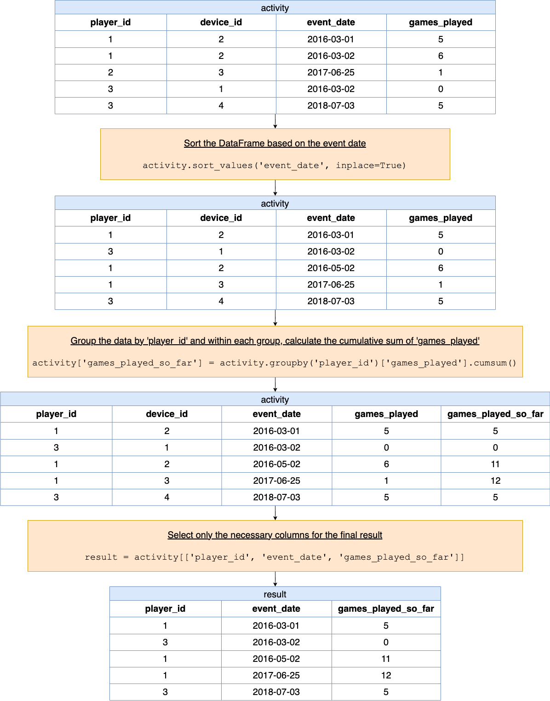

# Solution
---

### Overview

> **Problem reference:** Write a solution to report for each player and date, how many games played so far by the player. That is, the total number of games played by the player until that date. Check the example for clarity. Return the result table in any order.

This problem is fundamentally different from [part I](https://leetcode.com/problems/game-play-analysis-i/) and [part II](https://leetcode.com/problems/game-play-analysis-ii/) of the five-part Game Play Analysis problem series. In the previous parts, we were asked to make an aggregate calculation that was distinctly *discrete* in nature (i.e., something isolated and specific to each player such as a player's first login date or the device linked to each player's first login date).

In this part, we are asked to compute what is essentially a *running total* or *running sum* of the number of games played for each player up to each date listed for a player (ordered chronologically). How can we do this?

---

## pandas

### Approach 1: Window Functions - Using `groupby` and `cumsum`

**Visualization of approach 1**



#### Intuition

Here is a step-by-step breakdown of the approach given the following input `activity` DataFrame:

<table>
<tr>
<th>player_id</th>
<th>device_id</th>
<th>event_date</th>
<th>games_played</th>
</tr>
<tr>
<td>1</td>
<td>2</td>
<td>2016-03-01</td>
<td>5</td>
</tr>
<tr>
<td>1</td>
<td>2</td>
<td>2016-05-02</td>
<td>6</td>
</tr>
<tr>
<td>1</td>
<td>3</td>
<td>2017-06-25</td>
<td>1</td>
</tr>
<tr>
<td>3</td>
<td>1</td>
<td>2016-03-02</td>
<td>0</td>
</tr>
<tr>
<td>3</td>
<td>4</td>
<td>2018-07-03</td>
<td>5</td>
</tr>
</table>
<br>

**Step 1: Sort the DataFrame based on the event date**

We start by sorting the rows of the DataFrame based on the $'\text{event}_{date}'$ column. This ensures that when we calculate the cumulative sum of games played next, the events are considered in chronological order, and the cumulative sum for a given date represents the sum of $'\text{games}_{played}'$ up to that date.

```python
activity.sort_values('event_date', inplace=True)
```

<table>
<tr>
<th>player_id</th>
<th>device_id</th>
<th>event_date</th>
<th>games_played</th>
</tr>
<tr>
<td>1</td>
<td>2</td>
<td>2016-03-01</td>
<td>5</td>
</tr>
<tr>
<td>3</td>
<td>1</td>
<td>2016-03-02</td>
<td>0</td>
</tr>
<tr>
<td>1</td>
<td>2</td>
<td>2016-05-02</td>
<td>6</td>
</tr>
<tr>
<td>1</td>
<td>3</td>
<td>2017-06-25</td>
<td>1</td>
</tr>
<tr>
<td>3</td>
<td>4</td>
<td>2018-07-03</td>
<td>5</td>
</tr>
</table>
<br>

**Step 2: Group the data by 'player_id' and within each group, calculate the cumulative sum of 'games_played'**

Next, we group the data by $'\text{player}_{id}'$ using the `groupby` method, creating separate groups for each player. Within each group, we use the `cumsum` method to calculate the cumulative sum of games played. This effectively gives us, for each date a player played, the total number of games they had played up to and including that date.

```python
activity['games_played_so_far'] = activity.groupby('player_id')['games_played'].cumsum()
```

<table>
<tr>
<th>player_id</th>
<th>device_id</th>
<th>event_date</th>
<th>games_played</th>
<th>games_played_so_far</th>
</tr>
<tr>
<td>1</td>
<td>2</td>
<td>2016-03-01</td>
<td>5</td>
<td>5</td>
</tr>
<tr>
<td>3</td>
<td>1</td>
<td>2016-03-02</td>
<td>0</td>
<td>0</td>
</tr>
<tr>
<td>1</td>
<td>2</td>
<td>2016-05-02</td>
<td>6</td>
<td>11</td>
</tr>
<tr>
<td>1</td>
<td>3</td>
<td>2017-06-25</td>
<td>1</td>
<td>12</td>
</tr>
<tr>
<td>3</td>
<td>4</td>
<td>2018-07-03</td>
<td>5</td>
<td>5</td>
</tr>
</table>
<br>

**Step 3: Select only the necessary columns for the final result**

Once we have the cumulative sums, we create a new DataFrame containing only the columns we are interested in: $'\text{player}_{id}'$, $'\text{event}_{date}'$, and the newly created `'games_played_so_far'` column.

```python
result = activity[['player_id', 'event_date', 'games_played_so_far']]
```

<table>
<tr>
<th>player_id</th>
<th>event_date</th>
<th>games_played_so_far</th>
</tr>
<tr>
<td>1</td>
<td>2016-03-01</td>
<td>5</td>
</tr>
<tr>
<td>3</td>
<td>2016-03-02</td>
<td>0</td>
</tr>
<tr>
<td>1</td>
<td>2016-05-02</td>
<td>11</td>
</tr>
<tr>
<td>1</td>
<td>2017-06-25</td>
<td>12</td>
</tr>
<tr>
<td>3</td>
<td>2018-07-03</td>
<td>5</td>
</tr>
</table>
<br>

**Step 4: Return the resulting DataFrame**

Finally, we return the resultant DataFrame, which now includes a `'games_played_so_far'` column indicating the cumulative number of games played by each player at each event date.

```python
return result
```

This function, therefore, returns a DataFrame showing the cumulative sum of games played by each player up to each date they played, considering the events in chronological order.

#### Implementation

```python
import pandas as pd

def gameplay_analysis(activity: pd.DataFrame) -> pd.DataFrame:
    # Step 1: Sort the DataFrame based on the event date
    # It ensures that we are considering the events in chronological order before calculating the cumulative sum
    activity.sort_values('event_date', inplace=True)

    # Step 2: Group the data by 'player_id' and within each group, calculate the cumulative sum of 'games_played'
    # The groupby function creates separate groups for each player, and the cumsum function calculates the cumulative sum of games played in each group
    activity['games_played_so_far'] = activity.groupby('player_id')['games_played'].cumsum()

    # Step 3: Select only the necessary columns for the final result
    # Here we are creating a new dataframe that consists only of the 'player_id', 'event_date', and 'games_played_so_far' columns
    result = activity[['player_id', 'event_date', 'games_played_so_far']]

    # Step 4: Return the resulting DataFrame
    # Finally, we return the resulting dataframe which contains the cumulative sum of games played by each player till each event date
    return result

```

---

### Approach 2: Self-Join and Aggregation

#### Intuition

Here is a step-by-step breakdown of the approach given the following input `activity` DataFrame:

<table>
<tr>
<th>player_id</th>
<th>device_id</th>
<th>event_date</th>
<th>games_played</th>
</tr>
<tr>
<td>1</td>
<td>2</td>
<td>2016-03-01</td>
<td>5</td>
</tr>
<tr>
<td>1</td>
<td>2</td>
<td>2016-05-02</td>
<td>6</td>
</tr>
<tr>
<td>1</td>
<td>3</td>
<td>2017-06-25</td>
<td>1</td>
</tr>
<tr>
<td>3</td>
<td>1</td>
<td>2016-03-02</td>
<td>0</td>
</tr>
<tr>
<td>3</td>
<td>4</td>
<td>2018-07-03</td>
<td>5</td>
</tr>
</table>
<br>

**Step 1: Self-Join on Player ID**
In this initial step, we are creating a DataFrame where each row is merged with every other row that has the same 'player_id', allowing us to later compute the cumulative games played for each player up to each date.

```python
merged_df = activity.merge(activity, on='player_id', suffixes=('', '_other'))
```

<table>
<tr><th>player_id</th><th>device_id</th><th>event_date</th><th>games_played</th><th>device_id_other</th><th>event_date_other</th><th>games_played_other</th></tr>
<tr><td>1</td><td>2</td><td>2016-03-01</td><td>5</td><td>2</td><td>2016-03-01</td><td>5</td></tr>
<tr><td>1</td><td>2</td><td>2016-03-01</td><td>5</td><td>2</td><td>2016-05-02</td><td>6</td></tr>
<tr><td>1</td><td>2</td><td>2016-03-01</td><td>5</td><td>3</td><td>2017-06-25</td><td>1</td></tr>
<tr><td>1</td><td>2</td><td>2016-05-02</td><td>6</td><td>2</td><td>2016-03-01</td><td>5</td></tr>
<tr><td>1</td><td>2</td><td>2016-05-02</td><td>6</td><td>2</td><td>2016-05-02</td><td>6</td></tr>
<tr><td>1</td><td>2</td><td>2016-05-02</td><td>6</td><td>3</td><td>2017-06-25</td><td>1</td></tr>
<tr><td>1</td><td>3</td><td>2017-06-25</td><td>1</td><td>2</td><td>2016-03-01</td><td>5</td></tr>
<tr><td>1</td><td>3</td><td>2017-06-25</td><td>1</td><td>2</td><td>2016-05-02</td><td>6</td></tr>
<tr><td>1</td><td>3</td><td>2017-06-25</td><td>1</td><td>3</td><td>2017-06-25</td><td>1</td></tr>
<tr><td>3</td><td>1</td><td>2016-03-02</td><td>0</td><td>1</td><td>2016-03-02</td><td>0</td></tr>
<tr><td>3</td><td>1</td><td>2016-03-02</td><td>0</td><td>4</td><td>2018-07-03</td><td>5</td></tr>
<tr><td>3</td><td>4</td><td>2018-07-03</td><td>5</td><td>1</td><td>2016-03-02</td><td>0</td></tr>
<tr><td>3</td><td>4</td><td>2018-07-03</td><td>5</td><td>4</td><td>2018-07-03</td><td>5</td></tr>
</table>
<br>

**Step 2: Filtering Future Data**
In this step, we filter out rows representing future data to maintain only the historical data up until the current event date, which will help in calculating the cumulative games played till each date.

```python
merged_df = merged_df[merged_df['event_date_other'] <= merged_df['event_date']]
```

<table>
<tr><th>player_id</th><th>device_id</th><th>event_date</th><th>games_played</th><th>device_id_other</th><th>event_date_other</th><th>games_played_other</th></tr>
<tr><td>1</td><td>2</td><td>2016-03-01</td><td>5</td><td>2</td><td>2016-03-01</td><td>5</td></tr>
<tr><td>1</td><td>2</td><td>2016-05-02</td><td>6</td><td>2</td><td>2016-03-01</td><td>5</td></tr>
<tr><td>1</td><td>2</td><td>2016-05-02</td><td>6</td><td>2</td><td>2016-05-02</td><td>6</td></tr>
<tr><td>1</td><td>3</td><td>2017-06-25</td><td>1</td><td>2</td><td>2016-03-01</td><td>5</td></tr>
<tr><td>1</td><td>3</td><td>2017-06-25</td><td>1</td><td>2</td><td>2016-05-02</td><td>6</td></tr>
<tr><td>1</td><td>3</td><td>2017-06-25</td><td>1</td><td>3</td><td>2017-06-25</td><td>1</td></tr>
<tr><td>3</td><td>1</td><td>2016-03-02</td><td>0</td><td>1</td><td>2016-03-02</td><td>0</td></tr>
<tr><td>3</td><td>4</td><td>2018-07-03</td><td>5</td><td>1</td><td>2016-03-02</td><td>0</td></tr>
<tr><td>3</td><td>4</td><td>2018-07-03</td><td>5</td><td>4</td><td>2018-07-03</td><td>5</td></tr>
</table>
<br>

**Step 3: Calculating Cumulative Games Played**
Here, we are grouping the data by 'player_id' and 'event_date', and then calculating the cumulative games played by summing the 'games_played_other' values within each group. This step derives the total number of games played by each player up to each event date.

```python
result = (
    merged_df
    .groupby(['player_id', 'event_date'])
    .agg(games_played_so_far=('games_played_other', 'sum'))
    .reset_index()
)
```

<table>
<tr><th>player_id</th><th>event_date</th><th>games_played_so_far</th></tr>
<tr><td>1</td><td>2016-03-01</td><td>5</td></tr>
<tr><td>1</td><td>2016-05-02</td><td>11</td></tr>
<tr><td>1</td><td>2017-06-25</td><td>12</td></tr>
<tr><td>3</td><td>2016-03-02</td><td>0</td></tr>
<tr><td>3</td><td>2018-07-03</td><td>5</td></tr>
</table>
<br>

**Step 4: Returning the Final Output**
Finally, we obtain the structured output that showcases the 'player_id', 'event_date', and the cumulative sum of games played until that date, providing a clear view of each player's gaming history over time.

```python
return result
```

#### Implementation

```python
def gameplay_analysis(activity: pd.DataFrame) -> pd.DataFrame:
    # Step 1: Perform a self-join on the 'player_id' column to create a merged dataframe.
    # This operation will pair each row with every other row that has the same player_id,
    # creating a dataframe that contains all possible pairs of event dates for each player.
    merged_df = activity.merge(activity, on='player_id', suffixes=('', '_other'))

    # Step 2: Filter the merged dataframe to retain only the rows where the event_date from
    # the "other" part is less than or equal to the event_date from the current row. This ensures
    # that for each pair of rows in the merged dataframe, we only consider the historical data up
    # to the current date.
    merged_df = merged_df[merged_df['event_date_other'] <= merged_df['event_date']]

    # Step 3: Group the filtered dataframe by 'player_id' and 'event_date', and for each group,
    # sum the 'games_played' values from the "other" part. This calculates the cumulative sum of
    # games played by a player up to each event date.
    result = (
        merged_df
        .groupby(['player_id', 'event_date'])
        .agg(games_played_so_far=('games_played_other', 'sum'))
        .reset_index()
    )

    # Step 4: Return the resulting dataframe which contains the 'player_id', 'event_date', and
    # the calculated cumulative sum of games played up to each date.
    return result

```

---

## Database

It may be tempting to try a correlated subquery:

```sql
SELECT
  A1.player_id,
  A1.event_date,
  (
    SELECT
      SUM(A2.games_played)
    FROM
      Activity A2
    WHERE
      A2.player_id = A1.player_id
      AND A2.event_date <= A1.event_date
  ) AS games_played_so_far
FROM
  Activity A1;
```

This guarantees we will return the correct result set, but it is not a very efficient approach; in fact, if you submit the solution above, then you will get a Time Limit Exceeded error (TLE). All test cases will pass, but it simply takes too long.

In general, we try to avoid correlated subqueries for various reasons, most notably because [many query engines will turn them into nested loop joins](https://stackoverflow.com/a/12376521/5209533). It is also almost always possible to refactor a query using a correlated subquery so that it *does not* rely on the correlation.

If we are not going to use a correlated subquery to solve this problem, then what other approaches do we have at our disposal?

### Approach 1: `SUM()` window function

#### Intuition

If you ever hear *running* or *rolling* anything (e.g., running sum, running count or total, rolling average, etc.) in the context of retrieving data with SQL, then use of a window function will almost always be relevant.

Since we are asked to keep a running total of the number of games played so far for each player up until each date, we can use the `SUM()` window function over the $\text{games}_{played}$ field to give us our desired result set.

#### Algorithm

1. Partition records into subgroups corresponding to each $\text{player}_{id}$.
2. Order the records in each subgroup by $\text{event}_{date}$ (in ascending fashion).
3. Compute the number of games played so far in each subgroup by keeping a
   running sum of the $\text{games}_{played}$ field values.
4. Implement steps 1-3 by using the `SUM()` window function.

#### Implementation

```mysql []
SELECT
  A.player_id,
  A.event_date,
  SUM(A.games_played) OVER (
    PARTITION BY
      A.player_id
    ORDER BY
      A.event_date
  ) AS games_played_so_far
FROM
  Activity A;
```

---

### Approach 2: Non-equi self join

#### Intuition

For every `event_date` for each player, we want to compute the *sum* of all `games_played` field values up to that `event_date`. What if, for each player's `event_date`, we could generate all records specific to that player that had an `event_date` less than or equal to the `event_date` being considered? Then we could group records by `player_id` and `event_date` being considered and calculate the sum of the `games_played` field values to give us our desired running total.

The last sentence above may be rather difficult to understand without some sort of visualization. Using the example in the problem description, an illustrative result set is shown below that brings the last sentence above to life:

```
+------+---------------+-------------------+--------------+-----------+
| p_id | ed_considered | ed_lte_considered | games_played | tot_games |
+------+---------------+-------------------+--------------+-----------+
|    1 | 2016-03-01    | 2016-03-01        |            5 |         5 |
~                                                                     ~
|    1 | 2016-05-02    | 2016-03-01        |            5 |         5 |
|    1 | 2016-05-02    | 2016-05-02        |            6 |        11 |
~                                                                     ~
|    1 | 2017-06-25    | 2016-03-01        |            5 |         5 |
|    1 | 2017-06-25    | 2016-05-02        |            6 |        11 |
|    1 | 2017-06-25    | 2017-06-25        |            1 |        12 |
~                                                                     ~
|    3 | 2016-03-02    | 2016-03-02        |            0 |         0 |
~                                                                     ~
|    3 | 2018-07-03    | 2016-03-02        |            0 |         0 |
|    3 | 2018-07-03    | 2018-07-03        |            5 |         5 |
+------+---------------+-------------------+--------------+-----------+
```

Notes about column labels:

- `p_id`: `player_id`
- `ed_considered`: The `event_date` being considered.
- `ed_lte_considered`: The `event_date` specific to player `p_id` that is less than or equal to the event date being considered (i.e., `ed_considered`).
- `games_played`: `games_played`
- `tot_games`: Running total of `games_played` we are being asked to compute.
- **Note:** Row separators `~` have been inserted for the sake of clarity (i.e., to highlight how the process described essentially produces different groupings that can be used to find our desired result).

In the illustrative result set above, the idea is that we would like to group records by `player_id` (i.e., `p_id`) and the `event_date` being considered (i.e., `ed_considered`) -- this would then allow us to apply the `SUM()` aggregate to the `games_played` column to give us the total number of games played for each group (i.e., `tot_games`).

#### Algorithm

1. Join the `Activity` table to itself on the condition that `player_id` values are the same (equality) and that one `event_date` is less than or equal to another `event_date` (non-equality; this is why this approach is described as a non-equi self join).
2. Group records from the intermediate result set produced in step 1 by `player_id` and `event_date` for the purpose of applying an aggregate function.
3. Apply the `SUM()` aggregate function to the `games_played` field.

#### Implementation

```mysql []
SELECT
  A2.player_id,
  A2.event_date,
  SUM(A1.games_played) AS games_played_so_far
FROM
  Activity A1
  INNER JOIN Activity A2 ON A1.player_id = A2.player_id
  AND A1.event_date <= A2.event_date
GROUP BY
  A2.player_id,
  A2.event_date;
```

---

### Database Conclusion

We prefer Approach 1 due to its simplicity and performance. It is an excellent example of how a window function can make quick work of an otherwise challenging problem. Approach 2 is a good example of creative problem-solving where a non-equi self join can be put to good use.