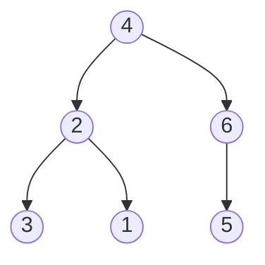

## Examples

**Example 1**

- Input: `s = "4(2(3)(1))(6(5))"`
- Output: `[4,2,6,3,1,5]`

The source diagram has the following tree structure:

**Example 2**

- Input: `s = "4(2(3)(1))(6(5)(7))"`
- Output: `[4,2,6,3,1,5,7]`

**Example 3**

- Input: `s = "-4(2(3)(1))(6(5)(7))"`
- Output: `[-4,2,6,3,1,5,7]`
