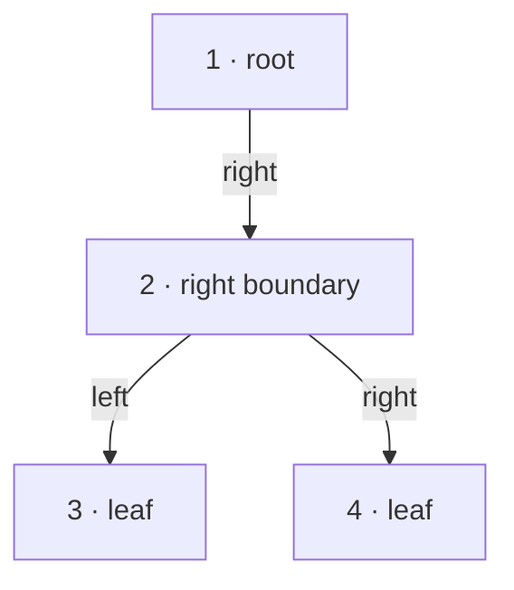
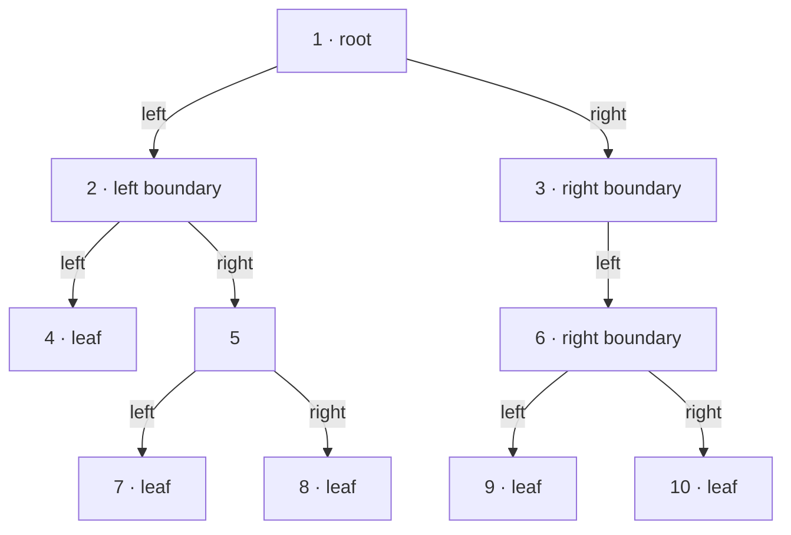

## Examples

**Example 1**

- **Input:** `root = [1,null,2,3,4]`
- **Output:** `[1,3,4,2]`
- **Explanation:** The root has no left child, so the left boundary is empty. On the right side, the path is `2 -> 4`,
  but leaf `4` is excluded from the right boundary, leaving `[2]`. The leaves in left-to-right order are `[3,4]`.
  Concatenating the root `[1]`, the empty left boundary, those leaves, and the reversed right boundary gives
  `[1] + [] + [3,4] + [2] = [1,3,4,2]`.

**Example 2**

- **Input:** `root = [1,2,3,4,5,6,null,null,null,7,8,9,10]`
- **Output:** `[1,2,4,7,8,9,10,6,3]`
- **Explanation:** The left-side path is `2 -> 4`; excluding leaf `4` makes the left boundary `[2]`. The right-side
  path is `3 -> 6 -> 10`; excluding leaf `10` gives `[3,6]`, which contributes `[6,3]` after reversal. The leaves are
  `[4,7,8,9,10]` from left to right. Therefore the full concatenation is
  `[1] + [2] + [4,7,8,9,10] + [6,3] = [1,2,4,7,8,9,10,6,3]`.
