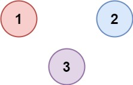

### 1. Description

There are `n` cities. Some of them are connected, while some are not. If city `a` is connected directly with city `b`, and city `b` is connected directly with city `c`, then city `a` is connected indirectly with city `c`.

A **province** is a group of directly or indirectly connected cities and no other cities outside of the group.

You are given an `n x n` matrix `isConnected` where $\text{isConnected}[i][j] = 1$ if the $i^{\text{th}}$ city and the $j^{\text{th}}$ city are directly connected, and $\text{isConnected}[i][j] = 0$ otherwise.

Return *the total number of **provinces***.

### 2. Function Contract

**Inputs**

- `isConnected`: Input parameter (`List[List[int]]`).

**Return value**

- Returns `int`.

### 3. Examples

#### Example 1

- **Input:** $isConnected = [[1,1,0],[1,1,0],[0,0,1]]$
- **Output:** `2`

#### Example 2

- **Input:** $isConnected = [[1,0,0],[0,1,0],[0,0,1]]$
- **Output:** `3`

### 4. Constraints

- $1 \le n \le 200$

- $n = \text{isConnected.length}$

- $n = \text{isConnected}[i].length$

- $\text{isConnected}[i][j]$ is `1` or `0`.

- $\text{isConnected}[i][i] = 1$

- $\text{isConnected}[i][j] = \text{isConnected}[j][i]$
