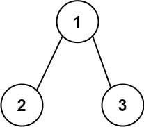
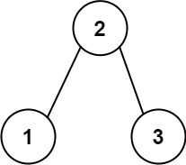

## Description

Given the `root` of a binary tree, return *the length of the longest consecutive path in the tree*.

A consecutive path is a path where the values of the consecutive nodes in the path differ by one. This path can be either increasing or decreasing.

- For example, `[1,2,3,4]` and `[4,3,2,1]` are both considered valid, but the path `[1,2,4,3]` is not valid.

On the other hand, the path can be in the child-Parent-child order, where not necessarily be parent-child order.
### Function Contract

**Inputs**

- `root`: the root node of the binary tree. Each node provides an integer `val` and optional `left` and `right`
  children.

Legal source inputs contain at least one node. Let $n$ be the number of nodes and $h$ be the tree height. A path is a
simple connected sequence of nodes and may start and end anywhere in the tree.

**Return value**

Return the maximum number of nodes on a path whose values change by exactly one at each edge in one consistent
numeric direction. The result is a length, not the path itself.

### Examples
#### Example 1

- **Input:** `root = [1,2,3]`
- **Output:** `2`
- **Explanation:** The longest consecutive path is [1, 2] or [2, 1].
#### Example 2

- **Input:** `root = [2,1,3]`
- **Output:** `3`
- **Explanation:** The longest consecutive path is [1, 2, 3] or [3, 2, 1].
### Constraints

- The number of nodes in the tree is in the range $[1, 3 * 10^{4}]$.

- $-3 * 10^{4} \le \text{Node.val} \le 3 * 10^{4}$