[TOC]

## Summary

Find the length of Longest Consecutive Path in Binary Tree. The path can be either increasing or decreasing i.e. [1,2,3,4] and [4,3,2,1] are both considered valid. The path can be child-parent-child or parent-child.

## Solution

---
### Approach #1 Brute Force [Time Limit Exceeded]

Since there are no cycles in a tree, there must be exactly one unique path from one node to another. So, the number of paths possible will be equal to number of pairs of nodes ${{N}\choose{2}}$, where $N$ is the number of nodes.

Brute force solution of this problem is to find the path between every two nodes and check whether it is increasing or decreasing. In this way we can find maximum length increasing or decreasing sequence.

**Complexity Analysis**

* Time complexity: $O(n^3)$. Total possible number of paths are $n^2$ and checking every path whether it is increasing or decreasing will take $O(n)$ for each path.

* Space complexity: $O(n^3)$. $n^2$ paths each with $O(n)$ nodes.

---

### Approach #2 Single traversal

**Algorithm**

For every node, let's associate two values/variables named $inr$ and $dcr$, where $inr$ represents the length of the longest incrementing branch below the current node including itself, and $dcr$ represents the length of the longest decrementing branch below the current node (including itself).

We make use of a recursive function `longestPath(node)` which returns an array of the form $[inr, dcr]$ for the calling node. We start off by assigning both $inr$ and $dcr$ as 1 for the current node. This is because the node itself always forms a consecutive increasing as well as decreasing path of length 1.

Then, we obtain the length of the longest path for the left child of the current node using `longestPath(root.left)`. Now, if the left child's value is one less than the current node, it forms a decreasing sequence with the current node. Thus, the $dcr$ value for the current node is stored as  the left child's $dcr$ value + 1. But, if the left child's value is 1 greater than the current node's value, it forms an incrementing sequence with the current node. Thus, we update the current node's $inr$ value as $left\_child(inr) + 1$.

Then, we do the same process with the right child as well. But, for obtaining the $inr$ and $dcr$ value for the current node, we need to consider the maximum value out of the two values obtained from the left and the right child for both $inr$ and $dcr$, since we need to consider the longest sequence possible.

Further, after we've obtained the final updated values of $inr$ and $dcr$ for a node, we update the length of the longest consecutive path found so far as $maxval =  \text{max}(inr + dcr - 1)$. We subtract 1 so that the current node is not counted twice, as both $inr$ and $dcr$ include the current node in the path length.

The following animation will help clarify the process:

<!--  -->

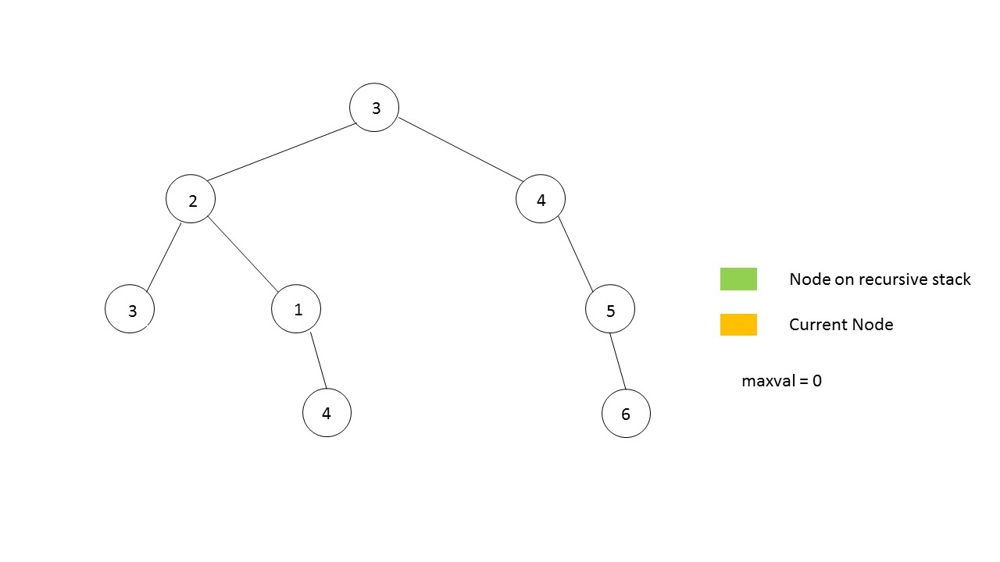

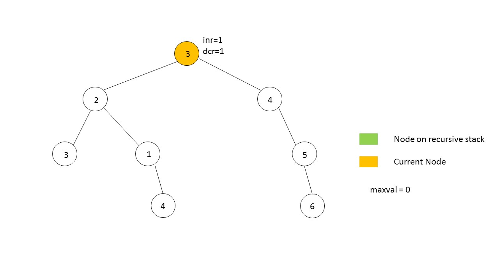

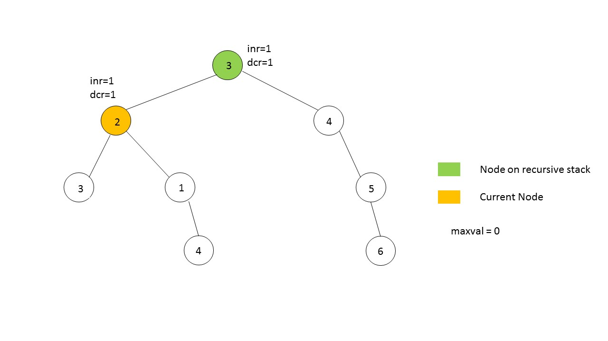

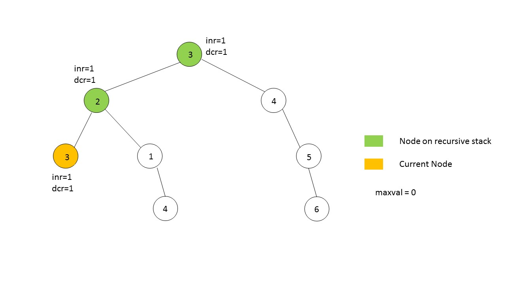

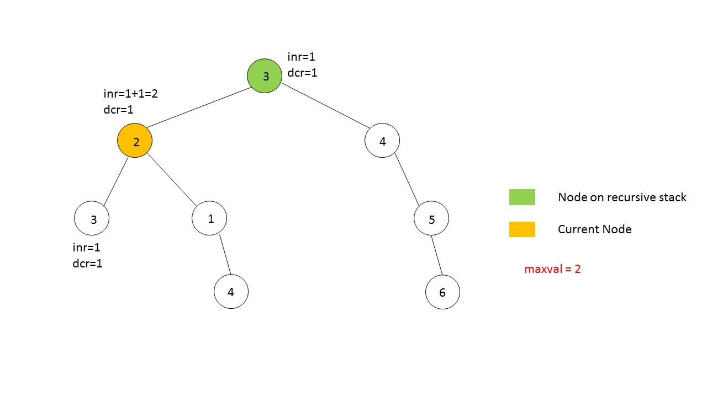

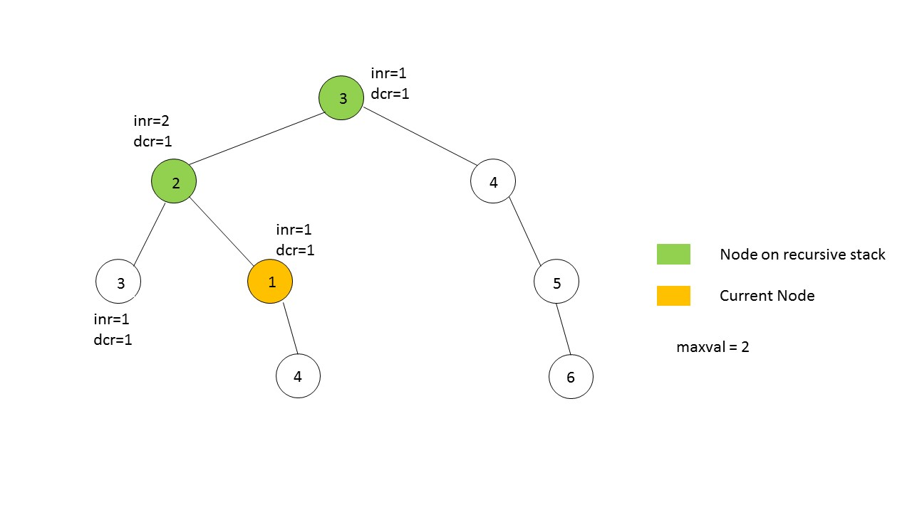

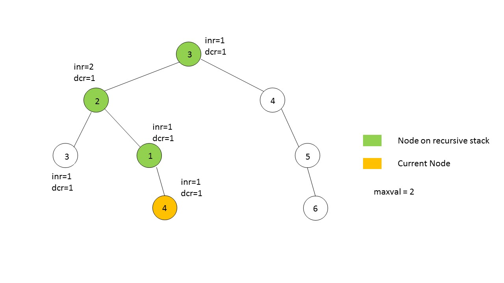

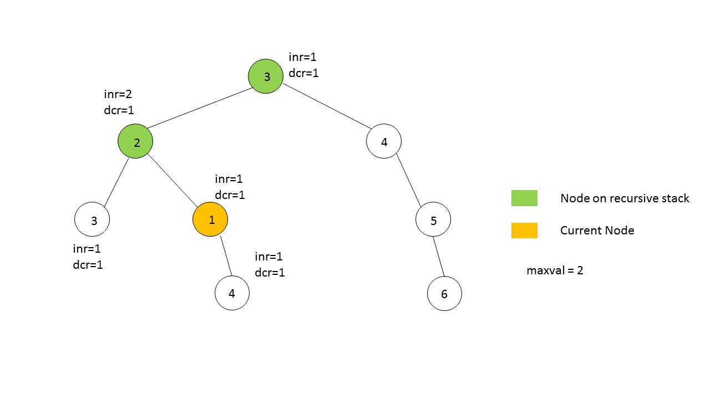

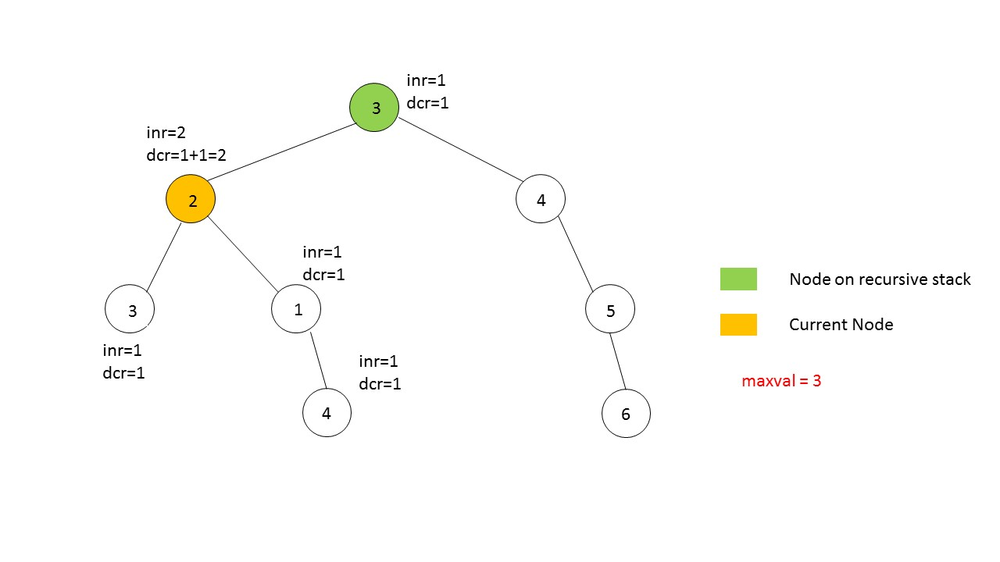

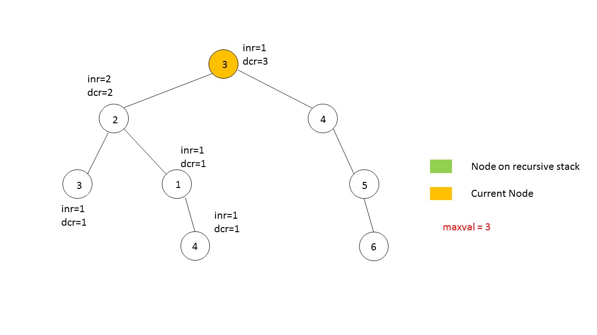

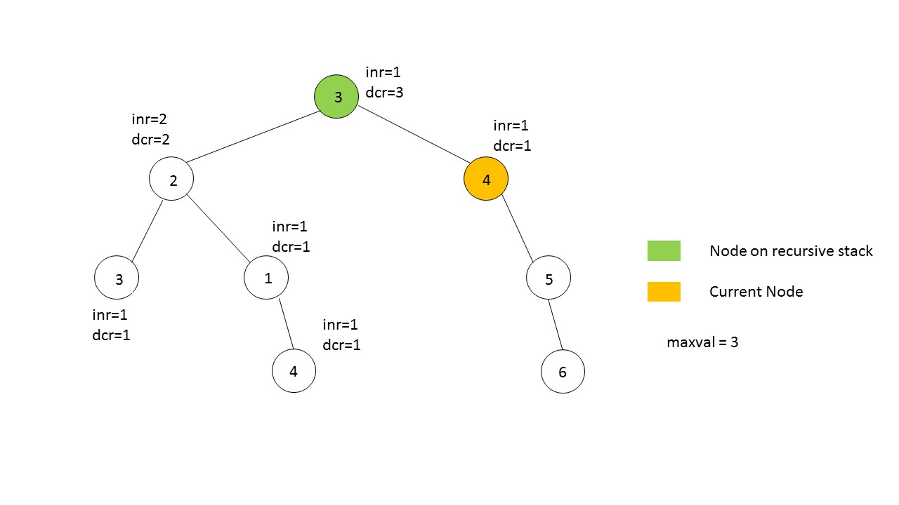

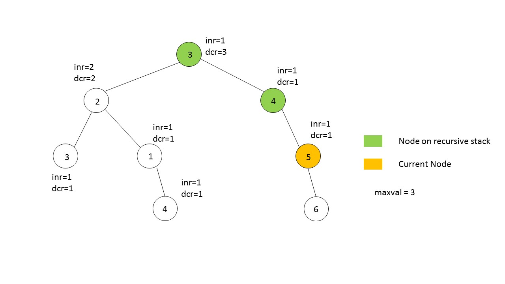

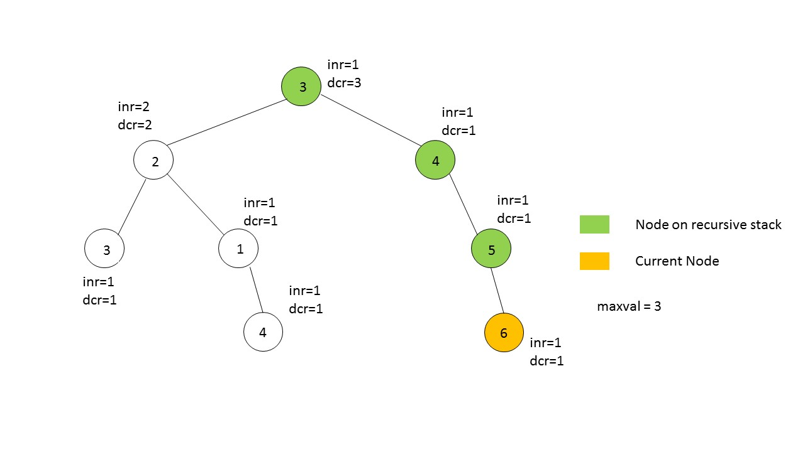

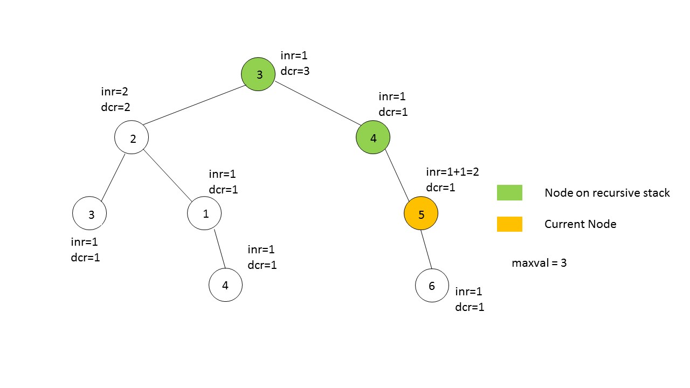

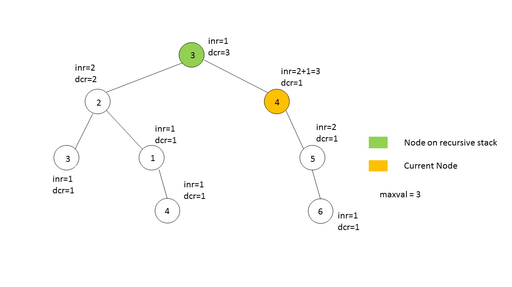

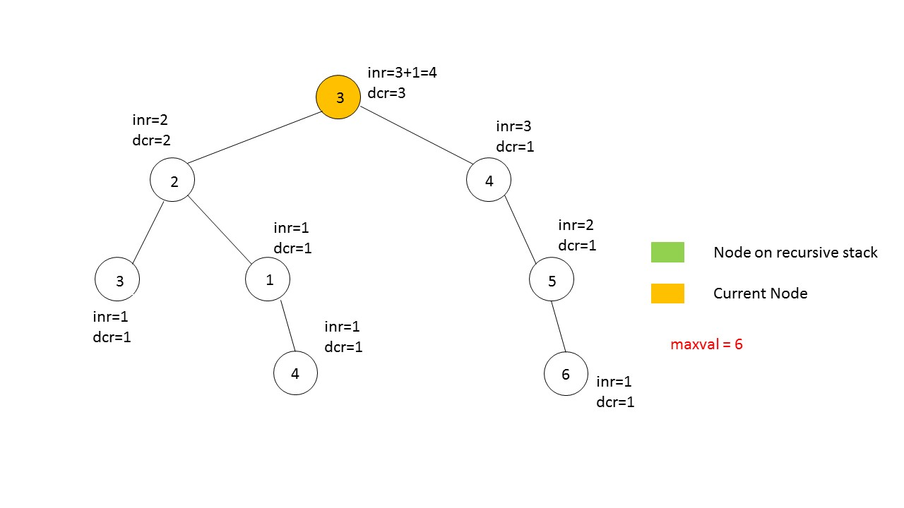

```python
class Solution:
    def longestConsecutive(self, root: TreeNode) -> int:

        def longest_path(root: TreeNode) -> List[int]:
            nonlocal maxval

            if not root:
                return [0, 0]

            inr = dcr = 1
            if root.left:
                left = longest_path(root.left)
                if (root.val == root.left.val + 1):
                    dcr = left[1] + 1
                elif (root.val == root.left.val - 1):
                    inr = left[0] + 1

            if root.right:
                right = longest_path(root.right)
                if (root.val == root.right.val + 1):
                    dcr = max(dcr, right[1] + 1)
                elif (root.val == root.right.val - 1):
                    inr = max(inr, right[0] + 1)

            maxval = max(maxval, dcr + inr - 1)
            return [inr, dcr]

        maxval = 0
        longest_path(root)
        return maxval
```

**Complexity Analysis**

* Time complexity : $O(n)$. The whole tree is traversed only once.
* Space complexity : $O(n)$. The recursion goes up to a depth of $n$ in the worst case.