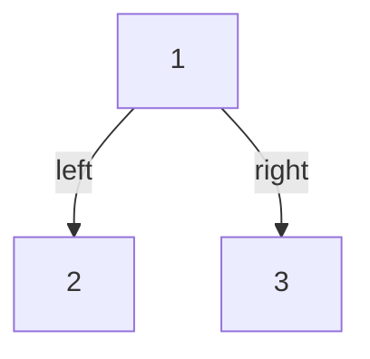
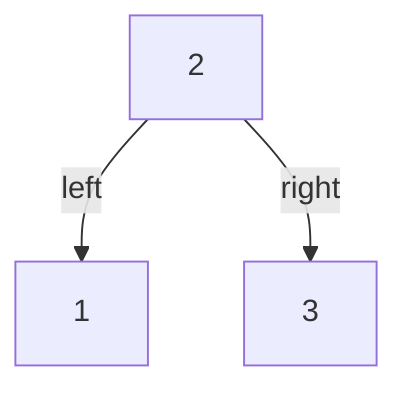

## Examples

**Example 1**

- **Input:** `root = [1,2,3]`
- **Output:** `2`
- **Explanation:** The longest consecutive path is `[1,2]` in increasing order, or the same edge traversed as
  `[2,1]` in decreasing order.

**Example 2**

- **Input:** `root = [2,1,3]`
- **Output:** `3`
- **Explanation:** The child-parent-child traversal `[1,2,3]` is increasing and consecutive. Traversing the same
  nodes in reverse gives the equally valid decreasing path `[3,2,1]`.
