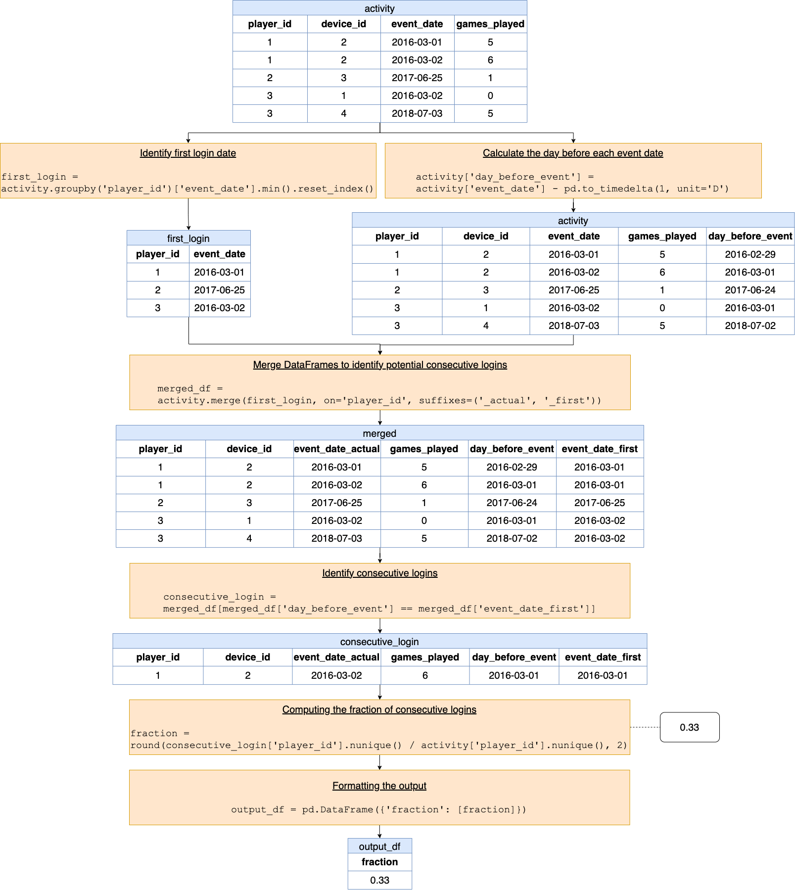

[TOC]

# Solution
---

### Overview

> **Problem reference:** Write a solution to report the fraction of players that logged in again on the day after the day they first logged in, rounded to 2 decimal places. In other words, you need to count the number of players that logged in for at least two consecutive days starting from their first login date, then divide that number by the total number of players.

This problem is a natural extension or follow-up to [part
II](https://leetcode.com/problems/game-play-analysis-ii/) of the five-part Game Play Analysis problem series. Why? Because counting the number of players who logged in for at least two consecutive days starting from their first login date naturally involves starting the problem-solving process by finding out the first login date for each player (which, we should note, actually *is* the solution to [part I](https://leetcode.com/problems/game-play-analysis-i/) in this problem series).

But finding each player's first login date is only a start to solving this
problem. We need to somehow use this information to determine whether or not
each player under consideration logged in the day after their first log in
date. How we go about making this determination is the crux of this problem.

---

## pandas

### Approach 1: Date Manipulation and Conditional Aggregation

**Visualization of approach 1**



#### Intuition

Let's breakdown the steps involved in this approach given the followin input DataFrame:

<table>
<tr><th>player_id</th><th>device_id</th><th>event_date</th><th>games_played</th></tr>
<tr><td>1</td><td>2</td><td>2016-03-01</td><td>5</td></tr>
<tr><td>1</td><td>2</td><td>2016-03-02</td><td>6</td></tr>
<tr><td>2</td><td>3</td><td>2017-06-25</td><td>1</td></tr>
<tr><td>3</td><td>1</td><td>2016-03-02</td><td>0</td></tr>
<tr><td>3</td><td>4</td><td>2018-07-03</td><td>5</td></tr>
</table>
<br>

**Step 1: Identifying the First Login Date**
   - **Objective**: To determine the first date each player logged in.
   - **Intuition**: By grouping the data by $\text{player}_{id}$ and getting the minimum $\text{event}_{date}$, we pinpoint the initial login date for each individual player. This forms our baseline for tracking each player's login activity over time.
```python
first_login = activity.groupby('player_id')['event_date'].min().reset_index()
```
<table>
<tr><th>player_id</th><th>event_date</th></tr>
<tr><td>1</td><td>2016-03-01</td></tr>
<tr><td>2</td><td>2017-06-25</td></tr>
<tr><td>3</td><td>2016-03-02</td></tr>
</table>
<br>

**Step 2: Calculating the Day Before Each Event Date**
   - **Objective**: To facilitate identifying consecutive logins.
   - **Intuition**: Note that in the question, consecutive dates actually represent two adjacent dates with a one-day difference. Therefore, we create a column that represents the day before each $\text{event}_{date}$ to help us identify consecutive logins in the subsequent steps. This column will essentially allow us to match it with the first login date to see if a player logged in consecutively. For instance, if a player first logged in on `2016-03-02` and had consecutive logins on `2016-03-03`, we would add a value of $day_before_event = 2016-03-02$ to the second record, which matches the first login date.

```python
activity['day_before_event'] = activity['event_date'] - pd.to_timedelta(1, unit='D')
```

<table>
<tr><th>player_id</th><th>device_id</th><th>event_date</th><th>games_played</th><th>day_before_event</th></tr>
<tr><td>1</td><td>2</td><td>2016-03-01</td><td>5</td><td>2016-02-29</td></tr>
<tr><td>1</td><td>2</td><td>2016-03-02</td><td>6</td><td>2016-03-01</td></tr>
<tr><td>2</td><td>3</td><td>2017-06-25</td><td>1</td><td>2017-06-24</td></tr>
<tr><td>3</td><td>1</td><td>2016-03-02</td><td>0</td><td>2016-03-01</td></tr>
<tr><td>3</td><td>4</td><td>2018-07-03</td><td>5</td><td>2018-07-02</td></tr>
</table>
<br>

**Step 3: Merging DataFrames to Identify Potential Consecutive Logins**
   - **Objective**: To align actual login dates with the first login dates of each player.
   - **Intuition**: We merge the data on 'player_id' to get a combined dataset where we have details of each player’s first login day along with all other days they logged in. This prepares us to directly compare whether any of the actual login dates align with a day after the first login date, highlighting consecutive logins.

```python
merged_df = activity.merge(first_login, on='player_id', suffixes=('_actual', '_first'))
```

<table>
<tr><th>player_id</th><th>device_id</th><th>event_date_actual</th><th>games_played</th><th>day_before_event</th><th>event_date_first</th></tr>
<tr><td>1</td><td>2</td><td>2016-03-01</td><td>5</td><td>2016-02-29</td><td>2016-03-01</td></tr>
<tr><td>1</td><td>2</td><td>2016-03-02</td><td>6</td><td>2016-03-01</td><td>2016-03-01</td></tr>
<tr><td>2</td><td>3</td><td>2017-06-25</td><td>1</td><td>2017-06-24</td><td>2017-06-25</td></tr>
<tr><td>3</td><td>1</td><td>2016-03-02</td><td>0</td><td>2016-03-01</td><td>2016-03-02</td></tr>
<tr><td>3</td><td>4</td><td>2018-07-03</td><td>5</td><td>2018-07-02</td><td>2016-03-02</td></tr>
</table>
<br>

**Step 4: Identifying Consecutive Logins**
   - **Objective**: To pinpoint the exact instances of consecutive logins occurring a day after the first login.
   - **Intuition**: By filtering the merged dataset for rows where the 'day_before_event' equals the 'event_date_first', we identify the precise moments where a login took place a day after the first login, effectively highlighting consecutive logins.

```python
consecutive_login = merged_df[merged_df['day_before_event'] == merged_df['event_date_first']]
```

<table>
<tr><th>player_id</th><th>device_id</th><th>event_date_actual</th><th>games_played</th><th>day_before_event</th><th>event_date_first</th></tr>
<tr><td>1</td><td>2</td><td>2016-03-02</td><td>6</td><td>2016-03-01</td><td>2016-03-01</td></tr>
</table>
<br>

**Step 5: Computing the Fraction of Consecutive Logins**
   - **Objective**: To find the fraction representing players who logged back in the day following their first login.
   - **Intuition**: Here we find the unique count of players who logged in consecutively and divide it by the total unique count of players in the dataset. This yields the proportion of players who exhibited this behavior, giving us a sense of player retention after the first login.

```python
fraction = round(consecutive_login['player_id'].nunique() / activity['player_id'].nunique(), 2)
```
Returns: `0.33`

**Step 6: Formatting the Output**
   - **Objective**: To prepare the final output.
   - **Intuition**: Creating a new DataFrame to hold the calculated fraction ensures that we can return the results in a structured and readable format, fulfilling the requirements of our function's return type.

```python
output_df = pd.DataFrame({'fraction': [fraction]})
```

<table>
<tr><th>fraction</th></tr>
<tr><td>0.33</td></tr>
</table>
<br>

#### Implementation

```python
import pandas as pd

def gameplay_analysis(activity: pd.DataFrame) -> pd.DataFrame:
    # Step 1: Find the first login date for each player
    first_login = activity.groupby('player_id')['event_date'].min().reset_index()

    # Step 2: Create a new column for the day before each event_date in the original DataFrame
    activity['day_before_event'] = activity['event_date'] - pd.to_timedelta(1, unit='D')

    # Step 3: Merge the dataframes to find rows where player logged in a day after their first login
    merged_df = activity.merge(first_login, on='player_id', suffixes=('_actual', '_first'))

    # Step 4: Find the rows where the actual event date matches the day after the first login date
    consecutive_login = merged_df[merged_df['day_before_event'] == merged_df['event_date_first']]

    # Step 5: Calculate the fraction of players that logged in again on the day after their first login
    fraction = round(consecutive_login['player_id'].nunique() / activity['player_id'].nunique(), 2)

    # Step 6: Create a dataframe to hold the output
    output_df = pd.DataFrame({'fraction': [fraction]})

    return output_df
```

---

## Database

### Approach 1: Subqueries and multi-value use of the `IN` comparison operator

#### Intuition

The preferred solution approach to [part
II](https://leetcode.com/problems/game-play-analysis-ii/) in this problem
series involved using the `IN` comparison operator in a rather creative or
nuanced way, namely *using more than a single value* for comparison:

```sql
SELECT
  A1.player_id,
  A1.device_id
FROM
  Activity A1
WHERE
  (A1.player_id, A1.event_date) IN (
    SELECT
      A2.player_id,
      MIN(A2.event_date)
    FROM
      Activity A2
    GROUP BY
      A2.player_id
  );
```

We can use a similar idea for this problem, where, again, we rely on our
ability to access the tuples $(\text{player}_{id}, \text{first}_{login})$ in some manner:

```sql
(val1, val2) IN (
  SELECT
    A.player_id,
    MIN(A.event_date) AS first_login
  FROM
    Activity A
  GROUP BY
    A.player_id
)
```

But what should `val1` and `val2` be? We must have $\text{player}_{id}$ as `val1`, but the choice for `val2` is less apparent. We need, in some form or fashion, to be able to relate `val2` to the first login date corresponding to the $\text{player}_{id}$ represented by `val1`; specifically, `val2` needs to be a date that is one day *after* the first login date being referenced. How can we achieve this?

#### Algorithm

1. Find the first login date for each player: $(\text{player}_{id}, \text{first}_{login})$.
2. Determine which tuples, if any, exist such that

    ```
    (player_id, day_after_first_login) = (player_id, first_login)
    ```

    The existence of such a tuple will confirm that whichever $\text{player}_{id}$ is
    being considered logged in the day after their first login date (i.e.,
    `day_after_first_login`).

3. Divide the total number of $\text{player}_{id}$ values obtained from the process
   described above by the *total number* of distinct $\text{player}_{id}$ values from
   the entire `Activity` table and round the result to two decimal places.

#### Implementation

##### MySQL

```sql
SELECT
  ROUND(
    COUNT(A1.player_id)
    / (SELECT COUNT(DISTINCT A3.player_id) FROM Activity A3)
  , 2) AS fraction
FROM
  Activity A1
WHERE
  (A1.player_id, DATE_SUB(A1.event_date, INTERVAL 1 DAY)) IN (
    SELECT
      A2.player_id,
      MIN(A2.event_date)
    FROM
      Activity A2
    GROUP BY
      A2.player_id
  );
```

**Note:** We only need to use $COUNT(A1.\text{player}_{id})$ in the `ROUND()` function above as opposed to $COUNT(DISTINCT A1.\text{player}_{id})$ since $(\text{player}_{id}, \text{event}_{date})$ is the primary key of the `Activity` table (i.e., it is not possible for the same player to have duplicated $\text{event}_{date}$ entries for the date after the player's initial login date).

---

### Approach 2: CTEs and `INNER JOIN`

#### Intuition

Common table expressions (CTEs) are powerful not only because of what they
allow us to *do* but also because of how they allow us to *think*. We can use CTEs to our advantage here so as to approach the problem-solving process in a more or less "linear" fashion:

1. Identify the first login date for each player.
2. Identify the number of players who logged in the day after their first login date.
3. Divide the number of players identified in step 2 by the number of players identified in step 1 and round the result to two decimal places.

#### Algorithm

See above.

#### Implementation

##### MySQL

```sql
WITH first_logins AS (
  SELECT
    A.player_id,
    MIN(A.event_date) AS first_login
  FROM
    Activity A
  GROUP BY
    A.player_id
), consec_logins AS (
  SELECT
    COUNT(A.player_id) AS num_logins
  FROM
    first_logins F
    INNER JOIN Activity A ON F.player_id = A.player_id
    AND F.first_login = DATE_SUB(A.event_date, INTERVAL 1 DAY)
)
SELECT
  ROUND(
    (SELECT C.num_logins FROM consec_logins C)
    / (SELECT COUNT(F.player_id) FROM first_logins F)
  , 2) AS fraction;
```

**Note:** As with Approach 1, observe that $COUNT(A.\text{player}_{id})$ is sufficient in the $\text{consec}_{logins}$ CTE since $(\text{player}_{id}, \text{event}_{date})$ is the primary key of the `Activity` table.

---

### Database Conclusion

Approach 1 is beautiful in its own right. It is elegant and builds on work done previously throughout this problem series. But we prefer Approach 2 due to its relative simplicity, performance, and rather principled approach. Specifically, you may be hard-pressed to come up with Approach 1 on the spot in an interview. It should be much more manageable to reproduce a solution akin to Approach 2 in an interview setting.