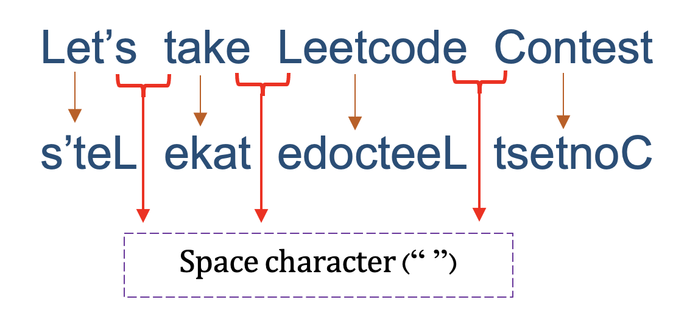
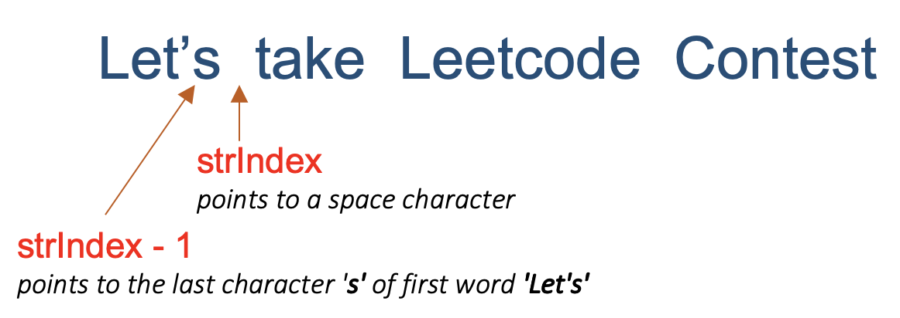
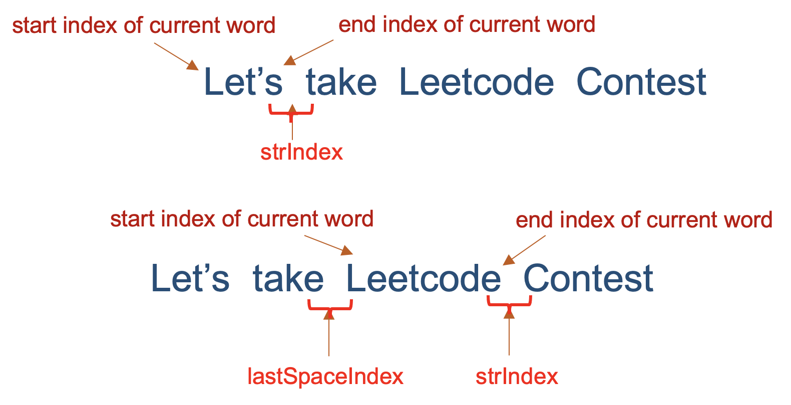
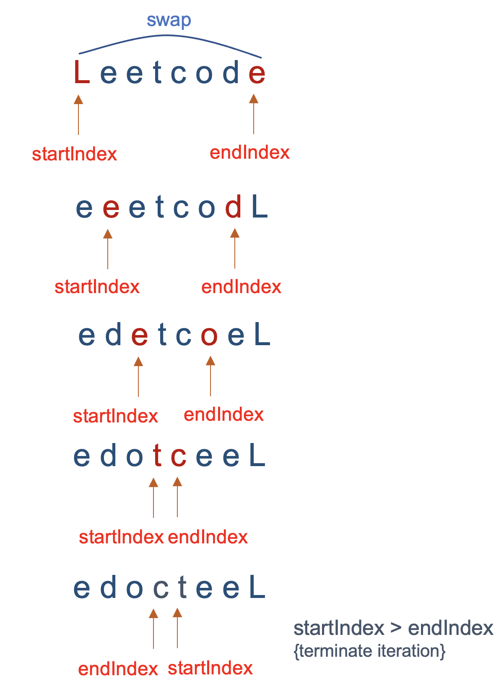

[TOC]

## Solution

---
### Overview

The problem is a variation of similar reverse string problems, [Reverse Words In a String](https://leetcode.com/problems/reverse-words-in-a-string/) and [Reverse Words In String II](https://leetcode.com/problems/reverse-words-in-a-string-ii/).

In the first one, we had to reverse all characters, and in the second variation, we had to reverse the order of words. In this problem, we have to reverse the characters of each word in the sentences.

---
### Approach 1: Traverse and Reverse each character one by one

**Intuition**

To solve the problem let's look at the example carefully,
```
Input: "Let's take LeetCode contest"`

Output: "s'teL ekat edoCteeL tsetnoc"
```
There are a few observations here,
- The characters of each word in the string are reversed, but the order of words remains the same.

   For example, in the input, the word `Let's` is the first word in the string. In the output, the characters in the word `Let's` are reversed to `s'teL`. But it is still at the first position in the string.
Similarly the second word `take` is reversed as `ekat` and placed at the same second position in the output string.

- The words in the string are separated by a space character. So we can say that to build the output string, we must extract and reverse the substring between 2 consecutive space characters.

  

Using this intuition, let's understand how to implement this problem.

**Algorithm**

By analyzing the above two key observations, we can derive the following algorithm,
-  Find the starting and ending position of each word in the string.

   As a space character is a separator for each word, we are finding the substrings having a space character before its first character and after its last character.
   > Note: Take care of 2 edge cases here, the first word does not have a space before its first character. Similarly, the last word does not have a space after its last character.

- For each identified word, reverse the characters of the word one by one.

*Steps*

 Traverse the string from left to right, starting from $0^{th}$ to $n^{th}$ index. As we traverse, the pointer `strIndex` tracks each character.
The implementation can be divided into 2 steps,

1. Find the start and end index of every word

- Traverse over the string until the current pointer `strIndex` points to a space character.

- As `strIndex` points to the space character, the index $strIndex - 1$ points to the last character of the current word.

      

   - Let's understand how to find the first character of the word,
     - For the first word, its first character is always the first character of the string.
     - For the remaining words, the first character would be the character after the last space character.

        Thus, to mark the start of the current character, we must keep track of the last found space character. Let's use a variable `lastSpaceIndex`. The variable will be initialized to `-1`  and updated every time we find the next space character.

       

        The first character of the current word is thus $lastSpaceIndex + 1$.

2. Reverse the characters within the word

   -  Now that we have the first and last index of the current word, we have to reverse the current word and append it to the result string.

   -  To reverse the current word, we can traverse it in reverse order i.e start from the end index $strIndex - 1$ to the first index i.e $lastSpaceIndex + 1$, appending each character one by one to the result string.

   - To separate the current word from the next, append a space character (" ") at the end after the reverse operation. However, for the last word, this step is skipped.

Repeat 1 and 2 for all the words in the string.

**Implementation**

```python
class Solution:
    def reverseWords(self, s: str) -> str:
        result = []
        last_space_index = -1

        for str_index in range(len(s)):
            if str_index == len(s) - 1 or s[str_index] == ' ':
                reverse_str_index = str_index if str_index == len(s) - 1 else str_index - 1
                while reverse_str_index > last_space_index:
                    result.append(s[reverse_str_index])
                    reverse_str_index -= 1
                if str_index != len(s) - 1:
                    result.append(' ')
                last_space_index = str_index

        return ''.join(result)
```

**Complexity Analysis**

Let $N$ be the length of input string `s`.

Time Complexity: $\mathcal{O}(N)$ Every character in the string is traversed twice. First, to find the end of the current word, and second to reverse the word and append it to the result. Thus the time complexity is, $\mathcal{O}(N + N) = \mathcal{O}(N)$.

Space Complexity: $\mathcal{O}(1)$ We use constant extra space to track the last space index. You could also argue that we are using $O(n)$ space to build the output string (we normally don't count the output as part of the space complexity, but in this case we are temporarily using some space to build it).

---

### Approach 2: Using Two Pointers

**Intuition**

In the previous approach, the words were reversed by copying every character into another string one by one in reverse order. This operation takes $\mathcal{O}(N)$ time, where `N` is the length of the word.

However, there is another optimal approach to reverse the string in $\mathcal{O}(N/2)$ time in place using two pointer approach.

In this solution, we will traverse the string and find every word's start and end index. Then, we will reverse each word using the two-pointer approach.

*Approach to reverse a string using a two-pointer approach*

1. Find the start and end index of every word given by `startIndex` and `endIndex`.
2. Swap the characters in the word pointed by `startIndex` and `endIndex`.
3. Increment `startIndex` by 1 and decrement `endIndex` by 1.
4. While `startIndex < endIndex`, repeat steps 2 and 3.

     

Here's the code snippet for reversing the string stored in character array `chArray` using two pointer approach.

```java
while (startIndex < endIndex) {
        char temp = chArray[startIndex];
        chArray[startIndex] = chArray[endIndex];
        chArray[endIndex] = temp;
        startIndex++;
        endIndex--;
}
```

**Algorithm**

- The variable `lastSpaceIndex` stores the index of space character last found. Initialize its value to `-1`.

- Traverse over each character of the string from $0^{th}$ index to $n^{th}$ index using pointer `strIndex`.
- As `strIndex` points to a space character, mark the start and end index of the current word in the variables `startIndex` and `endIndex` as,

  - The `startIndex` of the current word is the value of $lastSpaceIndex + 1$.
  - The `endIndex` of the current word is the value of $strIndex - 1$.

- Reverse the characters in the current word using two pointer approach.

- Update the `lastSpaceIndex` to the value of `strIndex` i.e the index of current space character. The next iteration will refer to this variable to identify the start position of the next word.

-  Repeat the process for all the words in the string.

**Implementation**

```python
class Solution:
    def reverseWords(self, s: str) -> str:
        words = s.split()
        reversed_str = ''
        for word in words:
            reversed_str += word[::-1] + ' '
        return reversed_str.strip()
```

**Complexity Analysis**

Let $N$ be the length of string `s`.
* Time Complexity: $\mathcal{O}(N)$ The outer loop iterates over $\text{N}$ characters to find the `start` and `end` index of every word. The algorithm to reverse the word also iterates $\text{N}$ times to perform $\text{N/2}$ swaps. Thus, the time complexity is $\mathcal{O}(N + N) = {O}(N)$.

* Space Complexity: $\mathcal{O}(1)$ We use constant extra space to track the last space index. You could also argue that we are using $O(n)$ space to build the output string (we normally don't count the output as part of the space complexity, but in this case we are temporarily using some space to build it).

---