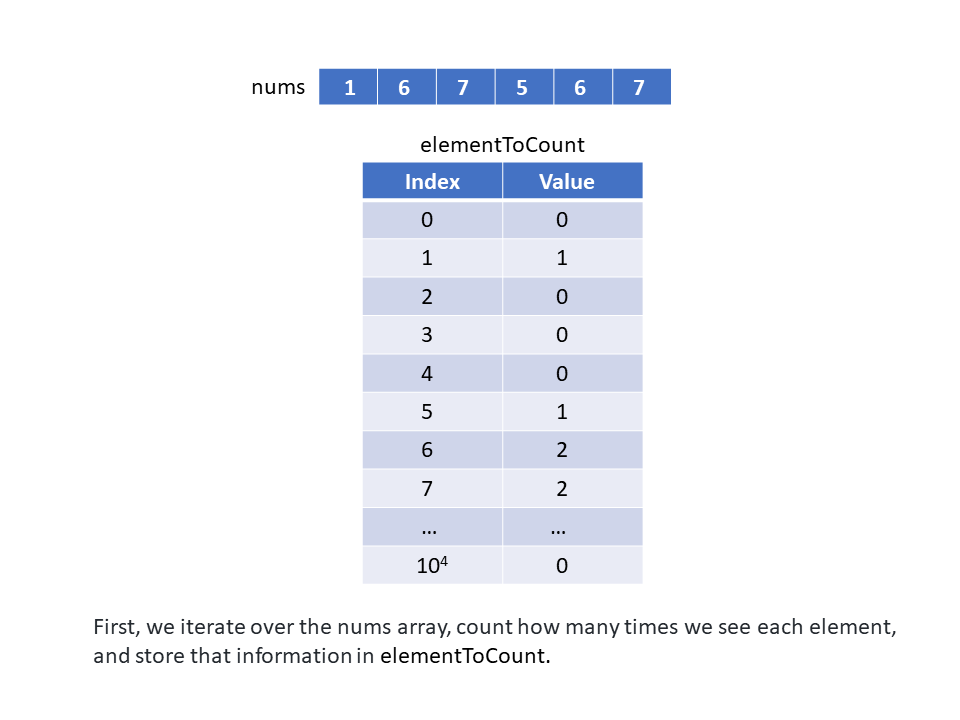
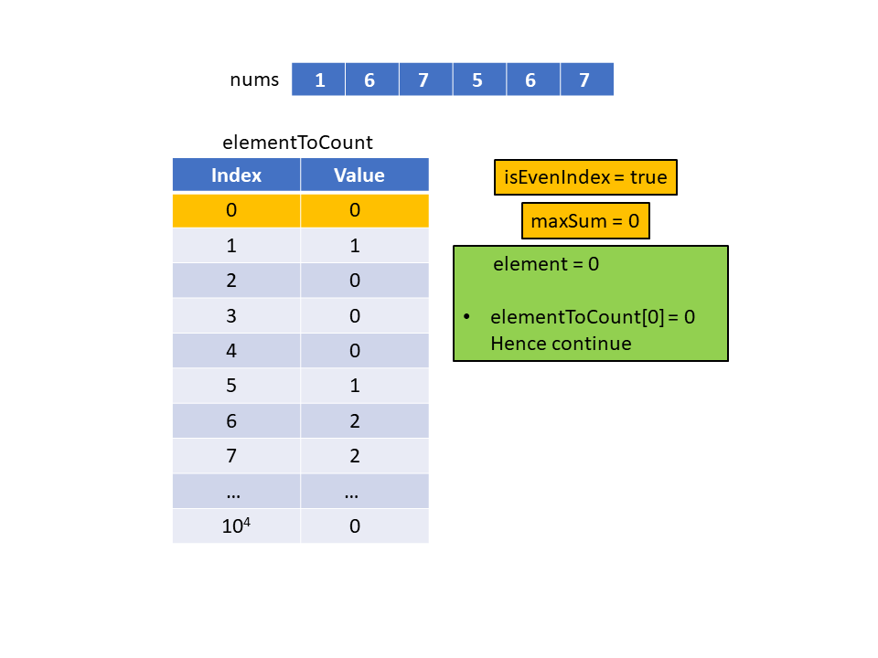
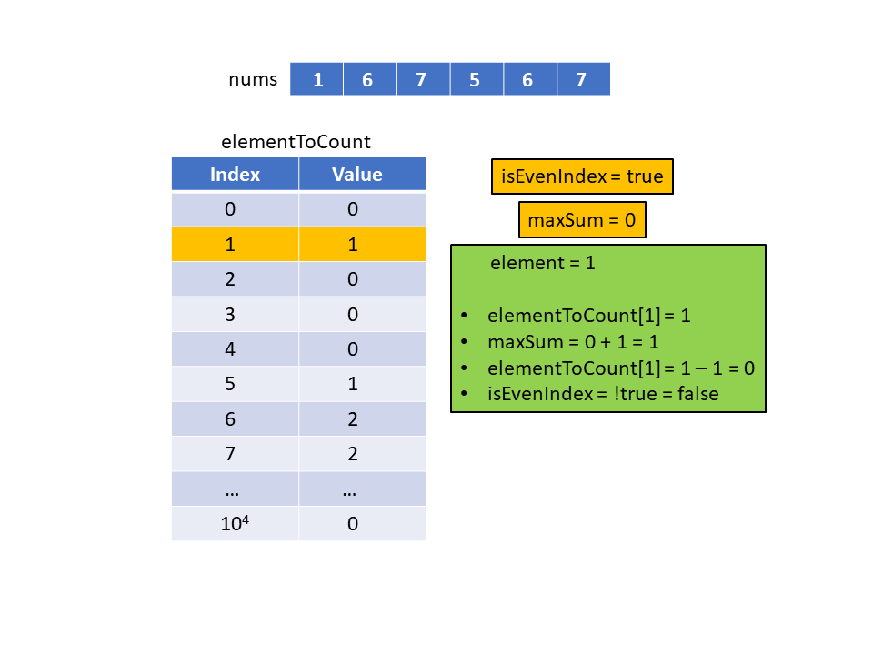
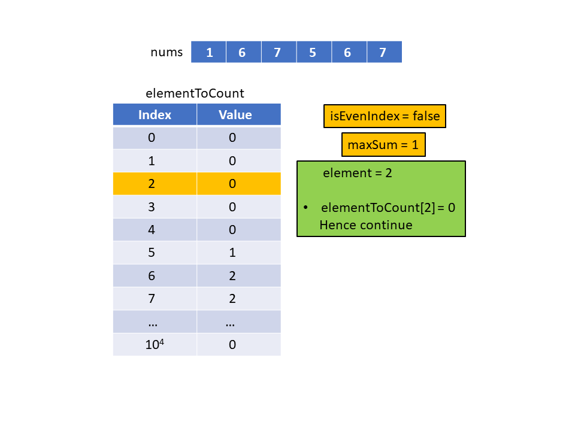
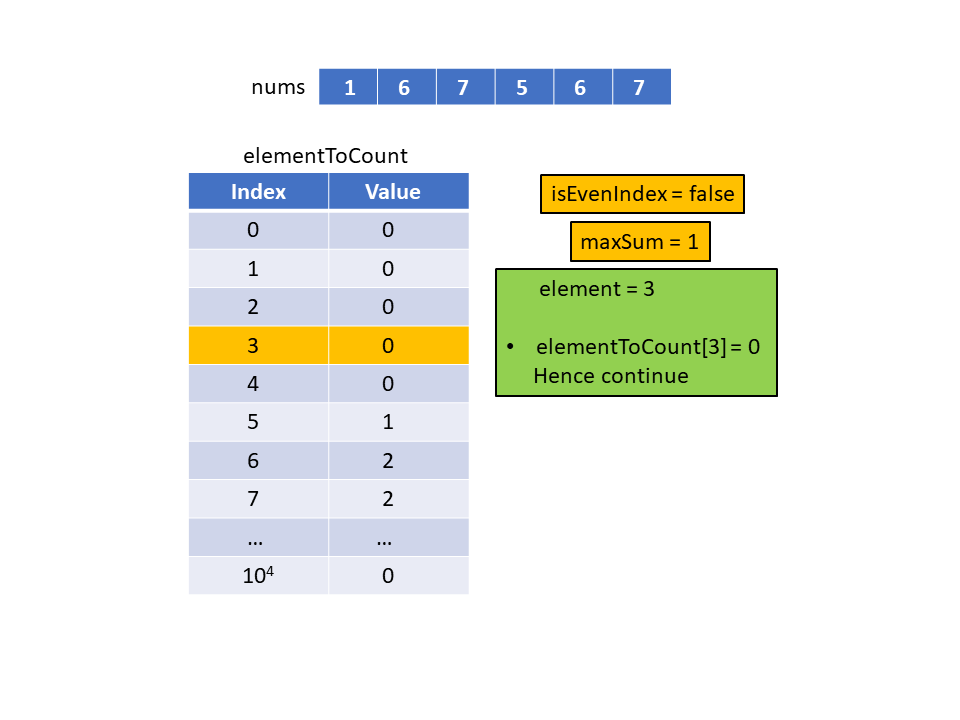
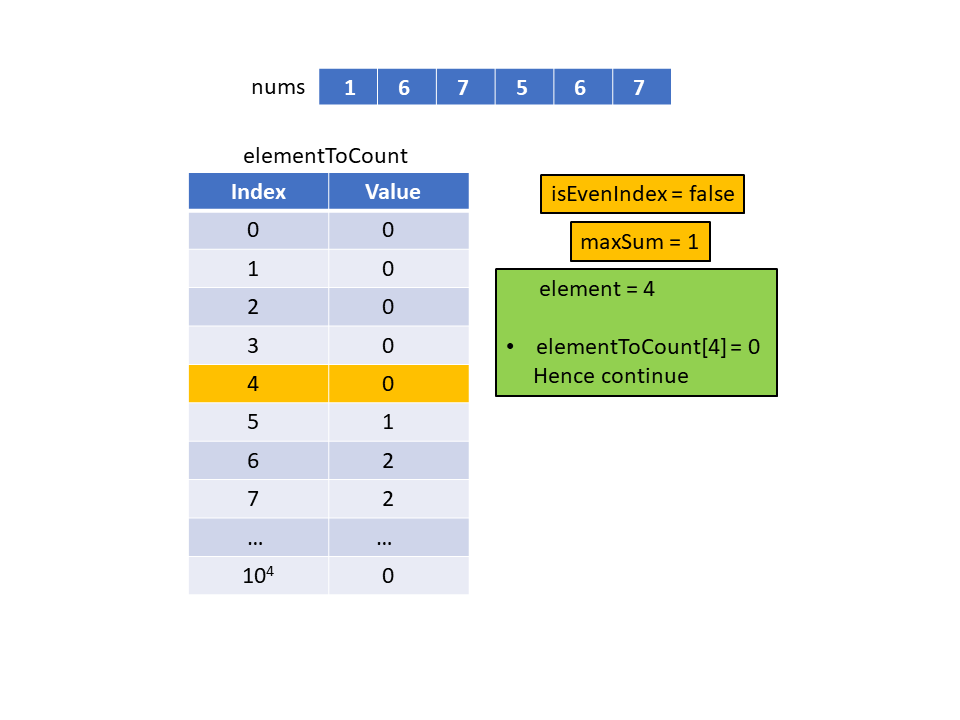
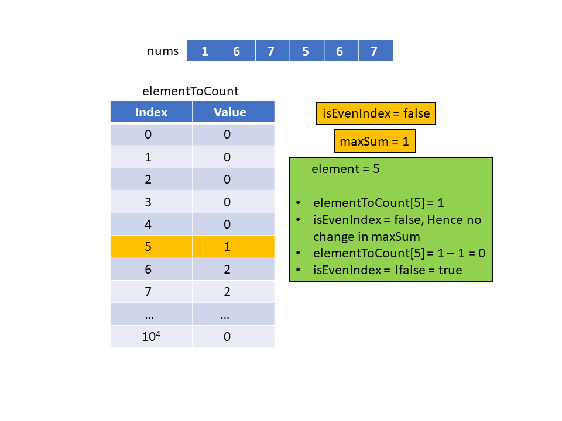
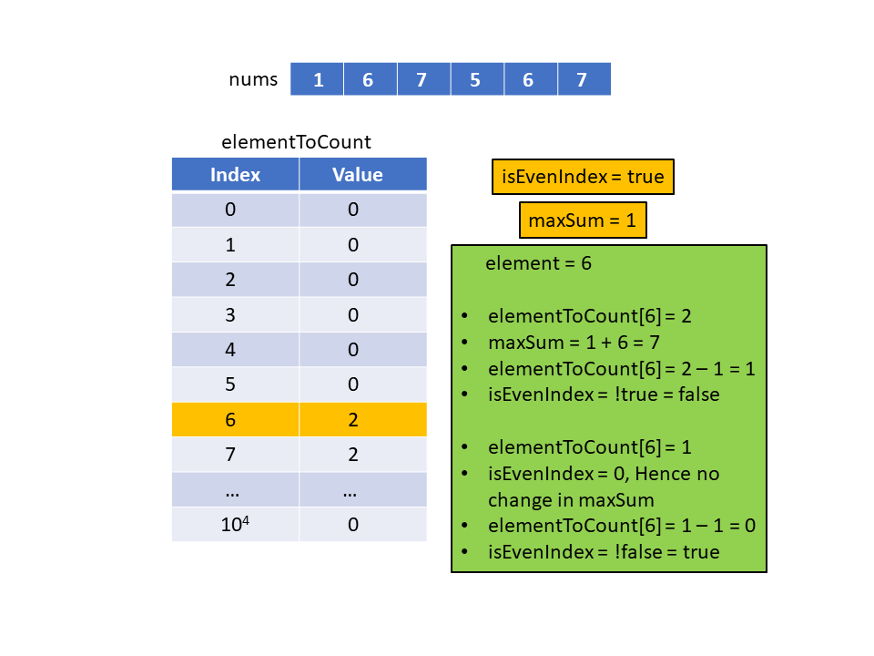
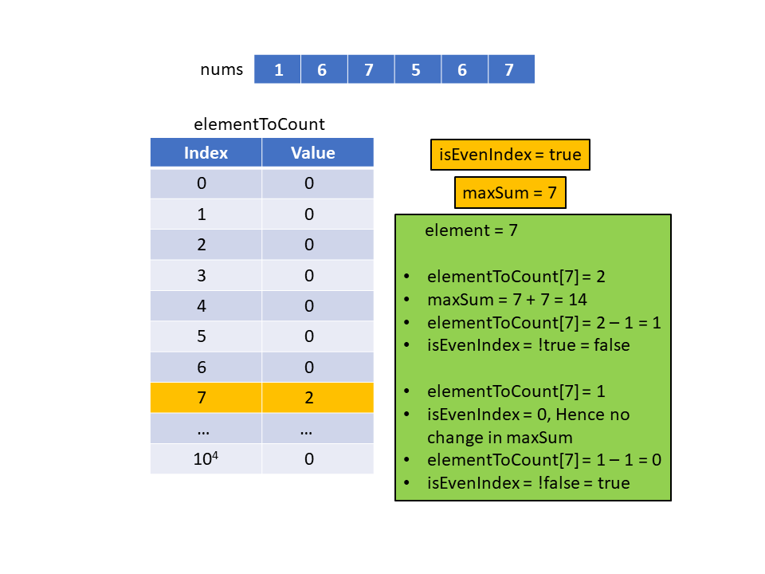
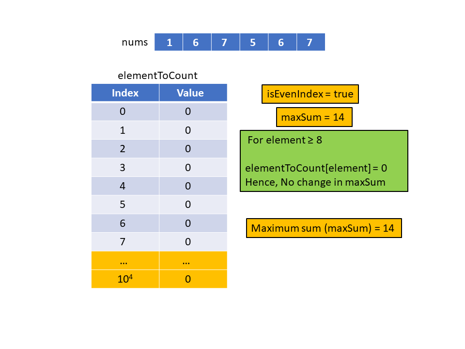

[TOC]

## Solution

---

### Overview

We are given a list of $2N$ integers. We need to group these integers into $N$ pairs such that the sum of minimum elements in all pairs is the maximum possible.

The key observation here is that if we have a pair like $(a, b)$ such that $a \leq b$, then we will add $a$ to the answer and $b$ cannot be used anymore. Therefore, in each such pair, we will add the value of the smaller element but the greater element will not contribute to the answer.

Suppose $x$ is the smallest possible element in the given list. This means that the contribution to the answer for any pair that includes $x$ must be $x$, irrespective of the paired element. The other element will essentially be wasted. Hence to minimize our losses, we would like to pair $x$ with the smallest element other than $x$.

The number paired with $x$ will be the second smallest element in the given list. Hence, we will pair each element with the closest unpaired number in ascending sorted order. After sorting the given list, the first element can be paired with the second element, the third element can be paired with the fourth, and so on.
</br>

---

### Approach 1: Sorting

**Intuition**

We will sort the given list using the built-in sorting function. In the sorted list we will pair the first two elements then the next two elements and so on. Therefore, the first element (at index `0`) will be added to the answer `maxSum` as it is the minimum of the first two elements. Similarly, the third element in the list (at index `2`) will be added, and so on. Hence, we will only sum the elements located at the even indices.

**Algorithm**

1. Sort the list `nums`.
2. Initialize the answer variable `maxSum` as `0`.
3. Iterate over the list `nums` and add the elements at even indices to `maxSum`.
4. Return `maxSum`.

**Implementation**

```python
class Solution:
    def arrayPairSum(self, nums: List[int]) -> int:
        # Sort the list in ascending order
        nums.sort()
        # Initialize sum to zero
        max_sum = 0
        for i in range(0, len(nums), 2):
            # Add every element at even positions (0-indexed)
            max_sum += nums[i]

        return max_sum
```

**Complexity Analysis**

Here, $N$ is the number of pairs that will be produced (i.e., the size of list `nums` is $2 \cdot N$).

* Time complexity: $O(N \log N)$

   Sorting the list `nums` of size $2 \cdot N$ will take $O(2 \cdot N \log(2 \cdot N))$ time which is equivalent to $O(N \log N)$, and iterating over the list will take an additional $O(N)$ time. Hence, the time complexity is $O(N \log N)$.

* Space complexity: $O(N)$

  The only variable we need is `maxSum`, which takes $O(1)$ space. However, some space will be used for sorting the list  `nums`. The space complexity of the sorting algorithm depends on the implementation of each programming language. For instance, in Java, the Arrays.sort() for primitives is implemented as a variant of the QuickSort algorithm whose space complexity is $O(\log N)$. In C++, sort() function provided by STL is a hybrid of QuickSort, Heap Sort, and Insertion Sort and has a worst-case space complexity of $O(\log N)$. Python, on the other hand, uses Timsort, which has a space complexity of $O(N)$. Thus, the use of the built-in sort() function could add up to $O(N)$ to the space complexity.

<br/>

---

### Approach 2: Counting Sort

**Intuition**

In this approach, we will be sorting the list `nums` using counting sort. We will store the frequency count for each element in the array `elementToCount`.

After sorting, we will iterate over all of the elements in sorted order, and add even indexed elements to `maxSum`. After that, we will iterate over the frequency array and use a boolean variable that flips at each element and is only true when we are on an even indexed element.

Since we are using an array where the element values will be used as indices, we need to ensure that we don't have any negative elements. The elements in the list `nums` can be negative with a value down to $-10^4$. Hence, we will add $10^4$ to each element so that all the elements convert to a non-negative value. Therefore, our `elementToCount` array will need to be of size $2 * $10^{4}$ + 1$ to account for the full range of possible values in `nums`.

**Note:**

- We could limit the size of the `elementToCount` array to the range of numbers in the nums array by performing a single pass to find the minimum and maximum values in nums, but to make the solution easier to follow, we chose to use a fixed value for $K$ based on the given problem constraints.
- Instead of iterating over every instance of an element in `elementToCount`. We can find the number of times that an element will be added to the final answer. Since this method doesn't improve the time/space complexity we avoided it to improve the code readability.

**Algorithm**

1. Iterate over each element in the list `nums` and for each `element` we will:
- Add the value $K = 10^4$
- Increment the frequency corresponding to the above element in the array `elementToCount`.
2. Initialize the answer variable `maxSum` as $0$. Initialize the variable `isEvenIndex` as true. This variable will be true when we are at an even position and will be false for odd positions. Since we start with index $0$ we have initialized it as true.
3. Iterate through `elementToCount`, and for each element:
- Iterate over the instances of `element` and for each instance:
- If the current element is at an even index, then we will add the value of that element to the `maxSum`. Since we shifted each element by $K$ when creating the frequency array, the element's value is $element - K$.
       - Decrement the frequency of `element` in `elementToCount` by $1$.
       - Flip the value of `isEvenIndex`. This is because if the current position is even the next will be odd and the variable `isEvenIndex` should be false in that case and vice versa.
4. Return `maxSum`.

The following slideshow demonstrates this algorithm. For simplicity, the example contains only positive values; hence it does not shift each value by $10^4$:





















 <br />

**Implementation**

```python
class Solution:
    def arrayPairSum(self, nums: List[int]) -> int:
        K = 10000
        # Store the frequency of each element
        element_to_count = [0] * (2 * K + 1)
        for element in nums:
            # Add K to element to offset negative values
            element_to_count[element + K] += 1

        # Initialize sum to zero
        max_sum = 0
        is_even_index = True
        for element in range(2 * K + 1):
            while element_to_count[element] > 0 :
                # Add element if it is at even index
                if is_even_index:
                    max_sum += element - K
                # Flip the value (one to zero or zero to one)
                is_even_index = not is_even_index;
                # Decrement the frequency count
                element_to_count[element] -= 1
        return max_sum
```

**Complexity Analysis**

Here, $N$ is the number of pairs that will be produced i.e., the size of list `nums` is $2N$, and $K$ is the range of possible values in nums, which in this problem equals $2·10^4$.

* Time complexity: $O(N + K)$

   First, we iterate over each of the $2N$ elements in `nums` in $O(2N)$ time. Then we iterate through the $2K$ elements in `elementToCount` during which we'll have another $2N$ frequency count operations for a total of $O(2K + 2N)$ time. Hence the total time complexity reduces to $O(N + K)$.

* Space complexity: $O(K)$

   The size of `elementToCount` needs to be able to accommodate the full range of values in `nums`, which can be up to $2K$. Hence the total space complexity reduces to $O(K)$.
<br/>

---