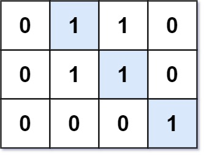
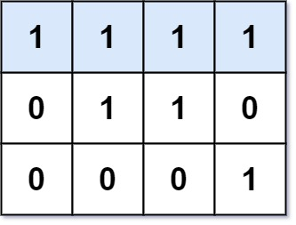

### 1. Description

Given an `m x n` binary matrix `mat`, return *the length of the longest line of consecutive one in the matrix*.

The line could be horizontal, vertical, diagonal, or anti-diagonal.

### 2. Function Contract

**Inputs**

- `mat`: a nonempty rectangular matrix whose entries are `0` or `1`.

Let $r = \lvert\texttt{mat}\rvert$ be the number of rows and $c = \lvert\texttt{\text{mat}[0]}\rvert$ be the number of
columns. A line's length is its number of cells, and every consecutive step must remain inside the matrix while using
one unchanged direction.

**Return value**

Return the maximum length among all horizontal, vertical, diagonal, and anti-diagonal runs of ones. Return `0` when
the matrix contains no `1`.

### 3. Examples

#### Example 1

- **Input:** $mat = [[0,1,1,0],[0,1,1,0],[0,0,0,1]]$
- **Output:** `3`

#### Example 2

- **Input:** $mat = [[1,1,1,1],[0,1,1,0],[0,0,0,1]]$
- **Output:** `4`

### 4. Constraints

- $m = \text{mat.length}$

- $n = \text{mat}[i].length$

- $1 \le m, n \le 10^{4}$

- $1 \le m * n \le 10^{4}$

- $\text{mat}[i][j]$ is either `0` or `1`.
