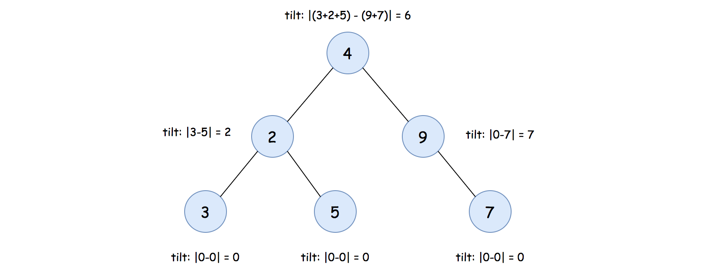

## Solution

---
### Overview

First of all, let us clarify the concept of __*tilt*__ for a given node in a tree.

In order to calculate the tilt value for a node, we need to know the sum of nodes in its left and right subtrees respectively.

Assume that we have a function `valueSum(node)` which gives the sum of all nodes, starting from the input node, then the sum of the node's left subtree would be `valueSum(node.left)`.
Similarly, the sum of its right subtree would be `valueSum(node.right)`.

With the above functions, we can then define the tilt value of a node as follows:
$\text{tilt(node)} = |\text{valueSum(node.left)} - \text{valueSum(node.right)}|$

Given the above formula, we show an example on how the tilt value of each node looks like, in the following graph:



_Note: when a subtree is empty, its value sum is zero._
As a result, the tilt value for a leaf node would be zero, since both the left and right subtree of a leaf node are empty.

---
### Approach 1: Post-Order DFS Traversal

**Intuition**

>The overall idea is that we _traverse_ each node, and calculate the _tilt_ value for each node. At the end, we sum up all the tilt values, which is the desired result of the problem.

There are in general two strategies to traverse a tree data structure, namely [Breadth-First Search](https://leetcode.com/explore/learn/card/queue-stack/231/practical-application-queue/) (**_BFS_**) and [Depth-First Search](https://leetcode.com/explore/learn/card/queue-stack/232/practical-application-stack/) (**_DFS_**).

Concerning the DFS strategy, it can further be divided into three categories: _Pre-Order_, _In-Order_ and _Post-Order_, depending on the relative order of visit among the node and its children nodes.

Sometimes, both strategies could work for a specific problem. In other cases, one of them might be more adapted to the problem.
In our case here, the _DFS_ is a more optimized choice, as one will see later.
More specifically, we could apply the **_Post-Order DFS_** traversal here.

**Algorithm**

As we discussed before, in order to calculate the tilt value for a node, we need to calculate the sum of its left and right subtrees respectively.

Let us first implement the function `valueSum(node)` which returns the sum of values for all nodes starting from the given `node`, which can be summarized with the following recursive formula:

$\text{valueSum(node)} = \text{node.val} + \text{valueSum(node.left)} + \text{valueSum(node.right)}$

Furthermore, the tilt value of a node also depends on the value sum of its left and right subtrees, as follows:

$\text{tilt(node)} = |\text{valueSum(node.left)} - \text{valueSum(node.right)}|$

Intuitively, we could combine the above calculations within a single recursive function.
In this way, we only need to traverse each node once and only once.

>More specifically, we will traverse the tree in the **post-order DFS**, _i.e._ we visit a node's left and right subtrees before processing the value of the current node.

Here are some sample implementations.

```python
class Solution:
    def findTilt(self, root: TreeNode) -> int:
        total_tilt = 0

        def valueSum(node):
            nonlocal total_tilt

            if not node:
                return 0

            left_sum = valueSum(node.left)
            right_sum = valueSum(node.right)
            tilt = abs(left_sum - right_sum)
            total_tilt += tilt

            return left_sum + right_sum + node.val

        valueSum(root)

        return total_tilt
```

**Complexity Analysis**

Let $N$ be the number of nodes in the input tree.

- Time Complexity: $\mathcal{O}(N)$

- We traverse each node once and only once. During the traversal, we calculate the tilt value for each node.

- Space Complexity: $\mathcal{O}(N)$

- Although the variables that we used in the algorithm are of constant-size, we applied recursion in the algorithm which incurs additional memory consumption in function call stack.

- In the worst case where the tree is not well balanced, the recursion could pile up $N$ times. As a result, the space complexity of the algorithm is $\mathcal{O}(N)$.

---