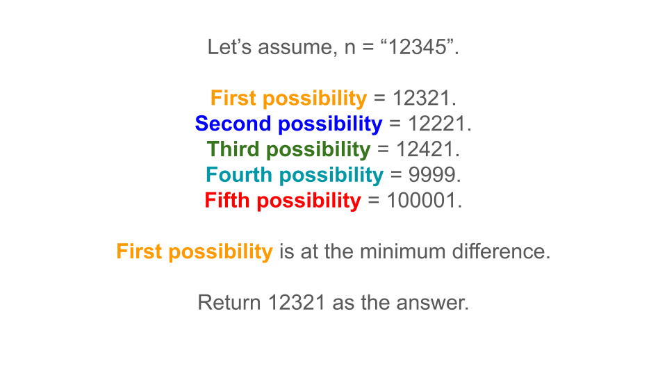

[TOC]

## Solution

---

### Approach 1: Find Previous and Next Palindromes

#### Intuition

The problem asks us to find the closest palindrome to a given integer `n` represented as a string. The string length is at most 18, meaning `n` can be as large as 999,999,999,999,999,999. The goal is to return the nearest palindrome to `n` that is not equal to `n` itself, minimizing the absolute difference.

To solve this, we can think of a palindrome as a number where the first half is mirrored to create the second half. For example, the palindrome for `12321` is formed by reversing the first half (`12`) and appending it to itself (`12` -> `12321`). This observation is key to finding the closest palindrome.

If we consider changing the second half of `n` to match the reverse of the first half, we might obtain a palindrome close to `n`. However, there are cases where this method might not give us the optimal answer, particularly for odd-length strings or when small adjustments to the first half could yield a closer palindrome.

For instance, consider $n = 139$. If we mirror the first half (`13`), we get `131`, but a closer palindrome is `141`. Therefore, it's important to also check palindromes formed by slightly adjusting the first half of `n`:

1. Same Half: Create a palindrome by mirroring the first half.
2. Decremented Half: Create a palindrome by decrementing the first half by 1 and mirroring it.
3. Incremented Half: Create a palindrome by incrementing the first half by 1 and mirroring it.

> Note: Adding +1 or subtracting -1 to/from the first half ensures that we stay as close as possible to the original number while creating new potential palindromes. If we were to add or subtract a larger value, such as +2 or -2, the resulting palindrome would be farther away from the original number, potentially missing a closer palindrome, and it's given that we need to find the closest palindrome.

In addition to these cases, we must handle edge cases where `n` is close to numbers like `1000`, `10000`, etc., or very small numbers like `11` or `9`. These can produce palindromes like `99`, `999`, or `101`, `1001`, which might be closer to `n`.

To summarize, we need to check the following five candidates:
- Palindrome formed from the first half of `n`.
- Palindrome formed from the first half decremented by 1.
- Palindrome formed from the first half incremented by 1.
- Nearest palindrome of the form `99`, `999`, etc.
- Nearest palindrome of the form `101`, `1001`, etc.

After generating these candidates, we compare them to `n` and choose the one with the smallest absolute difference.

#### Algorithm

Main Function - `nearestPalindromic(n)`

1. Calculate the length of `n` and determine the midpoint.
2. Extract the first half of the number.
3. Generate possible palindromic candidates and append them to `possibilities` list:
- Mirror the first half and append it to the string.
- Mirror the first half incremented by 1 and append it to the string.
- Mirror the first half decremented by 1 and append it to the string.
- Add the form 999....
- Add the form 100...001.
4. Find the nearest palindromic number by comparing absolute differences.
5. Return the closest palindrome.

Helper Function - `halfToPalindrome(left, even)`

1. Initialize `res` with `left`.
2. If the length is odd, divide `left` by 10.
3. Mirror the digits of `left` to form a palindrome.
4. Return the palindrome `res`.



#### Implementation

```python
class Solution:
    def nearestPalindromic(self, n: str) -> str:
        len_n = len(n)
        i = len_n // 2 - 1 if len_n % 2 == 0 else len_n // 2
        first_half = int(n[: i + 1])
        """
        Generate possible palindromic candidates:
1. Create a palindrome by mirroring the first half.
2. Create a palindrome by mirroring the first half incremented by 1.
3. Create a palindrome by mirroring the first half decremented by 1.
4. Handle edge cases by considering palindromes of the form 999...
           and 100...001 (smallest and largest n-digit palindromes).
        """
        possibilities = []
        possibilities.append(
            self.half_to_palindrome(first_half, len_n % 2 == 0)
        )
        possibilities.append(
            self.half_to_palindrome(first_half + 1, len_n % 2 == 0)
        )
        possibilities.append(
            self.half_to_palindrome(first_half - 1, len_n % 2 == 0)
        )
        possibilities.append(10 ** (len_n - 1) - 1)
        possibilities.append(10**len_n + 1)

        diff = float("inf")
        res = 0
        nl = int(n)
        for cand in possibilities:
            if cand == nl:
                continue
            if abs(cand - nl) < diff:
                diff = abs(cand - nl)
                res = cand
            elif abs(cand - nl) == diff:
                res = min(res, cand)
        return str(res)

    def half_to_palindrome(self, left: int, even: bool) -> int:
        res = left
        if not even:
            left = left // 10
        while left > 0:
            res = res * 10 + left % 10
            left //= 10
        return res
```

#### Complexity Analysis

Let $n$ be the number of digits in the input number.

- Time complexity: $O(n)$

    We perform operations on exactly 5 strings. The palindrome construction for each string takes $O(n)$ time. Therefore, total time complexity is given by $O(n)$.

- Space complexity: $O(n)$

    We store the 5 possible candidates in the `possibilities` array. Apart from this, the built-in functions used to make the `firstHalf` can potentially lead to $O(n)$ space complexity, as they copy the characters into a new String. Therefore, the total space complexity is $O(n)$.

---

### Approach 2: Binary Search

#### Intuition

Another way to solve the problem is by using binary search. The task is to find the smallest palindrome greater than `n` and the largest palindrome smaller than `n`, then return the one with the smallest absolute difference. Since this is a minimization/maximization, we can try to use binary search to solve this problem. But, our search space should be sorted to apply binary search. Observe that when you construct the palindromes using the first half for two integers, then the greater integer would always have it's constructed palindrome greater. Therefore, our search space is sorted in a non-decreasing order.

Given that palindromes are symmetric numbers, we can search within a specific range by leveraging binary search. The key is to first determine potential palindromes by constructing them based on the first half of `n`.

Finding the Next Palindrome:
- Start with the left boundary as $n + 1$ and the right boundary as an infinitely large value.
- Perform binary search within this range. For each midpoint value, construct the palindrome by mirroring its first half.
- If the constructed palindrome is greater than `n`, shift the search to the left (smaller values). Otherwise, move to the right.

Finding the Previous Palindrome:
- Start with the left boundary as `0` and the right boundary as $n - 1$.
- Perform binary search, constructing palindromes as above.
- If the constructed palindrome is smaller than `n`, shift the search to the right (larger values). Otherwise, move to the left.

Binary search efficiently narrows down the range of possible palindromes, finding the closest one that is greater and the closest one that is smaller. Once we have these two candidates, we simply compare their differences with `n` to determine the closest palindrome.

This approach is particularly useful when `n` is large, as it reduces the search space compared to checking all potential candidates directly.

#### Algorithm

`convert(num)`

1. Convert the number `num` to a string `s`.
2. Identify the midpoint indices `l (left)` and `r (right)`.
3. Mirror the left half of the string s onto the right half to create a palindrome.
4. Return the palindrome as a long integer.

`nextPalindrome(num)`

1. Initialize `left` to 0 and `right` to `num`.
2. Use binary search to find the next palindrome greater than `num`:
- Calculate `mid` as the midpoint between `left` and `right`.
- Convert `mid` to a palindrome using `convert(mid)`.
- If the palindrome is less than `num`, update `ans` to the palindrome and set `left` to $mid + 1$.
- Otherwise, set `right` to $mid - 1$.
3. Return the result `ans`.

`previousPalindrome(num)`

1. Initialize `left` to `num` and `right` to a large value `(1e18)`.
2. Use binary search to find the previous palindrome smaller than `num`:
- Calculate `mid` as the midpoint between `left` and `right`.
- Convert `mid` to a palindrome using `convert(mid)`.
- If the palindrome is greater than `num`, update `ans` to the palindrome and set `right` to $mid - 1$.
- Otherwise, set `left` to $mid + 1$.
3. Return the result `ans`.

Main Function - `nearestPalindromic(n)`

1. Convert the input string `n` to a long integer `num`.
2. Call `nextPalindrome(num)` to find the next palindrome greater than `num`.
3. Call `previousPalindrome(num)` to find the previous palindrome smaller than `num`.
4. Compare the differences between `num` and the two palindromes found:
- If the difference with the next palindrome is less than or equal to the difference with the previous palindrome, return the next palindrome. Otherwise, return the previous palindrome as a string.

#### Implementation

```python
class Solution:
    def convert(self, num: int) -> int:
        s = str(num)
        n = len(s)
        l, r = (n - 1) // 2, n // 2
        s_list = list(s)
        while l >= 0:
            s_list[r] = s_list[l]
            r += 1
            l -= 1
        return int("".join(s_list))

    def previous_palindrome(self, num: int) -> int:
        left, right = 0, num
        ans = float("-inf")
        while left <= right:
            mid = (right - left) // 2 + left
            palin = self.convert(mid)
            if palin < num:
                ans = palin
                left = mid + 1
            else:
                right = mid - 1
        return ans

    def next_palindrome(self, num: int) -> int:
        left, right = num, int(1e18)
        ans = float("-inf")
        while left <= right:
            mid = (right - left) // 2 + left
            palin = self.convert(mid)
            if palin > num:
                ans = palin
                right = mid - 1
            else:
                left = mid + 1
        return ans

    def nearestPalindromic(self, n: str) -> str:
        num = int(n)
        a = self.previous_palindrome(num)
        b = self.next_palindrome(num)
        if abs(a - num) <= abs(b - num):
            return str(a)
        return str(b)
```

#### Complexity Analysis

Let $m$ be the input number and $n$ be the number of digits in it.

- Time complexity: $O(n \cdot log(m))$

    We perform two binary search operations on a search space of size `m`, and in each operation iterate through all the digits. Therefore, the total time complexity is given by $O(n \cdot log(m))$.

- Space complexity: $O(n)$

    The space complexity is primarily determined by the storage needed for the string representation of the number and the intermediate list or character array used for manipulation. Since these data structures are proportional to the number of digits in $O(n)$, the total space complexity is $O(n)$.

    For C++: $\text{to}_{string}(num)$ - Converts the number to a string, which requires space proportional to the number of digits in $O(n)$, i.e., $O(n)$.
    For Java: `Long.toString(num)` - Converts the number to a string, requiring $O(n)$ space.
    For Python: $''.join(s_{list})$ - Creates a new string from the list, requiring $O(n)$ space.

---