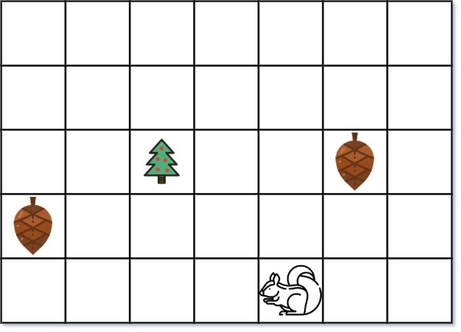

## Description

You are given two integers `height` and `width` representing a garden of size `height x width`. You are also given:

- an array `tree` where $tree = [\text{tree}_{r}, \text{tree}_{c}]$ is the position of the tree in the garden,

- an array `squirrel` where $squirrel = [\text{squirrel}_{r}, \text{squirrel}_{c}]$ is the position of the squirrel in the garden,

- and an array `nuts` where $\text{nuts}[i] = [\text{nut}_{i}r, \text{nut}_{i}c]$ is the position of the $$i^{\text{th}}$$ nut in the garden.

The squirrel can only take at most one nut at one time and can move in four directions: up, down, left, and right, to the adjacent cell.

Return *the **minimal distance** for the squirrel to collect all the nuts and put them under the tree one by one*.

The **distance** is the number of moves.
### Function Contract

**Inputs**

- `height`: the garden's row count.
- `width`: the garden's column count.
- `tree`: the tree coordinate `[row, column]`.
- `squirrel`: the squirrel's initial coordinate `[row, column]`.
- `nuts`: the list of nut coordinates, with $\text{nuts}[i]$ identifying the $i$th nut.

Let $n$ be the number of entries in `nuts`. Because movement is axis-aligned, the distance between coordinates $(r_1,c_1)$ and $(r_2,c_2)$ is $lvert r_1-r_2\rvert + \lvert c_1-c_2\rvert$.

**Return value**

Return the smallest total move count for a route that carries every nut to `tree`, never carrying more than one nut at once.

### Examples

#### Example 1

- **Input:** $height = 5, width = 7, tree = [2,2], squirrel = [4,4], nuts = [[3,0], [2,5]]$
- **Output:** `12`
- **Explanation:** The squirrel should go to the nut at [2, 5] first to achieve a minimal distance.
#### Example 2

- **Input:** $height = 1, width = 3, tree = [0,1], squirrel = [0,0], nuts = [[0,2]]$
- **Output:** `3`
### Constraints

- $1 \le height, width \le 100$

- $\text{tree.length} = 2$

- $\text{squirrel.length} = 2$

- $1 \le \text{nuts.length} \le 5000$

- $\text{nuts}[i].length = 2$

- $0 \le \text{tree}_{r}, \text{squirrel}_{r}, \text{nut}_{i}r \le height$

- $0 \le \text{tree}_{c}, \text{squirrel}_{c}, \text{nut}_{i}c \le width$