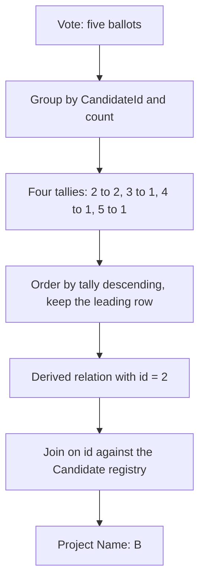

# Guided Example: Winning Candidate

An election result is not stored anywhere in the database. The `Vote` table records one chosen candidate per ballot and the `Candidate` table records who each identifier refers to, so "who won" decomposes into two questions that must be asked in the right order: which candidate identifier collected the strictly largest number of ballots, and what name that identifier belongs to. This lesson traces a five-ballot election and shows why the tally and the identity lookup are separate stages rather than one combined pass.

## 1. The Instance and the Required Outcome

| `id` | `Name` |
|:---:|:---:|
| 1 | `A` |
| 2 | `B` |
| 3 | `C` |
| 4 | `D` |
| 5 | `E` |

| `id` | `CandidateId` |
|:---:|:---:|
| 1 | 2 |
| 2 | 4 |
| 3 | 3 |
| 4 | 2 |
| 5 | 5 |

The guarantee that makes the task well posed is that the data admits **exactly one winner**: one candidate holds a strict maximum over all others. The required result is the winner's name in a single-row table:

| `Name` |
|:---:|
| `B` |

Note what the output does not contain: no vote count, no identifier, no runner-up. A method that ranks every candidate correctly but returns the whole ranking has still failed.

## 2. Plurality as Two Relational Stages

Let $\mathrm{tally}(c)$ count the ballots naming candidate $c$. With $\mathbf{1}[\cdot]$ the indicator function,

$$
\mathrm{tally}(c) = \sum_{v \in \text{Vote}} \mathbf{1}\!\left[\,v.\text{CandidateId} = c\,\right],
\qquad
c^{*} = \arg\max_{c} \mathrm{tally}(c),
$$

and the answer is the `Name` of the unique registry row whose `id` equals $c^{*}$.

The two-stage structure is forced by the data model. Counting depends only on `CandidateId`, so it needs only `Vote`; resolving an identifier to a name needs only `Candidate`, which is keyed by `id`. Nothing in stage one requires the name and nothing in stage two requires the count, which is why stage one carries all of the algorithmic work and stage two is a single keyed lookup. The tally is also defined on a multiset: shuffling ballot order or enlarging the registry leaves every count unchanged.

> **Tally invariant.** Grouping the `Vote` rows by `CandidateId` produces exactly one row per distinct voted candidate, whose count equals the number of ballots naming that candidate. Ballot order and registry size are irrelevant to the count.

## 3. Tallying the Ballots

Walking the ballots in `id` order:

| Ballot `id` | `CandidateId` | Running count for that candidate | Tally after this ballot |
|:---:|:---:|:---:|:---:|
| 1 | 2 | 1 | $\mathrm{tally}(2) = 1$ |
| 2 | 4 | 1 | $\mathrm{tally}(4) = 1$ |
| 3 | 3 | 1 | $\mathrm{tally}(3) = 1$ |
| 4 | 2 | 2 | $\mathrm{tally}(2) = 2$ |
| 5 | 5 | 1 | $\mathrm{tally}(5) = 1$ |

The grouped relation therefore has four rows, one per identifier that actually appears on a ballot:

| `CandidateId` | Ballots naming it | $\mathrm{tally}$ |
|:---:|:---|:---:|
| 2 | 1, 4 | 2 |
| 3 | 3 | 1 |
| 4 | 2 | 1 |
| 5 | 5 | 1 |

Candidate 1, registered as `A`, cast no ballot and produces **no group at all**. That is a structural fact about aggregation rather than a filtering decision: a group exists only because rows contribute to it. The candidate is still in the registry, so the registry must never be the source of the tally.

## 4. Ranking the Tallies and Slicing the Leader

The grouped relation is then ordered by tally descending. The strict-maximum guarantee means the first row of that order is unique.

| Rank | `CandidateId` | $\mathrm{tally}$ | Strict maximum? | Survives a one-row slice? |
|:---:|:---:|:---:|:---:|:---|
| 1 | 2 | 2 | yes | **yes** |
| 2 | 3 | 1 | no | no, tied below the leader |
| 2 | 4 | 1 | no | no, tied below the leader |
| 2 | 5 | 1 | no | no, tied below the leader |
| — | 1 | 0 | no | no, never tallied at all |

Three candidates share rank 2. Without the strict-maximum guarantee the slice would keep one of them arbitrarily and the answer would be non-deterministic, so the guarantee is exactly what licenses slicing one row instead of taking every row whose tally equals the maximum. The distinction matters: the slice is correct *because* the data has a strict maximum, whereas the equality formulation would survive ties but would then need a tie-break rule the contract does not define. Restricted to the leader, the derived relation is the one-row intermediate $t = \{(\text{id} = 2)\}$.

## 5. Projecting the Winner's Name

| Derived row | Registry key probed | Matching `Name` | Emitted |
|:---:|:---:|:---:|:---:|
| `id = 2` | 2 | `B` | **`B`** |
| — | 1 | `A` | not reached: `A` was never a group |
| — | 3, 4, 5 | `C`, `D`, `E` | not reached: discarded by the slice |

## 6. Correctness of the Two-Stage Method

Take the guarantee as a hypothesis: some candidate $c^{*}$ satisfies $\mathrm{tally}(c^{*}) > \mathrm{tally}(c)$ for every other candidate $c$.

*The tally stage computes the true count.* Grouping partitions the ballot relation, so every ballot belongs to exactly one group and is counted once; a group's cardinality is by definition the number of ballots naming that candidate. No ballot is dropped and none is counted twice.

*The slice selects exactly the winner.* Under a strict maximum, ordering descending places $c^{*}$ first and every other row strictly below it, so nothing else can occupy rank 1.

*The lookup resolves the name.* `Candidate.id` is unique, so the single derived identifier matches at most one registry row and cannot duplicate the result. Since `CandidateId` is a foreign key to `Candidate.id` and the identifier came from a real ballot, a matching registry row must exist, so the join cannot silently return nothing.

*Completeness.* Any candidate with a maximal tally must be $c^{*}$ by uniqueness of the strict maximum, so no rival can be reported in its place, and the projected attribute is the registry's name for $c^{*}$.

The guarantee also explains why the join is confined to one derived row. Joining the registry into the ballots before grouping also yields correct counts, because the registry join is one-to-one on the key, but it pays the join cost for every ballot instead of once.

## 7. Boundary Cases This Instance Exposes

| Situation | Behaviour of the method | Result |
|:---|:---|:---|
| A registered candidate receives no ballots | no group is produced for that identifier | the zero-tally candidate cannot win, correctly |
| A single ballot in the whole table | one group with tally 1 | that candidate's name is projected |
| Two candidates tie at the maximum | the strict-winner guarantee is violated | the slice becomes ambiguous, so the guarantee must hold |
| Every ballot names one candidate | one group whose tally equals the ballot count | that candidate's name is projected |
| Identifiers that are not contiguous | grouping and the key join use actual values | arbitrary identifier sets work without assuming 1-based numbering |
| A registry row whose `id` never appears in `Vote` | visible only to the stage-two lookup | it never contributes to a tally and never reaches the output |
| More registry rows than ballots | the grouped relation is smaller than the registry | grouping before joining keeps the intermediate at the size of the voted set |

The absent-candidate case is the sharpest. Because candidate 1 exists with name `A`, a method that grouped `Candidate` instead of `Vote` would manufacture a tally-0 row for `A` and admit a meaningless participant into the ranking.

## 8. Alternative Strategies and Their Trade-offs

| Strategy | Relational shape | Cost | Assessment |
|:---|:---|:---|:---|
| Group, slice the leader, look up the name | aggregate `Vote`, order the groups, join one row | $\Theta(V)$ to aggregate, $\Theta(C' \log C')$ to order, $\Theta(1)$ lookup | the method traced above |
| Join the registry first, then group | registry widened across every ballot, then aggregated | $\Theta(V)$ extra widening with string payloads | correct tallies, but every name rides through every ballot row |
| Group, then select rows equal to the maximum tally | aggregate, compute the maximum, keep ties | $\Theta(V + C')$ | avoids ordering and survives ties, but returns several rows unless a tie-break is added |
| Sort the ballots and scan for the longest run | order ballots by identifier, count run lengths | $\Theta(V \log V)$ | sorts the larger relation; strictly worse than aggregating |
| Single-pass running maximum | compare each completed group against the best tally | $\Theta(V + C')$ | equivalent for a single maximum, and never materialises the ordering |

Here $V$ is the number of ballots and $C'$ the number of distinct candidates that received at least one. The last two rows show that ordering the tallies is not strictly necessary — a running maximum over completed group counts finds the same leader — but the grouping cannot be skipped, because a tally must be complete before it is compared.

## 9. Complexity Derivation

Let $V$ be the number of ballots, $C$ the number of registry rows, and $C'$ the number of distinct voted identifiers, so $C' \le \min(V, C)$.

- **Time.** Grouping scans the ballot relation once and keeps one counter per distinct identifier, which is $\Theta(V)$ with constant expected cost per row. Ordering the $C'$ groups is $\Theta(C' \log C')$, or $\Theta(C')$ with a running maximum. The keyed lookup of one identifier against the unique registry column is a constant-cost equality test, so $\Theta(1)$ amortised. Total: $\Theta(V + C' \log C')$, or $\Theta(V + C')$ without the ordering. The registry size $C$ never appears, because the registry is never scanned in full.
- **Auxiliary space.** The accumulator holds one identifier and one counter per distinct voted candidate, so $\Theta(C')$. The last two stages carry a single row each, and the ballot relation is streamed rather than buffered.

For the official instance $V = 5$, $C = 5$ and $C' = 4$: four counters are maintained, four groups are ordered, and exactly one registry row is read. Joining names before grouping would have pushed five names through the aggregation for no benefit.