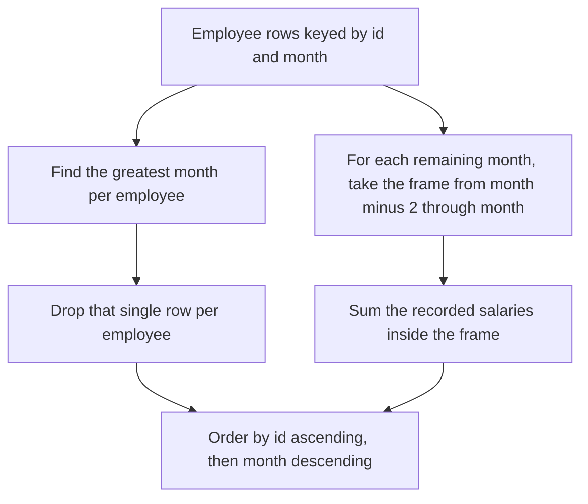

# Guided Example: Find Cumulative Salary of an Employee

`Employee` holds one row per employee per month worked, keyed by the pair `(id, month)`. What makes the problem more than a running total is that the window is defined on *calendar months*, not on rows: `month` runs from 1 to 12 and an employee may skip months entirely. The official instance exposes exactly that distinction — one employee works months 1 through 4 and reappears at months 7 and 8 — so the same method must sum three consecutive calendar months for one row and a single isolated month for another.

## 1. The Instance and the Required Outcome

| `id` | `month` | `salary` |
|:---:|:---:|:---:|
| 1 | 1 | 20 |
| 2 | 1 | 20 |
| 1 | 2 | 30 |
| 2 | 2 | 30 |
| 3 | 2 | 40 |
| 1 | 3 | 40 |
| 3 | 3 | 60 |
| 1 | 4 | 60 |
| 3 | 4 | 70 |
| 1 | 7 | 90 |
| 1 | 8 | 90 |

For every employee, the reported value of a month is the sum of the salaries recorded in that month and the two *immediately preceding calendar months*. Each employee's most recent recorded month is omitted, and so is any month the employee did not work. The output is ordered by `id` ascending, then by `month` descending:

| `Id` | `Month` | `Salary` |
|:---:|:---:|:---:|
| 1 | 7 | 90 |
| 1 | 4 | 130 |
| 1 | 3 | 90 |
| 1 | 2 | 50 |
| 1 | 1 | 20 |
| 2 | 1 | 20 |
| 3 | 3 | 100 |
| 3 | 2 | 40 |

Two rows deserve attention before any method is chosen. Employee 1's month 7 reports 90, the salary of month 7 alone, even though months 3 and 4 carry 40 and 60 and sit immediately before it in that employee's record sequence, and there is no row at all for months 5 or 6. The exercise turns on reading "the two preceding months" as a statement about the calendar rather than about the previous two rows of the table.

## 2. The Three-Month Calendar Window

Let $M_e$ be the set of months in which employee $e$ has a recorded row, and let $s(e, k)$ be the recorded salary, defined only for $k \in M_e$. The reported value of month $m$ is

$$
V(e, m) = \sum_{\substack{k \in M_e \\ m - 2 \;\le\; k \;\le\; m}} s(e, k),
$$

a sum over a *value interval* on the month attribute. The frame is $W(m) = [\,m-2,\, m\,] \cap [\,1,\, 12\,]$, where the intersection records that the calendar begins at month 1: for $m = 1$ the frame is $[1,1]$ and for $m = 2$ it is $[1,2]$, since months 0 and $-1$ do not exist and their effective salary is 0.

The frame is a *range* frame, which is a different object from a row-offset frame. A range frame selects rows by the value of the ordering attribute, so the number of rows it contains varies with the density of the data and can fall to one across a gap. A row-offset frame selects a fixed number of neighbouring rows in sorted order, regardless of their values, so it slides past gaps without noticing them. Both definitions are legitimate; only the first matches the statement.

> **Calendar-window invariant.** For any employee and any recorded month $m$, the reported value counts exactly the recorded months of that employee inside $[m-2, m]$, and each contributes its own recorded salary exactly once. Months outside the interval, and months with no record, contribute nothing.

## 3. Excluding Each Employee's Most Recent Month

The summary omits each employee's greatest recorded month, for that employee rather than globally. With $\mu_e = \max M_e$, the reported set is

$$
P = \{\,(e, m) : e \in E,\; m \in M_e,\; m \neq \mu_e \,\}.
$$

Because `(id, month)` is the primary key, the pair $(e, \mu_e)$ matches exactly one row, so the exclusion removes exactly one row per employee and no others. An employee who worked a single month contributes nothing at all, since that month is their maximum.

| `id` | Recorded months $M_e$ | Maximum $\mu_e$ | Excluded row | Months reported |
|:---:|:---|:---:|:---|:---|
| 1 | 1, 2, 3, 4, 7, 8 | 8 | `(1, 8, 90)` | 1, 2, 3, 4, 7 |
| 2 | 1, 2 | 2 | `(2, 2, 30)` | 1 |
| 3 | 2, 3, 4 | 4 | `(3, 4, 70)` | 2, 3 |

Only three of the eleven input rows are dropped, and their salaries differ widely: the exclusion depends on the month ordering, not on the salary. It also cannot shrink anyone else's window, because frames are anchored on the calendar rather than on row positions.

## 4. Worked Trace of the Official Instance

Employee 1 is the interesting case, because their months are not contiguous.

| `month` $m$ | Frame $[m-2, m]$ | Recorded months of employee 1 inside | Addends | $V(1, m)$ | Reported? |
|:---:|:---:|:---|:---|:---:|:---:|
| 1 | $[1, 1]$ | 1 | $20$ | 20 | yes |
| 2 | $[1, 2]$ | 1, 2 | $20 + 30$ | 50 | yes |
| 3 | $[1, 3]$ | 1, 2, 3 | $20 + 30 + 40$ | 90 | yes |
| 4 | $[2, 4]$ | 2, 3, 4 | $30 + 40 + 60$ | 130 | yes |
| 7 | $[5, 7]$ | 7 | $90$ | 90 | yes |
| 8 | $[6, 8]$ | 7, 8 | not evaluated | — | no, it is the maximum month |

Month 7 is where the calendar reading asserts itself. The frame $[5,7]$ contains month 7, and neither 5 nor 6 was worked, so the sum collapses to one salary. Nothing about months 3 and 4 belongs in it: month 4 is outside the interval by one step and month 3 by three.

| `id` | `month` $m$ | Frame $[m-2, m]$ | Recorded months inside | Addends | $V(e, m)$ | Reported? |
|:---:|:---:|:---:|:---|:---|:---:|:---:|
| 2 | 1 | $[1, 1]$ | 1 | $20$ | 20 | yes |
| 2 | 2 | $[1, 2]$ | 1, 2 | not evaluated | — | no, it is the maximum month |
| 3 | 2 | $[1, 2]$ | 2 | $40$ | 40 | yes |
| 3 | 3 | $[1, 3]$ | 2, 3 | $40 + 60$ | 100 | yes |
| 3 | 4 | $[2, 4]$ | 2, 3, 4 | not evaluated | — | no, it is the maximum month |

Employee 3 has no record for month 1, so month 2's frame finds only month 2 and the value is 40 rather than 60 — the same gap effect as employee 1's month 7, in a shorter employee. The survivors are then ordered by `id` ascending and `month` descending, giving the table in section 1; the ordering is by month *value*, not insertion order, which matters because months 7 and 8 were recorded after month 4.

## 5. Where a Row-Offset Frame Diverges

Employee 1's records in month order are months 1, 2, 3, 4, 7 and 8, so the two frames agree on the dense rows and separate at the first row after the gap:

| `month` $m$ | Calendar frame and addends | Range value | Three-row window in month order | Offset addends | Offset value | Agree? |
|:---:|:---|:---:|:---|:---|:---:|:---:|
| 4 | $[2,4]$: months 2, 3, 4 | 130 | months 2, 3, 4 | $30 + 40 + 60$ | 130 | yes |
| 7 | $[5,7]$: month 7 only | **90** | months 3, 4, 7 | $40 + 60 + 90$ | **190** | **no** |

The offset frame reports 190 at month 7, more than double the correct 90, while agreeing with the range frame on every other reported row. It reaches past the gap because it counts records, and the gap carries no record that could stop it. A wrong frame choice is therefore correct on the dense employees, correct on most rows of the gapped employee, and wrong precisely on the boundary the statement describes in its own explanation.

## 6. Correctness of the Method

The method is correct if it reports exactly the rows of $P$ and attaches exactly $V(e, m)$ to each.

*The exclusion removes exactly the intended rows.* Since `(id, month)` is the primary key, the pair $(e, \mu_e)$ identifies one row, and the collection of such pairs contains no other pair. Removing rows whose key lies in that collection removes each employee's greatest month once and leaves every other row in place, so the survivor set is exactly $P$.

*The frame selects exactly the intended months.* A row of employee $e$ at month $k$ belongs to the frame of month $m$ precisely when $m-2 \le k \le m$, the defining inequality of $V(e,m)$, so summing those rows reproduces the definition; intersecting with the calendar domain only excludes months that could not be keys anyway. A month with no row for $e$ is not in $M_e$ and adds no addend, so the convention that unworked months count as 0 holds automatically.

*Only the range frame implements the definition.* The rows inside a range frame are determined by comparing the ordering attribute with the current value, so the frame shrinks across a gap; a row-offset frame takes a fixed count of neighbours and can include a month more than two steps away, as month 7 demonstrates. Ordering by identifier ascending and then month descending matches the required tie-break, and because `(id, month)` is unique that two-key ordering is total and the result deterministic.

## 7. Boundary Cases and Alternative Strategies

| Situation | Behaviour of the method | Result |
|:---|:---|:---|
| Employee with exactly one recorded month | that month is the employee's maximum | zero rows for that employee |
| Employee with exactly two recorded months | the later month is dropped, the earlier survives | one row, whose value is its own salary |
| A two-month gap, as with employee 1 at months 5 and 6 | the gap contributes no addend | month 7 reports one salary, not three |
| Month 1 or month 2 | the frame extends below the calendar domain | the frame clamps to $[1, m]$, so month 1 sums one month |
| Several employees sharing a month | frames are partitioned per employee | one employee's salaries never enter another's total |
| Duplicate `(id, month)` pairs | impossible under the primary key | the exclusion stays well defined |
| Excluding the maximum month before computing frames | frames are anchored on month values, not row positions | earlier values are unaffected, so the two operations commute |

| Strategy | Relational shape | Cost | Assessment |
|:---|:---|:---|:---|
| Partitioned range frame plus maximum-month exclusion | order each employee's rows by month, sum the frame, drop the greatest month | $\Theta(N \log N)$ | the method traced above |
| Correlated sum per reported month | for each row, sum the employee's rows inside its frame | $\Theta(N \cdot w)$, or $\Theta(N \log N)$ with an index on the pair | states the definition literally but re-scans each frame |
| Self-join on the month interval | pair each row with every same-employee row inside its frame | $\Theta(N^2)$ worst case | correct but quadratic; enumerates the pairs a frame aggregate skips |
| Dense calendar grid per employee | expand to all twelve months, fill gaps with 0, take a three-row window | $\Theta(12E)$ rows | equivalent only because the month domain is bounded to 1–12; it fabricates rows |
| Row-offset frame | current row plus the two preceding rows | $\Theta(N \log N)$ | incorrect with gaps: month 7 would report 190 instead of 90 |
| Prefix totals with two boundary lookups | running total per employee, minus the total through month $m-3$ | $\Theta(N \log N)$ for the ordering, $\Theta(N)$ after | equivalent to the range frame, and usually cheaper |

The last row shows the frame aggregate is not magic: on a dense integer month axis a three-month range sum is the difference between the cumulative total through month $m$ and that through month $m-3$ — the prefix-sum technique transposed onto a calendar, with gaps handled for free.

## 8. Complexity Derivation

Let $N$ be the number of rows in `Employee` and $E$ the number of distinct employees, so $E \le N$.

- **Time.** Grouping to obtain each employee's greatest month costs $\Theta(N)$, and deciding which rows are excluded is one membership test per row, $\Theta(N)$ against a hash set or $\Theta(N \log N)$ if the maxima are merged by a sort. Evaluating the frames requires each employee's rows in ascending month order, $\Theta(N \log N)$ shared across partitions, after which the frame totals are produced in one pass per partition, $\Theta(N)$. The final ordering by identifier ascending and month descending costs another $\Theta(N \log N)$. Total: $\Theta(N \log N)$, dominated by the orderings; if the per-employee ordering can be reused for the output, one of the two sorts is absorbed.
- **Auxiliary space.** The window aggregate buffers the rows of the partition it is currently evaluating, $\Theta(N)$ in the worst case for one large partition, and the structure over the maxima is $\Theta(E)$. Total working memory: $\Theta(N + E)$.

For the official instance $N = 11$ and $E = 3$: eleven rows are read, three maxima are located, eight rows are reported, and the largest partition holds six rows.
