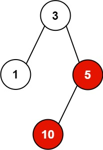

## Description

You have `n` processes forming a rooted tree structure. You are given two integer arrays `pid` and `ppid`, where $\text{pid}[i]$ is the ID of the $$i^{\text{th}}$$ process and $\text{ppid}[i]$ is the ID of the $$i^{\text{th}}$$ process's parent process.

Each process has only **one parent process** but may have multiple children processes. Only one process has $\text{ppid}[i] = 0$, which means this process has **no parent process** (the root of the tree).

When a process is **killed**, all of its children processes will also be killed.

Given an integer `kill` representing the ID of a process you want to kill, return *a list of the IDs of the processes that will be killed. You may return the answer in **any order**.*
### Function Contract

**Inputs**

- `pid`: the unique process identifiers.
- `ppid`: the parallel parent identifiers, where $\text{ppid}[i]$ is the parent of $\text{pid}[i]$.
- `kill`: an identifier present in `pid` whose entire subtree must be terminated.

Let $n = \lvert\texttt{pid}\rvert = \lvert\texttt{ppid}\rvert$.

**Return value**

Return a list containing `kill` and every direct or indirect descendant of that process. List order is unrestricted.

### Examples

#### Example 1

- **Input:** $pid = [1,3,10,5], ppid = [3,0,5,3], kill = 5$
- **Output:** `[5,10]`
- **Explanation:** The processes colored in red are the processes that should be killed.
#### Example 2

- **Input:** $pid = [1], ppid = [0], kill = 1$
- **Output:** `[1]`
### Constraints

- $n = \text{pid.length}$

- $n = \text{ppid.length}$

- $1 \le n \le 5 * 10^{4}$

- $1 \le \text{pid}[i] \le 5 * 10^{4}$

- $0 \le \text{ppid}[i] \le 5 * 10^{4}$

- Only one process has no parent.

- All the values of `pid` are **unique**.

- `kill` is **guaranteed** to be in `pid`.