[TOC]

## Video Solution

---

<div>
    <div class="video-container">
        <iframe src="https://player.vimeo.com/video/511798042?texttrack=en" width="640" height="360" frameborder="0" allow="autoplay; fullscreen" allowfullscreen></iframe>
    </div>
</div>

<div>
</div>

## Solution Article

---

### Approach #1 Depth First Search [Time Limit Exceeded]

**Algorithm**

Since killing a process leads to killing all its children processes, the simplest solution is to traverse over the $ppid$ array and find out all the children of the process to be killed. Further, for every child chosen to be killed we recursively make call to the `killProcess` function now treating this child as the new parent to be killed. In every such call, we again traverse over the $ppid$ array now considering the id of the child process, and continue in the same fashion. Further, at every step, for every process chosen to be killed, it is added to the list $l$ that needs to be returned at the end.

```java

public class Solution {

    public List < Integer > killProcess(List < Integer > pid, List < Integer > ppid, int kill) {
        List < Integer > l = new ArrayList < > ();
        if (kill == 0)
            return l;
        l.add(kill);
        for (int i = 0; i < ppid.size(); i++)
            if (ppid.get(i) == kill)
                l.addAll(killProcess(pid, ppid, pid.get(i)));
        return l;
    }
}

```

**Complexity Analysis**

* Time complexity : $O(n^2)$. For each process to be killed, we traverse the entire $ppid$ array of size $n$ to find its children. In the worst case, we kill all $n$ processes, resulting in $O(n^2)$ time.

* Space complexity : $O(n)$. The depth of the recursion tree can go upto $n$.

---
### Approach #2 Tree Simulation [Accepted]

**Algorithm**

We can view the given process relationships in the form of a tree. We can construct the tree in such a way that every node stores information about its own value as well as the list of all its direct children nodes. Thus, now, once the tree has been generated, we can simply start off by killing the required node, and recursively killing the children of each node encountered rather than traversing over the whole $ppid$ array for every node as done in the previous approach.

In order to implement this, we've made use of a $Node$ class which represents a node of a tree. Each node represents a process. Thus, every node stores its own value($Node.val$) and the list of all its direct children($Node.children$). We traverse over the whole $pid$ array and create nodes for all of them. Then, we traverse over the $ppid$ array, and make the parent nodes out of them, and at the same time add all their direct children nodes in their $Node.children$ list. In this way, we convert the given process structure into a tree structure.

Now, that we've obtained the tree structure, we can add the node to be killed to the return list $l$. Now, we can directly obtain all the direct children of this node from the tree, and add its direct children to the return list. For every node added to the return list, we repeat the same process of obtaining the children recursively.

```java
public class Solution {
    class Node {
        int val;
        List < Node > children = new ArrayList < > ();
    }
    public List < Integer > killProcess(List < Integer > pid, List < Integer > ppid, int kill) {
        HashMap < Integer, Node > map = new HashMap < > ();
        for (int id: pid) {
            Node node = new Node();
            node.val = id;
            map.put(id, node);
        }
        for (int i = 0; i < ppid.size(); i++) {
            if (ppid.get(i) > 0) {
                Node par = map.get(ppid.get(i));
                par.children.add(map.get(pid.get(i)));
            }
        }
        List < Integer > l = new ArrayList < > ();
        l.add(kill);
        getAllChildren(map.get(kill), l);
        return l;
    }
    public void getAllChildren(Node pn, List < Integer > l) {
        for (Node n: pn.children) {
            l.add(n.val);
            getAllChildren(n, l);
        }
    }
}

```

**Complexity Analysis**

* Time complexity : $O(n)$. We need to traverse over the $ppid$ and $pid$ array of size $n$ once. The `getAllChildren` function also takes at most $n$ time, since no node can be a child of two nodes.

* Space complexity : $O(n)$. $map$ of size $n$ is used.

---

### Approach #3 HashMap + Depth First Search  [Accepted]

**Algorithm**

Instead of making the tree structure, we can directly make use of a data structure which stores a particular process value and the list of its direct children. For this, in the current implementation, we make use of a hashmap $map$, which stores the data in the form ${parent: [list of all its direct children]}$.

Thus, now, by traversing just once over the $ppid$ array, and adding the corresponding $pid$ values to the children list at the same time, we can obtain a better structure storing the parent-children relationship.

Again, similar to the previous approach, now we can add the process to be killed to the return list, and keep on adding its children to the return list in a recursive manner by obtaining the child information from the structure created previously.

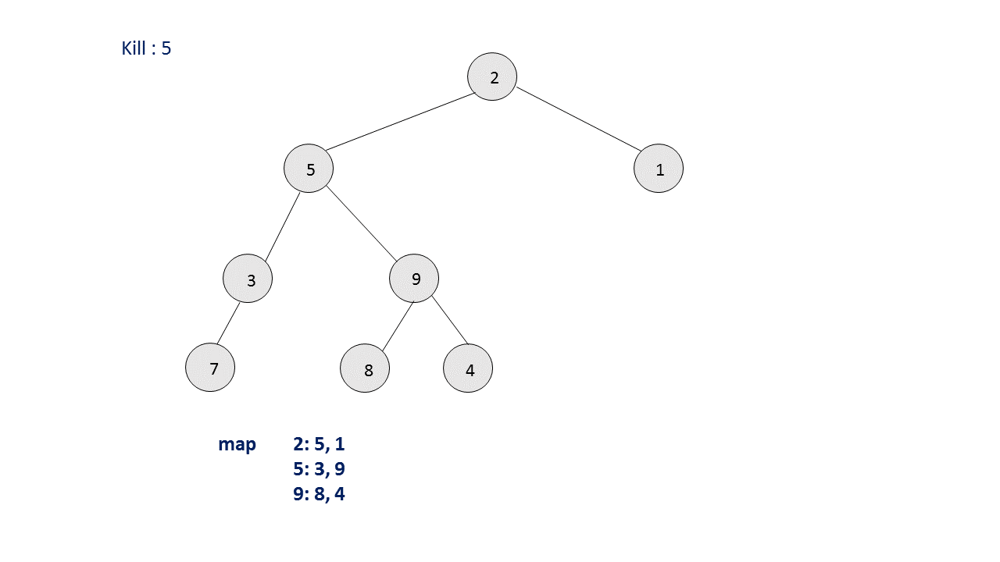

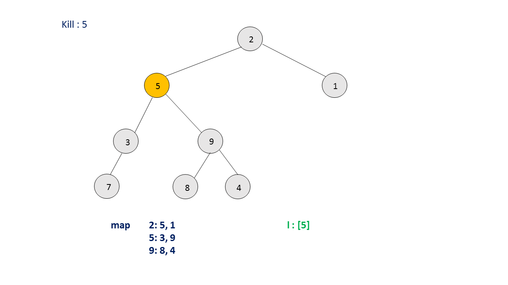

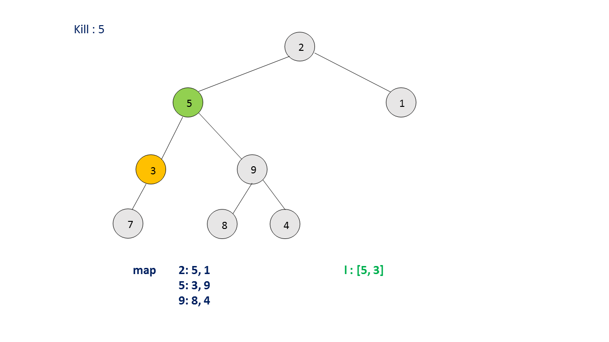

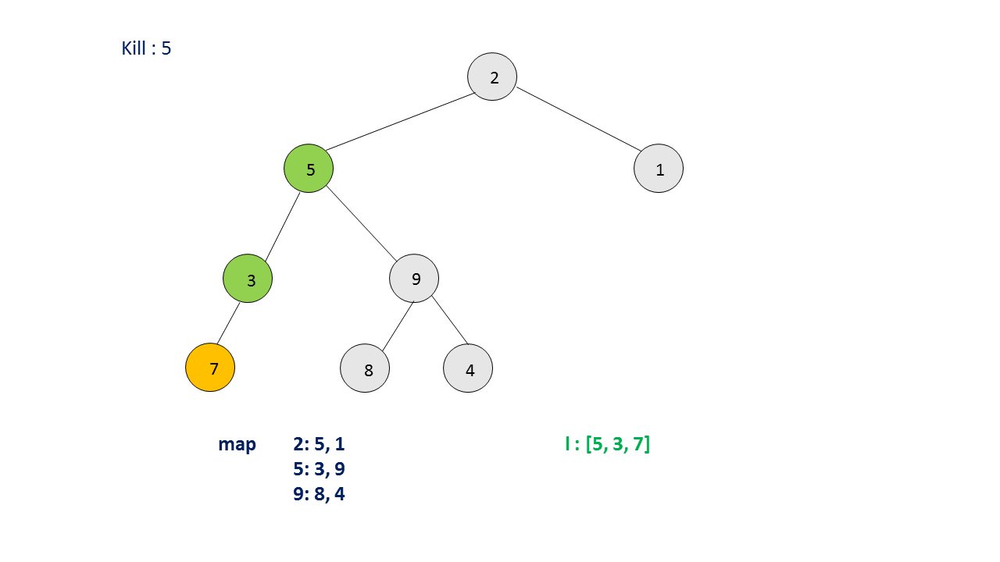

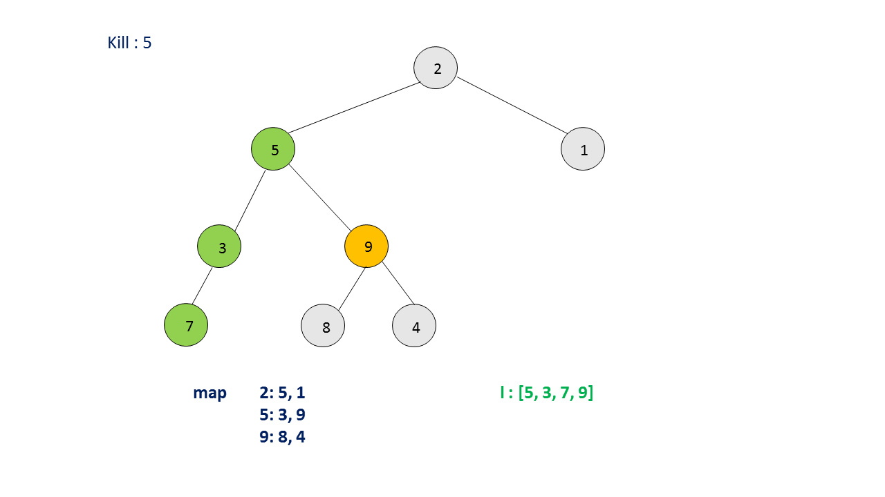

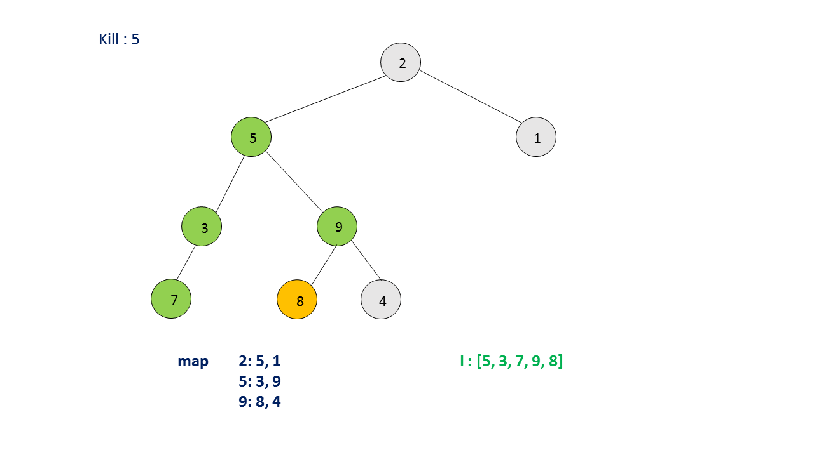

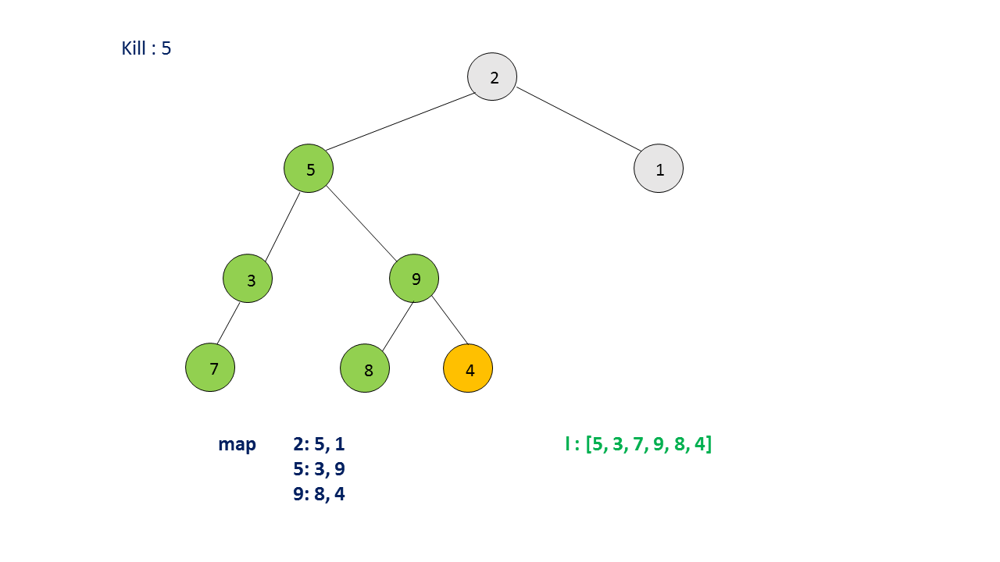

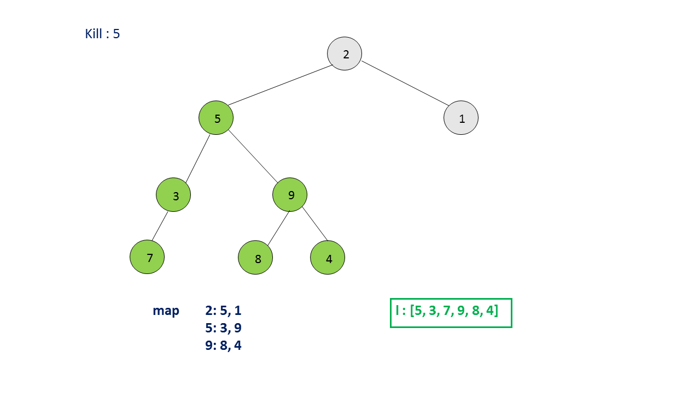

```java
public class Solution {
    public List < Integer > killProcess(List < Integer > pid, List < Integer > ppid, int kill) {
        HashMap < Integer, List < Integer >> map = new HashMap < > ();
        for (int i = 0; i < ppid.size(); i++) {
            if (ppid.get(i) > 0) {
                List < Integer > l = map.getOrDefault(ppid.get(i), new ArrayList < Integer > ());
                l.add(pid.get(i));
                map.put(ppid.get(i), l);
            }
        }
        List < Integer > l = new ArrayList < > ();
        l.add(kill);
        getAllChildren(map, l, kill);
        return l;
    }
    public void getAllChildren(HashMap < Integer, List < Integer >> map, List < Integer > l, int kill) {
        if (map.containsKey(kill))
            for (int id: map.get(kill)) {
                l.add(id);
                getAllChildren(map, l, id);
            }
    }
}

```

**Complexity Analysis**

* Time complexity : $O(n)$. We need to traverse over the $ppid$ array of size $n$ once. The `getAllChildren` function also takes at most $n$ time, since no node can be a child of two nodes.

* Space complexity : $O(n)$. $map$ of size $n$ is used.

---
### Approach #4 HashMap + Breadth First Search [Accepted]:

**Algorithm**

We can also make use of Breadth First Search to obtain all the children(direct+indirect) of a particular node, once the data structure of the form $(process: [list of all its direct children]$ has been obtained. The process of obtaining the data structure is the same as in the previous approach.

In order to obtain all the child processes to be killed for a particular parent chosen to be killed, we can make use of Breadth First Search. For this, we add the node to be killed to a $queue$. Then, we remove an element from the front of the $queue$ and add it to the return list. Further, for every element removed from the front of the queue, we add all its direct children(obtained from the data structure created) to the end of the queue. We keep on doing so till the queue becomes empty.


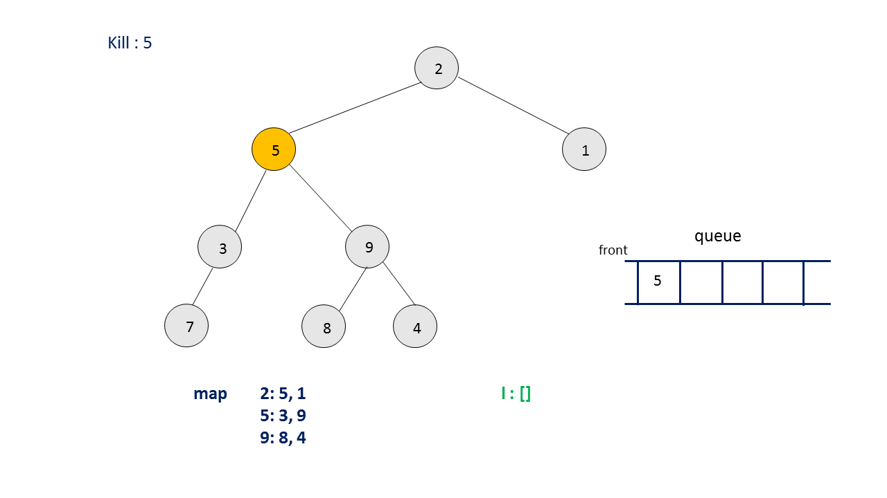

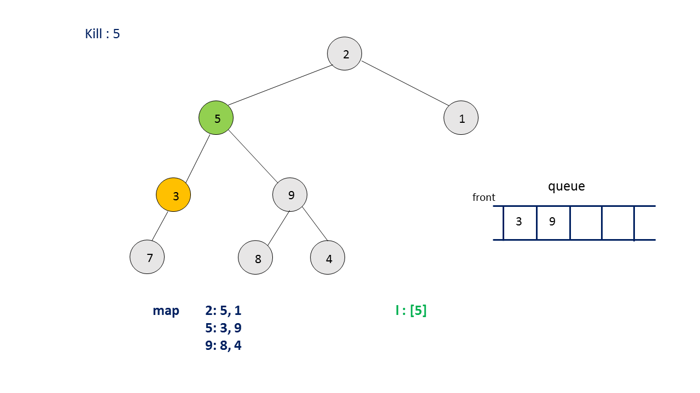

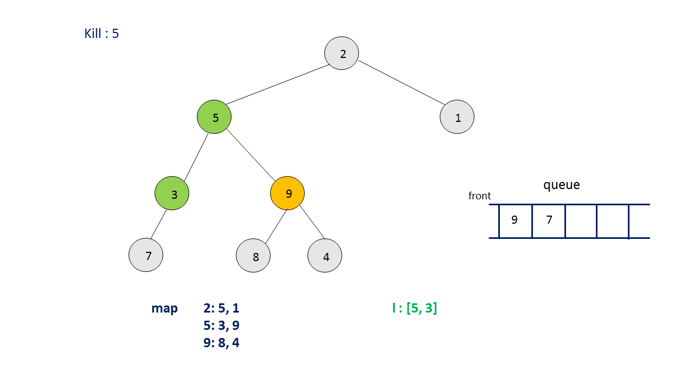

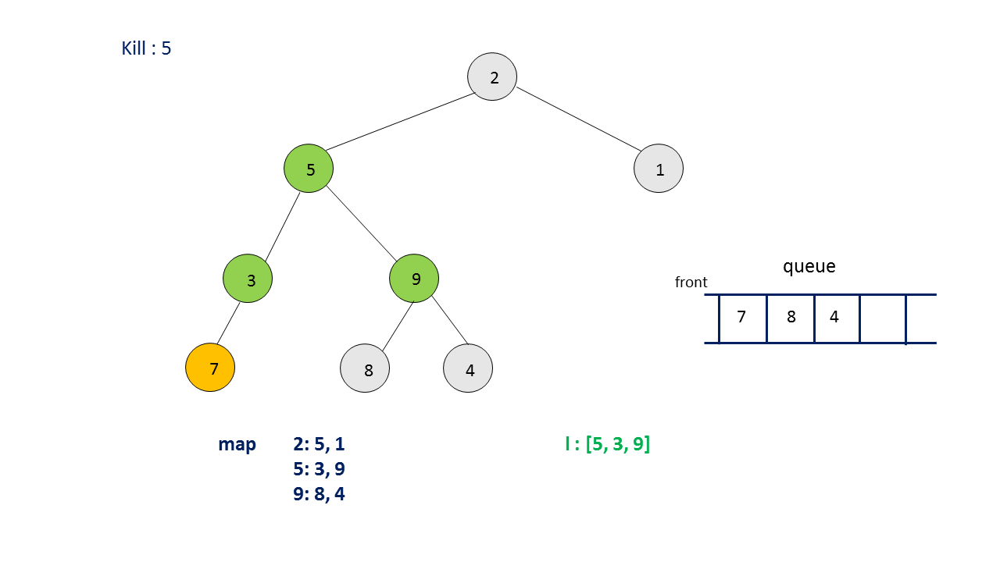

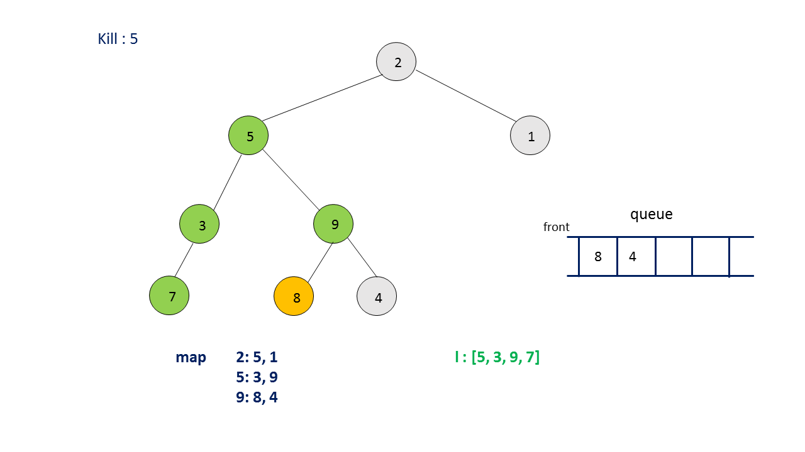


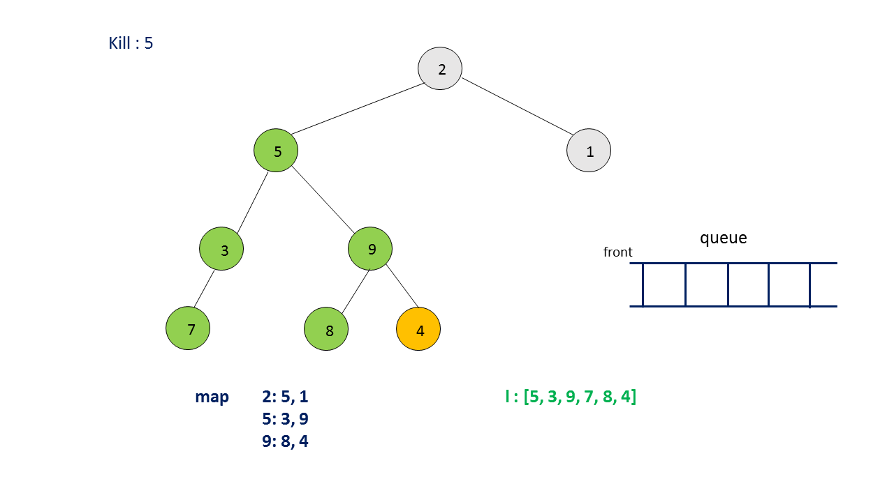


```java
public class Solution {

    public List < Integer > killProcess(List < Integer > pid, List < Integer > ppid, int kill) {
        HashMap < Integer, List < Integer >> map = new HashMap < > ();
        for (int i = 0; i < ppid.size(); i++) {
            if (ppid.get(i) > 0) {
                List < Integer > l = map.getOrDefault(ppid.get(i), new ArrayList < Integer > ());
                l.add(pid.get(i));
                map.put(ppid.get(i), l);
            }
        }
        Queue < Integer > queue = new LinkedList < > ();
        List < Integer > l = new ArrayList < > ();
        queue.add(kill);
        while (!queue.isEmpty()) {
            int r = queue.remove();
            l.add(r);
            if (map.containsKey(r))
                for (int id: map.get(r))
                    queue.add(id);
        }
        return l;
    }
}
```

**Complexity Analysis**

* Time complexity : $O(n)$. We need to traverse over the $ppid$ array of size $n$ once. Also, at most $n$ additions/removals are done from the $queue$.

* Space complexity : $O(n)$. $map$ of size $n$ is used.