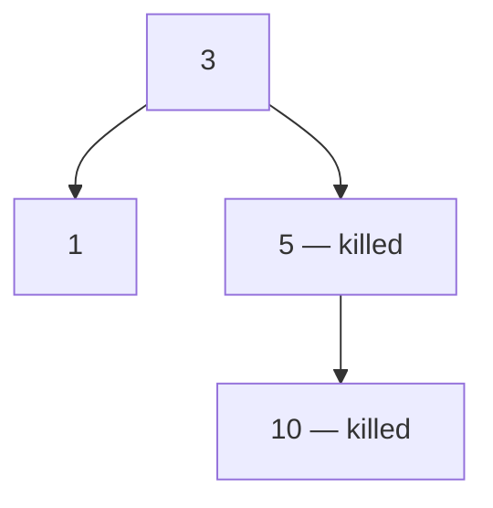

## Examples

**Example 1**

- **Input:** `pid = [1,3,10,5], ppid = [3,0,5,3], kill = 5`

- **Output:** `[5,10]`

- **Explanation:** The source diagram marks process `5` and its descendant `10` as killed. Process `1` is in a different subtree under root process `3`, so neither `1` nor `3` is included.

**Example 2**

- **Input:** `pid = [1], ppid = [0], kill = 1`

- **Output:** `[1]`
