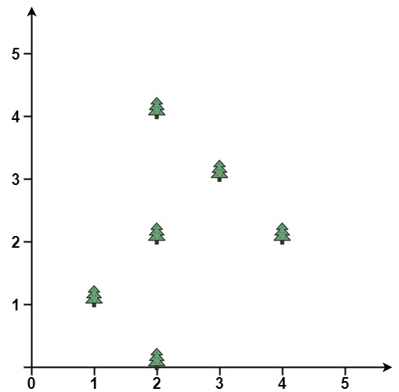
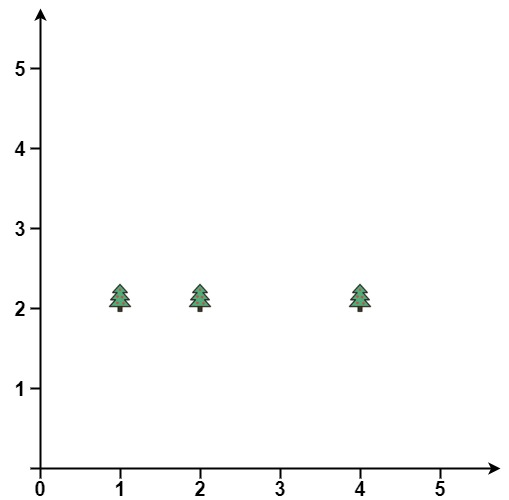

### 1. Description

You are given an array `trees` where $\text{trees}[i] = [x_{i}, y_{i}]$ represents the location of a tree in the garden.

Fence the entire garden using the minimum length of rope, as it is expensive. The garden is well-fenced only if **all the trees are enclosed**.

Return *the coordinates of trees that are exactly located on the fence perimeter*. You may return the answer in **any order**.

### 2. Function Contract

- `n`: Input parameter.
- Returns expected result.

### 3. Examples

#### Example 1

- **Input:** $trees = [[1,1],[2,2],[2,0],[2,4],[3,3],[4,2]]$
- **Output:** `[[1,1],[2,0],[4,2],[3,3],[2,4]]`
- **Explanation:** All the trees will be on the perimeter of the fence except the tree at [2, 2], which will be inside the fence.
#### Example 2

- **Input:** $trees = [[1,2],[2,2],[4,2]]$
- **Output:** `[[4,2],[2,2],[1,2]]`
- **Explanation:** The fence forms a line that passes through all the trees.

### 4. Constraints

- $1 \le \text{trees.length} \le 3000$

- $\text{trees}[i].length = 2$

- $0 \le x_{i}, y_{i} \le 100$

- All the given positions are **unique**.