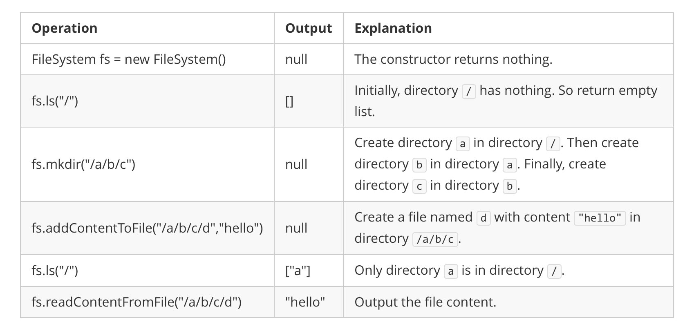

## Description

Design a data structure that simulates an in-memory file system.

Implement the FileSystem class:

- `FileSystem()` Initializes the object of the system.

- `List<String> ls(String path)`

		<li>If `path` is a file path, returns a list that only contains this file's name.

- If `path` is a directory path, returns the list of file and directory names **in this directory**.

	The answer should in **lexicographic order**.</li>
- `void mkdir(String path)` Makes a new directory according to the given `path`. The given directory path does not exist. If the middle directories in the path do not exist, you should create them as well.

- `void addContentToFile(String filePath, String content)`

		<li>If `filePath` does not exist, creates that file containing given `content`.

- If `filePath` already exists, appends the given `content` to original content.

	</li>
- `String readContentFromFile(String filePath)` Returns the content in the file at `filePath`.
### Function Contract

**LeetCode interface**

Construct one `FileSystem` object and invoke `ls`, `mkdir`, `addContentToFile`, and `readContentFromFile` in sequence. Mutating calls return `null`; query calls return the requested list or string.

**cOde(n) adapter**

- `operations`: a sequence whose entries begin with `"ls"`, `"mkdir"`, `"addContentToFile"`, or `"readContentFromFile"`, followed by that call's arguments.

`solve(operations)` creates a fresh `FileSystem`, applies the entries in order, and returns the results from `ls` and `readContentFromFile` calls. Mutation calls produce no adapter result entry.

For complexity notation, let $P$ be the number of path components traversed, $k$ the number of immediate names returned by a directory listing, $C$ the content length processed by an operation, and $S$ the total stored filesystem state.

### Examples

#### Example 1



```
**Input**
["FileSystem", "ls", "mkdir", "addContentToFile", "ls", "readContentFromFile"]
[[], ["/"], ["/a/b/c"], ["/a/b/c/d", "hello"], ["/"], ["/a/b/c/d"]]
**Output**
[null, [], null, null, ["a"], "hello"]

**Explanation**
FileSystem fileSystem = new FileSystem();
fileSystem.ls("/");                         // return []
fileSystem.mkdir("/a/b/c");
fileSystem.addContentToFile("/a/b/c/d", "hello");
fileSystem.ls("/");                         // return ["a"]
fileSystem.readContentFromFile("/a/b/c/d"); // return "hello"
```
### Constraints

- $1 \le \text{path.length}, \text{filePath.length} \le 100$

- `path` and `filePath` are absolute paths which begin with `'/'` and do not end with `'/'` except that the path is just `"/"`.

- You can assume that all directory names and file names only contain lowercase letters, and the same names will not exist in the same directory.

- You can assume that all operations will be passed valid parameters, and users will not attempt to retrieve file content or list a directory or file that does not exist.

- You can assume that the parent directory for the file in `addContentToFile` will exist.

- $1 \le \text{content.length} \le 50$

- At most `300` calls will be made to `ls`, `mkdir`, `addContentToFile`, and `readContentFromFile`.