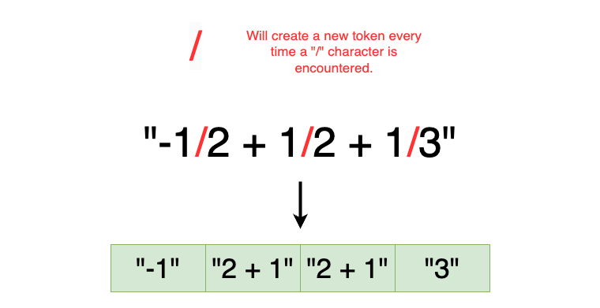
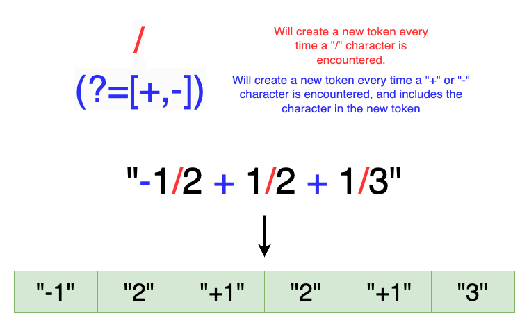

## Solution

---

### Overview

We are given a string `expression` that contains a series of fraction additions and subtractions. Our task is to evaluate the expression and return the result as a simplified fraction in its irreducible form, meaning the fraction cannot be reduced further.

To achieve this, we need to:
1. Parse the string `expression` to extract individual fractions and their corresponding operators (addition or subtraction).
2. Perform the arithmetic operations on these fractions.
3. Simplify the resulting fraction to its irreducible form using the greatest common divisor (GCD).

### Approach 1: Manual Parsing + Common Denominator

### Intuition

One way to approach this question is to manually parse the `expression` string to extract each fraction’s numerator and denominator. As we parse each fraction, we can update a running total of the result fraction by adding or subtracting the current fraction from it.

To add or subtract fractions, we need to find a common denominator between the currently parsed fraction and the running result. A straightforward approach is to use the product of the two denominators as the common denominator. This allows us to rewrite both fractions with this common denominator and then perform the addition or subtraction.

For example, given two fractions:
- Current fraction: $\frac{\text{currNum}}{\text{currDenom}}$

- Running result: $\frac{\text{num}}{\text{denom}}$

We can express their sum as:

$\text{newNum} = \text{currNum} \times \text{denom} + \text{num} \times \text{currDenom}$

$\text{newDenom} = \text{currDenom} \times \text{denom}$

After we finish processing all fractions, the resulting fraction may not be in its simplest form. To simplify it, we divide the numerator and the denominator by their greatest common divisor (GCD). The GCD can be efficiently calculated using Euclid’s Algorithm, which is based on the recursive formula:

$\text{gcd}(a, b) = \text{gcd}(b \mod a, a)$
with base case $\text{gcd}(0, b) = b$.

Given $expression = "1/3-1/2+1/6"$, we parse and calculate as follows:
- First fraction parsed: $\frac{1}{3}$
- Second fraction parsed: $\frac{-1}{2}$
- Subtract $\frac{1}{2}$ using a common denominator of 6: $\frac{2}{6} - \frac{3}{6} = \frac{-1}{6}$
- Third fraction parsed: $\frac{1}{6}$
- Add $\frac{1}{6}$ using a common denominator of $36$: $\frac{-6}{36} + \frac{6}{36} = \frac{0}{36}$

The final result is $\frac{0}{36}$, which will be reduced to $\frac{0}{1}$

### Algorithm

1. Define helper function `FindGCD(a, b)` to find the greatest common divisor:
* If $a = 0$ return `b`
* Return `FindGCD(b % a, a)`
2. Initialize our running result fraction with  numerator $num = 0$ and denominator $denom = 1$
3. Iterate through each character in `expression`:
* Initialize numerator $currNum = 0$ and denominator $currDenom = 0$ for the current fraction being parsed.
* Initialize a boolean $isNegative = false$ to account for negative fractions.
* If current character is a negative sign or positive sign:
* Set `isNegative` to `true` if character is negative sign
* Move on to next character
* Build the current numerator - While the current character is a number:
* Convert the character to its numerical value `val`
* Append the digit to `currNum` by performing $currNum = currNum * 10 + val$
* If $isNegative = true$, we set `currNum *= -1` to make it negative
* At this point, we are done iterating through the numerator, and can skip the divisor character to begin parsing the denominator
* Build the current denominator - While the current character is a number:
* Convert the character to its numerical value `val`
* Append the digit to `currDenom` by performing $currDenom = currDenom * 10 + val$
* Add the current fraction with the running result fraction:
* `num` is updated to $num * currDenom + currNum * denom$
* `denom` is updated to $denom * currDenom$
4. Call `FindGCD(num, denom)` and store result in `gcd`.
5. Reduce the result fraction by dividing `num` and `denom` by `gcd`
6. Return $num + "/" + denom$ to return the resulting fraction in string format

### Implementation

```python
class Solution:
    def fractionAddition(self, expression):
        num = 0
        denom = 1

        i = 0
        while i < len(expression):
            curr_num = 0
            curr_denom = 0

            is_negative = False

            # check for sign
            if expression[i] == "-" or expression[i] == "+":
                if expression[i] == "-":
                    is_negative = True
                # move to next character
                i += 1

            # build numerator
            while i < len(expression) and expression[i].isdigit():
                val = int(expression[i])
                curr_num = curr_num * 10 + val
                i += 1

            if is_negative:
                curr_num *= -1

            # skip divisor
            i += 1

            # build denominator
            while i < len(expression) and expression[i].isdigit():
                val = int(expression[i])
                curr_denom = curr_denom * 10 + val
                i += 1

            # add fractions together using common denominator
            num = num * curr_denom + curr_num * denom
            denom = denom * curr_denom

        gcd = abs(self._find_gcd(num, denom))

        # reduce fractions
        num //= gcd
        denom //= gcd

        return f"{num}/{denom}"

    def _find_gcd(self, a, b):
        if a == 0:
            return b
        return self._find_gcd(b % a, a)
```

### Complexity Analysis

* Time Complexity: $O(n)$

    The loop to parse through `expression` runs $O(n)$ times. Inside the loop, the math operations to combine fractions and find a common denominator is done in $O(1)$ time. Thus, the loop in total takes $O(n)$ time.

    The `FindGCD` function uses Euclid's algorithm, which runs in $\log(\min(a, b))$ time.

    Thus, the total time complexity is $O(n)$.

* Space Complexity: $O(\log(\min(a, b)))$

    The space complexity is determined by the recursive overhead from the `FindGCD` algorithm. The max depth of the call stack would be $O(\log(\min(a, b)))$. Thus, the total space complexity is $O(\log(\min(a, b)))$.

### Approach 2 - Parsing with Regular Expressions

### Intuition

> **Note:** We understand that most people are not familiar with the intricacies of regular expressions. We include this approach for the sake of article completeness, but we recognize most interviewers will not expect you to know the exact regex patterns needed without additional help.

In the first approach, we manually parsed the `expression` string, which can be tedious and error-prone. A more efficient and reliable method is to use regular expressions (regex) to tokenize the string. Most languages provide utility functions that will tokenize a string based on a given delimiter expression written in regex. For example, if we are given a string `3a5a10`, and we provide `a` as our delimiter, then the string will be separated into `3`, `5`, and `10`. For this approach, we will come up with a regex expression to match the delimiters needed to split `expression`.

##### Regular Expression Breakdown

We would like to break down `expression` into segments representing individual numbers (either numerator or denominator) along with their corresponding signs. We observe that each fraction is separated by a `/` character, so let's start by simply using `/` as our delimiter expression. The breakdown for `expression` using this regex is shown below:



We notice that this isn't a sufficient regex expression to match our desired delimiters, as $2 + 1$ should ideally be two separate tokens: `2` and `+1`. To address this, we can add in a regex "lookahead" expression that will create a new token if the next character is a `+` or a `-`, and will add the character to the new token. This lookahead expression can be expressed as `(?=[-+])`. Here, the `(?=)` portion indicates looking ahead at the next character, and the `[-+]` argument indicates that the lookahead should be done for either the `-` character or `+` character.

Combining these two expressions with the logical OR operator (`|`), the resulting regex pattern becomes: `/|(?=[-+])`. With this, we can properly split `expression` using `/`, `+`, and `-` as delimiters. The final breakdown is shown below:



This pattern allows us to tokenize the string into manageable parts, making it easier to iterate through each fraction and apply the arithmetic operations as in Approach 1.

### Algorithm

1. Define helper function `FindGCD(a, b)` to find the greatest common divisor:
* If $a = 0$ return `b`
* Return `FindGCD(b % a, a)`
2. Separate `expression` into tokens by using the regex `/|(?=[-+])` as the delimiter. Store the tokens into array `nums`
3. Initialize our running result fraction with  numerator $num = 0$ and denominator $denom = 0$
4. Initialize $i = 0$ to iterate through `nums`
5. While `i < nums.length`:
* **Get the numerator and denominator of next fraction**: $currNum = \text{nums}[i]$ and `currDenom=nums[i+1]`
* **Perform fraction addition/subtraction**:
* `num` is updated to $num * currDenom + currNum * denom$
* `denom` is updated to $denom * currDenom$
* **Update iterator**: `i += 2`
6. Call `FindGCD(num, denom)` and store result in `gcd`.
7. Reduce the result fraction by dividing `num` and `denom` by `gcd`
8. Return $num + "/" + denom$ to return the resulting fraction in string format

### Implementation

```python
import re

class Solution:
    def fractionAddition(self, expression: str) -> str:
        num = 0
        denom = 1

        # separate expression into signed numbers
        nums = re.split("/|(?=[-+])", expression)
        nums = list(filter(None, nums))

        for i in range(0, len(nums), 2):
            curr_num = int(nums[i])
            curr_denom = int(nums[i + 1])

            num = num * curr_denom + curr_num * denom
            denom = denom * curr_denom

        gcd = abs(self._find_gcd(num, denom))

        num //= gcd
        denom //= gcd

        return str(num) + "/" + str(denom)

    def _find_gcd(self, a: int, b: int) -> int:
        if a == 0:
            return b
        return self._find_gcd(b % a, a)
```

### Complexity Analysis

* Time Complexity: $O(n)$

    The regex parsing will take $O(n)$ time. Processing the `nums` array and performing the fraction math will take a total of $O(n)$ time as well. The `FindGCD` function runs in $\log(\min(a, b))$ time.

    Thus, the total time complexity is $O(n)$.

* Space Complexity: $O(\log(\min(a, b)))$

    Like before, the space complexity is determined by the recursive overhead from the `FindGCD` algorithm. The max depth of the call stack would be $O(\log(\min(a, b)))$. Thus, the total space complexity is $O(\log(\min(a, b)))$.