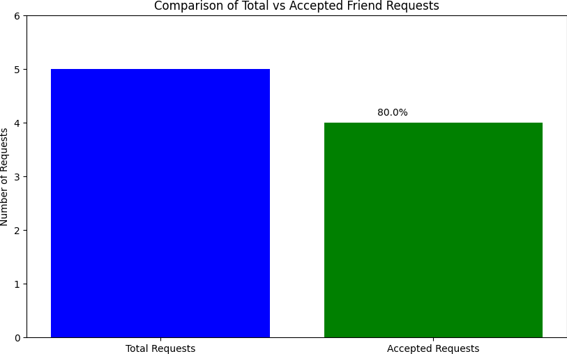

# Solution
---

### Overview

Given two tables, `FriendRequest` and `RequestAccepted`, which record the friend requests sent by users and the requests that were accepted, respectively, the goal is to calculate the acceptance rate. Specifically, the rate is the ratio of the number of unique accepted requests to the total number of unique sent requests.



---

## pandas

### Approach 1: Distinct Row Counting with Division

#### Intuition

**Step 1 - Distinct Identification**:

```python
distinct_accepted = request_accepted[['requester_id', 'accepter_id']].drop_duplicates()
distinct_request = friend_request[['sender_id', 'send_to_id']].drop_duplicates()
```

 - Before calculating the acceptance rate, we need to ensure that we're working with distinct rows, so we use $\text{drop}_{duplicates}$ method to remove duplicate rows that contain the same combination of values.

**Step 2 - Counting Distinct Rows**:

```python
accepted_count = len(distinct_accepted)
request_count = len(distinct_request)
```

 - Once we have the distinct rows, the next step is to count them. Here, the length (number of rows) of the distinct DataFrames gives us the counts.

**Step 3 - Rate Calculation via Division**:

```python
if request_count != 0:
    accept_rate = round(accepted_count / request_count, 2)
else:
    accept_rate = 0
```

 - The acceptance rate is computed by dividing the number of distinct accepted requests by the number of distinct sent requests. It's crucial to check for division by zero here to avoid errors.

**Step 4 - Returning as DataFrame**:

```python
return pd.DataFrame({"accept_rate": [accept_rate]})
```

 - The final step is to format the result as a DataFrame with the computed acceptance rate. This step transforms our single value into a table-like structure to be consistent with the required result format.

#### Implementation

```python
import pandas as pd

def acceptance_rate(friend_request: pd.DataFrame, request_accepted: pd.DataFrame) -> pd.DataFrame:

    # Dropping duplicate rows to make sure we have distinct rows
    distinct_accepted = request_accepted[['requester_id', 'accepter_id']].drop_duplicates()
    distinct_request = friend_request[['sender_id', 'send_to_id']].drop_duplicates()

    # Counting the rows of distinct data
    accepted_count = len(distinct_accepted)
    request_count = len(distinct_request)

    # Calculate acceptance rate
    if request_count != 0:
        accept_rate = round(accepted_count / request_count, 2)
    else:
        accept_rate = 0

    return pd.DataFrame({"accept_rate": [accept_rate]})
```

<br>

---

## Database

### Approach 1: Using `ROUND` and `IFNULL`

#### Intuition

Count the accepted requests and then divides it by the number of all requests.

To get the distinct number of accepted requests, we can query from the **RequestAccepted** table.
```sql
SELECT COUNT(*) FROM (SELECT DISTINCT requester_id, accepter_id FROM RequestAccepted) AS A;
```

With the same technique, we can have the total number of requests from the **FriendRequest** table:
```sql
SELECT COUNT(*) FROM (SELECT DISTINCT sender_id, send_to_id FROM FriendRequest) AS B;
```

At last, divide these two numbers and [`ROUND`](https://dev.mysql.com/doc/refman/5.7/en/mathematical-functions.html#function_round) it to a scale of 2 decimal places to get the required acceptance rate.

Wait! The divisor (total number of requests) could be '0' if the table **friend_request** is empty. So, we have to utilize  [`IFNULL`](https://dev.mysql.com/doc/refman/5.7/en/control-flow-functions.html#function_ifnull) to deal with this special case.

#### Implementation

```sql
SELECT
ROUND(
    IFNULL(
    (SELECT COUNT(*) FROM (SELECT DISTINCT requester_id, accepter_id FROM RequestAccepted) AS A)
    /
    (SELECT COUNT(*) FROM (SELECT DISTINCT sender_id, send_to_id FROM FriendRequest) AS B),
    0)
, 2) AS accept_rate;
```