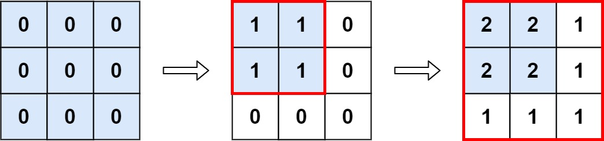

### 1. Description

You are given an `m x n` matrix `M` initialized with all `0`'s and an array of operations `ops`, where $\text{ops}[i] = [a_{i}, b_{i}]$ means $M[x][y]$ should be incremented by one for all $0 \le x < a_{i}$ and $0 \le y < b_{i}$.

Count and return *the number of maximum integers in the matrix after performing all the operations*.

### 2. Function Contract

**Inputs**

- `m`: Input parameter (`int`).
- `n`: Input parameter (`int`).
- `ops`: Input parameter (`List[List[int]]`).

**Return value**

- Returns `int`.

### 3. Examples

#### Example 1

- **Input:** $m = 3, n = 3, ops = [[2,2],[3,3]]$
- **Output:** `4`
- **Explanation:** The maximum integer in M is 2, and there are four of it in M. So return 4.

#### Example 2

- **Input:** $m = 3, n = 3, ops = [[2,2],[3,3],[3,3],[3,3],[2,2],[3,3],[3,3],[3,3],[2,2],[3,3],[3,3],[3,3]]$
- **Output:** `4`

#### Example 3

- **Input:** $m = 3, n = 3, ops = []$
- **Output:** `9`

### 4. Constraints

- $1 \le m, n \le 4 * 10^{4}$

- $0 \le \text{ops.length} \le 10^{4}$

- $\text{ops}[i].length = 2$

- $1 \le a_{i} \le m$

- $1 \le b_{i} \le n$
