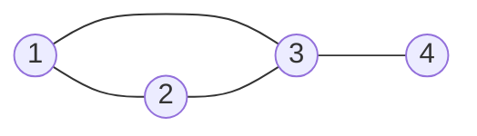

# Guided Example: Friend Requests II: Who Has the Most Friends

`RequestAccepted` records friendships as ordered pairs: one row per acceptance, with `requester_id` naming the user who asked and `accepter_id` naming the user who agreed, and the pair `(requester_id, accepter_id)` declared as the primary key. The task is to name the person with the largest number of friends together with that count, formatted as two columns `id` and `num`. The test data is generated so that exactly one person holds the strict maximum.

The difficulty is entirely in one modelling decision. A friendship is an *undirected* relation, but the table stores it as a *directed* pair. If a vertex is measured only where it appears in the first column, every friendship in which that person was the one who accepted disappears from the count. The instance below is chosen because its winner, user $3$, appears in both roles — and because a naive one-sided count would still produce a plausible-looking answer.

## 1. Instance, Contract, and the Degree Question

The acceptance log:

| `requester_id` | `accepter_id` | `accept_date` |
|:---:|:---:|:---|
| $1$ | $2$ | `2016-06-03` |
| $1$ | $3$ | `2016-06-08` |
| $2$ | $3$ | `2016-06-08` |
| $3$ | $4$ | `2016-06-09` |

The required result:

| `id` | `num` | Justification |
|:---:|:---:|:---|
| $3$ | $3$ | User $3$ is connected to $1$, $2$ and $4$, more than any other user |

The four rows encode four friendships among four users. Read as a graph:

### What the contract fixes

- **Input space.** `RequestAccepted(requester_id, accepter_id, accept_date)` with `(requester_id, accepter_id)` unique. Each ordered pair occurs at most once, so no acceptance row is a literal duplicate of another.
- **Output space.** A one-row relation with columns named `id` and `num`, where `num` is that person's friend count.
- **Uniqueness guarantee.** The generated data admits exactly one strict maximum, so no tie-breaking rule is required of the solution.
- **Semantic asymmetry.** The stored direction records who asked, not who is "more of a friend". Degree is therefore a property of the *pair*, not of the column in which a vertex happens to appear.

## 2. Symmetrizing a Directed Edge Relation

Treat the log as an edge set $E$ on the vertex set of all user identifiers, where a row $(u, v)$ contributes the undirected edge $\{u, v\}$. The friend count of a vertex is its degree, and the whole problem is a maximum-degree query. The only obstacle is representational: each edge is written once, in an arbitrary direction, so a single column never contains every incidence of a vertex.

| Counting rule applied to the log | Count for user $3$ | Count for user $4$ | Verdict |
|:---|:---:|:---:|:---|
| Rows where the user is `requester_id` | $1$ (only `(3, 4)`) | $0$ | Misses every friendship accepted by the user |
| Rows where the user is `accepter_id` | $2$ (`(1, 3)`, `(2, 3)`) | $1$ (`(3, 4)`) | Misses every friendship requested by the user |
| Union of both roles, one row per incidence | $3$ | $1$ | Correct — this is the degree |

The repair is to build a relation $T$ in which every edge appears once per endpoint:

$$
T \;=\; E \;\cup\; E^{\top},
\qquad
E^{\top} = \{\, (v, u) \;\mid\; (u, v) \in E \,\},
$$

so that $\lvert T \rvert = 2\lvert E \rvert$ and grouping $T$ by its first column yields each vertex's degree directly. Because the union must retain every row of both selections, it is a multiset union: the mirrored selection duplicates the *edges*, and that duplication is the mechanism, not an accident to be cleaned away.

## 3. Degree Conservation Invariant

Let $E = \text{RequestAccepted}$ with $E = \lvert \text{RequestAccepted} \rvert$ rows, and let $V$ be the number of distinct users appearing anywhere in the log. Define the friend count

$$
\deg(v) \;=\; \bigl\lvert \{\, u \;\mid\; (v, u) \in T \,\} \bigr\rvert .
$$

> **Degree conservation invariant.** Every undirected edge contributes exactly $+1$ to the count of each of its two endpoints, so the counts produced by grouping $T$ satisfy
> $$
> \sum_{v \in V} \deg(v) \;=\; \lvert T \rvert \;=\; 2\,E .
> $$

That identity is a free correctness check on any candidate answer: the reported degrees must sum to twice the number of acceptance rows. It also proves the symmetrization is *complete*. A vertex's own degree counts every edge incident to it, and because each edge is emitted in both directions, no incidence can be missing from $T$ — for each edge $\{u,v\}$ the multiset contains both a row whose subject is $u$ and a row whose subject is $v$.

Two secondary facts follow. The degree counts distinct partners only if the underlying relation has no repeated partner for a vertex; the primary key on the ordered pair guarantees this for the counted orientation, and the problem's unique-maximum guarantee removes any residual ambiguity. And because degrees are computed from a partition of $T$, a vertex's count is independent of the order in which the acceptance rows were read.

## 4. Worked Evaluation of the Official Log

**Step 1 — Build the symmetrized relation $T$.** Each of the four log rows contributes itself and its mirror.

| # | Row of $T$ | Subject | Origin |
|:---:|:---:|:---:|:---|
| 1 | $(1, 2)$ | $1$ | copy of the log row `(1, 2)` |
| 2 | $(1, 3)$ | $1$ | copy of the log row `(1, 3)` |
| 3 | $(2, 1)$ | $2$ | mirror of the log row `(1, 2)` |
| 4 | $(2, 3)$ | $2$ | copy of the log row `(2, 3)` |
| 5 | $(3, 1)$ | $3$ | mirror of the log row `(1, 3)` |
| 6 | $(3, 2)$ | $3$ | mirror of the log row `(2, 3)` |
| 7 | $(3, 4)$ | $3$ | copy of the log row `(3, 4)` |
| 8 | $(4, 3)$ | $4$ | mirror of the log row `(3, 4)` |

Eight rows from four, matching $\lvert T \rvert = 2E = 8$.

**Step 2 — Group $T$ by its first column and count.**

| User $v$ | Incident rows of $T$ | Distinct partners | $\deg(v)$ |
|:---:|:---|:---:|:---:|
| $1$ | $(1,2)$, $(1,3)$ | $2, 3$ | $2$ |
| $2$ | $(2,1)$, $(2,3)$ | $1, 3$ | $2$ |
| $3$ | $(3,1)$, $(3,2)$, $(3,4)$ | $1, 2, 4$ | $3$ |
| $4$ | $(4,3)$ | $3$ | $1$ |

The audit identity holds: $2 + 2 + 3 + 1 = 8 = 2E$. User $3$'s partners come from both roles — $(3,1)$ and $(3,2)$ are mirrors of rows where $3$ was the accepter, while $(3,4)$ is a row where $3$ was the requester. A one-sided count would have seen only the last of the three.

**Step 3 — Rank by degree and take the head of the ranking.**

| Rank | User $v$ | $\deg(v)$ | Strict maximum? |
|:---:|:---:|:---:|:---:|
| $1$ | $3$ | $3$ | Yes |
| $2$ | $1$ | $2$ | No |
| $2$ | $2$ | $2$ | No |
| $4$ | $4$ | $1$ | No |

The strict maximum is unique, so the reported row is `id = 3, num = 3`.

## 5. Selecting the Strict Maximum

Descending order by degree, followed by keeping only the leading row, is the direct expression of "the person with the most friends". Two properties make it correct here. First, ordering by the aggregated count is well defined even though the log has no natural order of its own, because the count is a function of the vertex alone. Second, the uniqueness guarantee means the head of the ranking is a single row, so truncating the ordering to one row cannot cut a tie in half.

Were the guarantee absent — the follow-up the statement raises — the correct general answer would be to keep *every* vertex whose degree equals the maximum, which is a different form of selection: a threshold equality against the global maximum rather than a positional truncation. This instance is a good place to notice the difference, since users $1$ and $2$ are genuinely tied at $2$ and would both have to be reported if the maximum happened to be $2$.

## 6. Ledger Topologies and Boundary Cases

| Log shape | Degrees produced | Does the method behave correctly? |
|:---|:---|:---|
| Star centred on an accepter, e.g. three rows all ending in $5$ | $\deg(5) = 3$, each sender $1$ | Yes — the centre's degree comes from mirrors exclusively |
| Star centred on a requester, e.g. three rows all starting from $7$ | $\deg(7) = 3$, each accepter $1$ | Yes — the centre's degree comes from the copied rows exclusively |
| Winner appearing in both roles | Sum of the two roles, as with user $3$ above | Yes — and this is the case a one-sided count fails |
| Non-consecutive identifiers, e.g. $10, 20, 30$ | Unaffected; keys are values, not positions | Yes — grouping never assumes dense or ordered keys |
| A single acceptance row | Both endpoints receive degree $1$ | Yes, but the input violates the unique-maximum guarantee, which is why the tests do not contain it |
| A user who never appears in the log | No rows in $T$, so no group | Correctly absent: only participants can be friends |

The last two rows mark the edges of the contract. The method assumes nothing about identifier contiguity, but it does rely on the generation guarantee for uniqueness. Note also that "number of friends" is a count of *distinct partners*: under the primary key, a repeated partner cannot inflate a count through the copied orientation, because the mirrored selection always produces exactly one incidence per endpoint per edge.

## 7. Cost of the Method

Let $E$ be the number of acceptance rows and $V$ the number of distinct users, so $V \le 2E$ because every user with a friend appears in at least one row.

**Time complexity.** The symmetrization reads the log once and emits two rows for each input row, at $O(E)$. Hash grouping then scans all $2E$ rows with one probe-and-increment per row, at $O(E)$ expected. Ranking the $V$ accumulated degrees costs $O(V \log V)$ for a full sort; a single-pass maximum scan would reduce it to $O(V)$, since only the largest counter needs to be remembered. With the sort,

$$
O(E) + O(E) + O(V \log V) = O(E + V \log V),
$$

and since $V \le 2E$ this is bounded above by $O(E \log E)$. The dominant term is linear whenever the sort is replaced by a running maximum, which the ranking does not actually require.

**Auxiliary-space complexity.** The intermediate relation $T$ holds $2E$ rows, and the aggregation state holds one integer counter per distinct user, for $O(E + V) = O(E)$ total. That is genuine working memory: the mirror image of every edge must be materialized before grouping can see both incidences. If the detector is folded into the grouping step so that each log row updates two counters directly, the $2E$-row intermediate disappears and the state shrinks to $O(V)$ — a constant-factor and locality improvement rather than an asymptotic one, but a meaningful one on a large log.
