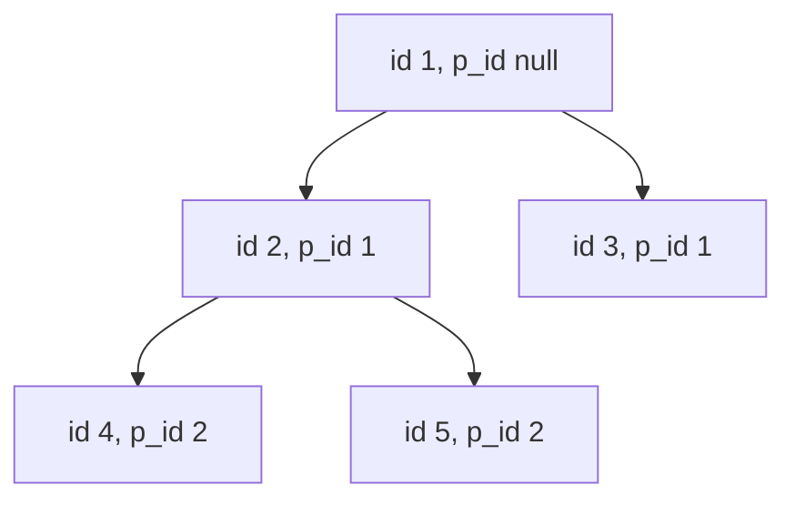

# Guided Example: Tree Node

The `Tree` table stores a rooted tree as a parent pointer: each row carries the unique
`id` of a node and the `p_id` of that node's parent, and the stored shape is guaranteed
to be a valid tree. We must label every node once with one of three structural roles —
`"Root"`, `"Inner"`, or `"Leaf"` — and return the `id` and the assigned `type` for each
node.

We work the five-node official instance end to end. The central idea is that a node's
role is completely determined by two small integers: how many parents it has and how
many children it has. Everything else in the lesson is bookkeeping that turns those two
degree counts into a single ordered decision.

## 1. The Instance and the Required Outcome

Input relation `Tree`:

| `id` | `p_id` |
|---|---|
| 1 | `null` |
| 2 | 1 |
| 3 | 1 |
| 4 | 2 |
| 5 | 2 |

Required output relation:

| `id` | `type` |
|---|---|
| 1 | `Root` |
| 2 | `Inner` |
| 3 | `Leaf` |
| 4 | `Leaf` |
| 5 | `Leaf` |

Nodes are returned in any order, so the ordering of the output rows is not part of the
contract. Only the pairing of an `id` with its role matters.

The three labels are defined operationally rather than by a picture:

- `"Leaf"`: a node that is a leaf of the tree;
- `"Root"`: a node that is the root of the tree;
- `"Inner"`: a node that is neither a leaf nor the root.

## 2. Parent Count and Child Count Are the Whole Story

Write $V$ for the set of identifiers that appear in the `id` column and $E$ for the set
of parent edges, where the pair $(p, v) \in E$ means that $v$ stores $p$ in `p_id`.

Two degree functions settle the classification:

$$
\text{in}(v) = \begin{cases} 1 & \text{if } v\text{'s } \texttt{p\_id} \text{ is not null}\\ 0 & \text{otherwise}\end{cases}
\qquad
\text{out}(v) = \bigl|\{\, u \in V : \texttt{p\_id}(u) = v \,\}\bigr|
$$

Because the stored structure is a valid tree, every node has at most one parent, exactly
one node has no parent, and the parent relation contains no cycle. The role definitions
then translate directly:

| Label | Structural meaning | Degree signature |
|---|---|---|
| `Root` | no parent at all | $\text{in} = 0$ |
| `Inner` | a parent plus at least one child | $\text{in} \ge 1$ and $\text{out} \ge 1$ |
| `Leaf` | a parent and no children | $\text{in} \ge 1$ and $\text{out} = 0$ |

The child count is not stored anywhere, but it is recoverable from one projection: let

$$
P = \{\, \texttt{p\_id}(u) : u \in V,\ \texttt{p\_id}(u) \neq \texttt{null} \,\}
$$

be the deduplicated set of identifiers that occur in the parent column. Then

$$
\text{out}(v) \ge 1 \iff v \in P .
$$

Membership in $P$ is therefore a complete substitute for counting children, which means
the whole problem reduces to one deduplication pass and one membership test per node.

## 3. Why an Ordered Chain of Tests Cannot Mislabel a Node

A conditional projection with three ordered branches assigns a label by taking the first
branch whose predicate holds. Ordering matters because the branch predicates are not
mutually exclusive when written independently: a single-node tree has both
$\text{in} = 0$ and $\text{out} = 0$, so it satisfies the raw "root" predicate and the raw
"leaf" predicate at the same time.

The chain below resolves that overlap by elimination, and the leftover bucket is
classified without any predicate of its own.

| Position | Predicate tested | What a match means | Rows surviving to the next branch |
|---|---|---|---|
| 1 | parent is null | $\text{in} = 0$, hence the unique apex | $\text{in} \ge 1$ for every remaining node |
| 2 | identifier occurs in the parent column | $\text{in} \ge 1$ and $\text{out} \ge 1$ | $\text{in} \ge 1$ and $\text{out} = 0$ |
| 3 | unconditional fallback | every remaining node is a genuine leaf | none — all rows are labelled |

> **Invariant of ordered elimination.** After the root branch has been consumed, every
> surviving row has a parent. After the inner branch has been consumed, every surviving
> row has a parent and no children. The fallback bucket therefore contains exactly the
> leaves, with no further test required.

Two properties are worth naming. The apex is claimed at position $1$ before the membership
test is consulted, so a one-node tree is labelled `Root` rather than `Leaf`: the
two-condition overlap is broken in favour of the definition. And position $3$ carries no
predicate, so the chain is total — no input row escapes unlabelled.

## 4. Working the Five-Node Instance

**Step 1 — Deduplicate the parent column.** Reading `p_id` bottom to top gives the
multiset `[null, 1, 1, 2, 2]`. Discarding the null and collapsing repeats leaves

$$
P = \{1, 2\}.
$$

So exactly two identifiers are parents of somebody: node 1 and node 2.

**Step 2 — Evaluate the chain for every node.** The state before and after each step:

| `id` | `p_id` | Parent is null? | `id` $\in P$? | Branch taken | Assigned `type` |
|---|---|---|---|---|---|
| 1 | `null` | yes | not consulted | 1 | `Root` |
| 2 | 1 | no | yes | 2 | `Inner` |
| 3 | 1 | no | no | 3 | `Leaf` |
| 4 | 2 | no | no | 3 | `Leaf` |
| 5 | 2 | no | no | 3 | `Leaf` |

**Step 3 — Confirm the result.** Node 1 is the unique node without a parent and does have
children, so it is the root. Node 2 stores parent 1 and appears in $P$ through children 4
and 5, so it is inner. Nodes 3, 4, and 5 all store a parent but never appear in $P$, so
they have no children and are leaves. The emitted relation matches the required output
row for row.

## 5. Correctness of the Three-Way Partition

> **Theorem.** For every finite valid tree, the predicates
> $\text{in} = 0$, $(\text{in} \ge 1 \land \text{out} \ge 1)$, and
> $(\text{in} \ge 1 \land \text{out} = 0)$ partition the node set, and the ordered chain of
> Section 3 labels each node with the role it satisfies.

*Completeness.* Every value of the pair $(\text{in}, \text{out})$ relevant to a tree falls
into one of three cases: $\text{in} = 0$ (the root), or $\text{in} \ge 1$ with
$\text{out} \ge 1$, or $\text{in} \ge 1$ with $\text{out} = 0$. A valid tree has exactly one
node of the first kind, so every node receives a label.

*Disjointness.* The first predicate contradicts the other two because $\text{in}$ cannot be
both $0$ and at least $1$; the second and third contradict each other on $\text{out}$. No
node satisfies two of the three role definitions simultaneously once the root case is
removed.

*Agreement with the definition.* A node matched at position $1$ has no parent, hence is
the root. A node matched at position $2$ has already failed position $1$, so it has a
parent, and membership in $P$ certifies at least one child: it is neither root nor leaf. A
node reaching position $3$ has a parent and no child, so it is a leaf. Elimination gives
the correct label in all three cases, and the fallback bucket contains nothing but leaves
because a tree node with a parent and no child is a leaf by definition.

*Substitution of membership for child counting.* The only non-obvious step is
$\text{out}(v) \ge 1 \iff v \in P$. If $v \in P$ then some row stores $v$ in `p_id`, so a
child of $v$ exists. Conversely, if $v$ has a child $u$, then $u$ is a row whose `p_id`
equals $v$, so $v$ occurs in the projected parent column and lies in $P$. Deduplication
does not affect the truth of a membership test, only the size of the structure that
answers it.

## 6. Boundary Structures and Relational Traps

The chosen five-node instance is deliberately shallow; these neighbouring structures
exercise the same reasoning at its extremes.

| Structure | Rows in `Tree` | Parent set $P$ | Labels produced | Why it matters |
|---|---|---|---|---|
| Single node | `(1, null)` | $\varnothing$ | `1 Root` | The only case where root and leaf predicates overlap; position $1$ must win |
| Star | root $1$ with children $2, 3$ | $\{1\}$ | `1 Root`, `2 Leaf`, `3 Leaf` | No inner node exists; position $2$ never fires |
| Chain $1 \to 2 \to 3 \to 4$ | four rows | $\{1, 2, 3\}$ | `1 Root`, `2 Inner`, `3 Inner`, `4 Leaf` | Two inner nodes; leaf detection stays a single membership miss |
| Non-consecutive identifiers | ids $100, 5, 77, 90$ | $\{100, 5\}$ | `100 Root`, `5 Inner`, `77 Leaf`, `90 Leaf` | Identifiers are names, not positions; no arithmetic on `id` is valid |
| Unsorted storage order | same five rows shuffled | $\{1, 2\}$ | unchanged | Ordering is irrelevant because the parent set is order-independent |

- **The negative-membership trap.** Expressing the second branch as the negation "identifier
  does not occur in the parent column" instead of the positive containment test invites a
  three-valued-logic failure: the parent column contains a `null`, and a negated containment
  over a set containing `null` evaluates to unknown rather than true, so no row can be
  proved a leaf. Testing the *positive* containment and then falling through
  unconditionally never needs to reason about unknown at all.
- **The apex-identifier trap.** The root is identified only by the null parent, so assuming
  it is the smallest identifier or the first stored row is unsafe: the non-consecutive
  structure above has its root at $100$.
- **The cycle assumption trap.** The partition is complete only because the input is
  promised to be a tree; a malformed cyclic relation would give every node a parent and
  empty the fallback bucket's meaning.
- **The output-shape trap.** Projecting every available attribute would emit `p_id`
  alongside the label and violate the required schema; only `id` and the computed `type`
  belong in the result.

## 7. Complexity Derivation

Let $N$ be the number of rows in `Tree`, and note that a valid tree satisfies
$|V| = N$.

**Deduplication of the parent column.** Streaming `p_id` into a hash set costs one probe
and at most one insertion per row, so the pass performs $O(N)$ expected work and the
finished set holds at most $N$ entries. A comparison-based alternative — sorting the
column and collapsing adjacent repeats — costs $\Theta(N \log N)$ time and $O(N)$ space;
the hash route is used because it needs no ordering.

**Classification sweep.** Each node performs one null test and, only when that fails, one
expected $O(1)$ membership probe. The conditional projection is branch-free in its
evaluation cost: three tests are possible per row, never three *per node* obligatory, and
the count is bounded by a constant regardless of $N$. The sweep is therefore
$\Theta(N)$ expected time.

**Total.** Time is $O(N)$ expected, degrading to $O(N \log N)$ only if the membership
structure is a sort rather than a hash set. Auxiliary space is $O(N)$ for the parent set
(the emitted relation is output, not auxiliary storage). No pass is repeated and no
superlinear intermediate relation is materialized at any point.