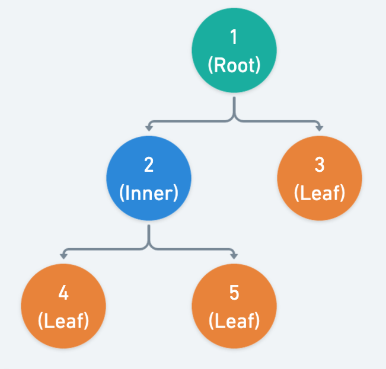

# Solution
---

### Overview

In this problem, we are tasked with classifying nodes from a tree structure into one of three categories: "Root" for the initial node, "Leaf" for nodes that have no children, and "Inner" for nodes that have both parents and children.

**Visualization of solution**



---

## pandas
### Approach 1: Conditional assignment combined with concatenation.

#### Intuition

At a high level, we implement the following logic to determine the type of each node in the tree.

Given the following input table `tree`:

<table>
  <tr>
    <th>id</th>
    <th>p_id</th>
  </tr>
  <tr>
    <td>1</td>
    <td>null</td>
  </tr>
  <tr>
    <td>2</td>
    <td>1</td>
  </tr>
  <tr>
    <td>3</td>
    <td>1</td>
  </tr>
  <tr>
    <td>4</td>
    <td>2</td>
  </tr>
  <tr>
    <td>5</td>
    <td>2</td>
  </tr>
</table>
<br>

1. **Identifying the Root Node(s)**:
   ```python
   root = tree.loc[tree['p_id'].isna(), ['id']]
   root['type'] = 'Root'
   ```
   We filter the rows where the $p_{id}$ column has a `NaN` value to identify the root node(s). This is because, by definition, the root node(s) will not have a parent node, which means the $p_{id}$ field will be `NaN`.

<table>
  <tr>
    <th>id</th>
    <th>type</th>
  </tr>
  <tr>
    <td>1</td>
    <td>Root</td>
  </tr>
</table>
<br>

2. **Identifying the Leaf Nodes**:
   ```python
   leaf = tree.loc[
       ~tree['id'].isin(tree.loc[tree['p_id'].notna(), 'p_id']) &
       tree['p_id'].notna(),
       ['id']
   ]
   leaf['type'] = 'Leaf'
   ```
   Leaf nodes are nodes that do not have any children but have a parent. Therefore, to identify these, we find nodes whose `id` doesn't appear in the $p_{id}$ column of any other row (meaning they have no children) and whose $p_{id}$ is not `NaN` (meaning they have a parent).

<table>
  <tr>
    <th>id</th>
    <th>type</th>
  </tr>
  <tr>
    <td>3</td>
    <td>Leaf</td>
  </tr>
  <tr>
    <td>4</td>
    <td>Leaf</td>
  </tr>
  <tr>
    <td>5</td>
    <td>Leaf</td>
  </tr>
</table>
<br>

3. **Identifying the Inner Nodes**:
   ```python
   inner = tree.loc[
       tree['id'].isin(tree.loc[tree['p_id'].notna(), 'p_id']) &
       tree['p_id'].notna(),
       ['id']
   ]
   inner['type'] = 'Inner'
   ```
   Inner nodes are nodes that have at least one child and have a parent. To find these, we look for nodes whose `id` appears in the $p_{id}$ column of other rows (indicating they have children) and whose $p_{id}$ is not `NaN` (indicating they have a parent).

<table>
  <tr>
    <th>id</th>
    <th>type</th>
  </tr>
  <tr>
    <td>2</td>
    <td>Inner</td>
  </tr>
</table>
<br>

4. **Combining and Sorting the Results**:
   ```python
   result = pd.concat([root, leaf, inner]).sort_values(by='id')
   ```
   After identifying the root, leaf, and inner nodes individually, we concatenate these results into a single DataFrame. We do this using the `pd.concat` function, which stacks the individual DataFrames on top of each other.

   Lastly, we sort the resulting DataFrame by the `id` column to get a final result that is ordered by the node IDs.

<table>
  <tr>
    <th>id</th>
    <th>type</th>
  </tr>
  <tr>
    <td>1</td>
    <td>Root</td>
  </tr>
  <tr>
    <td>2</td>
    <td>Inner</td>
  </tr>
  <tr>
    <td>3</td>
    <td>Leaf</td>
  </tr>
  <tr>
    <td>4</td>
    <td>Leaf</td>
  </tr>
  <tr>
    <td>5</td>
    <td>Leaf</td>
  </tr>
</table>
<br>

The pandas `.loc` function is used extensively to filter rows based on conditions, and the `.isin` function is used to check if a value in one column is present in a series (or list) of values, helping us find the leaf and inner nodes by comparing the `id` column values with the $p_{id}$ column values.

#### Implementation

```python
import pandas as pd

def tree_node(tree: pd.DataFrame) -> pd.DataFrame:
    # Find the root node(s)
    root = tree.loc[tree['p_id'].isna(), ['id']]
    root['type'] = 'Root'

    # Find the leaf nodes
    leaf = tree.loc[
        ~tree['id'].isin(tree.loc[tree['p_id'].notna(), 'p_id']) &
        tree['p_id'].notna(),
        ['id']
    ]
    leaf['type'] = 'Leaf'

    # Find the inner nodes
    inner = tree.loc[
        tree['id'].isin(tree.loc[tree['p_id'].notna(), 'p_id']) &
        tree['p_id'].notna(),
        ['id']
    ]
    inner['type'] = 'Inner'

    # Concatenate the DataFrames and sort by 'id'
    result = pd.concat([root, leaf, inner]).sort_values(by='id')

    return result
```

### Approach 2: Row-wise Classification

#### Intuition

Here's the step-by-step intuition:

1. **Finding the Root ID**:
   ```python
   root_id = tree.loc[tree['p_id'].isnull(), 'id'].values[0]
   ```
   - We use the `.loc` accessor to find the row where $p_{id}$ is `null`, meaning it is the root node. We extract the 'id' value of this node to identify it as the root ID.

2. **Identifying Inner Node Candidates**:
   ```python
   parent_ids = tree['p_id'].dropna().unique()
   ```
   - We take all the $p_{id}$ values (excluding `null` values using `.dropna()`) and find the unique values using the `.unique()` method. This gives us a list of IDs that are referenced as parent IDs, which will be used later to identify inner nodes.

3. **Defining a Helper Function**:
   ```python
   def get_type(row):
       if row['id'] == root_id:
           return 'Root'
       elif row['id'] in parent_ids:
           return 'Inner'
       else:
           return 'Leaf'
   ```
   - We define a function $\text{get}_{type}$ that takes a row of the dataframe as input and returns the type of the node based on the `id`. It checks the following:
     - If the 'id' matches the $\text{root}_{id}$, it returns 'Root'.
     - If the 'id' is found in the $\text{parent}_{ids}$ array, it is an inner node, so it returns 'Inner'.
     - Otherwise, it is a leaf node, so it returns 'Leaf'.

4. **Applying the Helper Function to Each Row**:
   ```python
   tree['type'] = tree.apply(get_type, axis=1)
   ```
   - We use the `.apply()` method with `axis=1` to apply the $\text{get}_{type}$ function to each row in the dataframe. This generates a new column `'type'` containing the type of each node (Root, Inner, or Leaf).

5. **Creating and Sorting the Result Dataframe**:
   ```python
   result = tree[['id', 'type']].sort_values(by='id')
   ```
   - We create a new dataframe with just the 'id' and 'type' columns, sorting it by the 'id' column to match the order specified in the problem statement.

6. **Returning the Result**:
   ```python
   return result
   ```
   - Finally, we return the resultant dataframe, which contains two columns: 'id' and 'type', representing the ID and the type of each node, respectively.

#### Implementation

```python
import pandas as pd

def tree_node(tree: pd.DataFrame) -> pd.DataFrame:
    # Get the ID of the root node
    root_id = tree.loc[tree['p_id'].isnull(), 'id'].values[0]

    # Get the list of IDs that are parents (to find inner nodes later)
    parent_ids = tree['p_id'].dropna().unique()

    # Define a function to apply to each row to determine the type
    def get_type(row):
        if row['id'] == root_id:
            return 'Root'
        elif row['id'] in parent_ids:
            return 'Inner'
        else:
            return 'Leaf'

    # Apply the function to each row
    tree['type'] = tree.apply(get_type, axis=1)

    # Create a new DataFrame with the required columns and sort it by 'id'
    result = tree[['id', 'type']].sort_values(by='id')

    return result
```

<br>

### Approach 3: Using numpy `where`

#### Intuition

Here is a step-by-step breakdown explaining the intuition behind each step utilizing both pandas and numpy to identify the types of nodes in a tree:

1. **Importing Necessary Modules:**

```python
import pandas as pd
import numpy as np
```

- **`pandas`** is imported to work with data frames, which are two-dimensional size-mutable, tabular data.
- **`numpy`** is imported to work with arrays and perform operations on them efficiently. `pandas` has a dependency on `numpy`.

2.  **Determining Node Types with `np.where`:**

   ```python
   tree["type"] = np.where(
       tree["p_id"].isna(),
       "Root",
       np.where(
           tree["id"].isin(tree["p_id"].unique()) & tree["p_id"].notna(),
           "Inner",
           "Leaf",
       ),
   )
   ```
- **`np.where(condition, x, y)`**: This numpy function is used to create a new array. It returns the value `x` where `condition` is True and the value `y` where `condition` is False.
- The column `'type'` is created in the data frame to store the type of each node, based on certain conditions evaluated through nested `np.where()` calls:
   - **First Layer**: If the $p_{id}$ (parent ID) is NaN (not a number, representing missing values), it classifies the node as 'Root'.
   - **Second Layer**: If the first condition is false (meaning the node is not a root), it checks two more conditions using an `&` (AND) operator:
      - $tree['id'].isin(tree['p_{id}'].unique())$: Checks if the ID of the node is in the list of unique parent IDs, which would mean the node is a parent node and is therefore classified as 'Inner'.
      - $tree['p_{id}'].notna()$: Ensures that the parent ID is not NaN. This is more of a safety check because if it was NaN, it would have been classified as 'Root' in the previous step.
   - If both conditions in the second layer are true, the node is classified as 'Inner'; if not, it is classified as 'Leaf'.

3. **Returning the Final Data Frame:**

```python
return tree[['id', 'type']]
```
- Finally, a data frame is returned containing only the `'id'` and `'type'` columns, representing the ID and determined type of each node respectively.

**Notes on Approach:**

- The script classifies nodes in a tree structure into 'Root', 'Inner', or 'Leaf' based on their parent IDs.
- It uses nested `np.where` statements to set the classification based on whether a node is the root, an inner node (has children), or a leaf node (has no children).
- It employs efficient vectorized operations from NumPy to avoid looping through each row, thereby enhancing performance.

#### Implementation

```python
import pandas as pd
import numpy as np

def tree_node(tree: pd.DataFrame) -> pd.DataFrame:
    tree["type"] = np.where(
        tree["p_id"].isna(),
        "Root",
        np.where(
            tree["id"].isin(tree["p_id"].unique()) & tree["p_id"].notna(),
            "Inner",
            "Leaf",
        ),
    )
    return tree[["id", "type"]]
```

<br>

---

## Database

### Approach 1: Using `UNION`

#### Intuition

We can print the node type by judging every record by its definition in this table.
* Root: it does not have a parent node at all
* Inner: it is the parent node of some nodes, and it has a not NULL parent itself.
* Leaf: rest of the cases other than above two

#### Implementation

By transiting the node type definition, we can have the following code.

For the root node, it does not have a parent.
```sql
SELECT
    id, 'Root' AS Type
FROM
    tree
WHERE
    p_id IS NULL
```

For the leaf nodes, they do not have any children, and it has a parent.
```sql
SELECT
    id, 'Leaf' AS Type
FROM
    tree
WHERE
    id NOT IN (SELECT DISTINCT
            p_id
        FROM
            tree
        WHERE
            p_id IS NOT NULL)
        AND p_id IS NOT NULL
```

For the inner nodes, they have have some children and a parent.
```sql
SELECT
    id, 'Inner' AS Type
FROM
    tree
WHERE
    id IN (SELECT DISTINCT
            p_id
        FROM
            tree
        WHERE
            p_id IS NOT NULL)
        AND p_id IS NOT NULL
```
So, one solution to the problem is to combine these cases together using `UNION`.

**MySQL**

```sql
SELECT
    id, 'Root' AS Type
FROM
    tree
WHERE
    p_id IS NULL

UNION

SELECT
    id, 'Leaf' AS Type
FROM
    tree
WHERE
    id NOT IN (SELECT DISTINCT
            p_id
        FROM
            tree
        WHERE
            p_id IS NOT NULL)
        AND p_id IS NOT NULL

UNION

SELECT
    id, 'Inner' AS Type
FROM
    tree
WHERE
    id IN (SELECT DISTINCT
            p_id
        FROM
            tree
        WHERE
            p_id IS NOT NULL)
        AND p_id IS NOT NULL
ORDER BY id;
```

### Approach 2: Using flow control statement `CASE`

#### Implementation

The idea is similar with the above solution but the code is simpler by utilizing the flow control statements, which is effective to output differently based on different input values. In this case, we can use [`CASE`](https://dev.mysql.com/doc/refman/5.7/en/case.html) statement.

**MySQL**

```sql
SELECT
    id AS `Id`,
    CASE
        WHEN tree.id = (SELECT atree.id FROM tree atree WHERE atree.p_id IS NULL)
          THEN 'Root'
        WHEN tree.id IN (SELECT atree.p_id FROM tree atree)
          THEN 'Inner'
        ELSE 'Leaf'
    END AS Type
FROM
    tree
ORDER BY `Id`
;
```
>MySQL provides different flow control statements besides `CASE`. You can try to rewrite the slution above using [`IF`](https://dev.mysql.com/doc/refman/5.7/en/control-flow-functions.html#function_if) flow control statement.

### Approach 3: Using `IF` function

#### Implementation

Also, we can use a single [`IF`](https://dev.mysql.com/doc/refman/5.7/en/control-flow-functions.html#function_if) function instead of the complex flow control statements.

**MySQL**

```sql
SELECT
    atree.id,
    IF(ISNULL(atree.p_id),
        'Root',
        IF(atree.id IN (SELECT p_id FROM tree), 'Inner','Leaf')) Type
FROM
    tree atree
ORDER BY atree.id
```
>Note: This databas solution was inspired by [@richarddia](https://discuss.leetcode.com/user/richarddia)