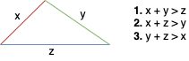

# Solution
---

### Overview

To solve this problem, the triangle inequality theorem is utilized, which states that for a set of three lengths to form a triangle, the sum of any two sides must be greater than the remaining side. This theorem provides three conditions that must be satisfied:

1. \(x + y > z\)
2. \(y + z > x\)
3. \(z + x > y\)

where \(x\), \(y\), and \(z\) are the lengths of the three sides.

**Visualization of triangle inequality theorem**



---

## pandas

### Approach: DataFrame Row-Wise Application of the Triangle Inequality Theorem

#### Intuition

In Math, three segments can form a triangle only if the sum of any of the two segments is larger than the third one.
(In other words, the subtraction of any of the two segments are smaller than the third one.)

We create a function $\text{is}_{triangle}$ which takes a single parameter, `row`. This function will be applied to each row in the input DataFrame to check if the values in that row represent the lengths of the sides of a triangle.

```python
def is_triangle(row):
    return (
        "Yes"
        if (row["x"] + row["y"] > row["z"])
        and (row["y"] + row["z"] > row["x"])
        and (row["z"] + row["x"] > row["y"])
        else "No"
    )
```

In this function, we check whether the values in the current row satisfy the conditions of the triangle inequality theorem:
 - $row['x'] + row['y'] > row['z']$ checks that the sum of the lengths of sides `x` and `y` is greater than the length of side `z`.
 - $row['y'] + row['z'] > row['x']$ checks that the sum of the lengths of sides `y` and `z` is greater than the length of side `x`.
 - $row['z'] + row['x'] > row['y']$ checks that the sum of the lengths of sides `z` and `x` is greater than the length of side `y`.
If all three conditions are met, it returns `'Yes'`, indicating that a triangle can be formed with the side lengths. Otherwise, it returns `'No'`.

We use the `apply` method of pandas to apply the $\text{is}_{triangle}$ function to each row (specified with `axis=1`) in the input DataFrame. The result is a new Series which we assign to the DataFrame as a new column named 'triangle'.

```python
triangle['triangle'] = triangle.apply(is_triangle, axis=1)
```

#### Implementation

Based on the understanding above we can implement the solution as follows:

```python
import pandas as pd

def triangle_judgement(triangle: pd.DataFrame) -> pd.DataFrame:

    # Define a function to check if three sides can form a triangle
    def is_triangle(row):
        return (
            "Yes"
            if (row["x"] + row["y"] > row["z"])
            and (row["y"] + row["z"] > row["x"])
            and (row["z"] + row["x"] > row["y"])
            else "No"
        )

    # Apply the function to each row in the DataFrame
    triangle["triangle"] = triangle.apply(is_triangle, axis=1)

    # Return the updated DataFrame
    return triangle

```

<br>

---

## Database

### Approach: Using `case...when...`

#### Intiuition

In Math, three segments can form a triangle only if the sum of any of the two segments is larger than the third one.
(In other words, the subtraction of any of the two segments are smaller than the third one.)

So, we can use this knowledge to judge with the help of the MySQL control statements [`case...when...`](https://dev.mysql.com/doc/refman/5.7/en/case.html).

#### Implementation

```sql
SELECT
    x,
    y,
    z,
    CASE
        WHEN x + y > z AND x + z > y AND y + z > x THEN 'Yes'
        ELSE 'No'
    END AS 'triangle'
FROM
    triangle
;
```