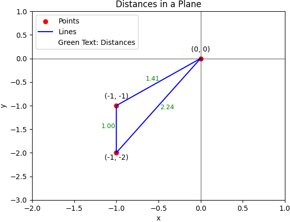

# Solution
---

### Overview

We are given a collection of points, each defined by two coordinates: x and y, representing its position in a two-dimensional space.

Our task is to determine the shortest distance between any two points within this collection. To calculate the distance between two points $(x_1, y_1)$ and $(x_2, y_2)$, we will use the Euclidean distance formula:

$d = \sqrt{(x_2 - x_1)^2 + (y_2 - y_1)^2}$

**Visualization of distances in a plane**



---

## pandas

### Approach 1: Pairwise Euclidean Distance Calculation Using Cartesian Coordinates

#### Intuition

**Highlevel Steps to Solve**

1. **Input Data**: Receive a list of points, where each point is defined by its $x$ and $y$ coordinates.

2. **Pairwise Distance Calculation**: For each unique pair of points in the list (a pair being two distinct points), we calculate the distance between them using the Euclidean distance formula.

3. **Finding the Minimum Distance**: From all the distances calculated in step 2, identify the smallest one, which represents the shortest distance between any two points in your dataset.

4. **Output**: Report this shortest distance, rounded to two decimal points.

Let’s break down each section of the code step-by-step with labeled steps for the following input of $\text{point2}_{d}$:

<table>
<tr><th>x</th><th>y</th></tr>
<tr><td>-1</td><td>-1</td></tr>
<tr><td>0</td><td>0</td></tr>
<tr><td>-1</td><td>-2</td></tr>
</table>
<br>

**Step 1: Cross Join of the DataFrame with Itself**

```python
df = point2_d.merge(point2_d, how='cross')
```

In this step, a cross join is performed on the DataFrame with itself to create all possible pairs of points. This generates a new DataFrame where each row contains a pair of points with their respective `x` and `y` coordinates (labelled with suffixes "\_x" and "\_y" to distinguish between the coordinates of the two points in each pair).

After the cross join, `df` looks like:

<table>
<tr>
<th>x_x</th>
<th>y_x</th>
<th>x_y</th>
<th>y_y</th>
</tr>
<tr>
<td>-1</td>
<td>-1</td>
<td>-1</td>
<td>-1</td>
</tr>
<tr>
<td>-1</td>
<td>-1</td>
<td>0</td>
<td>0</td>
</tr>
<tr>
<td>-1</td>
<td>-1</td>
<td>-1</td>
<td>-2</td>
</tr>
<tr>
<td>0</td>
<td>0</td>
<td>-1</td>
<td>-1</td>
</tr>
<tr>
<td>0</td>
<td>0</td>
<td>0</td>
<td>0</td>
</tr>
<tr>
<td>0</td>
<td>0</td>
<td>-1</td>
<td>-2</td>
</tr>
<tr>
<td>-1</td>
<td>-2</td>
<td>-1</td>
<td>-1</td>
</tr>
<tr>
<td>-1</td>
<td>-2</td>
<td>0</td>
<td>0</td>
</tr>
<tr>
<td>-1</td>
<td>-2</td>
<td>-1</td>
<td>-2</td>
</tr>
</table>
<br>

**Step 2:  Filtering Out Identical Points**

```python
df = df[(df['x_x'] != df['x_y']) | (df['y_x'] != df['y_y'])]
```

This step removes rows where the pairs of points are identical, because we are looking for the distance between distinct points, and the distance between a point and itself is zero.

After removing rows representing the same points, we have:

<table>
<tr>
<th>x_x</th>
<th>y_x</th>
<th>x_y</th>
<th>y_y</th>
</tr>
<tr>
<td>-1</td>
<td>-1</td>
<td>0</td>
<td>0</td>
</tr>
<tr>
<td>-1</td>
<td>-1</td>
<td>-1</td>
<td>-2</td>
</tr>
<tr>
<td>0</td>
<td>0</td>
<td>-1</td>
<td>-1</td>
</tr>
<tr>
<td>0</td>
<td>0</td>
<td>-1</td>
<td>-2</td>
</tr>
<tr>
<td>-1</td>
<td>-2</td>
<td>-1</td>
<td>-1</td>
</tr>
<tr>
<td>-1</td>
<td>-2</td>
<td>0</td>
<td>0</td>
</tr>
</table>
<br>

**Step 3:  Computing the Euclidean Distance**

```python
df['shortest'] = ((df['x_y'] - df['x_x']).pow(2) + (df['y_y'] - df['y_x']).pow(2)).pow(1/2)
```

Here, we calculate the Euclidean distance between all pairs of points using the distance formula:

$d = \sqrt{(x_2-x_1)^2 + (y_2-y_1)^2}$

This results in a new column `'shortest'` that contains the distances between all pairs of distinct points.

After computing the distances, `df` becomes:

<table>
<tr>
<th>x_x</th>
<th>y_x</th>
<th>x_y</th>
<th>y_y</th>
<th>shortest</th>
</tr>
<tr>
<td>-1</td>
<td>-1</td>
<td>0</td>
<td>0</td>
<td>1.414214</td>
</tr>
<tr>
<td>-1</td>
<td>-1</td>
<td>-1</td>
<td>-2</td>
<td>1.0</td>
</tr>
<tr>
<td>0</td>
<td>0</td>
<td>-1</td>
<td>-1</td>
<td>1.414214</td>
</tr>
<tr>
<td>0</td>
<td>0</td>
<td>-1</td>
<td>-2</td>
<td>2.236068</td>
</tr>
<tr>
<td>-1</td>
<td>-2</td>
<td>-1</td>
<td>-1</td>
<td>1.0</td>
</tr>
<tr>
<td>-1</td>
<td>-2</td>
<td>0</td>
<td>0</td>
<td>2.236068</td>
</tr>
</table>
<br>

**Step 4:  Rounding the Distances**

```python
df['shortest'] = df['shortest'].apply(lambda x: round(x, 2))
```

In this step, the distances calculated in the previous step are rounded to two decimal places using the `apply` function with a lambda function.

<table>
<tr>
<th>x_x</th>
<th>y_x</th>
<th>x_y</th>
<th>y_y</th>
<th>shortest</th>
</tr>
<tr>
<td>-1</td>
<td>-1</td>
<td>0</td>
<td>0</td>
<td>1.41</td>
</tr>
<tr>
<td>-1</td>
<td>-1</td>
<td>-1</td>
<td>-2</td>
<td>1.00</td>
</tr>
<tr>
<td>0</td>
<td>0</td>
<td>-1</td>
<td>-1</td>
<td>1.41</td>
</tr>
<tr>
<td>0</td>
<td>0</td>
<td>-1</td>
<td>-2</td>
<td>2.24</td>
</tr>
<tr>
<td>-1</td>
<td>-2</td>
<td>-1</td>
<td>-1</td>
<td>1.00</td>
</tr>
<tr>
<td>-1</td>
<td>-2</td>
<td>0</td>
<td>0</td>
<td>2.24</td>
</tr>
</table>
<br>

**Step 5:  Finding the Minimum Distance**

```python
df = df[df['shortest'] == df['shortest'].min()].drop_duplicates('shortest')
```

Here, we find the minimum distance by first identifying the minimum value in the `'shortest'` column, and then filtering the DataFrame to only include rows with this minimum distance. We use $\text{drop}_{duplicates}$ to remove duplicate distances, resulting in a DataFrame with a single row containing the minimum distance.

Filtering to find the rows with the minimum distance gives us:

<table>
<tr>
<th>x_x</th>
<th>y_x</th>
<th>x_y</th>
<th>y_y</th>
<th>shortest</th>
</tr>
<tr>
<td>-1</td>
<td>-1</td>
<td>-1</td>
<td>-2</td>
<td>1.0</td>
</tr>
</table>
<br>

**Step 6:  Returning the Result**

```python
return df[['shortest']]
```

Finally, a DataFrame with only the `'shortest'` column (which now contains a single unique value representing the shortest distance between any two distinct points) is returned as the output.

<table>
<tr>
<th>shortest</th>
</tr>
<tr>
<td>1.00</td>
</tr>
</table>
<br>

In essence, this algorithm systematically checks all possible pairs of points to find the pair with the shortest distance between them, using the standard Euclidean distance formula and pandas operations to carry out this task.

#### Implementation

```python
import pandas as pd

def shortest_distance(point2_d: pd.DataFrame) -> pd.DataFrame:
    df = point2_d.merge(point2_d, how='cross')

    # Filter df so no same points are calculated
    df = df[(df['x_x'] != df['x_y']) | (df['y_x'] != df['y_y'])]

    # Calculate shortest given the distance formula
    df['shortest'] = ((df['x_y'] - df['x_x']).pow(2) + (df['y_y'] - df['y_x']).pow(2)).pow(1/2)

    # Round each value in shortest
    df['shortest'] = df['shortest'].apply(lambda x: round(x, 2))

    # Find shortest, remove duplicates and return
    df = df[df['shortest'] == df['shortest'].min()].drop_duplicates('shortest')

    return df[['shortest']]

```

---

### Approach 2: Vectorized Pairwise Distance Calculation Using Broadcasting

#### Intuition

Let’s break down each section of the code step-by-step with labeled steps for the following input of $\text{point2}_{d}$:

<table>
<tr><th>x</th><th>y</th></tr>
<tr><td>-1</td><td>-1</td></tr>
<tr><td>0</td><td>0</td></tr>
<tr><td>-1</td><td>-2</td></tr>
</table>
<br>

**Step 1: Importing Necessary Libraries**

```python
import pandas as pd
import numpy as np
```
Here, we import the pandas and numpy libraries, which will be used for data manipulation and mathematical operations, respectively.

**Step 2: Function Definition**

```python
def shortest_distance(point2_d: pd.DataFrame) -> pd.DataFrame:
```
We define our function, specifying that it takes a pandas DataFrame as input and returns a pandas DataFrame as output.

**Step 3: Extracting x and y Coordinates**

```python
    x = point2_d['x'].to_numpy()
    y = point2_d['y'].to_numpy()
```
In this step, we extract the 'x' and 'y' coordinates from the input DataFrame and convert them into numpy arrays for efficient mathematical operations in the subsequent steps.

**Step 4: Computing Pairwise Squared Distances**

```python
    dx = (x[:, None] - x[None, :])**2
    dy = (y[:, None] - y[None, :])**2
    distances_squared = dx + dy
```
Using broadcasting and vectorized operations, we calculate the squared distances between all pairs of points. The expressions $x[:, None] - x[None, :]$ and $y[:, None] - y[None, :]$ create matrices of pairwise differences for 'x' and 'y' coordinates. We then sum these squared differences element-wise to obtain the squared Euclidean distances between all pairs.

The `dx` and `dy` matrices will be:

<table>
<tr><th>dx</th><th></th><th></th></tr>
<tr><td>0</td><td>1</td><td>0</td></tr>
<tr><td>1</td><td>0</td><td>1</td></tr>
<tr><td>0</td><td>1</td><td>0</td></tr>
</table>
<br>
<table>
<tr><th>dy</th><th></th><th></th></tr>
<tr><td>0</td><td>1</td><td>1</td></tr>
<tr><td>1</td><td>0</td><td>4</td></tr>
<tr><td>1</td><td>4</td><td>0</td></tr>
</table>
<br>

Then the $\text{distances}_{squared}$ matrix:

<table>
<tr><td>0</td><td>2</td><td>1</td></tr>
<tr><td>2</td><td>0</td><td>5</td></tr>
<tr><td>1</td><td>5</td><td>0</td></tr>
</table>
<br>

**Step 5: Setting Diagonal to Infinity**
```python
    np.fill_diagonal(distances_squared, np.inf)
```
We set the diagonal elements of the distance matrix to infinity, as these elements represent the distance of points to themselves, which are essentially zero and should not be considered when finding the minimum distance.

After setting the diagonal to infinity, the $\text{distances}_{squared}$ matrix:

<table>
<tr><td>inf</td><td>2</td><td>1</td></tr>
<tr><td>2</td><td>inf</td><td>5</td></tr>
<tr><td>1</td><td>5</td><td>inf</td></tr>
</table>
<br>

**Step 6: Finding the Minimum Squared Distance**

```python
    min_distance_squared = np.min(distances_squared)
```
We find the minimum value in our matrix of squared distances. This value represents the smallest squared distance between any two distinct points in our dataset.

The minimum squared distance is `1`.

**Step 7: Computing the Euclidean Distance**

```python
    min_distance = np.sqrt(min_distance_squared)
```
We take the square root of the minimum squared distance to calculate the actual minimum Euclidean distance between any two points.

The minimum Euclidean distance calculated is a scalar value: `1.0`.

**Step 8: Creating Output DataFrame**

```python
    result_df = pd.DataFrame({'shortest': [round(min_distance, 2)]})
```
We create a pandas DataFrame to hold our result, rounding the minimum distance to two decimal places as per the problem's requirements.

The output dataframe $\text{result}_{df}$:

<table>
<tr><th>shortest</th></tr>
<tr><td>1.0</td></tr>
</table>
<br>

**Step 9: Returning the Result**

```python
    return result_df
```
Finally, we return the DataFrame which contains our result: the shortest distance between any two points in our set, rounded to two decimal points.

#### Implementation

```python
import pandas as pd
import numpy as np

def shortest_distance(point2_d: pd.DataFrame) -> pd.DataFrame:
    # Extract x and y coordinates as numpy arrays
    x = point2_d['x'].to_numpy()
    y = point2_d['y'].to_numpy()

    # Compute the pairwise squared distances using broadcasting
    dx = (x[:, None] - x[None, :])**2
    dy = (y[:, None] - y[None, :])**2
    distances_squared = dx + dy

    # Set diagonal to infinity to avoid zero distance for a point with itself
    np.fill_diagonal(distances_squared, np.inf)

    # Find the minimum distance
    min_distance_squared = np.min(distances_squared)

    # Take square root to get the Euclidean distance
    min_distance = np.sqrt(min_distance_squared)

    # Create a DataFrame to hold the result
    result_df = pd.DataFrame({'shortest': [round(min_distance, 2)]})

    return result_df

```

---

## Database

### Approach 1: Using `SQRT`, `POW()` functions and math knowledge

#### Intuition

Calculate the distances between each two points and then display the smallest one.

The [euclidean distance](https://en.wikipedia.org/wiki/Euclidean_distance) between two points P1(x1,y1) and P2(x2, y2) in two dimensions is defined as $\sqrt{(x1-x2)^2+(y1-y2)^2}$. So in order to get the distances, we can join this table with itself, and then utilize the built-in function `POW()` and `SQRT()` like below.

```sql
SELECT
    p1.x,
    p1.y,
    p2.x,
    p2.y,
    SQRT((POW(p1.x - p2.x, 2) + POW(p1.y - p2.y, 2))) AS distance
FROM
    point_2d p1
        JOIN
    point_2d p2 ON p1.x != p2.x OR p1.y != p2.y
;
```

>Note:
> - The condition 'p1.x != p2.x OR p2.y != p2.y' is to avoid calculating the distance of a point with itself.
> Otherwise, the minimum distance will be always zero.
> - The columns p1.x, p1.y, p2.x and p2.y are for demonstrating. They are not necessary for the final solution.

So the output would be as below after running this code on the sample data.
```
| x  | y  | x  | y  | distance           |
|----|----|----|----|--------------------|
| 0  | 0  | -1 | -1 | 1.4142135623730951 |
| -1 | -2 | -1 | -1 | 1                  |
| -1 | -1 | 0  | 0  | 1.4142135623730951 |
| -1 | -2 | 0  | 0  | 2.23606797749979   |
| -1 | -1 | -1 | -2 | 1                  |
| 0  | 0  | -1 | -2 | 2.23606797749979   |
```

At last, choose the minimum distance and round it to 2 decimals as required.

#### Implementation

```mysql []
SELECT
    ROUND(SQRT(MIN((POW(p1.x - p2.x, 2) + POW(p1.y - p2.y, 2)))), 2) AS shortest
FROM
    point_2d p1
        JOIN
    point_2d p2 ON p1.x != p2.x OR p1.y != p2.y
;
```
>Note: To put the MIN() inside of SQRT() will slightly improve the performance.

### Approach 2: Optimize to avoid reduplicate calculations

#### Intuition

It is unnecessary to calculate the distance between all points to all other points since some of them may already be done.
So how to avoid the reduplicate calculations?

When join the table with itself, we can claim to only calculate the distance between one point to another point in a certain rule such ponts with bigger x value.
By following this rule, we can avoid quite a lot of reduplicate calculations.

```sql
SELECT
    t1.x,
    t1.y,
    t2.x,
    t2.y,
    SQRT((POW(t1.x - t2.x, 2) + POW(t1.y - t2.y, 2))) AS distance
FROM
    point_2d t1
        JOIN
    point_2d t2 ON (t1.x <= t2.x AND t1.y < t2.y)
        OR (t1.x <= t2.x AND t1.y > t2.y)
        OR (t1.x < t2.x AND t1.y = t2.y)
;
```

The output is as below for the sample data. You may notice that there are only 4 records, 1/3 less than the previous solution.

```
| x  | y  | x  | y  | distance           |
|----|----|----|----|--------------------|
| -1 | -2 | -1 | -1 | 1                  |
| -1 | -1 | 0  | 0  | 1.4142135623730951 |
| -1 | -2 | 0  | 0  | 2.23606797749979   |
| -1 | -1 | -1 | -2 | 1                  |
```

>Note:
The best case is to compare n*(n-1)/2 times, but practically it is not always true considering two points may have same x value or y value.
In this case, you may notice the distance between (-1, -2) and (-1, -1) appearing twice in the first and last line in the output.

Here comes the solution to select the shortest distance and round to two decimals.

#### Implementation

```mysql []
SELECT
    ROUND(SQRT(MIN((POW(p1.x - p2.x, 2) + POW(p1.y - p2.y, 2)))),2) AS shortest
FROM
    point_2d p1
        JOIN
    point_2d p2 ON (p1.x <= p2.x AND p1.y < p2.y)
        OR (p1.x <= p2.x AND p1.y > p2.y)
        OR (p1.x < p2.x AND p1.y = p2.y)
;
```