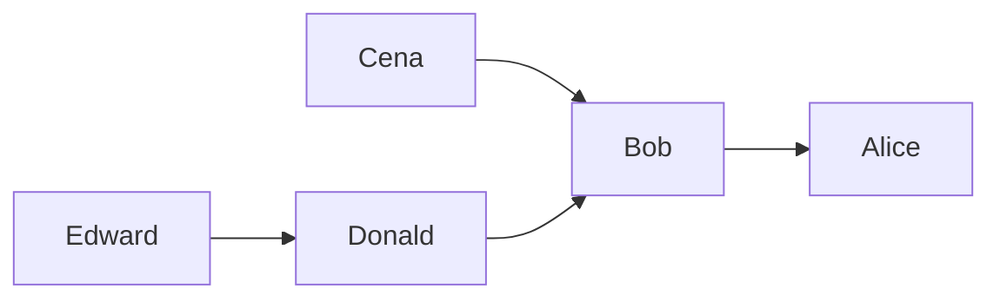

# Guided Example: Second Degree Follower

The `Follow` table stores directed follow relationships: each row records one user (the
`follower`) following another user (the `followee`). A **second-degree follower** is a user
who follows at least one user *and* is followed by at least one user, and for every such
user we must report the name and the number of that user's own followers, ordered
alphabetically by name.

The problem is an intersection of two roles that one user can hold simultaneously. Its two
failure modes are dropping the outgoing-role test — which admits popular users who follow
nobody — and counting followers without deduplication, which multiplies the answer by how
many people the subject follows.

## 1. The Instance and the Eligibility Contract

`Follow` holds two `varchar` columns, `followee` and `follower`. Together they form the
primary key, so a relationship is stored at most once, and the statement guarantees that no
user follows themself.

Input relation:

| `followee` | `follower` |
|---|---|
| Alice | Bob |
| Bob | Cena |
| Bob | Donald |
| Donald | Edward |

Required output relation:

| `follower` | `num` |
|---|---|
| Bob | 2 |
| Donald | 1 |

The output naming is deliberately inverted with respect to the input: the subject — the
second-degree follower itself — is emitted under the column name `follower`, while `num`
counts that subject's own followers. The output column therefore names the role the subject
plays in the stored `follower` column, not the role being counted.

## 2. The Two Roles as In-Degree and Out-Degree

Read the relation as the edge set of a directed graph: the row $(a, b)$ with $a$ in
`followee` and $b$ in `follower` is the edge $b \to a$, meaning "$b$ follows $a$". Let $V$
be the set of names occurring in either column. Two degree functions decide everything:

$$
\text{out}(u) = \bigl|\{\, a : (a, u) \in \text{Follow} \,\}\bigr|
\ \text{(users } u \text{ follows)},
\qquad
\text{in}(u) = \bigl|\{\, b : (u, b) \in \text{Follow} \,\}\bigr|
\ \text{(users following } u\text{)} .
$$

Eligibility is then a pure degree condition, and the reported count is the in-degree:

$$
u \text{ is reported} \iff \text{out}(u) \ge 1 \ \land \ \text{in}(u) \ge 1,
\qquad
\text{num} = \text{in}(u).
$$

Applying it to the five names of the instance:

| User $u$ | Users $u$ follows | $\text{out}(u)$ | Followers of $u$ | $\text{in}(u)$ | Eligible? | `num` |
|---|---|---|---|---|---|---|
| `Alice` | none | 0 | `Bob` | 1 | no — follows nobody | — |
| `Bob` | `Alice` | 1 | `Cena`, `Donald` | 2 | yes | 2 |
| `Cena` | `Bob` | 1 | none | 0 | no — nobody follows them | — |
| `Donald` | `Bob` | 1 | `Edward` | 1 | yes | 1 |
| `Edward` | `Donald` | 1 | none | 0 | no — nobody follows them | — |

`Alice` is the instructive rejection: she has a follower, so a test based only on "is
followed by at least one user" would report her with `num = 1`, yet she follows nobody and
must be omitted. Only `Bob` and `Donald` hold both roles.

## 3. Intersecting the Two Roles with a Key Equality

The eligible set is the intersection of the names appearing in the `follower` column and
the names appearing in the `followee` column:

$$
A = \{\, b : (a, b) \in \text{Follow} \,\},
\qquad
B = \{\, a : (a, b) \in \text{Follow} \,\},
\qquad
\text{Eligible} = A \cap B .
$$

An intersection of two relations over the same identity is realized by an equi-join on that
identity. The identity is the user name, and the two relations are two views of the same
table, so the join pairs an outgoing row $(X, u)$, which certifies that $u$ follows
somebody, with an incoming row $(u, Y)$, which certifies that somebody follows $u$. Every
surviving pairing is the two-hop path

$$
Y \to u \to X ,
$$

whose middle vertex $u$ is the candidate being classified. The far end $X$ proves the
outgoing role, and the near end $Y$ is one of $u$'s followers and therefore one unit of
`num`.

| Middle user $u$ | Outgoing row | Incoming rows | Two-hop paths produced |
|---|---|---|---|
| `Bob` | `(Alice, Bob)` | `(Bob, Cena)`, `(Bob, Donald)` | `Cena → Bob → Alice`, `Donald → Bob → Alice` |
| `Donald` | `(Bob, Donald)` | `(Donald, Edward)` | `Edward → Donald → Bob` |
| `Alice`, `Cena`, `Edward` | — | — | none; each lacks one of the two roles |

## 4. Worked Aggregation and the Multiplication Trap

Grouping the matched rows by their middle vertex and counting gives the answer, provided
the count runs over *distinct* followers. The number of matched rows belonging to $u$ is
not $\text{in}(u)$ but the product

$$
\text{out}(u) \times \text{in}(u),
$$

because every outgoing row of $u$ pairs with every incoming row of $u$; counting matched
rows overstates the follower count by a factor of $\text{out}(u)$.

| Middle user $u$ | $\text{out}(u)$ | $\text{in}(u)$ | Matched rows $=\text{out}\cdot\text{in}$ | Distinct followers | `num` |
|---|---|---|---|---|---|
| `Bob` (this instance) | 1 | 2 | 2 | `{Cena, Donald}` | 2 |
| `Donald` (this instance) | 1 | 1 | 1 | `{Edward}` | 1 |
| a user following `A` and `X` while followed by `C` and `D` | 2 | 2 | 4 | `{C, D}` | 2 |

The third row is a neighbouring instance where the two quantities diverge: four matched
rows but only two followers, so an undeduplicated count answers `4` instead of `2`, and the
error grows with how many people the subject follows. For the official instance the trace
is: pair on the shared name, obtaining `(Bob, Cena)`, `(Bob, Donald)`, `(Donald, Edward)`;
group by the middle user, giving `Bob → {Cena, Donald}` and `Donald → {Edward}`;
deduplicate and count, giving `Bob → 2` and `Donald → 1`; then order by name, giving `Bob`
before `Donald`. The emitted relation is the required output.

## 5. Correctness of the Intersection

> **Invariant.** A user $u$ reaches the output precisely when both degrees are positive,
> and the reported value equals the number of distinct users following $u$.

*Soundness.* If $u$ is reported, at least one pair of rows was joined through $u$, so an
outgoing row $(X, u)$ and an incoming row $(u, Y)$ both exist. The first gives
$\text{out}(u) \ge 1$, the second $\text{in}(u) \ge 1$, so $u$ satisfies the definition. The
count is taken over distinct incoming endpoints $Y$, each a distinct stored row whose
`followee` is $u$; since the primary key makes distinct followers distinct rows, the count
is exactly $u$'s follower count.

*Completeness.* If $u$ is a second-degree follower, some outgoing row $(X, u)$ and some
incoming row $(u, Y)$ exist. The join predicate compares the same value $u$ on both sides,
and equality of a value with itself is decidable, so those two rows pair. Hence $u$ yields
at least one matched row, enters a group, and cannot be dropped.

*Role symmetry.* The join is a symmetric equality, so either view may drive it; the only
asymmetry is in what the ends of the path are used for — one proves eligibility, the other
is counted. Two input guarantees keep the argument clean: a user never follows themself, so
no self-edge inflates both degrees at once, and the primary key prevents a duplicate row
from making one follower count twice.

## 6. Boundary Structures and Traps

| Structure | Stored relationships | Output | Why |
|---|---|---|---|
| Two-user cycle | `B` follows `A`, `A` follows `B` | `A 1`, `B 1` | Both users hold both roles, each with one follower |
| Broadcast hub only | `A` and `B` both follow `Hub` | empty relation | `Hub` follows nobody; `A` and `B` are followed by nobody |
| Directed chain | `B → A`, `C → B`, `D → C` | `B 1`, `C 1` | Interior vertices hold both roles; source and sink do not |
| Three-user cycle with extra followers | `B → A`, `C → B`, `A → C`, `D → A`, `E → C` | `A 2`, `B 1`, `C 2` | The count is the in-degree, which differs across the cycle |
| Lowercase identifiers | `amy → zoe`, `mike → amy`, `zoe → mike`, `nina → mike` | `amy 1`, `mike 2`, `zoe 1` | Ordering is by name text, not by degree |

- **Testing only the incoming role.** Reporting everyone with at least one follower admits
  `Alice` with `num = 1`. The outgoing test is the easy one to forget, because the reported
  quantity is a count of incoming edges.
- **Counting matched rows instead of distinct followers.** As Section 4 shows, that count is
  $\text{out}(u) \cdot \text{in}(u)$; the error is invisible exactly when every eligible
  user follows a single person.
- **Misreading the output columns.** The subject belongs in `follower` and its follower
  count in `num`. Emitting the subject under `followee`, or counting whom the subject
  follows, reverses the relationship.
- **Omitting the ordering.** The result must be ordered by the reported name ascending; a
  grouping with no explicit ordering may be emitted in any engine-chosen order.
- **Discarding the counts when testing membership.** Deciding eligibility by membership in
  both columns is valid and avoids the multiplicative intermediate, but that test alone
  produces no counts; the counts still require grouping the incoming rows.

## 7. Complexity Derivation

Let $E$ be the number of stored relationships and $V$ the number of distinct names. Each
row contributes one outgoing and one incoming appearance, so
$\sum_u \text{out}(u) = \sum_u \text{in}(u) = E$ and $V \le 2E$.

**Key-equality pairing.** Hashing the incoming view on the user name lets each of the $E$
outgoing rows perform one expected $O(1)$ probe and match all incoming rows with that key.
The number of matched rows is

$$
M = \sum_{u \in V} \text{out}(u) \cdot \text{in}(u),
$$

which is $O(E)$ for small degrees but reaches $\Theta(E^2)$ when one hub follows many users
and is followed by many users. The join is therefore $O(E)$ expected time with an $O(M)$
result spool, $M \le E^2$. Grouping the $M$ rows by middle vertex, deduplicating followers,
and counting costs $O(M)$ expected time, and ordering the $K \le V$ reported rows costs
$\Theta(K \log K)$. In total: $O(E + M + K\log K)$ expected time and $O(M + V)$ space, with
the multiplicative intermediate — not the join itself — dominating.

**Avoiding the quadratic intermediate.** Eligibility needs existence, not multiplicity.
Materializing the distinct names in the `followee` column lets each outgoing row decide
eligibility with one membership probe, and the counts come from grouping the original
incoming rows by `followee` while counting distinct `follower` values. That formulation runs
in $O(E + K \log K)$ expected time and $O(V)$ space, replacing the $M$ term with the input
size $E$. The join formulation of Section 3 is taught here because it exposes the two-hop
path structure that makes the eligibility condition evident.