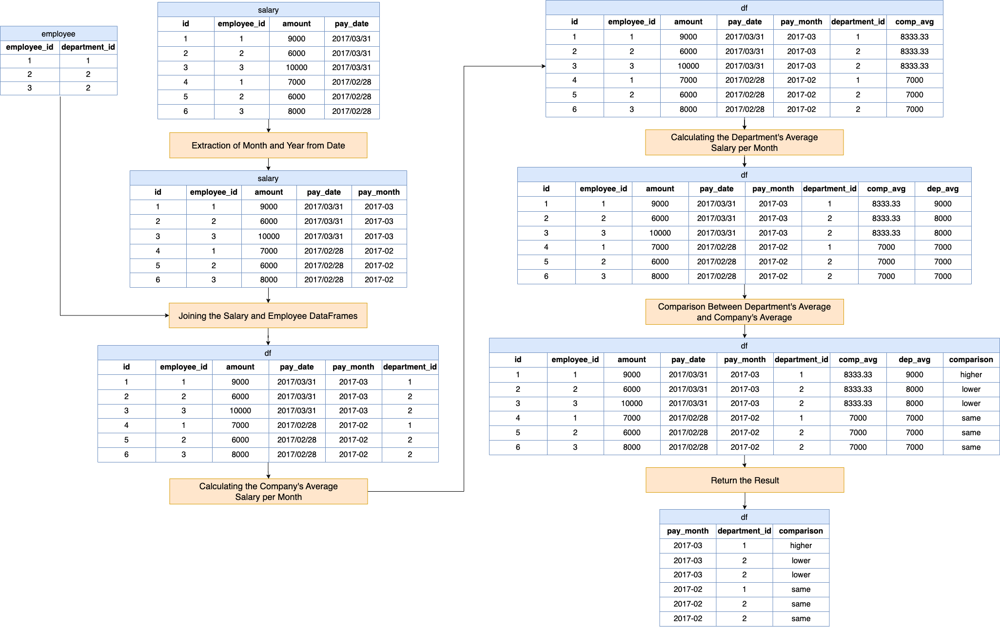

# Solution

---

## pandas

### Approach: Monthly Departmental Salary Comparison with Company Average

This approach begins by standardizing the data evaluation on a monthly timeframe to ensure uniformity in comparisons. Next, by integrating company-wide salary data with individual departmental salary details, a comprehensive picture of the salary distribution emerges. This paves the way to set a monthly company-wide salary benchmark. With this benchmark in place, the approach assesses how each department's average salary fares in relation to it. The departments are then categorized based on whether their average salary is higher, lower, or at par with the company average. Finally, the data is filtered as required by the problem, ensuring a concise monthly report of each department's performance relative to the overall company benchmark.

**Visualization of Approach**



#### Intuition

Let's review the intuition behind each step given the following input DataFrames:

Salary DataFrame (`salary`):

<table>
    <tr>
        <th>id</th>
        <th>employee_id</th>
        <th>amount</th>
        <th>pay_date</th>
    </tr>
    <tr>
        <td>1</td>
        <td>1</td>
        <td>9000</td>
        <td>2017/03/31</td>
    </tr>
    <tr>
        <td>2</td>
        <td>2</td>
        <td>6000</td>
        <td>2017/03/31</td>
    </tr>
    <tr>
        <td>3</td>
        <td>3</td>
        <td>10000</td>
        <td>2017/03/31</td>
    </tr>
    <tr>
        <td>4</td>
        <td>1</td>
        <td>7000</td>
        <td>2017/02/28</td>
    </tr>
    <tr>
        <td>5</td>
        <td>2</td>
        <td>6000</td>
        <td>2017/02/28</td>
    </tr>
    <tr>
        <td>6</td>
        <td>3</td>
        <td>8000</td>
        <td>2017/02/28</td>
    </tr>
</table>
<br>

Employee DataFrame (`employee`):

<table>
    <tr>
        <th>employee_id</th>
        <th>department_id</th>
    </tr>
    <tr>
        <td>1</td>
        <td>1</td>
    </tr>
    <tr>
        <td>2</td>
        <td>2</td>
    </tr>
    <tr>
        <td>3</td>
        <td>2</td>
    </tr>
</table>
<br>

1. **Extraction of Month and Year from Date**

    We need to group the salaries based on the month to calculate average salaries per month. By extracting the month and year from the full date, we can aggregate data at the month-level later in the process.

    ```python
    salary["pay_month"] = salary["pay_date"].dt.strftime("%Y-%m")
    ```

    The `dt.strftime("%Y-%m")` is used to format the date into a year-month format. This allows for aggregation based on the month and year, as required.

<table>
    <tr>
        <th>id</th>
        <th>employee_id</th>
        <th>amount</th>
        <th>pay_date</th>
        <th>pay_month</th>
    </tr>
    <tr>
        <td>1</td>
        <td>1</td>
        <td>9000</td>
        <td>2017/03/31</td>
        <td>2017-03</td>
    </tr>
    <tr>
        <td>2</td>
        <td>2</td>
        <td>6000</td>
        <td>2017/03/31</td>
        <td>2017-03</td>
    </tr>
    <tr>
        <td>3</td>
        <td>3</td>
        <td>10000</td>
        <td>2017/03/31</td>
        <td>2017-03</td>
    </tr>
    <tr>
        <td>4</td>
        <td>1</td>
        <td>7000</td>
        <td>2017/02/28</td>
        <td>2017-02</td>
    </tr>
    <tr>
        <td>5</td>
        <td>2</td>
        <td>6000</td>
        <td>2017/02/28</td>
        <td>2017-02</td>
    </tr>
    <tr>
        <td>6</td>
        <td>3</td>
        <td>8000</td>
        <td>2017/02/28</td>
        <td>2017-02</td>
    </tr>
</table>
<br>

2. **Joining the Salary and Employee DataFrames**

    To get the department information for each salary entry, we need to combine the salary data with the employee data. This step ensures that every salary entry is associated with a department, enabling us to calculate average salaries by department.

    ```python
    df = salary.merge(employee, on="employee_id")
    ```

    The `merge` function is used to join the two tables (dataframes) `salary` and `employee` based on the common column $\text{employee}_{id}$. This way, we now have a combined table with both salary details and department details for each employee.

<table>
    <tr>
        <th>id</th>
        <th>employee_id</th>
        <th>amount</th>
        <th>pay_date</th>
        <th>pay_month</th>
        <th>department_id</th>
    </tr>
    <tr>
        <td>1</td>
        <td>1</td>
        <td>9000</td>
        <td>2017/03/31</td>
        <td>2017-03</td>
        <td>1</td>
    </tr>
    <tr>
        <td>2</td>
        <td>2</td>
        <td>6000</td>
        <td>2017/03/31</td>
        <td>2017-03</td>
        <td>2</td>
    </tr>
    <tr>
        <td>3</td>
        <td>3</td>
        <td>10000</td>
        <td>2017/03/31</td>
        <td>2017-03</td>
        <td>2</td>
    </tr>
    <tr>
        <td>4</td>
        <td>1</td>
        <td>7000</td>
        <td>2017/02/28</td>
        <td>2017-02</td>
        <td>1</td>
    </tr>
    <tr>
        <td>5</td>
        <td>2</td>
        <td>6000</td>
        <td>2017/02/28</td>
        <td>2017-02</td>
        <td>2</td>
    </tr>
    <tr>
        <td>6</td>
        <td>3</td>
        <td>8000</td>
        <td>2017/02/28</td>
        <td>2017-02</td>
        <td>2</td>
    </tr>
</table>
<br>

3. **Calculating the Company's Average Salary per Month**

    The core of the task is to compare departmental average salaries with the company's overall average. So, we first need the overall company average for each month, which is what this step computes.

    ```python
    df["comp_avg"] = df.groupby(["pay_month"])["amount"].transform("mean")
    ```

    The `groupby` function along with `transform("mean")` is used to compute the average monthly salary for the entire company. The result is broadcasted to a new column $\text{comp}_{avg}$, ensuring that each row has the company's average salary for that month.

<table>
    <thead>
        <tr>
            <th>...</th>
            <th>pay_month</th>
            <th>department_id</th>
            <th>comp_avg</th>
        </tr>
    </thead>
    <tbody>
        <tr>
            <td>...</td>
            <td>2017-03</td>
            <td>1</td>
            <td>8333.33</td>
        </tr>
        <tr>
            <td>...</td>
            <td>2017-03</td>
            <td>2</td>
            <td>8333.33</td>
        </tr>
        <tr>
            <td>...</td>
            <td>2017-03</td>
            <td>2</td>
            <td>8333.33</td>
        </tr>
        <tr>
            <td>...</td>
            <td>2017-02</td>
            <td>1</td>
            <td>7000</td>
        </tr>
        <tr>
            <td>...</td>
            <td>2017-02</td>
            <td>2</td>
            <td>7000</td>
        </tr>
        <tr>
            <td>...</td>
            <td>2017-02</td>
            <td>2</td>
            <td>7000</td>
        </tr>
    </tbody>
</table>
<br>

4. **Calculating the Department's Average Salary per Month**

    Similarly to the last step, we also need to compute the average salary for each department in each month.

    ```python
    df["dep_avg"] = df.groupby(["pay_month","department_id"])["amount"].transform("mean")
    ```

    Similarly, the `groupby` function is again used, but this time it groups by both the month and the $\text{department}_{id}$. This calculates the average salary for each department per month. This result is stored in the new column $\text{dep}_{avg}$.

<table>
    <tr>
        <th>...</th>
        <th>pay_month</th>
        <th>department_id</th>
        <th>comp_avg</th>
        <th>dep_avg</th>
    </tr>
    <tr>
        <td>...</td>
        <td>2017-03</td>
        <td>1</td>
        <td>8333.33</td>
        <td>9000</td>
    </tr>
    <tr>
        <td>...</td>
        <td>2017-03</td>
        <td>2</td>
        <td>8333.33</td>
        <td>8000</td>
    </tr>
    <tr>
        <td>...</td>
        <td>2017-03</td>
        <td>2</td>
        <td>8333.33</td>
        <td>8000</td>
    </tr>
    <tr>
        <td>...</td>
        <td>2017-02</td>
        <td>1</td>
        <td>7000</td>
        <td>7000</td>
    </tr>
    <tr>
        <td>...</td>
        <td>2017-02</td>
        <td>2</td>
        <td>7000</td>
        <td>7000</td>
    </tr>
    <tr>
        <td>...</td>
        <td>2017-02</td>
        <td>2</td>
        <td>7000</td>
        <td>7000</td>
    </tr>
</table>
<br>

5. **Comparison Between Department's Average and Company's Average**

    This is the crux of our analysis. Now that we have both the company's average and the department's average for each month, we need to compare them to determine if a department is earning "higher", "lower", or the "same" as the company average. This comparison gives us the insights we're seeking.

    ```python
    df["comparison"] = df.apply(
        lambda row: "lower" if row["dep_avg"] < row["comp_avg"]
            else ("higher" if row["dep_avg"] > row["comp_avg"] else "same"),
        axis=1
    )
    ```

    A lambda function is applied to compare the department's average ($\text{dep}_{avg}$) with the company's average ($\text{comp}_{avg}$) on each row. If the department's average is less, it is tagged as "lower". If the department's average is more, it is tagged as "higher". Otherwise, it's tagged as "same".

<table>
    <thead>
        <tr>
            <th>...</th>
            <th>pay_month</th>
            <th>department_id</th>
            <th>comp_avg</th>
            <th>dep_avg</th>
            <th>comparison</th>
        </tr>
    </thead>
    <tbody>
        <tr>
            <td>...</td>
            <td>2017-03</td>
            <td>1</td>
            <td>8333.33</td>
            <td>9000</td>
            <td>higher</td>
        </tr>
        <tr>
            <td>...</td>
            <td>2017-03</td>
            <td>2</td>
            <td>8333.33</td>
            <td>8000</td>
            <td>lower</td>
        </tr>
        <tr>
            <td>...</td>
            <td>2017-03</td>
            <td>2</td>
            <td>8333.33</td>
            <td>8000</td>
            <td>lower</td>
        </tr>
        <tr>
            <td>...</td>
            <td>2017-02</td>
            <td>1</td>
            <td>7000</td>
            <td>7000</td>
            <td>same</td>
        </tr>
        <tr>
            <td>...</td>
            <td>2017-02</td>
            <td>2</td>
            <td>7000</td>
            <td>7000</td>
            <td>same</td>
        </tr>
        <tr>
            <td>...</td>
            <td>2017-02</td>
            <td>2</td>
            <td>7000</td>
            <td>7000</td>
            <td>same</td>
        </tr>
    </tbody>
</table>
<br>

6. **Return the Result**

    Our DataFrame at this point contains detailed data, with multiple rows potentially reflecting the same monthly comparison for a given department (since there are multiple employees in a department). We only need a concise summary. So, we select the relevant columns and drop any duplicate rows to give a unique comparison for each department for each month.

    ```python
    return df[["pay_month", "department_id", "comparison"]].drop_duplicates()
    ```

    This final step selects only the relevant columns ($\text{pay}_{month}$, $\text{department}_{id}$, and `comparison`) from the dataframe. The $\text{drop}_{duplicates}()$ function is applied to ensure that the result doesn't have any repeated rows.

<table>
    <tr>
        <th>pay_month</th>
        <th>department_id</th>
        <th>comparison</th>
    </tr>
    <tr>
        <td>2017-03</td>
        <td>1</td>
        <td>higher</td>
    </tr>
    <tr>
        <td>2017-03</td>
        <td>2</td>
        <td>lower</td>
    </tr>
    <tr>
        <td>2017-02</td>
        <td>1</td>
        <td>same</td>
    </tr>
    <tr>
        <td>2017-02</td>
        <td>2</td>
        <td>same</td>
    </tr>
</table>
<br>

#### Implementation

```python
import pandas as pd

def average_salary(salary: pd.DataFrame, employee: pd.DataFrame) -> pd.DataFrame:
    salary["pay_month"] = salary["pay_date"].dt.strftime("%Y-%m")
    df = salary.merge(employee, on="employee_id")
    df["comp_avg"] = df.groupby(["pay_month"])["amount"].transform("mean")
    df["dep_avg"] = df.groupby(["pay_month", "department_id"])["amount"].transform(
        "mean"
    )
    df["comparison"] = df.apply(
        lambda row: "lower" if row["dep_avg"] < row["comp_avg"]
            else ("higher" if row["dep_avg"] > row["comp_avg"] else "same"),
        axis=1
    )
    return df[["pay_month", "department_id", "comparison"]].drop_duplicates()

```

---

## Database

### Approach: Using `avg()` and `case...when...`

#### Intuition

Solve this problem by 3 steps as below.

**Algorithm**

1.Calculate the company's average salary in every month
MySQL has the built-in function avg() to get the average of a list of numbers. Also, we need to format the *pay_date* column for future use.

```sql
SELECT
  AVG(amount) AS company_avg,
  DATE_FORMAT(pay_date, '%Y-%m') AS pay_month
FROM
  salary
GROUP BY
  DATE_FORMAT(pay_date, '%Y-%m');
```

| company_avg | pay_month |
|-------------|-----------|
| 7000.0000   | 2017-02   |
| 8333.3333   | 2017-03   |

2.Calculate the each department's average salary in every month
To do this, we need to join the **salary** table with the **employee** table using condition $salary.\text{employee}_{id} = \text{employee.id}$.

```sql
SELECT
  department_id,
  AVG(amount) AS department_avg,
  DATE_FORMAT(pay_date, '%Y-%m') AS pay_month
FROM
  salary
  JOIN employee ON salary.employee_id = employee.employee_id
GROUP BY
  department_id,
  pay_month;
```

| department_id | department_avg | pay_month |
|---------------|----------------|-----------|
| 1             | 7000.0000      | 2017-02   |
| 1             | 9000.0000      | 2017-03   |
| 2             | 7000.0000      | 2017-02   |
| 2             | 8000.0000      | 2017-03   |

3.Compare the previous numbers and display the result
This step might be the hardest if you have no idea on how to use MySQL flow control statement [`case...when...`](https://dev.mysql.com/doc/refman/5.7/en/case.html).

MySQL, like other programming languages, also has its flow control. Click [this link](https://dev.mysql.com/doc/refman/5.7/en/flow-control-statements.html) to learn it.

At last, combine the above two query and join them $on \text{department}_{salary}.\text{pay}_{month} = \text{company}_{salary}.\text{pay}_{month}$.

#### Implementation

**MySQL**

```sql
SELECT
  department_salary.pay_month,
  department_id,
  CASE
    WHEN department_avg > company_avg THEN 'higher'
    WHEN department_avg < company_avg THEN 'lower'
    ELSE 'same'
  END AS comparison
FROM
  (
    SELECT
      department_id,
      AVG(amount) AS department_avg,
      DATE_FORMAT(pay_date, '%Y-%m') AS pay_month
    FROM
      salary
      JOIN employee ON salary.employee_id = employee.employee_id
    GROUP BY
      department_id,
      pay_month
  ) AS department_salary
  JOIN (
    SELECT
      AVG(amount) AS company_avg,
      DATE_FORMAT(pay_date, '%Y-%m') AS pay_month
    FROM
      salary
    GROUP BY
      DATE_FORMAT(pay_date, '%Y-%m')
  ) AS company_salary ON department_salary.pay_month = company_salary.pay_month;
```