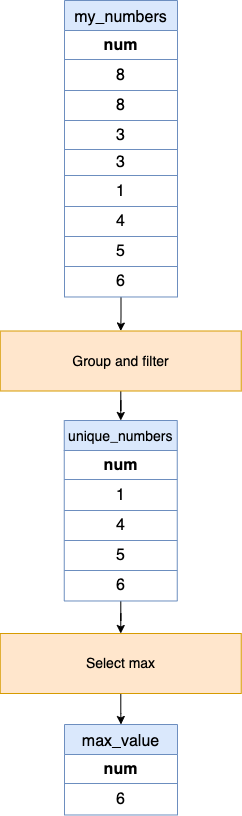

[TOC]

# Solution
---

## pandas
### Approach 1: Filter and Max



#### Intuition

**Input**:
<table>
    <tr>
        <th>num</th>
    </tr>
    <tr>
        <td>8</td>
    </tr>
    <tr>
        <td>8</td>
    </tr>
    <tr>
        <td>3</td>
    </tr>
    <tr>
        <td>3</td>
    </tr>
    <tr>
        <td>1</td>
    </tr>
    <tr>
        <td>4</td>
    </tr>
    <tr>
        <td>5</td>
    </tr>
    <tr>
        <td>6</td>
    </tr>
</table>
<br>

**Step 1: Identify the numbers that appear only once in the table.**

One way to determine the frequency of each number is by using the `groupby` method, which groups the numbers together, and the length of each group corresponds to the number of times that particular number appears. Then, we utilize the `filter` method to retain groups with a length of 1, indicating numbers that have appeared only once.

```python
unique_numbers = my_numbers.groupby('num').filter(lambda x: len(x) == 1)
```

If we count the occurrences of each number:

 - The number 8 appears 2 times.
 - The number 3 appears 2 times.
 - The number 1 appears 1 time.
 - The number 4 appears 1 time.
 - The number 5 appears 1 time.
 - The number 6 appears 1 time.

From the above count, the numbers 1, 4, 5, and 6 appear only once.

**Step 2: Select the maximum number from the numbers identified in step 1.**

```python
max_value = unique_numbers['num'].max()
```

From our list of numbers that appear only once (1, 4, 5, 6), the number 6 is the highest.

#### Implementation

```python
import pandas as pd

def biggest_single_number(my_numbers: pd.DataFrame) -> pd.DataFrame:
    # 1. Filter numbers that appear only once
    unique_numbers = my_numbers.groupby('num').filter(lambda x: len(x) == 1)

    # 2. Find the maximum of those numbers
    max_value = unique_numbers['num'].max()

    return pd.DataFrame({'num': [max_value]})

```

## Database

### Approach 1: Using **subquery** and `MAX()` function [Accepted]

#### Intuition

Use subquery to select all the numbers appearing just one time.

```sql
SELECT
    num
FROM
    MyNumbers
GROUP BY num
HAVING COUNT(num) = 1;
```

Then choose the biggest one using `MAX()`.

```sql
SELECT
    MAX(num) AS num
FROM
    (SELECT
        num
    FROM
        MyNumbers
    GROUP BY num
    HAVING COUNT(num) = 1) AS t;
```

#### Implementation

```sql
SELECT
    MAX(num) AS num
FROM
    (SELECT
        num
    FROM
        MyNumbers
    GROUP BY num
    HAVING COUNT(num) = 1) AS t;
```