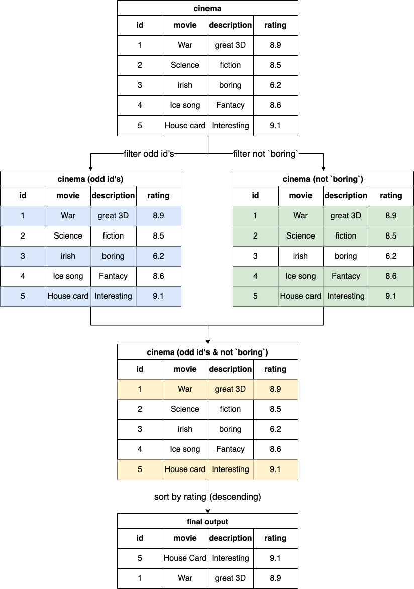

[TOC]

# Solution

---

## pandas

### Approach 1: Filtering and Sorting

#### Intuition



The objective of the function is to filter and sort movies based on specific criteria.

1. **Selecting Odd Movie IDs:** The cinema might have a sequential system of assigning unique identifiers (IDs) to movies. By checking if a movie's ID is odd, we are effectively filtering for every alternate movie starting from the first one. This could be useful for scenarios where, for instance, alternate movies are to be considered for a particular kind of analysis or representation.
```python
cinema['id'] % 2 == 1
```

2. **Excluding Movies with 'boring' Descriptions:** The cinema might categorize or tag movies with a description. By filtering out movies that have a 'boring' description, we are focusing on movies that potentially have more engaging, thrilling, or intriguing content.
```python
cinema['description'] != 'boring'
```

3. **Sorting by Rating:** After filtering, it's intuitive to sort movies by their ratings so that the most critically acclaimed or popular movies appear first. Sorting in descending order by rating ensures that the highest-rated movies are at the top.
```python
sort_values(by='rating', ascending=False)
```

#### Implementation

```python
import pandas as pd

def not_boring_movies(cinema: pd.DataFrame) -> pd.DataFrame:
    return cinema[
        (cinema['id'] % 2 == 1) &
        (cinema['description'] != 'boring')
    ].sort_values(by='rating', ascending=False)

```

## Database

### Approach 1: Using `MOD()` function [Accepted]

#### Intuition
We can use the `mod(id,2)=1` to determine the odd id, and then add a $description \neq 'boring'$ should address this problem.

#### Implementation

```sql
select *
from cinema
where mod(id, 2) = 1 and description != 'boring'
order by rating DESC
;
```