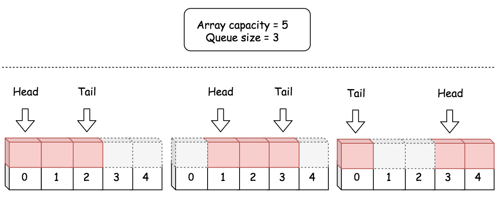
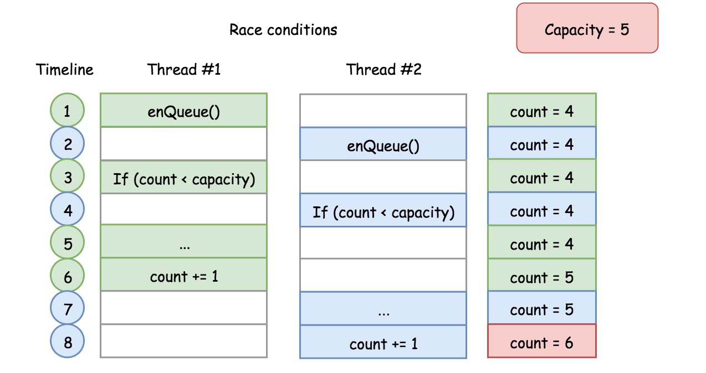
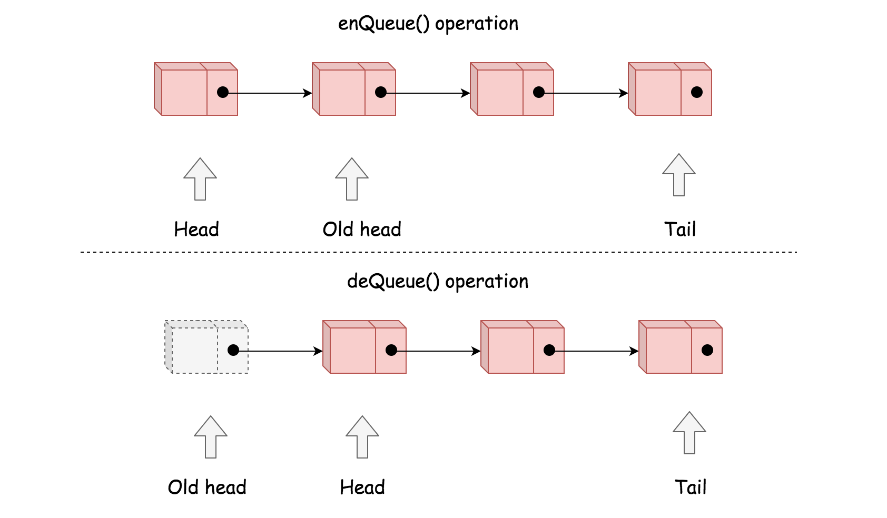

## Solution

---

### Approach 1: Array

**Intuition**

Based on the description of the problem, an intuitive data structure that meets all the requirements would be a **_ring_** where the head and the tail are adjacent to each other.

However, there does not exist a ring data structure in any programming language. A similar data structure at our disposal is the one called **_Array_** which is a collection of elements that reside continuously in one dimensional space.

The essence of many design problems, is how one can build more advanced data structures with the basic building blocks such as an array.

>In this case, to build a circular queue, we could form a _virtual_ ring structure with the array, via the manipulation of index.

Given a fixed size array, any of the elements could be considered as a head in a queue. As long as we know the length of the queue, we then can instantly locate its tail, based on the following formula:

$\text{tailIndex} = (\text{headIndex} + \text{count} - 1) \mod \text{capacity}$

where the variable `capacity` is the size of the array, the `count` is the length of the queue and the `headIndex` and `tailIndex` are the indices of head and tail elements respectively in the array. Here we showcase a few examples how a circular queue could reside in a fixed size array.



**Algorithm**

The procedure to design a data structure lies essentially on how we design the _attributes_ within the data structure.

One of the traits of a good design is to have as less attributes as possible, which arguably could bring several benefits.

- Less attributes usually implies little or no redundancy among the attributes.
<br/>
- The less redundant the attributes are, the simpler the manipulation logic, which eventually could be less error-prone.
</br>
- Less attributes also requires less space and therefore it could also bring efficiency to the runtime performance.

_However, it is not advisable to seek for the minimum set of attributes._ Sometimes, a bit of redundancy could help with the time complexity. After all, like many other problems, we are trying to strike a balance between the space and the time.

Following the above principles, here we give a list of attributes and the thoughts behind each attribute.

- `queue`: a fixed size array to hold the elements for the circular queue.
</br>
- `headIndex`: an integer which indicates the current head element in the circular queue.
</br>
- `count`: the current length of the circular queue, _i.e._ the number of elements in the circular queue. Together with the `headIndex`, we could locate the current tail element in the circular queue, based on the formula we gave previously. Therefore, we choose not to add another attribute for the index of tail.
<br/>
- `capacity`: the capacity of the circular queue, _i.e._ the maximum number of elements that can be hold in the queue. One might argument that it is not absolutely necessary to add this attribute, since we could obtain the capacity from the `queue` attribute. It is true. Yet, since we would frequently use this `capacity` in our algorithm, we choose to keep it as an attribute, instead of invoking function `len(queue)` in Python at every occasion. Though in other programming languages such as Java, it might be more efficient to omit this attribute, since it is part of the attributes (`queue.length`) in the Java array. _Note: for the sake of consistency, we keep this attribute for all implementations._

```python
class MyCircularQueue:

    def __init__(self, k: int):
        """
        Initialize your data structure here. Set the size of the queue to be k.
        """
        self.queue = [0]*k
        self.headIndex = 0
        self.count = 0
        self.capacity = k

    def enQueue(self, value: int) -> bool:
        """
        Insert an element into the circular queue. Return true if the operation is successful.
        """
        if self.count == self.capacity:
            return False
        self.queue[(self.headIndex + self.count) % self.capacity] = value
        self.count += 1
        return True

    def deQueue(self) -> bool:
        """
        Delete an element from the circular queue. Return true if the operation is successful.
        """
        if self.count == 0:
            return False
        self.headIndex = (self.headIndex + 1) % self.capacity
        self.count -= 1
        return True

    def Front(self) -> int:
        """
        Get the front item from the queue.
        """
        if self.count == 0:
            return -1
        return self.queue[self.headIndex]

    def Rear(self) -> int:
        """
        Get the last item from the queue.
        """
        # empty queue
        if self.count == 0:
            return -1
        return self.queue[(self.headIndex + self.count - 1) % self.capacity]

    def isEmpty(self) -> bool:
        """
        Checks whether the circular queue is empty or not.
        """
        return self.count == 0

    def isFull(self) -> bool:
        """
        Checks whether the circular queue is full or not.
        """
        return self.count == self.capacity
```

**Complexity**

- Time complexity: $\mathcal{O}(1)$. All of the methods in our circular data structure is of constant time complexity.
<br/>
- Space Complexity: $\mathcal{O}(N)$. The overall space complexity of the data structure is linear, where $N$ is the pre-assigned capacity of the queue. _However, it is worth mentioning that the memory consumption of the data structure remains as its pre-assigned capacity during its entire life cycle._

**Improvement: Thread-Safe**

One might be happy with the above implementation, after all it meets all the requirements of the problem.

>As a followup question though, an interviewer might ask one to point out a _potential defect_ about the implementation and the solution.

This time, it is not about the space or time complexity, but **_concurrency_**. Our circular queue is NOT _thread-safe_. One could end up with _corrupting_ our data structure in a multi-threaded environment.

For example, here is an execution sequence where we exceed the designed capacity of the queue and overwrite the tail element undesirably.



The above scenario is called race conditions as described in the problem of [Print in Order](https://leetcode.com/problems/print-in-order/solution/). One can find more [concurrency problems](https://leetcode.com/problemset/concurrency/) to practice on LeetCode.

There are several ways to mitigate the above concurrency problem.
Take the function `enQueue(int value)` as an example, we show how we can make the function thread-safe in the following implementation:

```python
from threading import Lock

class MyCircularQueue:

    def __init__(self, k: int):
        """
        Initialize your data structure here. Set the size of the queue to be k.
        """
        self.queue = [0]*k
        self.headIndex = 0
        self.count = 0
        self.capacity = k
        # the additional attribute to protect the access of our queue
        self.queueLock = Lock()

    def enQueue(self, value: int) -> bool:
        """
        Insert an element into the circular queue. Return true if the operation is successful.
        """
        # automatically acquire the lock when entering the block
        with self.queueLock:
            if self.count == self.capacity:
                return False
            self.queue[(self.headIndex + self.count) % self.capacity] = value
            self.count += 1
        # automatically release the lock when leaving the block
        return True
```

With the protection of locks, we now feel more confident to apply our circular queue in critical scenarios.

The above improvement does not alter the time and space complexity of the original data structure, though overall the thread-safe measures do incur some extra costs.
<br/>
<br/>

---

### Approach 2: Singly-Linked List

**Intuition**

Similar to array, the _Linked List_ is another common building block for more advanced data structures.

>Different than a fixed size array, a linked list could be more memory efficient, since it does not pre-allocate memory for unused capacity.

With a singly-linked list, we could design a circular queue with the same time and space complexity as the array approach. But we could gain some memory efficiency, since we don't need to pre-allocate the memory upfront.

In the following graph, we show how the operations of `enQueue()` and `deQueue()` can be done via singly-linked list.



**Algorithm**

Here we give a list of attributes in our circular queue data structure and the thoughts behind each attribute.

- `capacity`: the maximum number of elements that the circular queue will hold.
<br/>
- `head`: the reference to the head element in the queue.
</br>
- `count`: the current length of the queue. This is a critical attribute that helps us to do the boundary check in each method.
<br/>
- `tail`: the reference to the tail element in the queue. Unlike the array approach, we need to explicitly keep the reference to the tail element. Without this attribute, it would take us $\mathcal{O}(N)$ time complexity to locate the tail element from the head element.
</br>

```python
class Node:
    def __init__(self, value, nextNode=None):
        self.value = value
        self.next = nextNode

class MyCircularQueue:

    def __init__(self, k: int):
        """
        Initialize your data structure here. Set the size of the queue to be k.
        """
        self.capacity = k
        self.head = None
        self.tail = None
        self.count = 0

    def enQueue(self, value: int) -> bool:
        """
        Insert an element into the circular queue. Return true if the operation is successful.
        """
        if self.count == self.capacity:
            return False

        if self.count == 0:
            self.head = Node(value)
            self.tail = self.head
        else:
            newNode = Node(value)
            self.tail.next = newNode
            self.tail = newNode
        self.count += 1
        return True

    def deQueue(self) -> bool:
        """
        Delete an element from the circular queue. Return true if the operation is successful.
        """
        if self.count == 0:
            return False
        self.head = self.head.next
        self.count -= 1
        return True

    def Front(self) -> int:
        """
        Get the front item from the queue.
        """
        if self.count == 0:
            return -1
        return self.head.value

    def Rear(self) -> int:
        """
        Get the last item from the queue.
        """
        # empty queue
        if self.count == 0:
            return -1
        return self.tail.value

    def isEmpty(self) -> bool:
        """
        Checks whether the circular queue is empty or not.
        """
        return self.count == 0

    def isFull(self) -> bool:
        """
        Checks whether the circular queue is full or not.
        """
        return self.count == self.capacity
```

**Complexity**

- Time complexity: $\mathcal{O}(1)$ for each method in our circular queue.
<br/>
- Space Complexity: The upper bound of the memory consumption for our circular queue would be $\mathcal{O}(N)$, same as the array approach. However, it should be more memory efficient as we discussed in the intuition section.
<br/>
<br/>