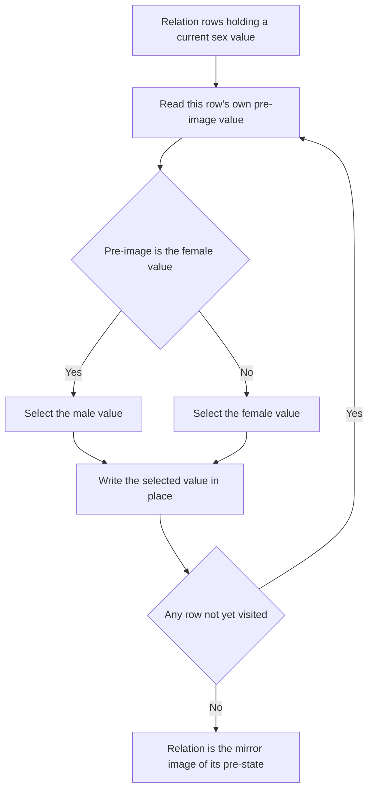

# Guided Example: Swap Sex of Employees

We trace one payroll relation through the single-statement rewrite the contract demands, and show precisely why the obvious two-step sequence destroys the very data it is meant to invert.

**Representative instance (the official sample).** The `Salary` relation holds four employee rows, with `id` as the primary key:

| `id` | `name` | `sex` | `salary` |
|:---:|:---:|:---:|:---:|
| $1$ | `A` | `m` | $2500$ |
| $2$ | `B` | `f` | $1500$ |
| $3$ | `C` | `m` | $5500$ |
| $4$ | `D` | `f` | $500$ |

**Required outcome.** Every `sex` value inverted, with `id`, `name`, and `salary` preserved exactly:

| `id` | `name` | `sex` | `salary` |
|:---:|:---:|:---:|:---:|
| $1$ | `A` | `f` | $2500$ |
| $2$ | `B` | `m` | $1500$ |
| $3$ | `C` | `f` | $5500$ |
| $4$ | `D` | `m` | $500$ |

The statement adds two operational requirements that decide the shape of the reasoning: the whole change must be carried out by **one** update statement, and no intermediate temporary table may hold a copy of the data. Naming relational operations is enough here — the lesson is about *when* each row's new value is read, not about the syntax that reads it. The concrete statement belongs to the Reference workflow.

---

## 1. The Binary Domain and the Involution Target

The `sex` attribute draws its values from the two-element category domain

$$
D = \{\,\texttt{'m'},\ \texttt{'f'}\,\},
$$

and the required transformation is the total map

$$
\sigma(x) =
\begin{cases}
\texttt{'f'}, & x = \texttt{'m'},\\[2pt]
\texttt{'m'}, & x = \texttt{'f'}.
\end{cases}
$$

Four structural properties of $\sigma$ drive every later argument:

| Property | Formal statement | Consequence for this instance |
|:---|:---|:---|
| Total on the domain | $\forall x \in D,\ \sigma(x)$ is defined | No row needs a special branch, and no `NULL` case exists |
| No fixed point | $\forall x \in D,\ \sigma(x) \ne x$ | Every row must actually change; leaving a row untouched is an error |
| Bijective (a permutation of $D$) | $\sigma$ restricted to $D$ is one-to-one and onto | The post-state stays inside the declared category domain |
| Involution | $\sigma(\sigma(x)) = x$ for both values of $x$ | Applying the whole rewrite twice restores the original relation exactly |

The involution identity is easy to verify: the map exchanges the two elements, so exchanging twice returns each element to its home. It is also a useful self-check, because it means the correct post-state must be a *perfect mirror* of the pre-state rather than a one-directional push.

---

## 2. Why Two Sequential Rewrites Collapse the Relation

The tempting decomposition is two filtered passes: first turn every `'f'` into `'m'`, then turn every `'m'` into `'f'`. Trace it row by row on the instance.

| `id` | Pre-state | After pass 1: `'f'` becomes `'m'` | After pass 2: `'m'` becomes `'f'` | Required post-state |
|:---:|:---:|:---:|:---:|:---:|
| $1$ | `'m'` | `'m'` (untouched) | `'f'` | `'f'` |
| $2$ | `'f'` | `'m'` | `'f'` | `'m'` |
| $3$ | `'m'` | `'m'` (untouched) | `'f'` | `'f'` |
| $4$ | `'f'` | `'m'` | `'f'` | `'m'` |

Pass 1 is a constant assignment on a *subset* of the rows, and pass 2 is a different constant assignment on a *different* subset. Their composition is therefore not $\sigma \circ \sigma$. Writing $R_m$ for the rows whose pre-state is `'m'` and $R_f$ for those whose pre-state is `'f'`, pass 1 erases the distinction between $R_m$ and $R_f$ by mapping both parts onto the same value:

$$
R_m \xrightarrow{\ \text{pass 1}\ } R_m, \qquad R_f \xrightarrow{\ \text{pass 1}\ } R_m,
\qquad\text{so } R \xrightarrow{\ \text{pass 1}\ } R_m \text{ entirely.}
$$

Once pass 1 has finished, the table retains no trace of which rows originally held `'f'`. Pass 2 then sees a uniform table and writes the same value everywhere. The information needed to reconstruct the original split has been overwritten — this is a lost-update / stale-read hazard across statements, not an arithmetic mistake.

> **Observation.** Both passes are $\Theta(N)$ and individually correct as partial rewrites; the failure is compositional. Cost is not the issue; the loss of the pre-image is.

---

## 3. The Simultaneous Substitution Invariant

The single-statement formulation expresses the whole permutation at once: the assignment target is a *piecewise expression* over the row's own `sex`, and the engine evaluates that expression against each row's **pre-image** — the value that row held before the statement's writes became visible to the statement itself.

$$
sex \longleftarrow \sigma(sex)
$$

Three facts make this a simultaneous substitution rather than a cascade:

1. **Read-your-own-old-value.** A row's new value depends only on that row's value at the start of the statement, never on a value the same statement has already written.
2. **No cross-row contamination.** No row can observe another row's new value, so the order in which the engine happens to visit pages cannot matter.
3. **Domain closure.** The piecewise branch returns only `'m'` or `'f'`, so the result is a valid category value for every row.

> **Invariant (pre-image evaluation).** For every row $r$, the value written by the statement is $\sigma\bigl(sex_{\text{before}}(r)\bigr)$. The statement never reads $sex_{\text{after}}$ of any row. Consequently the state transition is the simultaneous map $R' = \sigma(R)$, i.e. the *parallel* application of $\sigma$ to every row.

This is the same guarantee that lets a single statement exchange two values safely: as long as each new value is derived from the pre-image of its own row, one pass can realise a permutation of the domain. No staging value, no sentinel, and no second relation are required.

---

## 4. Row-by-Row Evaluation Trace

We now execute the instance under the invariant. "Test" is the branch condition of the piecewise map, i.e. whether the pre-image equals `'f'`.

| `id` | Pre-image $sex$ | Test $sex = \texttt{'f'}$ | Branch taken | Value written | Post-image $sex$ |
|:---:|:---:|:---:|:---:|:---:|:---:|
| $1$ | `'m'` | False | fall-through branch | `'f'` | `'f'` |
| $2$ | `'f'` | True | primary branch | `'m'` | `'m'` |
| $3$ | `'m'` | False | fall-through branch | `'f'` | `'f'` |
| $4$ | `'f'` | True | primary branch | `'m'` | `'m'` |

Two global quantities are untouched by the pass:

- **Schema.** The updated relation exposes the same four attributes in the same order: `id`, `name`, `sex`, `salary`.
- **Cardinality.** No row is inserted, deleted, or duplicated, so $\lvert R' \rvert = \lvert R \rvert = 4$. In the sample grids of this family of problems the comparison rows are displayed in ascending `id` order (for example the unsorted $\{9, 2, 5\}$ input is presented as $2, 5, 9$); that ordering is a presentation convention of the result grid, not part of the transformation.

---

## 5. Correctness of the Single-Pass Rewrite

The rows of $R$ partition into two disjoint, exhaustive parts:

$$
R_m = \{\, r \in R : sex_{\text{before}}(r) = \texttt{'m'} \,\}, \qquad
R_f = \{\, r \in R : sex_{\text{before}}(r) = \texttt{'f'} \,\}, \qquad
R = R_m \uplus R_f .
$$

**Soundness.** For $r \in R_m$ the test is false, so the written value is `'f'` $= \sigma(\texttt{'m'})$; for $r \in R_f$ the test is true, so the written value is `'m'` $= \sigma(\texttt{'f'})$. Every written value therefore equals $\sigma$ applied to that row's pre-image, and every written value lies in $D$. The result relation contains no illegitimate category value and no accidental same-value row.

**Completeness.** The statement carries no filtering predicate, so every row of $R$ is visited exactly once and rewritten. Since $\sigma$ has no fixed point, no row can be skipped while still looking correct: a skipped row would keep its pre-image and immediately violate the mirror requirement. Because the two parts are exhaustive, every row — in either original state — receives its inverted value.

**Involution corollary.** Writing $R' = \sigma(R)$ and applying the same statement again gives $R'' = \sigma(R') = \sigma(\sigma(R)) = R$. The rewrite is its own inverse, which confirms that the map is a permutation of the relation and not a lossy edit.

The contrast with the two-pass failure is now sharp: the single statement realises the *parallel* map $\sigma$ on the whole relation, whereas the two-pass version realises the composition of two *partial constant* maps, which is not $\sigma^2$.

---

## 6. Boundary Behaviour and Alternative Encodings

The decisive boundary conditions all follow from the domain partition above.

| Scenario | Input pattern | Behaviour | Trap it exposes |
|:---|:---|:---|:---|
| All rows male | `sex = 'm'` on every row | Every row becomes `'f'`; the fall-through branch fires everywhere | Assuming both branches must fire |
| All rows female | `sex = 'f'` on every row | Every row becomes `'m'` | Symmetric case; same argument |
| Singleton relation | One row only | That row is inverted; no inter-row interaction exists | Reasoning that "swapping needs a partner row" |
| Empty relation | $R = \varnothing$ | Zero rows visited; the result is the empty relation, which satisfies the mirror requirement vacuously | Reporting a `NULL` or an error instead of an empty relation |
| Rows share other attributes | Three rows with `name = 'Same'`, `salary = 100` | Only `sex` changes; the duplicated non-key fields stay identical | De-duplicating rows that merely look alike |
| Duplicate stored rows | Identical rows repeated | Each physical row is inverted independently | Treating the relation as a set and collapsing duplicates |

Alternative realisations of the same permutation, and why the explicit conditional is the one to keep:

| Alternative | Mechanism | Tradeoff |
|:---|:---|:---|
| **Two filtered statements** | Rewrite `'f'`-rows, then `'m'`-rows | Rejected: the composition collapses every row to one value (§2) |
| **Sentinel staging (three statements)** | Move `'f'`-rows to a third value, then `'m'` to `'f'`, then the sentinel to `'m'` | Rejected: violates the single-statement and no-temporary-table requirements, and needs a value outside the declared domain |
| **Character-code complement** | `'f'` and `'m'` have codes $102$ and $109$, whose sum is $211$; assigning $211 - \operatorname{code}(sex)$ swaps them | Valid, but it depends on a character encoding instead of the declared category and is far less self-documenting |
| **Explicit piecewise conditional** | One statement whose assignment target is the two-branch map $\sigma$ | Chosen: states the permutation directly, stays inside the declared domain, needs no staging state |

Cost is not the deciding factor among these options — both the correct and the broken versions scan the table once — so the selection is driven entirely by which formulation preserves the pre-image.

---

## 7. Complexity Derivation

Let $N = \lvert R \rvert$ be the number of rows in `Salary`.

**Time.** The statement makes exactly one pass over the relation, and each row requires one comparison plus one constant-size branch selection and write. With $T_{\text{row}} = \Theta(1)$:

$$
T(N) = \sum_{r \in R} \Theta(1) = \Theta(N).
$$

There is no search phase, no grouping, no sort, and no repeated scan, so no logarithmic or quadratic term appears. A single clustered-index sweep is enough; the sample-sized relation finishes in well under a millisecond, and a relation of $10^6$ rows is still a single linear pass.

**Auxiliary space.** Each row's new value is computed from that row's own pre-image, so the algorithm holds no auxiliary collection — no set of identifiers, no mapping table, and no staging relation. The logical auxiliary space is therefore

$$
S(N) = \Theta(1).
$$

The writes are in place at the logical level. A particular engine may buffer modified pages or use copy-on-write for its physical storage, which is a constant factor per page, but the *method* requires no additional logical state proportional to $N$.

**Contrast.** The two-pass version also runs in $\Theta(N)$ time and $\Theta(1)$ logical space; it is simply incorrect. This instance therefore teaches a correctness distinction rather than a performance one — the single-statement pre-image rule is what makes a permutation realisable without intermediate storage.