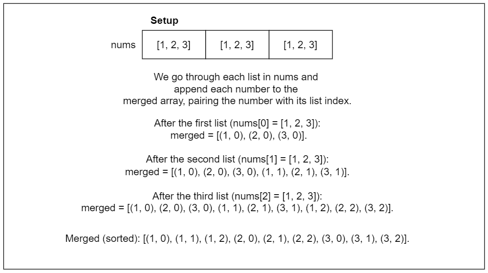
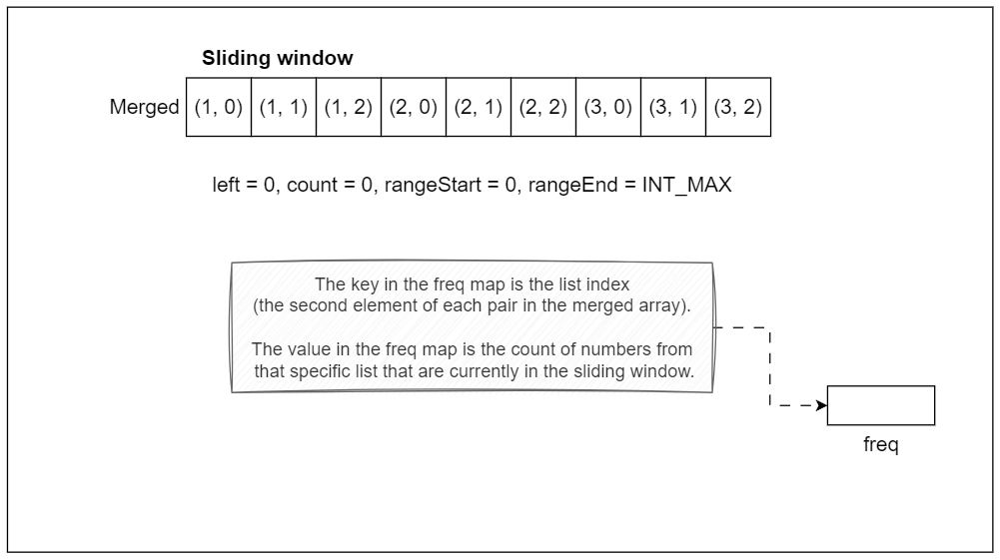
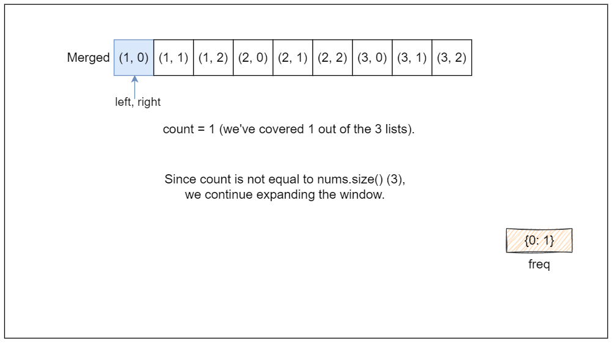
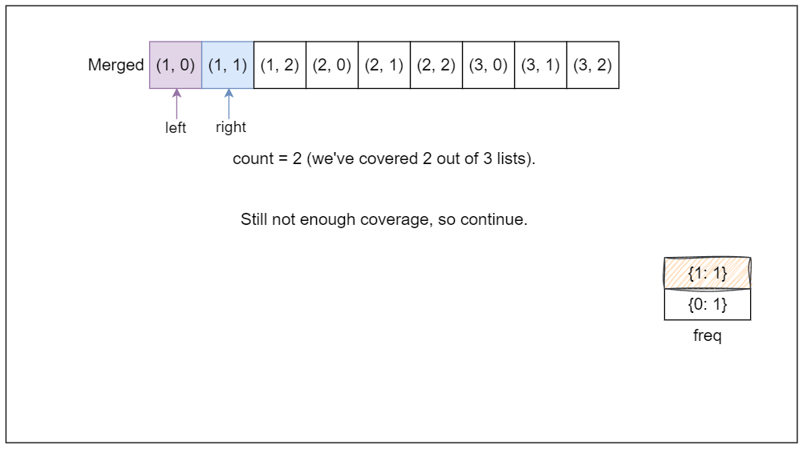
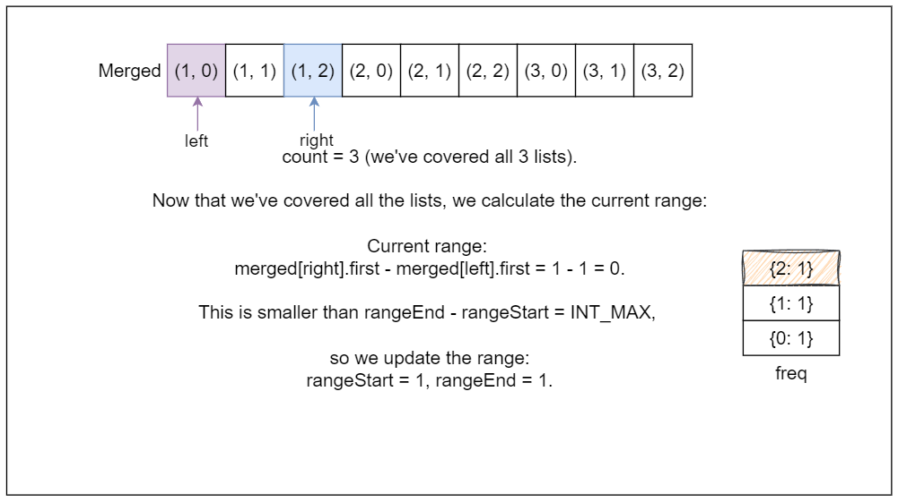
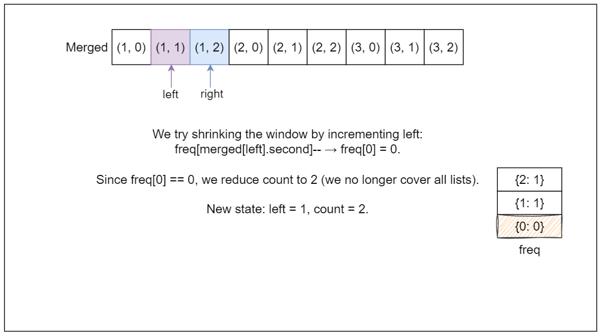
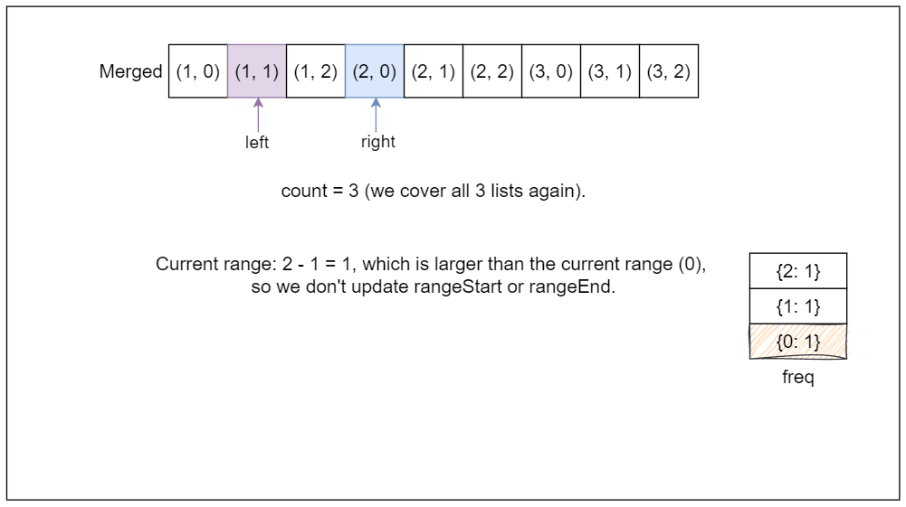
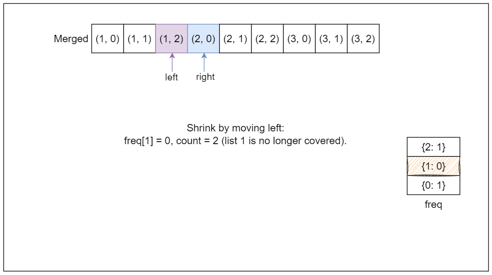
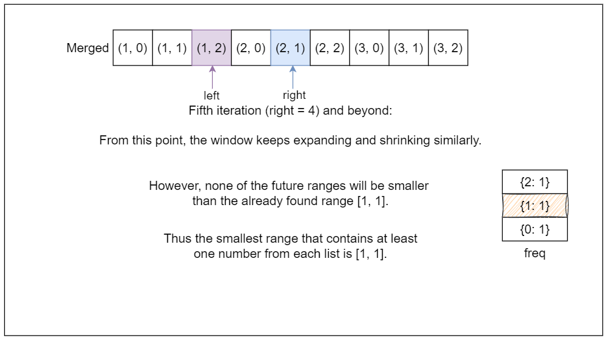

[TOC]

## Solution

---

### Overview

We have several lists of sorted integers, and the goal is to find the smallest range that includes at least one number from each list. The range should be as tight as possible, meaning the difference between the smallest and largest number in the range should be minimal.

We need to compare the two ranges by looking at their lengths first. If two ranges have the same size, we choose the one that starts earlier.

For example, given the lists:

- List 1: `[4, 10, 15, 24, 26]`
- List 2: `[0, 9, 12, 20]`
- List 3: `[5, 18, 22, 30]`

The smallest range that includes at least one number from each list is `[20, 24]`.

This range works because it contains `24` from List 1, `20` from List 2, and `22` from List 3.

Remember, the key is that each list is already sorted. We can approach the problem by maintaining a structure that includes one number from each list and using something to track the smallest elements across the lists, adjusting the answer as we explore larger numbers.

---

### Approach 1: Optimal Brute Force

#### Intuition

We need to find the smallest range that contains at least one number from each of the `k` sorted lists. At first glance, a simple brute force solution comes to mind, i.e., checking every combination of elements from the lists to find the smallest range. However, that would involve too many comparisons and will lead to TLE. Instead, we can refine this process into something more manageable.

At any moment, we need to select one number from each list. So, to find the smallest range, we need to minimize the difference between the largest and smallest numbers chosen at each step. The important point here is that, at any time, our range is defined by the smallest number chosen and the largest number chosen.

So we need to select the smallest number among the current numbers picked from each list and move forward by choosing the next number from the same list that gave us this smallest number. This makes sense because moving forward in any other list would only increase the range, which we want to avoid. We repeat this process of updating the smallest number and checking if the new range is smaller than our previously found range. If it is, we update the range.

We continue this until we reach the end of one of the lists because, at that point, it’s no longer possible to select a number from each list.

#### Algorithm

- Initialize `k` to the number of lists in `nums` and create an array `indices` to keep track of the current index of each list, initializing all to `0`.
- Initialize an array `range` to store the smallest range, starting with ${0, \text{INT}_{MAX}}$.

- Enter an infinite loop:
  - Initialize `curMin` to $\text{INT}_{MAX}$, `curMax` to $\text{INT}_{MIN}$, and `minListIndex` to `0`.

  - Iterate over each list to find the current minimum and maximum values:
- For each list `i`, retrieve the current element using $\text{indices}[i]$.
- Update `curMin` if the current element is less than `curMin`, and set `minListIndex` to `i`.
- Update `curMax` if the current element is greater than `curMax`.

  - After checking all lists, if the difference $curMax - curMin$ is smaller than the current range ($\text{range}[1] - \text{range}[0]$), update `range` to `{curMin, curMax}`.

  - Move to the next element in the list that had the minimum value by incrementing $\text{indices}[minListIndex]$.
- If the updated index equals the size of $\text{nums}[minListIndex]$, break the loop (all elements have been processed).

- Return the smallest range stored in `range`.

#### Implementation

> Note: Due to Python's relatively slower execution speed, the optimal brute-force solution will lead to a Time Limit Exceeded (TLE) error when using Python3. However, this same solution will perform adequately in other programming languages.

```python
class Solution:
    def smallestRange(self, nums: List[List[int]]) -> List[int]:
        k = len(nums)
        # Stores the current index of each list
        indices = [0] * k
        # To track the smallest range
        range_list = [0, float("inf")]

        while True:
            cur_min, cur_max = float("inf"), float("-inf")
            min_list_index = 0

            # Find the current minimum and maximum values across the lists
            for i in range(k):
                current_element = nums[i][indices[i]]

                # Update the current minimum
                if current_element < cur_min:
                    cur_min = current_element
                    min_list_index = i

                # Update the current maximum
                if current_element > cur_max:
                    cur_max = current_element

            # Update the range if a smaller one is found
            if cur_max - cur_min < range_list[1] - range_list[0]:
                range_list[0] = cur_min
                range_list[1] = cur_max

            # Move to the next element in the list that had the minimum value
            indices[min_list_index] += 1
            if indices[min_list_index] == len(nums[min_list_index]):
                break

        return range_list
```

#### Complexity Analysis

Let $n$ be the total number of elements across all lists and $k$ be the number of lists.

- Time complexity: $O(n \cdot k)$

    In each iteration of the `while (true)` loop, we traverse all $k$ lists to find the current minimum and maximum. This takes $O(k)$ time.

    The loop continues until at least one of the lists is fully traversed. In the worst case, every element from every list is visited, and the total number of elements across all lists is $n$. Therefore, the loop runs $O(n)$ times.

    Overall, the time complexity becomes $O(n \cdot k)$.

- Space complexity: $O(k)$

    The space complexity is dominated by the `indices` array, which has size proportional to $k$, the number of lists.

    The `indices` array stores the current index of each list, so it takes $O(k)$ space.

    The `range` array stores only two integers, so it takes $O(1)$ space.

    Hence, the overall space complexity is $O(k)$.

---

### Approach 2: Priority Queue (Heap)

#### Intuition

We can build on the idea of always keeping track of the smallest element, but we can make this process more efficient. Instead of scanning all the lists to find the smallest element at every step, we use a min-heap to manage the selection of the smallest element in logarithmic time.

We start by inserting the first element from each list into the heap. The heap gives us quick access to the smallest element among the current numbers we have selected. Along with this, we also keep track of the largest number among the selected elements because our range depends on both the smallest and largest values.

The strategy is simple: at each step, we extract the smallest element from the heap (the root of the heap), which corresponds to the current smallest number. This number forms the lower bound of our current range. To continue, we replace this smallest number with the next number from the same list and add it to the heap. After updating the heap, we again check the current range between the smallest element (from the heap) and the largest element (which we track separately). If this new range is smaller than the previous best range, we update it.

We repeat this process until we can no longer add numbers from one of the lists to the heap.

#### Algorithm

- Initialize a priority queue `pq` to store tuples of the form (value, list_index, element_index) for the smallest elements.
- Initialize `maxVal` to the minimum integer, `rangeStart` to 0, and `rangeEnd` to the maximum integer.

- Insert the first element from each list into the min-heap:
  - For each list in `nums`, push the first element into `pq` along with its indices.
  - Update `maxVal` to be the maximum of itself and the newly inserted element.

- Continue processing while the size of the priority queue equals the number of lists:
  - Extract the smallest element `minVal` from `pq`, and get its corresponding indices.
  - Update the smallest range:
- If the difference between `maxVal` and `minVal` is smaller than the current range ($rangeEnd - rangeStart$), update `rangeStart` to `minVal` and `rangeEnd` to `maxVal`.

  - If there is a next element in the same list (check using $col + 1$):
- Retrieve the next value from the same list.
- Push this next value into `pq` along with its indices.
- Update `maxVal` to be the maximum of itself and the next value.

- Return an array containing `rangeStart` and `rangeEnd`, which represents the smallest range covering at least one number from each of the `k` lists.

#### Implementation

```python
class Solution:
    def smallestRange(self, nums: List[List[int]]) -> List[int]:
        # Priority queue to store (value, list index, element index)
        pq = []
        max_val = float("-inf")
        range_start = 0
        range_end = float("inf")

        # Insert the first element from each list into the min-heap
        for i in range(len(nums)):
            heapq.heappush(pq, (nums[i][0], i, 0))
            max_val = max(max_val, nums[i][0])

        # Continue until we can't proceed further
        while len(pq) == len(nums):
            min_val, row, col = heapq.heappop(pq)

            # Update the smallest range
            if max_val - min_val < range_end - range_start:
                range_start = min_val
                range_end = max_val

            # If possible, add the next element from the same row to the heap
            if col + 1 < len(nums[row]):
                next_val = nums[row][col + 1]
                heapq.heappush(pq, (next_val, row, col + 1))
                max_val = max(max_val, next_val)

        return [range_start, range_end]
```

#### Complexity Analysis

Let $n$ be the total number of elements across all lists and $k$ be the number of lists.

- Time complexity: $O(n \log k)$

    The initial loop that inserts the first element from each list into the priority queue runs in $O(k)$. The while loop continues until we have exhausted one of the lists in the priority queue. Each iteration of the loop involves:
- Extracting the minimum element from the priority queue, which takes $O(\log k)$.
- Inserting a new element from the same list into the priority queue, which also takes $O(\log k)$.

    In the worst case, we will process all $n$ elements, leading to a total complexity of $O(n \log k)$.

- Space complexity: $O(k)$

    The priority queue can hold at most $k$ elements at any time, corresponding to the first elements of each of the $k$ lists. Thus, the space complexity is $O(k)$. Additionally, the space for storing the output range (two integers) is negligible and does not contribute to the overall complexity.

---

### Approach 3: Two Pointer

#### Intuition

Since we need a range that includes one number from each of the `k` lists, we can think of this as a subarray problem. However, the numbers are spread across multiple lists. To simplify, we can combine all the lists into a single sorted list of numbers. When merging, we also keep track of which list each number came from, since the problem requires at least one number from each original list in the final range.

Once we have the merged list, the problem becomes finding the smallest range (or subarray) in this list that contains at least one element from each of the original `k` lists. This is a common scenario for a sliding window or two-pointer approach: we want to expand and shrink the window (subarray) dynamically to find the minimum range that meets the criteria.

The right pointer will expand the window by moving forward in the merged list, and the left pointer will shrink the window once we know the window contains at least one element from each list.

As the right pointer moves through the merged list, we need to ensure that the current subarray includes at least one number from each list. So we keep track of how many lists are "covered" by the current subarray (i.e., how many of the `k` lists have at least one number in the current window).

Once all lists are covered, the window between the left and right pointers represents a valid range. We then check if this range is the smallest we've found so far.

After finding a valid range, we need to shrink the window (move the left pointer forward) to see if we can make the range even smaller while still keeping one number from each list in the subarray. As we move the left pointer forward, we check if we lose coverage from any list. If we do, we stop shrinking and start expanding the window again by moving the right pointer.

We will continue this until we can no longer expand the window (i.e., the right pointer reaches the end of the merged list). By this point, we have explored all possible ranges, and the smallest valid range is our final answer.

</br>

The algorithm is visualized below:



















#### Algorithm

- Initialize an empty array `merged` to store pairs of numbers and their respective list indices.

- Merge all lists into `merged`:
  - For each list in `nums`, iterate through its numbers and add each number along with its list index to `merged`.

- Sort the `merged` array to facilitate the two-pointer technique.

- Initialize a frequency map `freq` to keep track of how many times each list is represented in the current window.
- Set the `left` pointer to `0`, `count` to `0`, and initialize `rangeStart` to `0` and `rangeEnd` to $\text{INT}_{MAX}$.

- Use a `right` pointer to iterate through the `merged` array:
  - Increment the count for the list index in `freq` for $\text{merged}[right]$.
  - If the count for this list index becomes `1`, increment `count` (indicating a new list is represented).

- When all lists are represented (i.e., $count = \text{nums.size}()$):
  - Calculate the current range as $curRange = \text{merged}[right].first - \text{merged}[left].first$.
  - If `curRange` is smaller than the previously found range ($rangeEnd - rangeStart$):
- Update `rangeStart` and `rangeEnd` to the current numbers.

  - Decrement the frequency count for the leftmost number (i.e., $\text{merged}[left]$).
  - If this list index's frequency becomes `0`, decrement `count` (indicating that a list is no longer represented).
  - Move the `left` pointer to the right to attempt shrinking the window.

- After completing the iteration, return the smallest range as a array containing `rangeStart` and `rangeEnd`.

#### Implementation

```python
class Solution:
    def smallestRange(self, nums: List[List[int]]) -> List[int]:
        merged = []

        # Merge all lists with their list index
        for i in range(len(nums)):
            for num in nums[i]:
                merged.append((num, i))

        # Sort the merged list
        merged.sort()

        # Two pointers to track the smallest range
        freq = defaultdict(int)
        left, count = 0, 0
        range_start, range_end = 0, float("inf")

        for right in range(len(merged)):
            freq[merged[right][1]] += 1
            if freq[merged[right][1]] == 1:
                count += 1

            # When all lists are represented, try to shrink the window
            while count == len(nums):
                cur_range = merged[right][0] - merged[left][0]
                if cur_range < range_end - range_start:
                    range_start = merged[left][0]
                    range_end = merged[right][0]

                freq[merged[left][1]] -= 1
                if freq[merged[left][1]] == 0:
                    count -= 1
                left += 1

        return [range_start, range_end]
```

#### Complexity Analysis

Let $n$ be the total number of elements across all lists and $k$ be the number of lists.

- Time complexity: $O(n \log n)$

    The first nested loop iterates over $k$ lists, and for each list, it iterates through its elements. In the worst case, this requires $O(n)$ time since we are processing all elements once.

    After merging, we sort the `merged` array which contains $n$ elements. Sorting has a time complexity of $O(n \log n)$.

    The two-pointer approach iterates through the `merged` list once (with the right pointer) and may also move the left pointer forward multiple times. In total, each pointer will traverse the `merged` list at most $n$ times.

    Combining these steps, the overall time complexity is: $O(n \log n)$

- Space complexity: $O(n)$

    We create a `merged` array to hold $n$ elements, which requires $O(n)$ space.

    We use an unordered map (`freq`) that can potentially store $k$ elements (one for each list). Thus, this requires $O(k)$ space.

    Some extra space is used when we sort an array. The space complexity of the sorting algorithm ($S$) depends on the programming language.
- In Python, the sort method sorts a list using the Timsort algorithm which is a combination of Merge Sort and Insertion Sort and has a space complexity of $O(n)$.
- In C++, the `sort()` function is implemented as a hybrid of Quick Sort, Heap Sort, and Insertion Sort, with a worst-case space complexity of $O( \log n )$.
- In Java, `Arrays.sort()` is implemented using a variant of the Quick Sort algorithm which has a space complexity of $O( \log n)$.

    Combining these, the overall space complexity is: $O(n)$

---