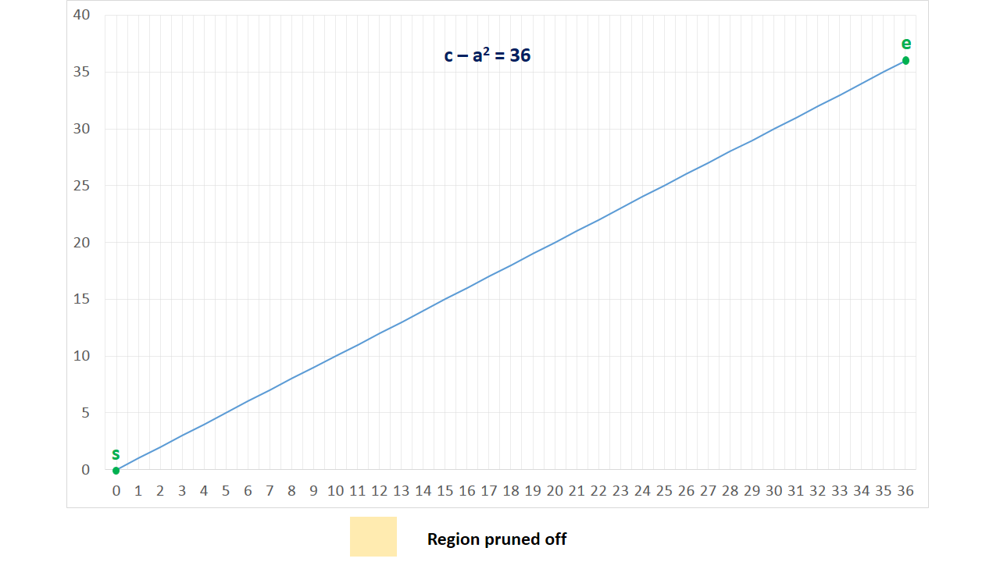
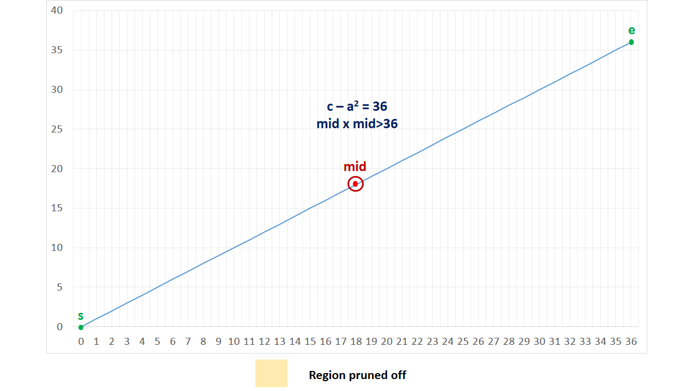
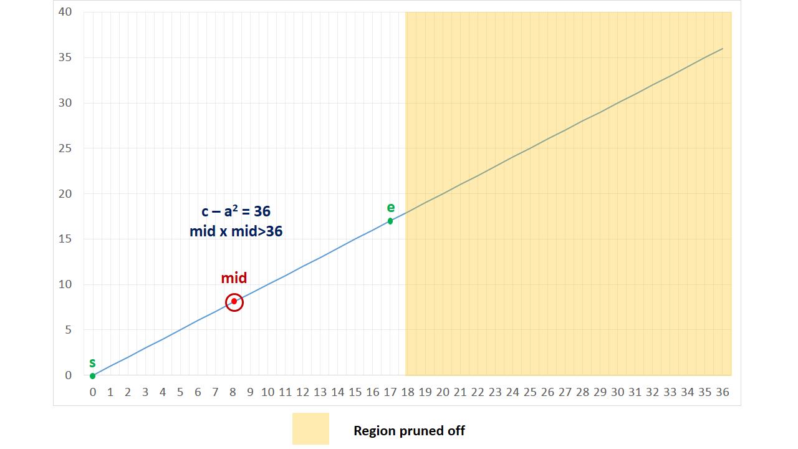
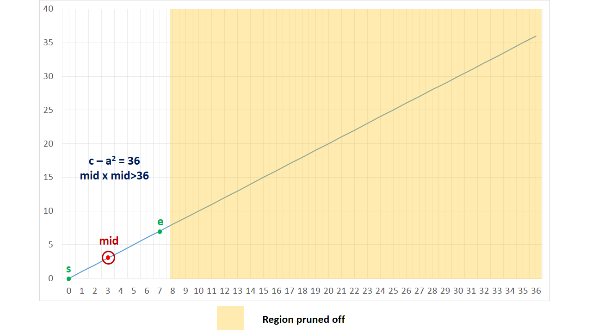
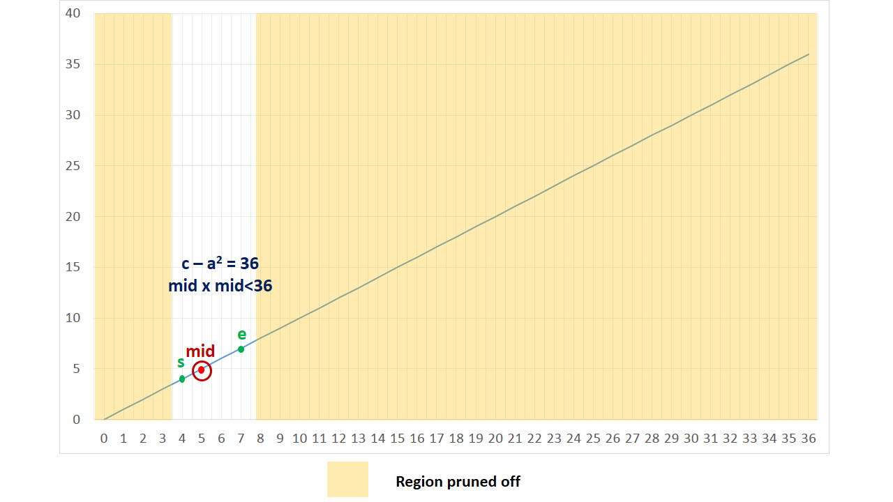
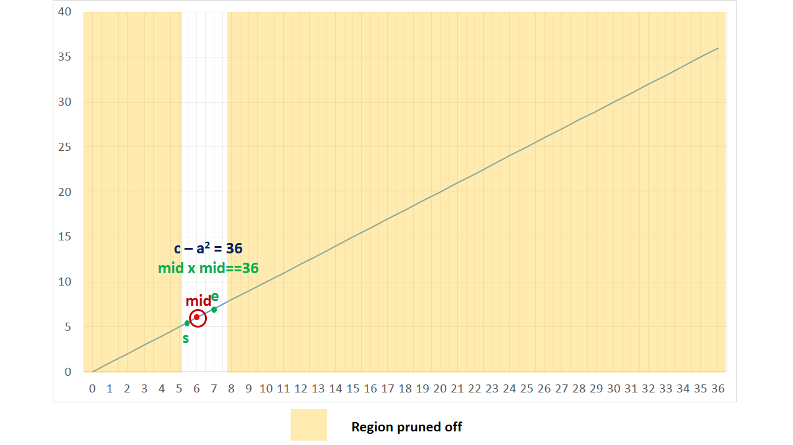

[TOC]

## Solution

---
### Approach 1: Brute Force

The simplest solution would be to consider every possible combination of integers $a$ and $b$ and check if the sum of their squares equals $c$. Now, both $a$ and $b$ can lie within the range $(0,\sqrt{c})$. Thus, we need to check for the values of $a$ and $b$ in this range only.

```python
class Solution:
    def judgeSquareSum(self, c: int) -> bool:
        a = 0
        while a * a <= c:
            b = 0
            while b * b <= c:
                if a * a + b * b == c:
                    return True
                b += 1
            a += 1
        return False
```

**Complexity Analysis**

* Time complexity : $O(c)$.

    Two loops up to $\sqrt{c}$. Here, $c$ refers to the given integer (sum of squares).

* Space complexity : $O(1)$.

    Constant extra space is used.

---

### Approach 2: Better Brute Force

We can improve the last solution, if we make the following observation. For any particular $a$ chosen, the value of $b$ required to satisfy the equation $a^2 + b^2 = c$ will be such that $b^2 = c - a^2$. Thus, we need to traverse over the range $(0, \sqrt{c})$ only for considering the various values of $a$. For every current value of $a$ chosen, we can determine the corresponding $b^2$ value and check if it is a perfect square or not. If it happens to be a perfect square, $c$ is a sum of squares of two integers, otherwise not.

Now, to determine, if the number $c - a^2$ is a perfect square or not, we can make use of the following theorem:

>The square of $n^{th}$ positive integer can be represented as a sum of first $n$ odd positive integers.

Or in mathematical terms:

$n^2 = 1 + 3 + 5 + ... + (2 \cdot n-1) = \sum_{i=1}^{n} (2 \cdot i - 1)$

To look at the proof of this statement, look at the L.H.S. of the above statement.

$$
\begin{aligned}
&1 + 3 + 5 + \ldots + (2 \cdot n-1) \\
= \; &(2 \cdot 1-1) + (2 \cdot 2-1) + (2 \cdot 3-1) + \ldots + (2 \cdot n-1) \\
= \; &2 \cdot (1+2+3+....+n) - (\underbrace{1+1+ \ldots +1}_{n\text{ times}}) \\
= \; &2 \cdot \frac{n\;(n+1)}{2} - n \\
= \; &n\;(n+1) - n \\
= \; &n^2 + n - n \\
= \; &n^2
\end{aligned}
$$

This completes the proof of the above statement.

```python
class Solution:
    def judgeSquareSum(self, c: int) -> bool:
        a = 0
        while a * a <= c:
            b = c - a * a
            i = 1
            sum = 0
            while sum < b:
                sum += i
                i += 2
            if sum == b:
                return True
            a += 1
        return False
```

**Complexity Analysis**

* Time complexity : $O(c)$.

    The total number of times the $sum$ is updated is: $1 + 2 + 3 + \ldots + \sqrt{c} = \frac{\sqrt{c}\;(\sqrt{c}+1)}{2} = O(c)$.

* Space complexity : $O(1)$.

    Constant extra space is used.

---

### Approach 3: Using Sqrt Function

**Algorithm**

Instead of finding if $c - a^2$ is a perfect square using sum of odd numbers, as done in the last approach, we can make use of the inbuilt $sqrt$ function and check if $\sqrt{c - a^2}$ turns out to be an integer. If it happens for any value of $a$ in the range $[0, \sqrt{c}]$, we can return a True value immediately.

```python
class Solution:
    def judgeSquareSum(self, c):
        a = 0
        while a * a <= c:
            b = (c - a * a) ** 0.5
            if b == int(b):
                return True
            a += 1
        return False
```

**Complexity Analysis**

* Time complexity : $O\big(\sqrt{c}\log c\big)$.

    We iterate over $\sqrt{c}$ values for choosing $a$. For every $a$ chosen, finding square root of $c - a^2$ takes $O\big(\log c\big)$ time in the worst case.

* Space complexity : $O(1)$.

    Constant extra space is used.

---

### Approach 4: Binary Search

**Algorithm**

Another method to check if $c - a^2$ is a perfect square, is by making use of Binary Search. The method remains same as that of a typical Binary Search to find a number.
The only difference lies in that we need to find an integer, $mid$ in the range $[0, c - a^2]$, such that this number is the square root of $c - a^2$.
Or in other words, we need to find an integer, $mid$, in the range $[0, c - a^2]$, such that $mid \times mid = c - a^2$.

The following animation illustrates the search process for a particular value of $c - a^2 = 36$.













```python
class Solution(object):
    def judgeSquareSum(self, c):
        def binary_search(s, e, n):
            if s > e:
                return False
            mid = s + (e - s) // 2
            if mid * mid == n:
                return True
            elif mid * mid > n:
                return binary_search(s, mid - 1, n)
            else:
                return binary_search(mid + 1, e, n)

        for a in range(
            int(c**0.5) + 1
        ):  # equivalent to `for (long a = 0; a * a <= c; a++)` in Java
            b = c - a * a
            if binary_search(0, b, b):
                return True
        return False
```

**Complexity Analysis**

* Time complexity : $O\big(\sqrt{c}\log c\big)$.
    Binary search taking $O\big(\log c\big)$ in the worst case is done for $\sqrt{c}$ values of $a$.

* Space complexity : $O(\log c)$. Binary Search will take $O(\log c)$ space.

---

### Approach 5: Fermat Theorem

**Algorithm**

This approach is based on the following statement, which is based on Fermat's Theorem:

>Any positive number $n$ is expressible as a sum of two squares if and only if the prime factorization of $n$, every prime of the form $(4k+3)$ occurs an even number of times.

By making use of the above theorem, we can directly find out if the given number $c$ can be expressed as a sum of two squares.

To do so we simply find all the prime factors of the given number $c$, which could range from $[2,\sqrt{c}]$ along with the count of those factors, by repeated division.
If at any step, we find out that the number of occurrences of any prime factor of the form $(4k+3)$ occurs an odd number of times, we can return a False value.

In case, $c$ itself is a prime number, it won't be divisible by any of the primes in the $[2,\sqrt{c}]$. Thus, we need to check if $c$ can be expressed in the form of
$4k+3$. If so, we need to return a False value, indicating that this prime occurs an odd number(1) of times.

Otherwise, we can return a True value.

The proof of this theorem includes the knowledge of advanced mathematics and is beyond the scope of this article. However, interested reader can refer to [this](http://wstein.org/edu/124/lectures/lecture21/lecture21/node2.html) documentation.

```python
class Solution:
    def judgeSquareSum(self, c: int) -> bool:
        i = 2
        while i * i <= c:
            count = 0
            while c % i == 0:
                count += 1
                c //= i
            if i % 4 == 3 and count % 2 != 0:
                return False
            i += 1
        return c % 4 != 3
```

**Complexity Analysis**

* Time complexity : $O\left(\sqrt{c}\right)$.

    We find the factors of $c$ and their count using repeated division. We check for the factors in the range $[0, \sqrt{c}]$.

    However, the number of times a factor can occur is spread over the entire outer loop, so the entire complexity caused by the inner loop is effectively $O(\log c)$. As a result, the total time complexity is $O(\sqrt{c} + \log c) = O\left(\sqrt{c}\right)$.

* Space complexity : $O(1)$.

    Constant space is used.

---