[TOC]

## Solution

---
### Approach 1: Brute Force

The simplest solution is to consider every possible permutation of the given numbers from $1$ to $n$ and count the number of permutations which are dereangements of the
original arrangement.

**Complexity Analysis**

* Time complexity : $O\big((n+1)!\big)$. $n!$ permutations are possible for $n$ numbers. For each permutation, we need to traverse over the whole arrangement to check if it
is a derangement or not, which takes $O(n)$ time.

* Space complexity : $O(n)$. Each permutation would require $n$ space to be stored.
<br />
<br />

---

### Approach 2: Recursion

**Algorithm**

In order to find the number of derangements for $n$ numbers, firstly we can consider the the original array to be
`[1,2,3,...,n]`. Now, in order to generate the derangements of this array, assume that firstly, we move the number 1 from
its original position and place at the place of the number $i$. But, now, this $i^{th}$ position can be chosen
in $n-1$ ways. Now, for placing the number $i$ we have got two options:

1. We place $i$ at the place of $1$: By doing this, the problem of finding the derangements reduces to finding the derangements of the
remaining $n-2$ numbers, since we've got $n-2$ numbers and $n-2$ places, such that every number can't be placed at exactly one position.

2. We don't place $i$ at the place of $1$: By doing this, the problem of finding the derangements reduces to finding the
derangements for the $n-1$ elements(except 1). This is because, now we've got $n-1$ elements and these $n-1$ elements can't be placed at
exactly one location(with $i$ not being placed at the first position).

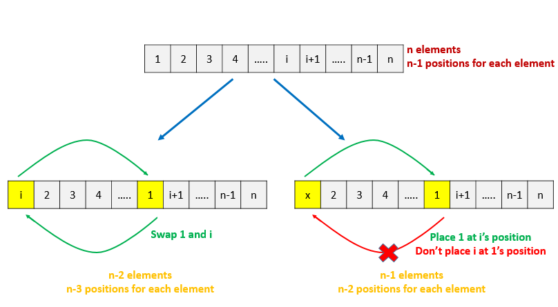

Based, on the above discussion, if $d(n)$ represents the number of derangements for $n$ elements, it can be obtained as:

$d(n) = (n-1) \cdot [d(n-1) + d(n-2)]$

This is a recursive equation and can thus, be solved easily by making use of a recursive function.

But, if we go with the above method, a lot of duplicate function calls wiil be made, with the same parameters being passed. This is because the same state can be reached through various paths in the recursive tree. In order to avoid these duplicate calls, we can store the result of a function call, once its made,
into a memoization array. Thus, whenever the same function call is made again, we can directly return the result from this memoization array.
This helps to prune the search space to a great extent.

> **Caution:** The maximum recursion depth of this implementation is $n$. So when $n$ is very large, it is possible to exceed the recursion limit or the memory limit.  As such, the following code **will not** pass all test cases.  Thus, in the following approaches we will discuss two improvements that can be applied to circumvent this issue.

```java
public class Solution {
    public int findDerangement(int n) {
        Integer[] memo = new Integer[n + 1];
        return find(n, memo);
    }

    public int find(int n, Integer[] memo) {
        if (n == 0)
            return 1;
        if (n == 1)
            return 0;
        if (memo[n] != null)
            return memo[n];
        memo[n] = (int)(((n - 1L) * (find(n - 1, memo) + find(n - 2, memo))) % 1000000007);
        return memo[n];
    }
}
```

**Complexity Analysis**

* Time complexity : $O(n)$. $memo$ array of length $n$ is filled once only.

* Space complexity : $O(n)$. $memo$ array of length $n$ is used.
<br />
<br />
---

### Approach 3: Dynamic Programming

**Algorithm**

As we've discussed above, the recursive formula for finding the derangements for $n$ elements is given by:

$d(n) = (n-1) \cdot [d(n-1) + d(n-2)]$

From this expression, we can see that the result for derangements for $i$ numbers depends only on the result of the derangments
of numbers lesser than $i$. Thus, we can solve the given problem by making use of Dynamic Programming.

The equation for Dynamic Programming remains identical to the recursive equation.

$\text{dp}[i] = (i - 1) \cdot (dp[i-1]+dp[i-2])$

Here, $\text{dp}[i]$ is used to store the number of derangements for $i$ elements. We start filling the $dp$ array from $i=0$ and move towards the larger values of $i$. At the end, the value of
$\text{dp}[n]$ gives the required result.

The following animation illustrates the $dp$ filling process.

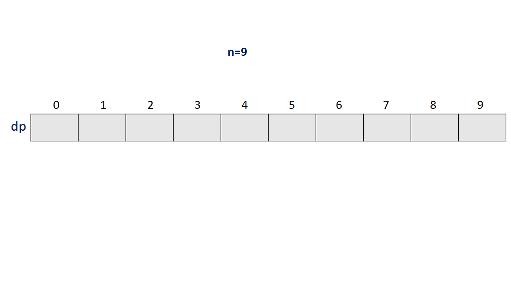

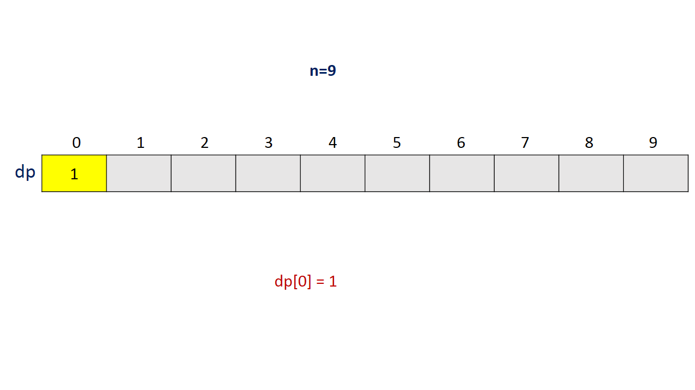

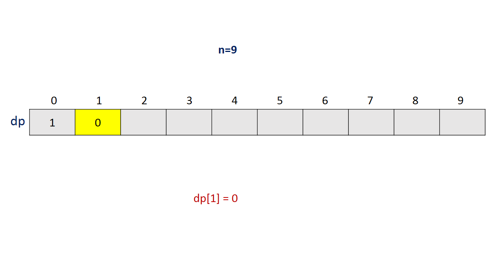

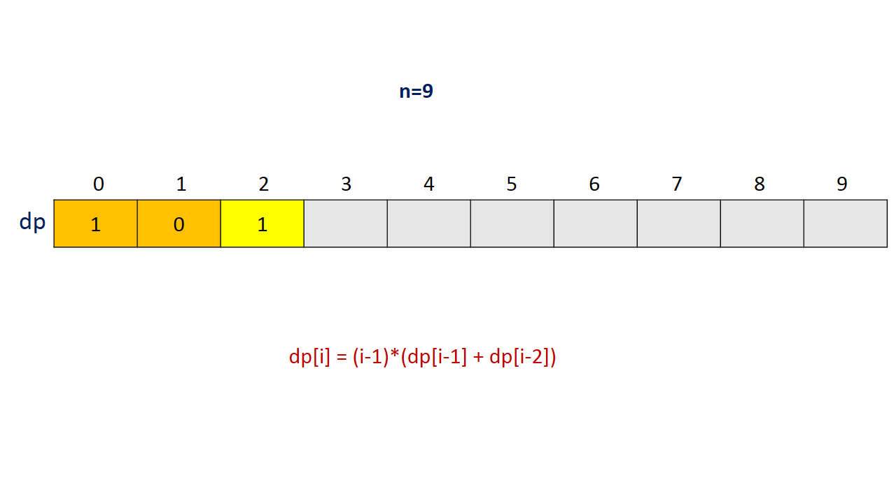

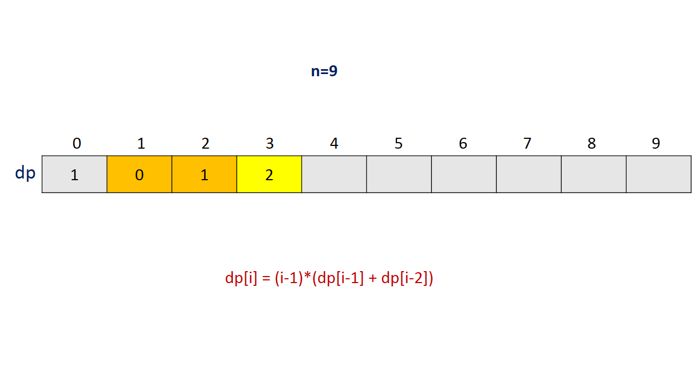

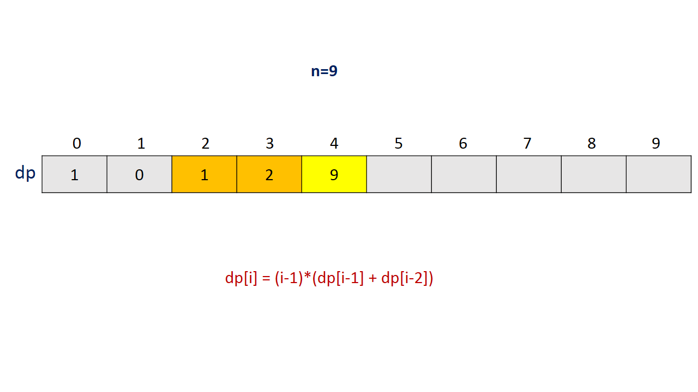

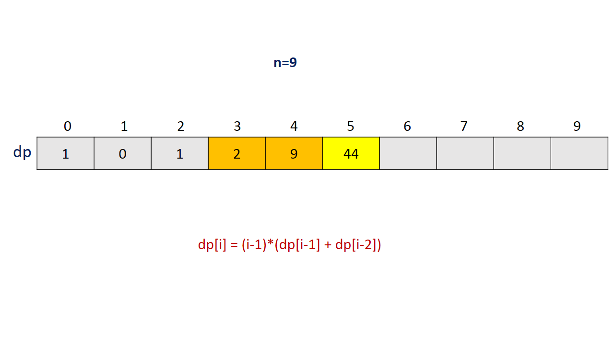

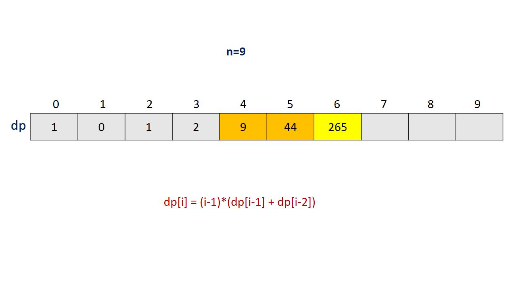

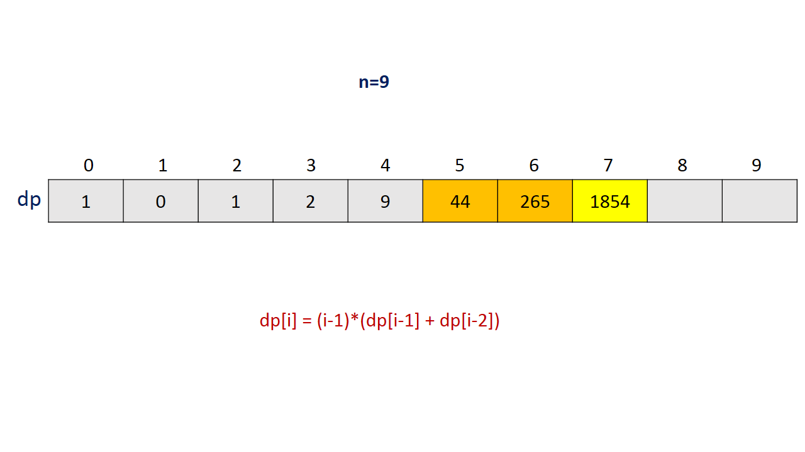

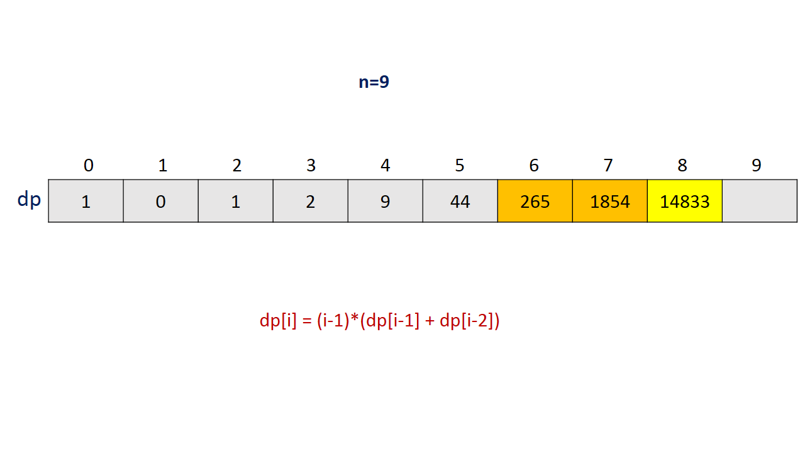

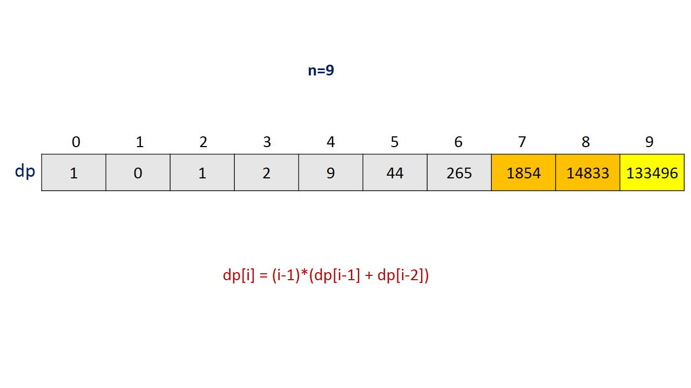

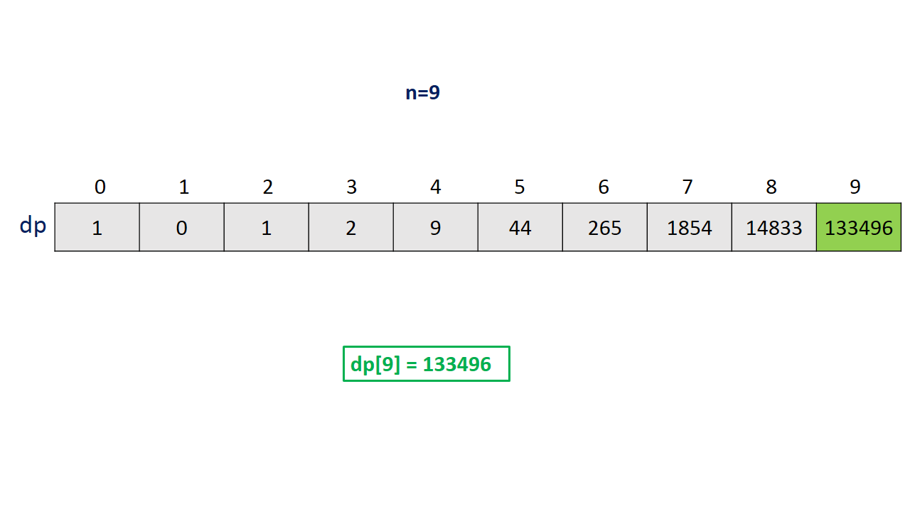

```java
public class Solution {
    public int findDerangement(int n) {
        if (n == 0)
            return 1;
        if (n == 1)
            return 0;
        int[] dp = new int[n + 1];
        dp[0] = 1;
        dp[1] = 0;
        for (int i = 2; i <= n; i++)
            dp[i] = (int)(((i - 1L) * (dp[i - 1] + dp[i - 2])) % 1000000007);
        return dp[n];
    }
}
```

**Complexity Analysis**

* Time complexity : $O(n)$. Single loop upto $n$ is required to fill the $dp$ array of size $n$.

* Space complexity : $O(n)$. $dp$ array of size $n$ is used.
<br />
<br />

---

### Approach 4: Constant Space Dynamic Programming

**Algorithm**

In the last approach, we can easily observe that the result for $\text{dp}[i]$ depends only on the previous two elements, $dp[i-1]$ and
$dp[i-2]$. Thus, instead of maintaining the entire 1-D array, we can just keep a track of the last two values required to calculate the
value of the current element. By making use of this observation, we can save the space required by the $dp$ array in the last approach.

```java
public class Solution {
    public int findDerangement(int n) {
        if (n == 0)
            return 1;
        if (n == 1)
            return 0;
        int first = 1, second = 0;
        for (int i = 2; i <= n; i++) {
            int temp = second;
            second = (int)(((i - 1L) * (first + second)) % 1000000007);
            first = temp;
        }
        return second;
    }
}
```

**Complexity Analysis**

* Time complexity : $O(n)$. Single loop upto $n$ is required to find the required result.

* Space complexity : $O(1)$. Constant extra space is used.
<br />
<br />

---

### Approach 5: Formula

**Algorithm**

Before discussing this approach, we need to look at some preliminaries.

In combinatorics (combinatorial mathematics), the inclusion–exclusion principle is a counting
technique which generalizes the familiar method of obtaining the number of elements in the union of two
finite sets; symbolically expressed as

$\left|A\cup B\right|=\left|A\right|+\left|B\right|-\left|A\cap B\right|$

where $A$ and $B$ are two finite sets and $\left|S\right|$ indicates the cardinality of a set $S$
(which may be considered as the number of elements of the set, if the set is finite).

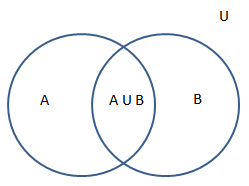

The formula expresses the fact that the sum of the sizes of the two sets may be too large since
 some elements may be counted twice. The double-counted elements are those in the intersection of
 the two sets and the count is corrected by subtracting the size of the intersection.

The principle is more clearly seen in the case of three sets, which for the sets $A$, $B$ and $C$ is given by

$\left|A\cup B\cup C\right|=\left|A\right|+\left|B\right|+\left|C\right|-\left|A\cap B\right|-\left|A\cap C\right|-\left|B\cap C\right|+\left|A\cap B\cap C\right|$.

This formula can be verified by counting how many times each region in the
Venn diagram figure shown below.

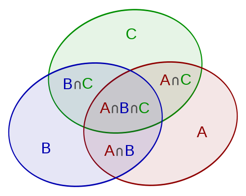

In this case,
when removing the contributions of over-counted elements, the number of elements in the mutual
intersection of the three sets has been subtracted too often, so must be added back in to get the correct total.

In its general form, the principle of inclusion–exclusion states that for finite sets $A_1, ..., A_n$, one
 has the identity

$\bigg|\bigcup _{i=1}^{n}A_{i}\bigg|=\sum_{i=1}^{n}\left|A_{i}\right|-\sum_{1 \leq; i < j \leq; n}\left|A_{i}\cap A_{j}\right|+...$

$+...+\sum_{1 \leq; i < j < k \leq; n}\left|A_{i}\cap A_{j}\cap A_{k}\right|-..... +(-1)^{n}\left|A_{1}\cap... \cap A_{n}\right|$

By applying De-Morgan's law to the above equation, we can obtain

$\bigg|\bigcap _{i=1}^{n}\bar{A_{i}}\bigg|=\bigg|S-\bigcup _{i=1}^{n}A_{i}\bigg|=\left|S\right|-$  $\sum_{i=1}^{n}\left|A_{i}\right|+\sum_{1 \leq; i < j \leq; n}\left|A_{i}\cap A_{j}\right|-.... +(-1)^{n}\left|A_{1}\cap....\cap A_{n}\right|$

Here, $S$ represents the universal set containing all of the $A_i$ and $\bar{A_{i}}$ denotes the complement of $A_i$ in $S$.

Now, let $A_i$ denote the set of permutations  which leave $A_i$ in its natural position. Thus, the number of permutations in which
the $i^{th}$ element remains at its natural position is $(n-1)!$. Thus, the component $\sum_{i=1}^{n}\left|A_{i}\right|$ above
becomes ${{n}\choose{1}} (n-1)!$. Here, ${{n}\choose{1}}$ represents the number of ways of choosing 1 element out of $n$ elements.

 Making use of this notation, the required number of derangements can be denoted by $\left|\bigcap _{i=1}^{n}\bar{A_{i}}\right|$ term.

This is the same term which has been expanded in the last equation. Putting appropriate values of the elements, we can expand the above equation as:

$\bigg|\bigcap _{i=1}^{n}\bar{A_{i}}\bigg|=n! -{n \choose 1}(n-1)! + {n\choose 2}(n-2)! - {n \choose 3}(n-3)! +...$
$...+(-1)^{p}{n \choose p}(n-p)! +...+ (-1)^{n}{n \choose n} (n-n)!$

$= n! - \frac{n!}{1!} + \frac{n!}{2!} - \frac{n!}{3!}+...+(-1)^n \frac{n!}{n!}$

We can make use of this formula to obtain the required number of derangements.

```java
public class Solution {
    public int findDerangement(int n) {
        long mul = 1, sum = 0, M = 1000000007;
        for (int i = n; i >= 0; i--) {
            sum = (sum + M + mul * (i % 2 == 0 ? 1 : -1)) % M;
            mul = (mul * i) % M;
        }
        return (int) sum;
    }
}
```

**Complexity Analysis**

* Time complexity : $O(n)$. Single loop upto $n$ is used.

* Space complexity : $O(1)$. Constant space is used.