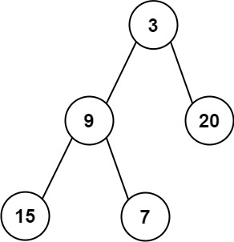

### 1. Description

Given the `root` of a binary tree, return *the average value of the nodes on each level in the form of an array*. Answers within $10^{-5}$ of the actual answer will be accepted.

### 2. Function Contract

**Methods**

- `TreeNode(val=0, left=None, right=None)`: Initializes the data structure.
- `averageOfLevels(root: Optional[TreeNode]) -> `List[float]``: Executes operation.

### 3. Examples

#### Example 1

- **Input:** `root = [3,9,20,null,null,15,7]`
- **Output:** `[3.00000,14.50000,11.00000]`
- **Explanation:** The average value of nodes on level 0 is 3, on level 1 is 14.5, and on level 2 is 11.
Hence return [3, 14.5, 11].

#### Example 2

- **Input:** `root = [3,9,20,15,7]`
- **Output:** `[3.00000,14.50000,11.00000]`

### 4. Constraints

- The number of nodes in the tree is in the range $[1, 10^{4}]$.

- $-2^{31} \le \text{Node.val} \le 2^{31} - 1$
