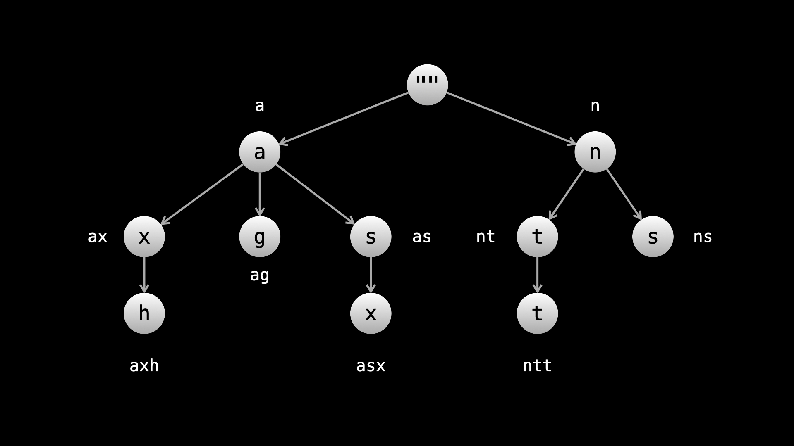

## Solution

---

### Overview

A trie is a data structure that can be used to efficiently search for strings. If you are not familiar with tries, we highly recommend you read the official solution to [this problem](https://leetcode.com/problems/implement-trie-prefix-tree/solution) before proceeding with this approach. We will not delve into implementation details in this article and assume that you are already familiar with tries.

To summarize, a trie is a tree where each node is labeled. Here, we label each node with a character. The path from the root to any node represents the string that is built by the nodes on the path. The root represents the empty string.

 <br>

---

### Approach 1: Trie

**Intuition**

A trie is a great option whenever you want to search in a collection of strings, especially if you are searching one character at a time.

If we put all the sentences in a trie, we can walk through every sentence simultaneously with each call to `input`.

We will use a `TrieNode` class to represent the trie nodes. The `AutocompleteSystem` class will be initialized with a `TrieNode root`.

```python
class TrieNode:
    def __init__(self):
        self.children = {}
        self.sentences = defaultdict(int)
```

> The additional `sentences` attribute will be used to count the number of times each sentence was typed.

Let's start by defining a method `addToTrie` that takes a string `sentence` and an integer `count`. Calling `addToTrie(sentence, count)` means that `sentence` was typed `count` times, and we will update our trie to reflect that.

```python
def add_to_trie(self, sentence, count):
    node = self.root
    for c in sentence:
        if c not in node.children:
            node.children[c] = TrieNode()
        node = node.children[c]
        node.sentences[sentence] += count
```

At each trie node, we have a hash map. This hash map holds all the sentences that have the current path as a prefix. Because we need to return the sentences that have been typed the most, we need to map each sentence to its count.

We can initialize the trie in the constructor with the initial `sentences`. For each $\text{sentences}[i]$, we call $addToTrie(\text{sentences}[i], \text{times}[i])$. In the future, when we finish a sentence by calling `input('#')`, we can easily add the sentence we have typed by calling `addToTrie(sentence, 1)`.

Next, let's talk about how we can implement the `input` function. Calling this function repeatedly represents typing out a sentence. We can keep a class attribute `currSentence` which represents the current sentence we are typing. Additionally, let's keep a class attribute `currNode` that represents the current node in the trie we are located at. Whenever we start typing a new sentence, we set $currNode = root$.

Each time we call `input(c)`, there are 3 possibilities:

1. `c = '#'`: We have finished typing the current sentence. Add `currSentence` as a string to the trie using the `addToTrie` function, and reset our class variables in preparation for the next sentence. Empty `currSentence` and set $currNode = root$, then return an empty list.
2. $c \neq '#'$, and `c` is a child of `currNode`: there are some existing sentences that have the current sentence we are typing as a prefix. First, let's add `c` to `currSentence`. Next, walk to the child node by doing $currNode = currNode.\text{children}[c]$. Now, fetch the sentences that have the current sentence as a prefix - we store them in the hash map `currNode.sentences` with the mapping `sentence: count`. Finally, sort these sentences according to their count, and return the top 3 sentences according to the criteria in the problem description.
3. $c \neq '#'$, but `c` is not a child of `currNode`: there are no existing sentences that have the current sentence we are typing as a prefix. We just need to add `c` to `currSentence` and return an empty list.

Here's an implementation of the above logic:

```python
def input(self, c: str) -> List[str]:
    if c == "#":
        curr_sentence = "".join(self.curr_sentence)
        self.add_to_trie(curr_sentence, 1)
        self.curr_sentence = []
        self.curr_node = self.root
        return []

    self.curr_sentence.append(c)
    if c not in self.curr_node.children:
        self.curr_node = self.dead
        return []

    self.curr_node = self.curr_node.children[c]
    sentences = self.curr_node.sentences
    sorted_sentences = sorted(sentences.items(), key = lambda x: (-x[1], x[0]))

    ans = []
    for i in range(min(3, len(sorted_sentences))):
        ans.append(sorted_sentences[i][0])

    return ans
```

We can now combine everything to fully implement our solution.

**Algorithm**

1. Create a `TrieNode` class with two attributes:
- `children`, a hash map that maps characters to `TrieNode`.
- `sentences`, a hash map that maps strings to integers.
2. Create the function `addToTrie(sentence, count)` that adds `sentence` to the trie `count` times.
3. `AutocompleteSystem` is initialized with the following attributes:
- `root` of type `TrieNode`, the root of our trie.
- `currNode` of type `TrieNode`, the current node we are located at in our trie.
- `dead` of type `TrieNode`, a dummy node.
- `currSentence` of type `StringBuilder` or `list`, depending on the language. This is the current sentence we are typing.
4. In the constructor of `AutocompleteSystem`, call $addToTrie(\text{sentences}[i], \text{times}[i])$ for each index `i`.
5. In `input(c)`:
- If `c = '#'`, convert `currSentence` to a string and add it to the trie with `addToTrie`. Reset `currSentence` and `currNode` to the root. Return an empty array.
- Otherwise, add `c` to `currSentence`. Now, check if `c` is in `currNode.children`.
- If it isn't, set $currNode = dead$ and return an empty array.
- If it is, move `currNode` to the child with $currNode = currNode.\text{children}[c]$. Next, fetch the sentences in `currNode.sentences`, sort them, and return the top 3.

**Implementation**

```python
class TrieNode:
    def __init__(self):
        self.children = {}
        self.sentences = defaultdict(int)

class AutocompleteSystem:
    def __init__(self, sentences: List[str], times: List[int]):
        self.root = TrieNode()
        for sentence, count in zip(sentences, times):
            self.add_to_trie(sentence, count)

        self.curr_sentence = []
        self.curr_node = self.root
        self.dead = TrieNode()

    def input(self, c: str) -> List[str]:
        if c == "#":
            curr_sentence = "".join(self.curr_sentence)
            self.add_to_trie(curr_sentence, 1)
            self.curr_sentence = []
            self.curr_node = self.root
            return []

        self.curr_sentence.append(c)
        if c not in self.curr_node.children:
            self.curr_node = self.dead
            return []

        self.curr_node = self.curr_node.children[c]
        sentences = self.curr_node.sentences
        sorted_sentences = sorted(sentences.items(), key = lambda x: (-x[1], x[0]))

        ans = []
        for i in range(min(3, len(sorted_sentences))):
            ans.append(sorted_sentences[i][0])

        return ans

    def add_to_trie(self, sentence, count):
        node = self.root
        for c in sentence:
            if c not in node.children:
                node.children[c] = TrieNode()
            node = node.children[c]
            node.sentences[sentence] += count
```

**Complexity Analysis**

Given $n$ as the length of `sentences`, $k$ as the average length of all sentences, and $m$ as the number of times `input` is called,

* Time complexity: $O(n \cdot k + m \cdot (n + \frac{m}{k}) \cdot \log{(n + \frac{m}{k})})$

    `constructor`:
- We initialize the trie, which costs $O(n \cdot k)$ as we iterate over each character in each sentence.

    `input`:
- We add a character to `currSentence` and the trie, both cost $O(1)$. Next, we fetch and sort the sentences in the current node. Initially, a node could hold $O(n)$ sentences. After we call `input` $m$ times, we could add $\frac{m}{k}$ new sentences. Overall, there could be up to $O(n + \frac{m}{k})$ sentences, so a sort would cost $O((n + \frac{m}{k}) \cdot \log{(n + \frac{m}{k})})$.
- The work done in the other cases (like adding a new sentence to the trie) will be dominated by this sort.
- `input` is called $m$ times, which gives us a total of $O(m \cdot (n + \frac{m}{k}) \cdot \log{(n + \frac{m}{k})})$

* Space complexity: $O(k \cdot (n \cdot k + m))$

    The worst-case scenario for the trie size is when no two sentences share any prefix. The trie will initially have a size of $n \cdot k$. Then, each call to `input` would create a new node.

    Each of these trie nodes has `children` and `sentences` hash maps. The size of `children` is limited to 26, so we will ignore it. The size of `sentences` is variable, but in the case described, each node will only have 1 entry (because no two sentences share any prefix, so no trie node is visited by more than one sentence). This 1 entry will have a size of $O(k)$.

<br/>

---

### Approach 2: Optimize with Heap

**Intuition**

The most expensive part of our algorithm in the previous approach was sorting the sentences. We can improve by using a heap instead of just using the built-in sorting algorithm.

Once we fetch `currNode.sentences`, we will convert it into a heap. Then, we can extract the top 3 sentences from the heap. Everything else will mostly be the same as in the previous approach, so we will just discuss the differences between the two approaches.

**Python**

Python's `heapq` module provides functions `nsmallest` and `nlargest`. They take lists as input and return the `n` best elements. When performed on a list of length $m$, these methods have a time complexity of $O(m + n \cdot \log m)$. We have $n = 3$ here, so the time complexity is $O(m + \log m) = O(m)$.

Implementation of the `heapq` functions can be [found here](https://github.com/python/cpython/blob/3.11/Lib/heapq.py).

By default, `heap` implements min-heaps. Because we want the sentences with larger counts, we need to emulate a max heap. We can do this by modifying `addToTrie`. Instead of doing `+= count`, we will do `-= count`. As the counts are negatives, the larger magnitudes will be considered "better" by the min-heap.

The heap will hold elements as `(count, sentence)`. `heapq` will automatically handle tiebreaks when `count` is equal. `heapq.nsmallest` will give us our answer.

**Java**

Python's `heapq` module is very efficient. It uses a method `heapify` that can convert a list to a heap in linear time. Unfortunately, there is no built-in equivalent method in Java, so we will use a standard "top k elements" method.

We initialize our heap with a custom comparator, similar to the custom comparator we used in the previous approach. However, we will flip the logic in the comparator so that "worse" sentences get removed first. We iterate over the sentences and push each one onto the heap. When the heap's size exceeds 3, we pop from it. After handling all sentences, the 3 best sentences will remain in the heap. Now, we simply extract and reverse them.

The reversal is necessary because the problem wants the 3 sentences in sorted order as well. We changed our custom comparator to be the opposite, so after extracting the 3 sentences, they will be in backward order.

**Implementation**

```python
import heapq

class TrieNode:
    def __init__(self):
        self.children = {}
        self.sentences = defaultdict(int)

class AutocompleteSystem:
    def __init__(self, sentences: List[str], times: List[int]):
        self.root = TrieNode()
        for sentence, count in zip(sentences, times):
            self.add_to_trie(sentence, count)

        self.curr_sentence = []
        self.curr_node = self.root
        self.dead = TrieNode()

    def input(self, c: str) -> List[str]:
        if c == "#":
            curr_sentence = "".join(self.curr_sentence)
            self.add_to_trie(curr_sentence, 1)
            self.curr_sentence = []
            self.curr_node = self.root
            return []

        self.curr_sentence.append(c)
        if c not in self.curr_node.children:
            self.curr_node = self.dead
            return []

        self.curr_node = self.curr_node.children[c]
        items = [(val, key) for key, val in self.curr_node.sentences.items()]
        ans = heapq.nsmallest(3, items)
        return [item[1] for item in ans]

    def add_to_trie(self, sentence, count):
        node = self.root
        for c in sentence:
            if c not in node.children:
                node.children[c] = TrieNode()
            node = node.children[c]
            node.sentences[sentence] -= count
```

**Complexity Analysis**

Given $n$ as the length of `sentences`, $k$ as the average length of all sentences, and $m$ as the number of times `input` is called,

> This analysis will assume that you have access to a linear time heapify method, like in the Python implementation.

* Time complexity: $O(n \cdot k + m \cdot (n + \frac{m}{k}))$

    `constructor`:
- We initialize the trie, which costs $O(n \cdot k)$ as we iterate over each character in each sentence.

    `input`:
- We add a character to `currSentence` and the trie, both cost $O(1)$. Next, we fetch the sentences in the current node. Initially, a node could hold $O(n)$ sentences. After we call `input` $m$ times, we could add $\frac{m}{k}$ new sentences. Overall, there could be up to $O(n + \frac{m}{k})$ sentences. We heapify these sentences and find the best 3 in linear time, which costs $O(n + \frac{m}{k})$.
- The work done in the other cases (like adding a new sentence to the trie) will be dominated by this.
- `input` is called $m$ times, which gives us a total of $O(m \cdot (n + \frac{m}{k}))$.

* Space complexity: $O(k \cdot (n \cdot k + m))$

    The worst-case scenario for the trie size is when no two sentences share any prefix. The trie will initially have a size of $n \cdot k$. Then, each call to `input` would create a new node.

    Each of these trie nodes has `children` and `sentences` hash maps. The size of `children` is limited to 26, so we will ignore it. The size of `sentences` is variable, but in the case described, each node will only have 1 entry (because no two sentences share any prefix, so no trie node is visited by more than one sentence). This 1 entry will have a size of $O(k)$.

<br/>

---