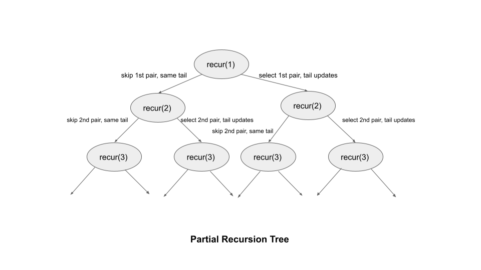

[TOC]

## Solution

---

### Overview

We are given an array of `n` pairs `pairs` where $\text{pairs}[i] = [\text{left}_i, \text{right}_i]$ and $\text{left}_i < \text{right}_i$.

A pair $p2 = [c, d]$ follows a pair $p1 = [a, b]$ if `b < c`. A chain of pairs can be formed in this fashion.

Our task is to return the length of the longest chain which can be formed.

---

### Approach 1: Recursive Dynamic Programming

#### Intuition

Two pairs can join together to form a chain if the second element of the first pair is less than the first element of the next pair. Since the problem says that we can choose any combination in any order, we can safely sort the input. We can guarantee that all feasible chains can be built iteratively going from the first to the last pair after sorting.

Following sorting, we have two options for a pair at index `i`: we may either include this pair in our current chain or we can choose not to include this pair in our current chain.

If we do not include this pair in the current chain, we may simply skip it and move on to the pair at index $i + 1$. We shall repeat in the range $[i + 1, n)$. Because we have already sorted the `pairs`, it means the next potential pair will be located after the present pair.

Otherwise, if we include this pair, we increase the length of the chain by `1`. We then need to find the next pair that would follow the one we just added. It will be at an index `j` in the range of $[i + 1, n)$, and its first element must be greater than the second element of the pair we just added.

This would solve the problem but the solution is exponential in terms of time complexity.

Here's how the partial recursion tree would look like for the above approach where `recur` is the recursive function that takes in the `index` of the starting pair and recursively finds the longest chain considering the pairs starting from the `index`:



The word **tail** refers to the second element of the most recently selected pair. The next chosen pair should have the first element be greater than the tail.

We can observe that there are several repeating problems in this solution. Several subproblems, such as `recur(2)`, `recur(3)`, etc., are solved multiple times in the partial recursion tree shown above. If we draw the entire recursion tree, we can see that many subproblems are solved repeatedly.

To avoid this issue, we store the solution of each sub-problem and when we encounter the same subproblem again, we simply refer to the stored result. This is called **memoization**.

We create an array of integers `memo` where $\text{memo}[i]$ will store the longest length of the chain starting from the $i^{th}$ pair and including it.

We can now select every pair as the starting pair one by one.

For each starting pair `i`, we try to select all the pairs from the range $[i + 1, n)$ as the next pair one by one.

We run a loop from $j = i + 1$ to $n - 1$ to check all the potential next pairs. If we can choose the pair at index `j` ($\text{pairs}[j][0] > \text{pairs}[i][1]$), we try using it as the next pair. We want to take the pair that maximizes the final length, so we perform $\text{memo}[i] = max(\text{memo}[i], 1 + \text{recur}[j])$. We added `1` as we selected the pair `i` in the chain and now moved to the next pair at the index `j`.

The longest chain starting from each pair is stored in `memo`, thus the answer is the maximum value in `memo`. Note that as a base case, any pair forms a chain of length `1` on its own.

#### Algorithm

1. Create an integer variable `n` to store the number of pairs in `pairs`.
2. Sort `pairs` based on the first element (we could sort on the second element as well).
3. Create an integer array `memo` of size `n` where $\text{memo}[i]$ will store the longest length of the chain starting from the $i^{th}$ pair and including it.
4. Create an integer variable $ans = 0$.
5. Select every pair from $i = 0$ to $n - 1$ as the starting pair of the chain and take the maximum out of it in `ans`. To find the longest chain starting from the pair at index `i`, we call the recursive method `longestPairChain` which takes four parameters: `i` of the starting pair, `pairs`, `n`, and `memo`. We perform the following in this method:
- If we have already computed the length of the longest chain starting from pair at `i`, we simply return $\text{memo}[i]$.
- Set $\text{memo}[i] = 1$ as the current pair can always be selected as the only pair in the chain.
- Iterate over all the pairs from $j = i + 1$ to $n - 1$ and recursively find the longest chain that can be formed by going to the $j^{th}$ pair. We perform $\text{memo}[i] = max(\text{memo}[i], 1 + longestPairChain(j, pairs, n, memo))$ to figure and store the length of the longest chain starting with $i^{th}$ pair.
6. Return `ans`.

#### Implementation

```python
class Solution:
    def longestPairChain(self, i: int, pairs: List[List[int]], n: int, memo: List[int]) -> int:
        if memo[i] != 0:
            return memo[i]
        memo[i] = 1
        for j in range(i + 1, n):
            if pairs[i][1] < pairs[j][0]:
                memo[i] = max(memo[i], 1 + self.longestPairChain(j, pairs, n, memo))
        return memo[i]

    def findLongestChain(self, pairs: List[List[int]]) -> int:
        n = len(pairs)
        pairs.sort()
        memo = [0] * n

        ans = 0
        for i in range(n):
            ans = max(ans, self.longestPairChain(i, pairs, n, memo))
        return ans
```

#### Complexity Analysis

Here $n$ is the length of `pairs`.

* Time complexity: $O(n^2)$.
- It takes $O(n \cdot \log{n})$ time to sort `pairs`.
- It further takes $O(n)$ time to initialize the `memo` array.
- In the recursive method, we iterate from the current pair till the last pair, which takes $O(n)$ time for each pair. We compute the length of the longest chain starting from each pair once (due to memoization). Since we have a total of $n$ pairs and it takes $O(n)$ time on average to iterate over all the next pairs, it would take $O(n^2)$ time in total.

* Space complexity: $O(n)$.
- The recursion stack will grow up to a maximum size of $n$ in the case where all the calls corresponding to all the pairs are in the stack. This will occur when the subsequent pair in the sorted `pair` always satisfies the condition to be selected as the follow-up pair.
- The `memo` array also takes $O(n)$ space.

---

### Approach 2: Iterative Dynamic Programming

#### Intuition

We used memoization in the preceding approach to store the answers to subproblems to solve a larger problem. We can also use a bottom-up approach to solve such problems without using recursion. We build answers to subproblems iteratively first, then use them to build answers to larger problems.

We create a list $\text{dp}[n]$ where $\text{dp}[i]$ will store the length of the longest chain starting from pair `i` and selecting it in the chain. Note that $\text{dp}[i] = \text{memo}[i] = longestPairChain(i, pairs, n, memo)$ from the previous approach.

We initialize $\text{dp}[i] = 1$ for all values of `i` since a single pair can always form a chain on its own. While moving from bottom to top, this serves as the base case for our solution.

We iterate from $i = n - 1$ to `0` in the outer loop. It controls the starting index of the pair. After choosing the $i^{th}$ pair, we go on to the next pair by executing an inner loop from $j = i + 1$ to $n - 1$. We determine if the pair at index `j` can be chosen as the $i^{th}$ pair's successor.

If we can choose pair `j`, we take the maximum from the longest chain we created so far beginning with `i` ($\text{dp}[i]$) and moving forward by selecting pair `j` as the next pair to create the longest chain possible. Basically, $\text{dp}[i] = max(\text{dp}[i], 1 + \text{dp}[j])$ is what we perform. We would already know the solution to $\text{dp}[j]$ as we are going from the end to the beginning.

The maximum value in the `dp` array is the answer.

You may realize that we could also fill the `dp` table by moving from the start to the end. We can use an outer loop from $i = 1$ to $n - 1$ and an inner loop from $j = 0$ to $i - 1$ to fill the `dp` table from the start.

#### Algorithm

1. Create an integer variable `n` to store the number of pairs in `pairs`.
2. Sort `pairs` based on the first element (we could sort on the second element as well).
3. Create an integer array `dp` of size `n` where $\text{dp}[i]$ will store the longest length of the chain starting from the $i^{th}$ pair and including it. We initialize all the elements in `dp` to `1`.
4. Create an integer variable $ans = 1$ that stores the answer to the problem. As we have at least one pair in the input, we initialize it to `1`.
5. We iterate using two loops. The outer loops run from $i = n - 1$ to `0` and the inner loop runs from $j = i + 1$ to $n - 1$:
- If $j^{th}$ pair can be selected as the next pair after $i^{th}$ pair, i.e., $\text{pairs}[i][1] < \text{pairs}[j][0]$, we update $\text{dp}[i] = max(\text{dp}[i], 1 + \text{dp}[j])$.
- After the completion of the inner loop, we update our answer with $ans = max(ans, \text{dp}[i])$.
6. Return `ans`.

#### Implementation

```python
class Solution:
    def findLongestChain(self, pairs: List[List[int]]) -> int:
        n = len(pairs)
        pairs.sort()
        dp = [1] * n
        ans = 1

        for i in range(n - 1, -1, -1):
            for j in range(i + 1, n):
                if pairs[i][1] < pairs[j][0]:
                    dp[i] = max(dp[i], 1 + dp[j])
            ans = max(ans, dp[i])
        return ans
```

#### Complexity Analysis

Here $n$ is the length of `pairs`.

* Time complexity: $O(n^2)$.
- We sort `pairs` which takes $O(n \cdot \log{n})$ time.
- We run two nested loops which consume $O(n^2)$ time.

* Space complexity: $O(n)$.
- The `dp` array takes $O(n)$ space.

---

### Approach 3: Greedy

#### Intuition

In the first two methods, we used dynamic programming to construct the solution to a larger problem by solving smaller subproblems. Let's think if we can solve the problem using a greedy approach.

We must think about sorting `pairs` if we want to solve the problem using a greedy strategy, which involves picking up pairs on the fly from the beginning to the end whenever we can.

Let's see what happens if we order the "pairs" based on the first element and then pick pairs whenever we can in order. Take the pairs `[1, 10], [2, 4], [5, 8], [9, 11]` as an example. They are ordered according to the first element.

An incorrect answer of `1` will be returned if we choose the first element and keep choosing the pairs as we go. The correct answer is `3`.

This suggests that sorting based on the first element wouldn't be effective because the second element of a selected pair might be large enough to prevent the addition of numerous additional pairs.

Note that sorting based on the first element worked with the earlier methods because we built the solution optimally for the length of all feasible chains, rather than just greedily choosing the first pair.

Let's check out what happens if we sort the above list of pairs now using the second element. The above example would be changed to `[2, 4], [5, 8], [1, 10], [9, 11]`. If we begin by greedily choosing the pairs, we will choose `[2, 4], [5, 8], [9, 11]`, yielding the answer `3`, which is the right answer.

Will this always work?

Consider `pairA` and `pairB`, where `pairA` appears before `pairB` in the sorted pairs based on the second element. We want to figure out if it is always correct to pick `pairA` first if it comes before any other pair `pairB`.

Since `pairA` comes before `pairB` in the sorted list, it implies that $\text{pairA}[1] \le \text{pairB}[1]$. There are no guarantees on $\text{pairA}[0]$ and $\text{pairB}[0]$.

Now, if $\text{pairA}[1] < \text{pairB}[0]$, it's obvious that we should append `pairA` first. This is because after picking `pairA` we can still pick `pairB`.

When $\text{pairA}[1] \ge \text{pairB}[0]$, we have to choose carefully. It means that either we only append `pairA` to the chain, or we only append `pairB` to the chain. Appending either `pairA` or `pairB` will increment the length of the chain by `1` but will affect the next pair we can pick.

The tail of the current chain would be $\text{pairA}[1]$ if we choose `pairA` and would be $\text{pairB}[1]$ if choose `pairB`. Since $\text{pairA}[1] < \text{pairB}[1]$ (due to sorting), it is better to choose `pairA` first because that way we expose a smaller tail which has a better opportunity to append more future pairs.

As you can see, in both cases, it is better to pick `pairA`. So, this greedy approach of sorting `pairs` based on the second element and then greedily picking pairs whenever we can starting from the first pair will always give the length of the longest chain.

#### Algorithm

1. Sort `pairs` based on the second element.
2. Create an integer variable `curr` to store the tail of the current chain (second element of the most recently selected pair). We initialize it to a large negative value.
3. Create an integer variable $ans = 0$ that stores the answer to the problem.
4. Iterate over all the pairs in `pairs` from the start. For each `pair` in `pairs`, we perform the following:
- If $\text{pair}[0] > curr$, i.e., starting of `pair` is greater than the current tail of the chain `curr`, we increment `ans` by `1` and update $curr = \text{pair}[1]$.
5. Return `ans`.

#### Implementation

```python
class Solution:
    def findLongestChain(self, pairs: List[List[int]]) -> int:
        # Sort pairs in ascending order based on the second element.
        pairs.sort(key=lambda x: x[1])
        curr = float('-inf')
        ans = 0

        for pair in pairs:
            if pair[0] > curr:
                ans += 1
                curr = pair[1]
        return ans
```

#### Complexity Analysis

Here $n$ is the length of `pairs`.

* Time complexity: $O(n \cdot \log{n})$.
- We sort `pairs` based on the second element which takes $O(n \cdot \log{n})$ time.
- We then iterate over `pairs` which takes $O(n)$.

* Space complexity: $O(1)$.
- Except for using few variables that use constant space, we don't consume any space.