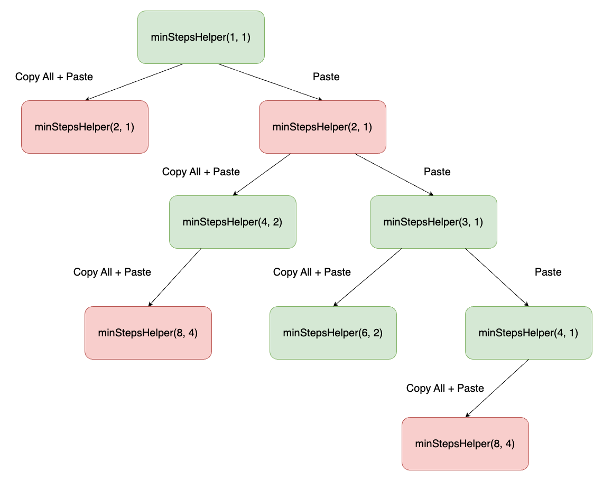
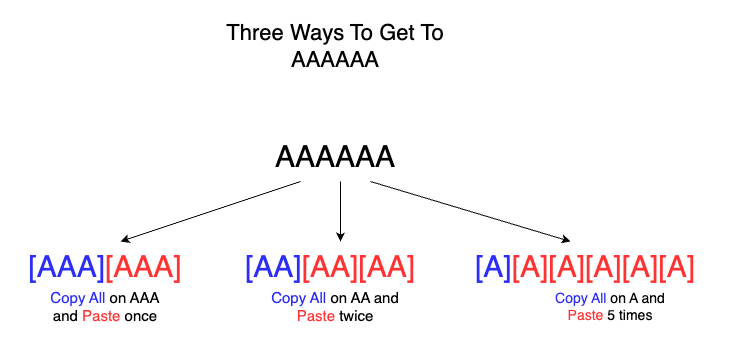

## Solution

---

### Overview

In the problem, we start with one character `A` on our screen. At each step, we can perform one of two operations available:

1. Copy All: Copy all the A's currently on the screen.
2. Paste: Paste all the A's that were copied in the last Copy All operation.

Given an integer `n`, the goal is to determine the minimum number of operations needed to get exactly `n` A's on the screen.

### Approach 1: Recursion / Backtracking

### Intuition

When adding A's on the screen to achieve `n` A's, we note that it is unnecessary to apply consecutive Copy All operations because applying consecutive Copy All operations has the same effect as applying just one. If a Copy All operation is applied, then a Paste operation should be applied right after. Thus, we have two options to add A's on the screen at every step:

1) Apply a Copy All operation first and then apply the Paste operation right after.
2) Apply a Paste operation.

A brute-force approach involves exploring both ways recursively at each step. This would allow us to find all possible sequences of operations that result in exactly `n` A's, and then choose the sequence that requires the minimum number of operations.

To implement this, we define a function $f(i, j)$, which represents the minimum number of operations needed to get to `n` A's starting with $i$ A's, where the previous copy operation had $j$ A's.

We can break the problem into subproblems based on the two options described above:

1. **Copy All + Paste**: This option takes 2 operations. It doubles the number of A's to $i * 2$, and updates the previous copy length to `i`. Thus, the number of operations needed for this choice is $2 + f(i * 2, i)$.

2. **Paste**: This option takes 1 Paste operation. It increases the number of A's by `j` while keeping the previous copy length as `j`. Thus, the number of operations needed for this choice is $1 + f(i + j, j)$.

By making recursive calls for these two choices — $2 + f(i * 2, i)$  and $1 + f(i + j, j)$ — our solution can return the minimum value among these options, effectively finding the global minimum number of operations needed to reach `n` A's.

### Algorithm

1. If $n = 1$, no operations are needed so return `0`.
2. Define a recursive helper function `minStepsHelper(int currLen, int pasteLen)`:
* **Base Case**: If $currLen = n$, then we have reached `n` A's, so return `0`
* **Base Case**: If `currLen > n`, then we have exceeded the number of A's needed, so return max value `1000`, ignoring this current sequence
* **Try Copy All + Paste**: Initialize `opt1` to $2 + minStepsHelper(currLen * 2, currLen)$, where 2 operations are used, `currLen` is doubled, and `pasteLen` is updated to `currlen`
* **Try Paste**: Initialize `opt2` to $1 + minStepsHelper(currLen + pasteLen, pasteLen)$, where 1 operation is used, `currLen` increases by `pasteLen` and `pasteLen` remains the same.
* Return the minimum between `opt1` and `opt2`
3. Return $1 + minStepsHelper(1, 1)$, the minimum number of operations to get to `n` A's from `1` `A`, where `pasteLen` is `1` from performing a Copy All operation first.

### Implementation

```python
class Solution:

    def __init__(self):
        self.n = 0

    def _min_steps_helper(self, curr_len, paste_len):
        # base case: reached n A's, don't need more operations
        if curr_len == self.n:
            return 0
        # base case: exceeded n `A`s, not a valid sequence, so
        # return max value
        if curr_len > self.n:
            return 1000

        # copy all + paste
        opt1 = 2 + self._min_steps_helper(curr_len * 2, curr_len)
        # paste
        opt2 = 1 + self._min_steps_helper(curr_len + paste_len, paste_len)

        return min(opt1, opt2)

    def minSteps(self, n: int) -> int:
        if n == 1:
            return 0
        self.n = n
        # first step is always a Copy All operation
        return 1 + self._min_steps_helper(1, 1)
```

### Complexity Analysis

* Time Complexity: $O(2^n)$

    The `minStepsHelper` function is recursively called 2 times at each point. The maximum height of the call stack would be $n$, leading to a total exponential time complexity of $O(2^n)$.

* Space Complexity: $O(n)$

    The space complexity is determined by the call stack, which has a maximum height of $O(n)$.

### Approach 2: Top-Down Dynamic Programming

### Intuition

In Approach 1, certain subproblems $f(i, j)$ can appear more than once, resulting in duplicate calculations. This issue is illustrated by the recursive call tree for `minStepsHelper`, where duplicate calls are highlighted in red.



To optimize this, we can utilize a technique called [memoization](https://leetcode.com/explore/learn/card/recursion-i/255/recursion-memoization/1495/), which stores previously computed results in a cache. With memoization, we can check if an answer to a subproblem has already been computed, and retrieve the answer from our cache to avoid redundant calculations.

Our cache can be a 2D array `memo`, where $\text{memo}[i][j]$ stores the answer to subproblem $f(i, j)$. The dimensions of `memo` can be $(n + 1) \times \left(\frac{n}{2} + 1\right)$, because the current number of characters is at most `n` and the previous copy length is at most $\frac{n}{2}$.

By employing memoization, we eliminate duplicate work and solve each unique subproblem exactly once, improving the efficiency of our solution.

### Algorithm

1. If $n = 1$, no operations are needed so return `0`.
2. Initialize cache $\text{memo}[i][j]$ to 2D array with dimensions $(n + 1) x (n / 2 + 1)$.
3. Define a recursive helper function `minStepsHelper(int currLen, int pasteLen, int[][] memo)`:
* **Base Case**: If $currLen = n$, then we have reached `n` A's, so return `0`
* **Base Case**: If `currLen > n`, then we have exceeded the number of A's needed, so return max value `1000`, ignoring this current sequence
* **Check cache**: If `memo` has the answer to the subproblem, return $\text{memo}[currLen][pasteLen]$.
* **Solve subproblem**:
* **Try Copy All + Paste**: Initialize `opt1` to $2 + minStepsHelper(currLen * 2, currLen)$, where 2 operations are used, `currLen` is doubled, and `pasteLen` is updated to `currlen`
* **Try Paste**: Initialize `opt2` to $1 + minStepsHelper(currLen + pasteLen, pasteLen)$, where 1 operation is used, `currLen` increases by `pasteLen` and `pasteLen` remains the same.
* Save the minimum between `opt1` and `opt2` in $\text{memo}[currLen][pasteLen]$ and return it.
4. Return $1 + minStepsHelper(1, 1, memo)$, the minimum number of operations to get to `n` A's from `1` `A`, where `pasteLen` is `1` due to performing a Copy All operation first.

### Implementation

```python
class Solution:
    def minSteps(self, n: int) -> int:
        if n == 1:
            return 0
        self.n = n

        self.memo = [[0] * (n // 2 + 1) for _ in range(n + 1)]
        return 1 + self._min_steps_helper(1, 1)

    def _min_steps_helper(self, curr_len: int, paste_len: int) -> int:
        if curr_len == self.n:
            return 0
        if curr_len > self.n:
            return 1000

        # return result if it has been calculated already
        if self.memo[curr_len][paste_len] != 0:
            return self.memo[curr_len][paste_len]

        opt1 = 1 + self._min_steps_helper(curr_len + paste_len, paste_len)
        opt2 = 2 + self._min_steps_helper(curr_len * 2, curr_len)
        self.memo[curr_len][paste_len] = min(opt1, opt2)
        return self.memo[curr_len][paste_len]
```

### Complexity Analysis

* Time Complexity: $O(n^2)$

    The time complexity is determined by the total number of subproblems solved, which is proportional to the size of the `memo` array: $(n + 1) \cdot (n / 2 + 1)$. This leads to a time complexity of $O(n^2)$.

* Space Complexity: $O(n^2)$

    The space complexity is determined by the size of the `memo` array, which is $O(n^2)$.

### Approach 3: Bottom-Up Dynamic Programming

### Intuition

An alternate approach is to solve our subproblems from bottom to top (bottom-up dynamic programming), by working from the base case up to the final answer. We define a new function $f(i)$ to represent the minimum number of operations to get to $i$ A's starting from 1 A. Note that in contrast to Approaches 1 and 2, we do not keep track of the length of the previous copy. This approach focuses on incrementally building up from the base case $f(1) = 0$ to $f(n)$, the final result.

To do this, we'd like to form a relation between subproblems and express $f(i)$ in terms of $f(j)$ for values of $j$ where $1 \leq j < i$.
For a given subproblem $f(i)$ where there are currently `i` A's, we recognize the last operation must have been a paste. Furthermore, we know that the number of A's previously copied must be a factor of $i$. For example, if we currently have $6$ A's, the previous copy could have been of $1$, $2$, or $3$ A's, which are all the factors of $6$.



 Thus, one possible way to make $i$ A's is to use the Copy All operation on $j$ A's, where $j$ is a factor of $i$. We can then paste the $j$ A's $(i - j)/ j$ times to reach a total of `i` A's. If this approach is chosen, then the minimum number of operations possible would be $f(j) + 1 + (i-j) / j$.  Here, $f(j)$ represents the minimum number of operations to reach $j$ A's, $1$ accounts for the single Copy All operation on the $j$ A's, and $(i-j) / j$ represents the number of additional Paste operations of $j$ A's needed.

 We can simplify the expression $f(j) + 1 + (i-j)/j$ to $f(j) + i/j$.

If we consider all possible factors $j$ of `i`, then we can solve for $f(i)$. Thus, we have the relation:

 $f(i) = f(j) + i/j$ for all $j$ such that $i \mod j = 0$. Note that $j \leq i/2$ since $i/2$ is the largest factor of $i$.

By iteratively applying this relation, we can build up to compute $f(n)$, effectively solving the problem from the bottom up.

### Algorithm

1. Initialize an array `dp` of size `n+1` where $\text{dp}[i] =  f(i)$, $1 <= i <= n$
2. Initialize values of `dp` to a default max value of `1000`
3. Fill in the base case: $\text{dp}[1] = 0$
4. Iterate through values of `i` from `2` to `n`:
* Iterate through values of `j` from `1` to `i/2`:
* If $i \% j = 0$: Set $\text{dp}[i]$ to minimum between $\text{dp}[i]$ and $\text{dp}[j] + i / j$.

### Implementation

```python
class Solution:
    def minSteps(self, n: int) -> int:
        dp = [1000] * (n + 1)

        # Base case
        dp[1] = 0
        for i in range(2, n + 1):
            for j in range(1, i // 2 + 1):
                # Copy All and Paste (i-j) / j times
                # for all valid j's
                if i % j == 0:
                    dp[i] = min(dp[i], dp[j] + i // j)

        return dp[n]
```

### Complexity Analysis

* Time Complexity: $O(n^2)$

    Initializing our `dp` array takes $O(n)$ time. To fill in the `dp` array, the outer and inner loop each run $O(n)$ times, resulting in a total time complexity of $O(n^2)$.

* Space Complexity: $O(n)$

    The space complexity is determined by our `dp` array, which has a size of $O(n)$.

### Approach 4: Prime Factorization

### Intuition

> Note: This approach contains some mathematical notation. We encourage you to read carefully to fully understand the intuition.

In Approach 3, we recognize that getting to $i$ A's will repeatedly involve a Copy All operation followed by a series of Paste operations. For example, a possible sequence of operations might look like `[CPP][CPPPP][CP]`. In this approach, we will find a way to minimize the length of each block of this sequence. In doing so, we can find the minimum number of operations needed to achieve `n` A's at the end.

To start, we call the length of the $i-th$ block in this sequence $g_i$. From this setup, We can make two important observations:

1. The total number of operations performed can be expressed as $g_1 + g_2 + ... + g_n$.
2. After applying $g_1$ operations, we have $g_1$ A's. Then, after applying $g_2$ operations, we have $g_1 \times g_2$ A's. In general, $g_1 \times g_2 \times ... \times g_n = n$.

Thus, to solve the problem, we need to find values for $g_1,g_2, ... , g_n$ so that their sum is minimized while ensuring that their product is equal to `n`.

Let's dive deep on how a certain block's length can be minimized. When examining a block $i$ where its length $g_i$ is composite, (i.e. $g_i = p \times q$), we can break it down into two smaller blocks of size $p$ and $q$. For example, if our first block is $[CPPPPP]$, where $g_i = 3 \times 2$, we can break that down into $[CPP][CP]$. This splitting reduces the total number of operations in this example from 6 to 5, while still producing the same number of A's as the original block.

Because using $p + q$ moves by splitting is never more than using $p \times q$ moves by not splitting, the optimal strategy involves breaking down each composite $g_i$ into its prime factors. Thus, splitting whenever possible will lead to the minimum number of operations.

This will lead to each $g_i$ being a prime factor of `n`. This problem then reduces to finding the sum of the prime factors of `n`.

### Algorithm

1. Initialize `ans` to 0, representing the current sum of prime factors
2. Initialize `d` to 2, the first possible prime factor to consider.
3. While `n` is not equal to `0`:
* **While d is a prime factor:** While $n \% d = 0$:
* **Divide `n` by the prime factor:** n = n / d
* **Add `d` to current sum `ans`:**`ans += d`
* **Increment `d` to find the next prime factor:** `d++`
4. Return `ans`

### Implementation

```python
class Solution:
    def minSteps(self, n: int) -> int:
        ans = 0
        d = 2
        while n > 1:
            # If d is prime factor, keep dividing
            # n by d until is no longer divisible
            while n % d == 0:
                ans += d
                n //= d
            d += 1
        return ans
```

### Complexity Analysis

* Time Complexity: $O(\sqrt{n})$

    The outer `while` loop runs until `n` becomes 1. The inner `while` loop divides `n` by `d` whenever `d` is a divisor of `n`.

    The factorization of `n` involves checking divisibility from $d = 2$ to $d \leq \sqrt{n}$. After `d` surpasses $sqrt{n}$, `n` can only have one prime factor greater than $\sqrt{n}$, which will be handled in one iteration of the outer loop.

    Thus, the complexity is dominated by the number of potential divisors up to $\sqrt{n}$, leading to a time complexity of $O(\sqrt{n})$.

* Space Complexity: $O(1)$

    Our iterative algorithm has no recursive overhead and no auxiliary data structures. Thus, the space complexity is $O(1)$.