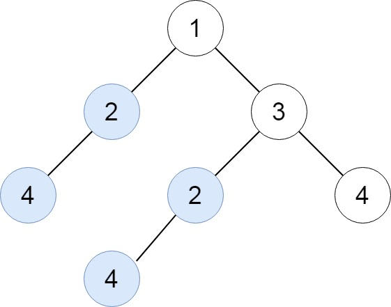

[TOC]

## Solution

---

### A String Representation Approach

#### Intuition

One may represent a tree with a string. There exist different ways to do so. One of the possible representations of a tree is the following: `(representation of the left subtree) root.val (representation of the right subtree)`. It is a recursive representation because the parts in the brackets are representations of smaller subtrees.



For example, the representation of the tree in the picture is `((4)2())1(((4)2())3(4))`.

Equal subtrees have equal string representations, and different trees have different ones. To solve the problem, one represents each subtree with a string. Duplicate representations mean duplicate subtrees.

>**Note.** If you do not know how to traverse a tree, we highly recommend you visit the [Binary Tree Explore Card](https://leetcode.com/explore/learn/card/data-structure-tree/134/traverse-a-tree/) as this is used frequently in tree problems. In this article, we will assume that you already understand how to traverse a tree.

We find a string representation for each subtree during the postorder tree traversal. With postorder, at the moment we handle a `node` we have already traversed its left and right subtrees. Therefore we can compose a string for the subtree of the `node` using the representations of its left and right subtrees.

We maintain a hash map that tracks how many times each string occurred during the traversal. If one occurs more than once, it represents duplicate subtrees.

#### Algorithm

The function `traverse(node)` traverses the subtree of the `node` and adds duplicate subtrees to the answer. The return value is the string representation of the subtree.

The function works as follows:

1. Traverse the left subtree of the `node` and get its representation (call recursively `traverse(node->left)`).
2. Traverse the right subtree of the `node` and get its representation (call recursively `traverse(node->right)`).
3. Compose the representation of the current subtree using the left subtree representation, the value of the `node`, and the right subtree representation.
4. If the string occurs for the second time, it means there already was the same subtree as the current one (the subtree of the `node`). In this case, we add the `node` to the answer.
5. Return the string from the function.

We only need to call `traverse(root)` to solve the problem.

#### Implementation

```python
class Solution:
    def findDuplicateSubtrees(self, root):
        def traverse(node):
            if not node:
                return ""
            representation = ("(" + traverse(node.left) + ")" + str(node.val)
                              + "(" + traverse(node.right) + ")")
            cnt[representation] += 1
            if cnt[representation] == 2:
                res.append(node)
            return representation
        cnt = collections.defaultdict(int)
        res = []
        traverse(root)
        return res
```

#### Complexity Analysis

Let `n` denote the number of nodes.

* Time complexity: $O(n^2)$.

The string representation of each subtree can have a length up to $O(n)$. Creating each representation therefore costs up to $O(n)$, and we find string representations for all $O(n)$ subtrees during the traversal.

* Space complexity: $O(n^2)$.

We store all string representations in the hash map. There are $O(n)$ subtrees, and each subtree representation has the length of $O(n)$.

---

### An Optimized Approach

#### Intuition

We can solve the problem more efficiently. Instead of representing a subtree with a string, we will use non-negative integer IDs: 0, 1, 2, and so on.

We want IDs to satisfy the same property as in the previous approach: equal subtrees have equal IDs, and different trees have different IDs.

Two subtrees are equal when they have equal root values, equal left subtrees, and equal right subtrees. Thus one can characterize a tree with the triplet `(ID of the left subtree, root value, ID of the right subtree)`. Equal subtrees have the same triplets.

Each subtree has its triplet and also its ID. We will maintain a hash map `tripletToID` that maps a triplet to an ID.

We find a triplet and an ID for each subtree during the postorder tree traversal. Again, at the moment when we are handling a `node` in postorder, its left and right subtrees are already visited, and we can compose a triplet for the subtree of the `node` using the IDs of the left and right subtrees.

If this triplet occurs for the first time, we assign the smallest available ID to this subtree. Otherwise, the triplet occurred earlier, and we get the ID from the hash map `tripletToID`.

We maintain one more hash map `cnt` (similar to the previous approach), that tracks how many times each ID occurred. When we at some point encounter an ID for the second time, we found duplicate subtrees and can add to the answer.

#### Algorithm

The function `traverse(node)` traverses the subtree of `node` and adds duplicate subtrees to the answer. The return value is the ID of the subtree.

The function works as follows:

1. Traverse the left subtree of the `node` and get its ID (call recursively `traverse(node->left)`).
2. Traverse the right subtree of the `node` and get its ID (call recursively `traverse(node->right)`).
3. Compose a triplet of the following values: the left subtree ID, the value of the `node`, and the right subtree ID.
4. If the triplet is not in the hash map `tripletToID`, we assign a new ID to this triplet – the smallest unused non-negative integer value (we can use the length of the map for this). Otherwise, get the ID from `tripletToID`.
5. If the ID occurs for the second time, it means there was already the same subtree as the current one (the subtree of `node`). In this case, we add `node` to the answer.
6. Return the ID from the function.

We only need to call `traverse(root)` to solve the problem.

#### Implementation

```python
class Solution:
    def findDuplicateSubtrees(self, root):
        def traverse(node):
            if not node:
                return 0
            triplet = (traverse(node.left), node.val, traverse(node.right))
            if triplet not in triplet_to_id:
                triplet_to_id[triplet] = len(triplet_to_id) + 1
            id = triplet_to_id[triplet]
            cnt[id] += 1
            if cnt[id] == 2:
                res.append(node)
            return id
        triplet_to_id = dict()
        cnt = collections.defaultdict(int)
        res = []
        traverse(root)
        return res
```

#### Complexity Analysis

Let `n` denote the number of nodes.

* Time complexity: $O(n)$.

We traverse the tree with $n$ nodes and, for each subtree, find a triplet and an ID. We perform operations with the hash maps `tripletToID` and `cnt`. Since an ID is an integer and a triplet has a length of 3 ($O(1)$), these operations take $O(1)$ time for each of the $n$ nodes.

* Space complexity: $O(n)$.

We store the hash maps `tripletToID` and `cnt`, which take $O(n)$ memory. Also, the recursion stack takes $O(n)$ memory.