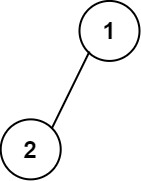
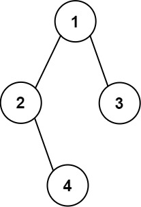

### 1. Description

Given the `root` of a binary tree, construct a **0-indexed** `m x n` string matrix `res` that represents a **formatted layout** of the tree. The formatted layout matrix should be constructed using the following rules:

- The **height** of the tree is `height` and the number of rows `m` should be equal to $height + 1$.

- The number of columns `n` should be equal to $2^height+1 - 1$.

- Place the **root node** in the **middle** of the **top row** (more formally, at location $\text{res}[0][(n-1)/2]$).

- For each node that has been placed in the matrix at position $\text{res}[r][c]$, place its **left child** at $res[r+1][c-2^height-r-1]$ and its **right child** at $res[r+1][c+2^height-r-1]$.

- Continue this process until all the nodes in the tree have been placed.

- Any empty cells should contain the empty string `""`.

Return *the constructed matrix *`res`.

### 2. Function Contract

**Methods**

- `TreeNode(val=0, left=None, right=None)`: Initializes the data structure.
- `printTree(root: Optional[TreeNode]) -> `List[List[str]]``: Executes operation.

### 3. Examples

#### Example 1

- **Input:** `root = [1,2]`
- **Output:** ``
[["","1",""],
["2","",""]]

#### Example 2

- **Input:** `root = [1,2,3,null,4]`
- **Output:** ``
[["","","","1","","",""],
["","2","","","","3",""],
["","","4","","","",""]]

### 4. Constraints

- The number of nodes in the tree is in the range $[1, 2^{10}]$.

- $-99 \le \text{Node.val} \le 99$

- The depth of the tree will be in the range `[1, 10]`.
