[TOC]

## Solution

---

### Overview

At first read, this problem might sound challenging. But the key to solving this problem lies in the details. Read the problem statement again and again. Try to list all the conditions given.

The key phrase is written in the first line of the problem statement itself, i.e., the array is **sorted in non-decreasing (increasing) order**. How is this important? Let's go through the conditions for a subsequence to be valid:

1. Each subsequence should consist of **consecutive** numbers in increasing order.
2. Each subsequence should be of length 3 or more.

Let's go through all the details one by one.

- Subsequence - it is an ordered subset of an array where the sequential ordering of elements is the same as in the parent array.
- Consecutive & Increasing sequence - every element should be exactly 1 more than the previous element.

Our job is to split the `nums` array into subsequences that satisfy the above conditions. We will think about implementation later. First, let's try to create subsequences on the paper. Suppose, at the $i^{th}$ index, we have `x` number of subsequences. There are two options we have:

- Add $\text{nums}[i]$ to one of the `x` subsequences if possible.
- Create a new subsequence with $\text{nums}[i]$ as the starting number.

Also, we need to keep in mind that each subsequence should be of length 3 or more. So at $i ^ {th}$ index, if we need to create a new subsequence and there is one or more existing subsequences of length less than 3, we can return `false` then. This is because the `nums` array is **sorted in increasing order** and each subsequence consists of **consecutive** elements. As we move from left to right in the array, the value of the elements keeps increasing, so it is impossible to find consecutively increasing elements for these subsequences (of length < 3) in the future.

This can be better understood with an example. Let's consider an array $nums = {1, 2, 3, 5, 6, 8, 9, 10}$.

- At $0^{th}$ index: {1} [new subsequence formed]
- At $1^{st}$ index: {1, 2} [add to the existing subsequence]
- At $2^{nd}$ index: {1, 2, 3}  [add to the existing subsequence]
- At $3^{rd}$ index: {1, 2, 3}, {5}  [new subsequence formed]
- At $4^{th}$ index: {1, 2, 3}, {5, 6}  [add to the existing subsequence]
- At $5^{th}$ index: {1, 2, 3}, {5, 6}, {8}  [new subsequence formed]

At this point, we see the second subsequence (`{5, 6}`) is of length 2. Because the elements are sorted in increasing order, there is no way we will get a `7` or a `4` to make this subsequence valid. So we can safely return `false` at this point.

Now let us think about ways to implement this logic using popular data structures.

</br>

---

### Approach 1: Greedy using Heap

**Intuition**

From the above discussion, it is clear that first of all, we need to consider ways to store the subsequences created so far. We can use a list of lists to store each subsequence. But wait, do we need to store the entire subsequence? Give it a thought.

Well, we need only the metadata of each subsequence. We know the subsequence consists of consecutive increasing numbers. So isn't it enough to know the first and the last element in the subsequence? We can also find the length of the subsequence from this information: $last - first + 1$.  We can store this information in an array of size `2`.

Now that we have found a possible way to store each subsequence, the next question is the order. As discussed earlier, at $i ^ {th}$ index, $\text{nums}[i]$ has two options - to be a part of any existing subsequence or to start a new subsequence. If we choose the first option, it will be a part of a subsequence whose last element value is $\text{nums}[i] - 1$. How can we find such a subsequence easily? By sorting subsequences in increasing order of their last element. Have doubts about believing this? Please refer to the intuition part again.

Now the next question is, what if the last element is the same for two or more subsequences? (Yes, it is possible, consider `{0, 1, 1, 2, 2, 3}`). In this case, at $5 ^ {th}$ index, `3` has two subsequences that it can be a part of: `{0, 1, 2}`, `{1, 2}`. But if it becomes a part of the first subsequence, the second subsequence will become invalid and we will return `false`. However, the answer should be `true`. How? By appending `3` to the second subsequence, we will get two valid subsequences: `{0, 1, 2}` and `{1, 2, 3}`. So what can we keep in mind from this example? Yes, we got the answer to the previously asked question, i.e., if the last element is the same for two or more subsequences, sort the subsequences based on the increasing order of their size.

Now when it comes to storing arrays in a sorted manner, what's the first thing that comes to your mind? Heaps. So can we use a heap in this use case? Let's try to use one. The heap will store 1D arrays of size `2` comprising of the first and the last element of each subsequence. The arrays in the heap will be stored based on two conditions:

- Increasing the order of their last element.
- When the subsequences' last elements are equal, then the two subsequences will be placed in increasing order of length.

For each element ($\text{nums}[i]$) we compare the element with the last element ($last = \text{subsequences.peek}()[1]$) of the existing subsequences in the heap one by one. There can be only 3 conditions:

1. $\text{nums}[i]$ > $last + 1$: $\text{nums}[i]$ cannot be a part of this subsequence. So we remove this subsequence from the heap and compare $\text{nums}[i]$ with the next subsequence in the heap.
2. $\text{nums}[i]$ == `last` (or the heap is empty): $\text{nums}[i]$ cannot be a part of this subsequence either. As the subsequences are stored in increasing order of their last element in the heap, there will be no other subsequences in the heap to append $\text{nums}[i]$. So the only way here is to start a new subsequence with $\text{nums}[i]$ as the only element.
3. $\text{nums}[i] = last + 1$: we add $\text{nums}[i]$ to this subsequence. As the subsequences with equal last elements are stored in increasing order of their length, this current subsequence will be the shortest subsequence ending with $\text{nums}[i] - 1$.

This can be better understood with the following animation.

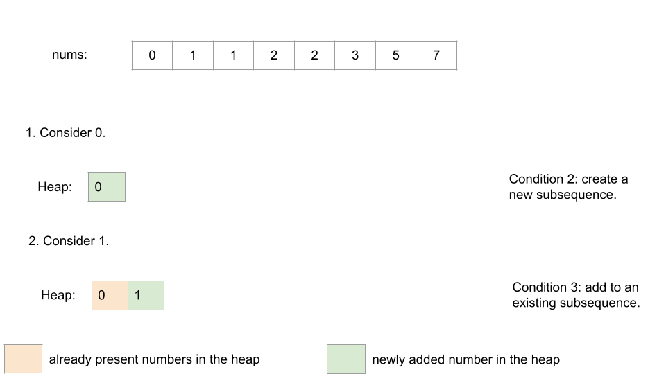

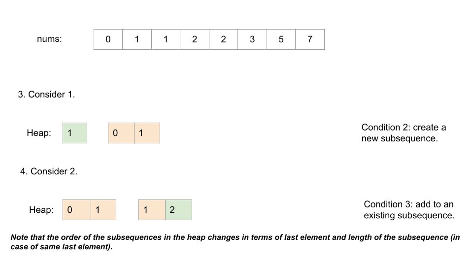

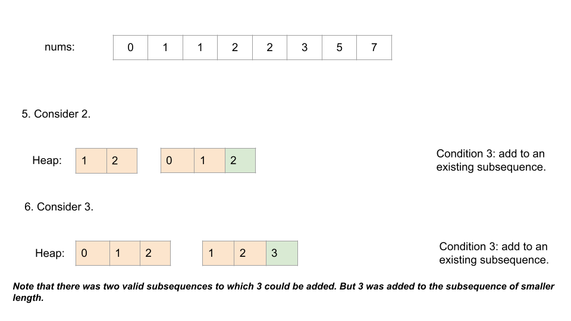

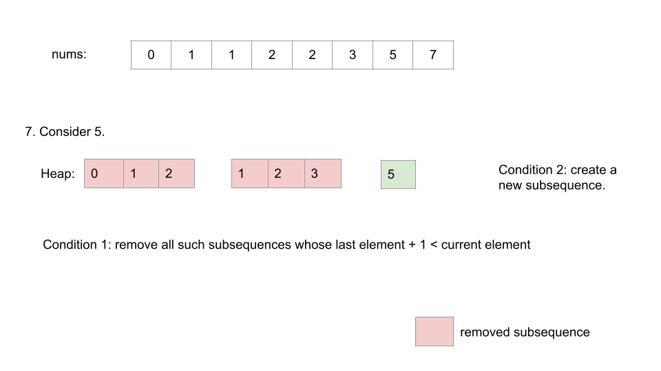

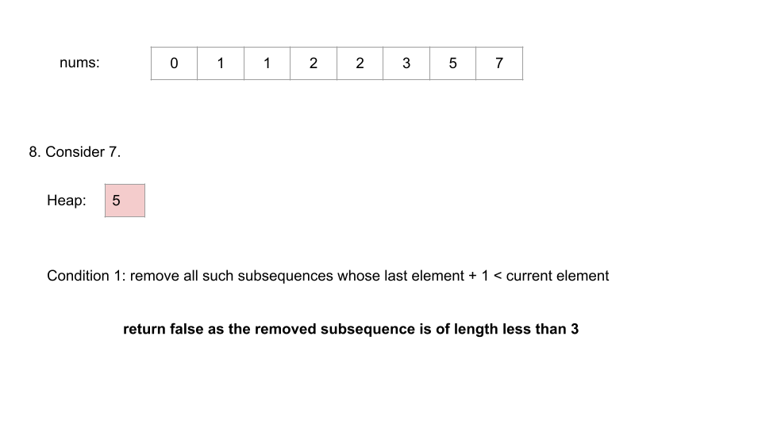

</br>

**Algorithm**

1. Create a heap to store 1D arrays with the required conditions. Each array is of size 2 and represents a subsequence. We store the first and the last element of each subsequence in the array.

2. Iterate over the `nums` array.

- Compare the last element of each existing subsequence in the heap with the current element `num`. If the last element is smaller than $num - 1$, we cannot add `num` or any future element to that subsequence. So we remove it from the heap. While removing, check if its length is greater than or equal to 3. If not, return `false`.

- If the heap is empty or the last element of the first subsequence in the heap is equal to `num`, create a new subsequence with `num` as the only element and add it to the heap.

- If there exists a valid subsequence of which `num` can be a part, add `num` to it. If there are multiple valid subsequences, choose the subsequence with the smallest length possible.

3. Check the length of all the subsequences present in the heap. If any of them is of length less than `3`, return `false`. Otherwise, return `true`.

**Implementation**

```cpp
class Solution {
public:
    struct Compare {
        bool operator()(array<int, 2> subsequence1, array<int, 2> subsequence2) {
            if (subsequence1[1] == subsequence2[1]) {
                return (subsequence1[1] - subsequence1[0]) > (subsequence2[1] - subsequence2[0]);
            }
            return subsequence1[1] > subsequence2[1];
        }
    };

    bool isPossible(vector<int> &nums) {
        priority_queue<array<int, 2>, vector<array<int, 2>>, Compare> subsequences;

        for (int num : nums) {
            //Condition 1 - remove non-qualifying subsequences
            while (!subsequences.empty() && subsequences.top()[1] + 1 < num) {
                array<int, 2> currentSubsequence = subsequences.top();
                subsequences.pop();
                int subsequenceLength = currentSubsequence[1] - currentSubsequence[0] + 1;
                if (subsequenceLength < 3) {
                    return false;
                }
            }
            //Condition 2 - create a new subsequence
            if (subsequences.empty() || subsequences.top()[1] == num) {
                subsequences.push({num, num});
            } else {
                //Condition 3 - add num to an existing subsequence
                array<int, 2> currentSubsequence = subsequences.top();
                subsequences.pop();
                subsequences.push({currentSubsequence[0], num});
            }
        }

        //If any subsequence is of length less than 3 return false
        while (!subsequences.empty()) {
            array<int, 2> currentSubsequence = subsequences.top();
            subsequences.pop();
            int subsequenceLength = currentSubsequence[1] - currentSubsequence[0] + 1;
            if (subsequenceLength < 3) {
                return false;
            }
        }
        return true;
    }
};
```

**Complexity Analysis**

Here $N$ is the size of the `nums` array.

* Time complexity: $O(N \log (N))$.

    In the worst case, each subsequence will be of length $1$ (say for $nums = {1, 1, 1, 1}$). So there will be a total `N` arrays (subsequences) in the heap. Each subsequence is added and removed from the heap only once and each such operation takes $\log (N)$ time. So the overall time complexity will be $O(N \log (N))$.

* Space complexity: $O(N)$.

    Each of the $N$ elements in the `nums` array is added as a part of a subsequence in the heap only once. So the extra space occupied by the heap will be in the order of $N$.

<br/>

---

### Approach 2: Greedy using Maps

**Intuition**

In our previous approach, we applied the Greedy algorithm to create increasing subsequences consisting of consecutive elements. In this approach, for each element (say $\text{nums}[i]$) we will see if it is possible to form a valid subsequence with the remaining elements. Previously we were trying to find a subsequence to which we can append $\text{nums}[i]$. We will continue to do that here as well. However, while creating a new subsequence with $\text{nums}[i]$ as the starting element, we will check if a valid subsequence is possible or not with $\text{nums}[i]$ as the starting element. If not, we will return `false` without any further operations.

The first thing that comes to mind while reading the last line of the previous paragraph is that we need to know if a valid subsequence is possible or not with $\text{nums}[i]$ as the starting element at the $i ^ {th}$ iteration. For a valid subsequence we need $\text{nums}[i] + 1$ and $\text{nums}[1] + 2$ to be present in the array. Thus we need to know the count of these two numbers in advance to make the decision at the $i ^ {th}$ iteration. We can use a `map` here since it's the most convenient data structure to store the frequency of each element in the array.

But is one `map` enough? Well, what if we want to add $\text{nums}[i]$ in one of the existing subsequences? How are we going to store the existing subsequences? By using a `heap` like before? When we are creating a new subsequence at the $i ^ {th}$ iteration, we are ensuring that a valid subsequence is possible with $\text{nums}[i]$. So we don't need a heap to record the length or sort the subsequences. For adding $\text{nums}[i]$ to an existing subsequence we only need to know if such a subsequence exists whose last element is $\text{nums}[i] - 1$.

Now can you think of how to store this information? We just need to store the last element in the subsequence in a `set` when a subsequence is created or modified. This way, if we want to add $\text{nums}[i]$ to an existing subsequence, we can just check if $\text{nums}[i] - 1$ exists in the `set`. But wait, is using a `set` enough? Of course, we can get the answer in $O(1)$ time using `sets`. But what if there is more than one subsequence with the same last element? Well, in this case, we need to store the frequency as well. We can use another `map` for that. The time complexity will remain the same and our problem will also be solved.

You can do a dry run in pen and paper. See if you can find out the conditions for entry and exit in each `map`. Then have a look at this animation.

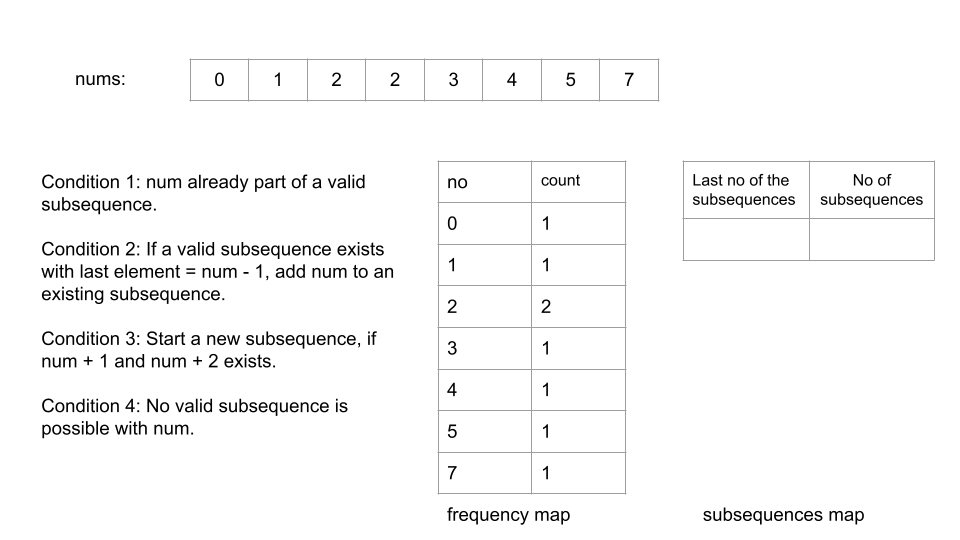

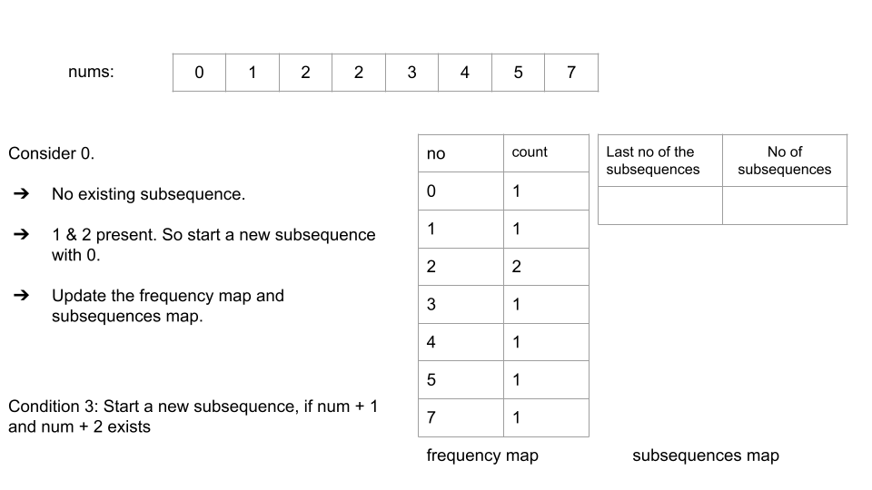

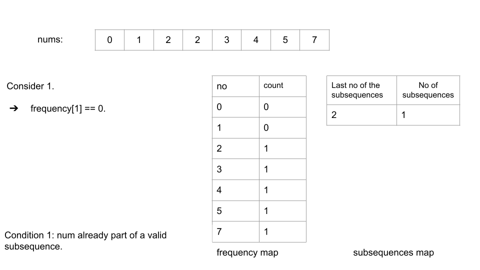

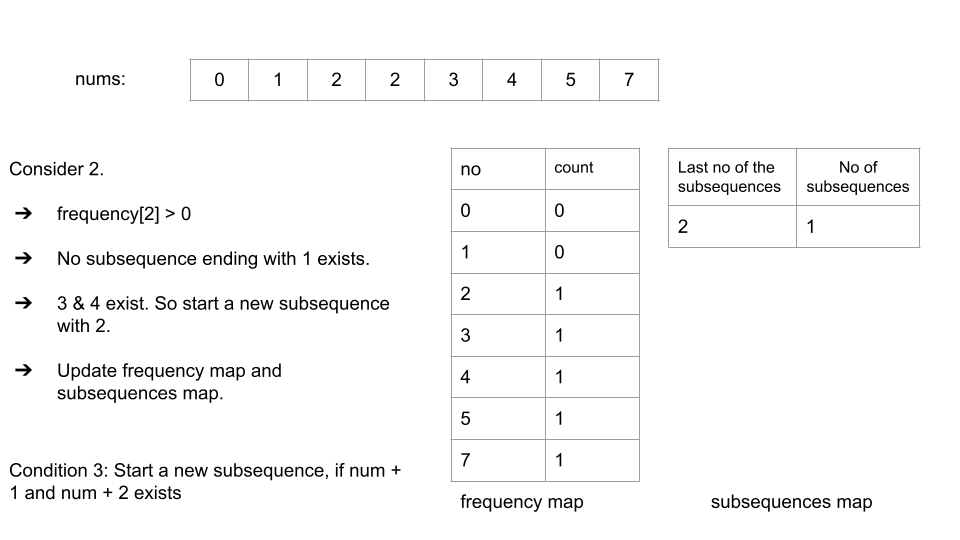

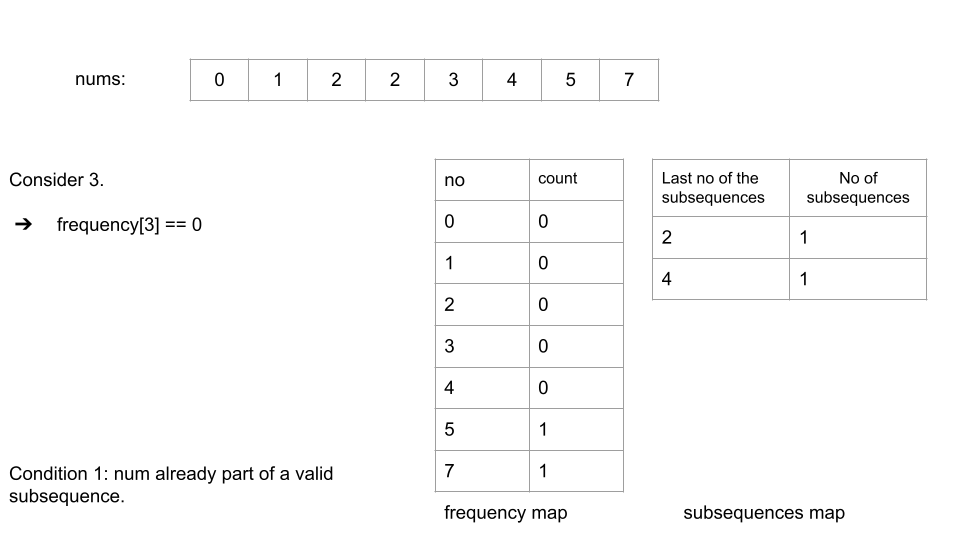

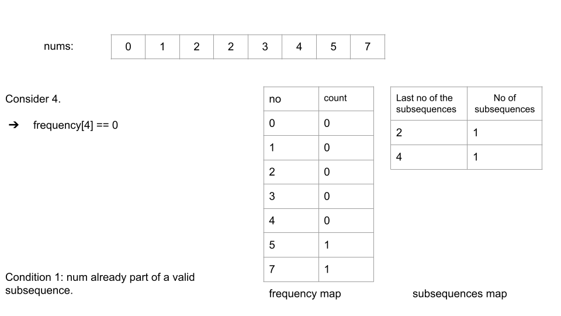

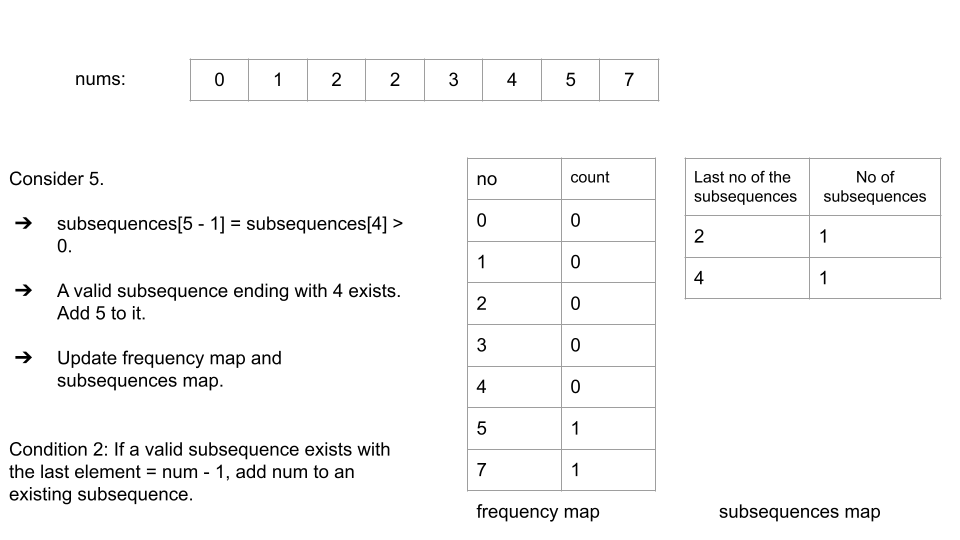

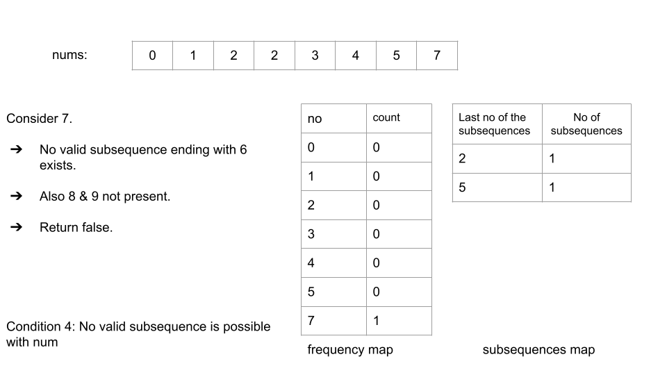

</br>

**Algorithm**

1. Initialize two maps - one to store the frequency of each element present in `nums` array (`frequency`), the other to store the frequency of subsequences ending with the `key` (`subsequences`).

2. Iterate over the `nums` array to update the `frequency` map.

3. Iterate over the `nums` array.

- If the frequency of the current element `num` is `0`, it means the num is already considered to be a part of a valid subsequence. Continue.

- Next, check if it is possible to add `num` to one of the existing subsequences. For this, check if there is an entry with `key` as $num - 1$ in the `subsequences` map. If there exists such an entry, it means we can add `num` to an existing subsequence. Make the necessary changes in `subsequences` map to keep it consistent.

- If no such subsequence exists, we need to create a new subsequence with `num` as the first element. For this, we need to check if $num + 1$ and $num + 2$ exist or not. If they don't, no valid subsequence is possible with `num` as the starting element. Return `false`. Otherwise, make the necessary changes in `subsequences` map to keep it consistent.

4. After the traversal is done, return `true`.

**Implementation**

```cpp
class Solution {
public:
    bool isPossible(vector<int> &nums) {
        unordered_map<int, int> subsequences;
        unordered_map<int, int> frequency;
        for (int num : nums) {
            frequency[num]++;
        }
        for (int num : nums) {
            //num already part of a valid subsequence.
            if (frequency[num] == 0) {
                continue;
            }
            //If a valid subsequence exists with last element = num - 1.
            if (subsequences[num - 1] > 0) {
                subsequences[num - 1]--;
                subsequences[num]++;
            } else if (frequency[num + 1] > 0 && frequency[num + 2] > 0) {
                // If we want to start a new subsequence, check if num + 1 and num + 2 exists
                // Update the list of subsequences with the newly created subsequence
                subsequences[num + 2]++;
                frequency[num + 1]--;
                frequency[num + 2]--;
            } else {
                // No valid subsequence is possible with num
                return false;
            }
            frequency[num]--;
        }
        return true;
    }
};
```

**Complexity Analysis**

Here $N$ is the length of the `nums` array.

* Time complexity: $O(N)$.

    We are iterating over the `nums` array twice, which adds $O(2 * N) = O(N)$ to the time complexity. Operations on an unordered map/hashmap take $O(1)$ time in the average case. Thus the overall time complexity is $O(N)$.

* Space complexity: $O(N)$.

    We are using two maps. `frequency` map will store at max $N$ elements. The total number of subsequences will also be $N$ in the worst case. Thus the size of the `subsequences` map will also be at max $N$. Therefore, it's a $O(N)$ space solution.

<br/>

---

### Approach 3: Dynamic Programming

**Intuition**

Given that the array consists of numbers in non-decreasing order, we can make the following observation:

Anytime we encounter two adjacent elements with a difference of > 1, a new subsequence must start. In other words, these points (of > 1 jump) can be treated as a break-point that separates the array into two segments that can be treated in isolation, since no valid subsequence can cross over from the left segment to the right segment while maintaining the first condition (each subsequence consists of consecutively increasing elements).

That is the approach we take here, checking each such segment for validity. The idea is to ensure that all elements in each such segment can be accommodated inside a valid subsequence of length >= 3.

How do we check each segment for validity?

The idea is to linearly process all elements in the segment and keep track of how many subsequences (consisting of consecutive elements) of lengths one and two can end at the present index. This also requires us to keep track of the total count (frequency) of each element in this segment. Another important observation is that due to the nature of the input, all elements with the same value will be placed consecutively in the segment.

Instead of storing the frequency of each number directly, in order to optimize space usage, we store the frequency of the difference of each number in the segment with the starting number ($\text{nums}[start]$) of each segment. This way we can store the frequency of each number in an array of size equal to the total number of unique numbers present in the segment which can be at max the segment length (`noOfUniqueNumbers`). Henceforth, we consider each element in terms of their difference, i.e., $\text{nums}[i]$ is denoted by $\text{nums}[i] - start$. This way we can store all the required values in arrays of size `noOfUniqueNumbers`. Otherwise, arrays of size $\text{nums}[end]$ would have been required.

We take three arrays for calculation purposes.

- `lengthOneSubsequences`: at $i ^ {th}$ index it holds the number of subsequences of length one ending with $i$.
- `lengthTwoSubsequences`: at $i ^ {th}$ index it holds the number of subsequences of length two ending with $i$.
- `totalNoOfSubsequences`: at $i ^ {th}$ index it holds the total number of existing subsequences ending with $i$.

At an index $i$, we calculate the number of sequences of lengths one and two ending with $i$ as follows:

- Note that if $\text{frequency}[i]$ is less than sum of $lengthOneSubsequences[i - 1]$ and $lengthTwoSubsequences[i - 1]$, it means there aren't enough $i$ elements to create valid subsequences ($lengthOneSubsequences[i - 1]$ and $lengthTwoSubsequences[i - 1]$ will be valid only if there are enough $i$ elements to append). We can check for this condition and break early if it's true.

Next, we do the following:

- $\text{lengthTwoSubsequences}[i] = lengthOneSubsequences[i - 1]$ (All sequences of length one, ending at $i - 1$ can be extended by adding $i$ to the end of it. Also, priority should be given to `lengthOneSubsequences` since we need to choose the smallest length subsequence possible)

- $\text{lengthOneSubsequences}[i] = max(0, \text{frequency}[i] - totalNoOfSubsequences[i - 1])$, ($totalNoOfSubsequences[i - 1]$ is equal to $frequency[i - 1]$). Since $totalNoOfSubsequences[i - 1]$ represents the number of subsequences ending with $i - 1$, the difference represents the number of $i$ valued elements left over after adding $i$ to existing subsequences. These remaining $i$ valued elements will form a new subsequence of length `1`.

- We also need to update $\text{totalNoOfSubsequences}[i]$ to $\text{frequency}[i]$.

After exiting the loop, we check if there exists any subsequence of length one or two ending with value $end - start$. If there isn't any such subsequence, we return `true`.

**Algorithm**

1. Iterate over the `nums` array.
2. Initialize `start` variable to `0`. This will hold the starting index of the current segment.
3. Whenever the difference between consecutive elements ($\text{nums}[i] - nums[i -1]$) is more than one, a new segment needs to be created.
4. Before iterating further, we need to check if valid subsequences are possible with the current segment (between `start` and `i`). To do so make a call to the `isSegmentValid` function.
5. In the `isSegmentValid` function,
- Initialize `noOfUniqueNumbers` to $end - start + 1$. Note this variable does not denote the length of the segment. It denotes the number of unique numbers present in the current segment.
- The frequency of each number is stored in terms of their difference with the first number of the segment ($\text{nums}[start]$) in the `frequency` array. Thus each segment is considered as a series starting with `0` and ending with $\text{nums}[end] - \text{nums}[start]$.
- Next, we iterate over each unique element in the segment ranging from `0` to $\text{nums}[end]- \text{nums}[start]$.
- If the $\text{frequency}[i]$ is less than the total number of one and two length subsequences ending with $i - 1$, we do not have enough $i$ valued numbers to make these one/two length subsequences ending with $i - 1$ valid. So return `false`.
- For each unique value encountered, we update the `lengthOneSubsequences`, `lengthTwoSubsequences`, `totalNoOfSubsequences` arrays as mentioned in the intuition.
- Before exiting, check if there are any remaining sequences of length one or two. If not, we return `true`.

**Implementation**

```cpp
class Solution {
public:
    bool isPossible(vector<int> &nums) {
        int n = nums.size();
        int start = 0;

        for (int i = 1; i < n; i++) {
            // Check the possibility of a valid segment starting at index start and ending at index i - 1.
            if (nums[i] - nums[i - 1] > 1) {
                if (!isSegmentValid(nums, start, i - 1)) {
                    return false;
                }
                // Update the starting index of the next segment.
                start = i;
            }
        }
        // Check for the last segment
        return isSegmentValid(nums, start, n - 1);
    }

private:
    bool isSegmentValid(vector<int> &nums, int start, int end) {
        int noOfUniqueNumbers = nums[end] - nums[start] + 1;

        // Count the frequency of each number in the current segment.
        vector<int> frequency(noOfUniqueNumbers);

        for (int i = start; i <= end; i++) {
            frequency[nums[i] - nums[start]]++;
        }
        // lengthOneSubsequences[i] holds the count of subsequences of length 1 ending with index i
        vector<int> lengthOneSubsequences(noOfUniqueNumbers);

        // lengthTwoSubsequences[i] holds the count of subsequences of length 2 ending with index i
        vector<int> lengthTwoSubsequences(noOfUniqueNumbers);

        // totalNoOfSubsequences[i] holds the count of all subsequences ending with index i
        vector<int> totalNoOfSubsequences(noOfUniqueNumbers);

        lengthOneSubsequences[0] = totalNoOfSubsequences[0] = frequency[0];

        for (int i = 1; i < noOfUniqueNumbers; i++) {

            // If the frequency[i] is less than the total number of subsequences ending with i - 1,
            // we do not have enough subsequences where we can put i.
            if (frequency[i] < lengthOneSubsequences[i - 1] + lengthTwoSubsequences[i - 1]) {
                return false;
            }

            //Total number of subsequences of length 2 can be obtained by adding i
            //to subsequences of length 1 ending with i - 1.
            lengthTwoSubsequences[i] = lengthOneSubsequences[i - 1];

            // For the remaining i valued numbers we can either add them to an existing subsequence
            // or create a new one. We first try to add them to the existing subsequences ending
            // with i - 1. If there are not enough of such subsequences, we start a new subsequence.
            // The existing subsequences ending with i - 1 are denoted by totalNoOfSubsequences[i - 1];
            lengthOneSubsequences[i] = max(0, frequency[i] - totalNoOfSubsequences[i - 1]);
            totalNoOfSubsequences[i] = frequency[i];
        }

        // If there is no remaining subsequence of length one or two, we can return true.
        // Otherwise, return false.
        return lengthOneSubsequences[noOfUniqueNumbers - 1] == 0 &&
               lengthTwoSubsequences[noOfUniqueNumbers - 1] == 0;
    }
};
```

**Complexity Analysis**

Here $N$ is the size of the `nums` array.

* Time complexity: $O(N)$.

    At one glance, it might look like the `isSegmentValid` function takes $O(N)$ time. However, if you look at the value of `noOfUniqueNumbers`, you will realize that the `for` loop in the `isSegmentValid` function iterates over each unique element in the `nums` array only once. For the given array of size $N$ there can be at max $N$ unique elements. Thus the overall time complexity is $O(N)$.

* Space complexity: $O(N)$.

    In the `isSegmentValid` function four arrays of size at max $N$ are used. So the space complexity is $O(N * 4) = O(N)$ in Big O notation.

<br/>

---
### Approach 4: Optimal Space

**Intuition**

In this approach, we will try to optimize the space usage in Approach 3. How? Let's go through the `isSegmentValid` again. Do we really need the four arrays of size `N`? First, let's try to remove the `frequency` array. The `frequency` array stores the frequency of each number in the current subsequence in the form of their difference with the first number, i.e., $\text{nums}[start]$. If we look at the second `for` loop in the `isSegmentValid` function, we'll notice that at each iteration we only need the value of $\text{frequency}[i]$. Also, the value of $\text{frequency}[i]$ is independent of $frequency[i - 1]$. So we can compute this value on the fly. At any point, we only need the count of how many numbers with the same value are present. This can be easily stored in a variable (say `frequency`) as the same valued numbers are present consecutively in the `nums` array. As long as we get the same value, i.e., $\text{nums}[i] = nums[i - 1]$, we increment `frequency`. Whenever we encounter a new value, we will update the value of `frequency` to `1`.

Next, let's check if we need arrays `lengthOneSubsequences`, `lengthTwoSubsequences`, and `totalNoOfSubsequences`. In the second `for` loop of the `isSegmentValid` function at $i^{th}$, we are only using the value of these arrays at index $i - 1$. Thus we don't need to store the count of subsequences of length one, two, and the total count of all the indices since knowing the previous value is enough. So let's replace these arrays with integer variables.

This way we can reduce the space complexity of Approach 3 to $O(1)$.

**Algorithm**
1. Iterate over the `nums` array.
2. Initialize `start` variable to `0`. This will hold the starting index of the current segment.
3. Whenever the difference between consecutive elements ($\text{nums}[i] - nums[i -1]$) is more than one, a new segment needs to be created.
4. Before iterating further, we need to check if valid subsequences are possible with the current segment (between `start` and `i`). To do so make a call to the `isSegmentValid` function.
5. In the `isSegmentValid` function,
- Initialize variables `lengthOneSubsequences`, `lengthTwoSubsequences`, `totalNoOfSubsequences` to `0`.
- Initialize `frequency` to `1`.
- Next, we iterate over each element in the segment ranging from `start` to `end`.
- If the value of $\text{nums}[i] = nums[i - 1]$, we just increment the `frequency` value by `1`.
- If the $\text{frequency}[i]$ is less than the total number of subsequences ending with i - 1, we do not have enough `i` valued numbers to make these one/two length subsequences ending with $i - 1$ valid. So return `false`.
- Otherwise, we update the `lengthOneSubsequences`, `lengthTwoSubsequences`, `totalNoOfSubsequences` variables as mentioned in the intuition. Update `frequency` to `1` as a new value has been encountered.
- Before exiting, check if there are any remaining sequences of length one or two. If there are not, we return `true`.

**Implementation**

```cpp
class Solution {
public:
    bool isPossible(vector<int> &nums) {
        int n = nums.size();
        int start = 0;

        for (int i = 1; i < n; i++) {
            //Check possibility of a valid segment starting at index start and ending at index i - 1.
            if (nums[i] - nums[i - 1] > 1) {
                if (!isSegmentValid(nums, start, i - 1)) {
                    return false;
                }
                //Update the starting index of the next segment.
                start = i;
            }
        }
        //Check for the last segment
        return isSegmentValid(nums, start, n - 1);
    }

private:
    bool isSegmentValid(vector<int> &nums, int start, int end) {
        int frequency = 0;

        //lengthOneSubsequences holds count of subsequences of length 1.
        int lengthOneSubsequences = 0;

        //lengthTwoSubsequences holds count of subsequences of length 2.
        int lengthTwoSubsequences = 0;

        //totalNoOfSubsequences holds count of all subsequences.
        int totalNoOfSubsequences = 0;

        for (int i = start; i <= end; i++) {
            if (i > start && nums[i] == nums[i - 1]) {
                frequency++;
            } else if (frequency < lengthOneSubsequences + lengthTwoSubsequences) {
                // If the frequency[i] is less than total number of subsequences ending with i - 1,
                // we do not have enough subsequences where we can put i.
                return false;
            } else {
                // Total number of subsequences of length 2 can be obtained by
                // adding i to subsequences of length 1 ending with i - 1.
                lengthTwoSubsequences = lengthOneSubsequences;
                lengthOneSubsequences = max(0, frequency - totalNoOfSubsequences);
                totalNoOfSubsequences = frequency;
                frequency = 1;
            }
        }
        // For the last element in the segment.
        lengthTwoSubsequences = lengthOneSubsequences;
        lengthOneSubsequences = max(0, frequency - totalNoOfSubsequences);
        // If there is no remaining subsequence of length one or two, we can return true.
        // Otherwise, return false.
        return lengthOneSubsequences == 0 && lengthTwoSubsequences == 0;
    }
};
```

**Complexity Analysis**

Here $N$ is the size of the `nums` array.

* Time complexity: $O(N)$.

    At one glance, it might look like the `isSegmentValid` function takes $O(N)$ time. However, upon closer inspection of the values of the `start` and `end` variables, we can see that the `for` loop in the `isSegmentValid` function iterates over each element of the `nums` array only once. The `start` and the `end` variables denote the starting and the ending index of a segment at any point respectively. The `isSegmentValid` function is run for each segment only once. Thus, the overall time complexity is $O(N)$.

* Space complexity: $O(1)$.

    Only a constant amount of extra space is required for this approach.

<br/>

---