## Solution

---

### Overview

In this problem, we are given an `m x n` integer matrix `img`.

We need to return a matrix of dimension `m x n` where each cell is obtained by applying **smoother** on the corresponding cell of the `img` matrix.

Now, **smoother**, as given in the problem statement, can be thought of as an operator that takes as an input a cell. It then returns the *average* of the values of the "cell and its *neighbors*".

- *average*: the average of a list of integers is the sum of the integers divided by the number of integers in the list. The average can be a floating point number, and in that case, the smoother should round down the result to the nearest integer.

- *neighbors*: a cell is called a neighbor of another cell if they share a common edge or a common corner.

Now, based on the different numbers of neighbors, let's see how we can apply the **smoother** operator on a cell.

- A cell can have at most 8 neighbors. 4 of these share a common edge, and the remaining 4 share a common corner.

   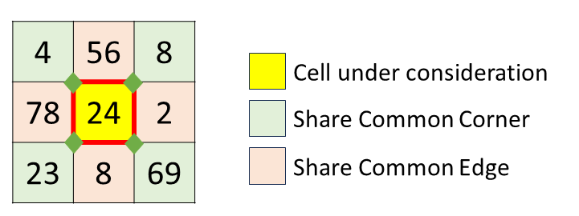

   To apply smoother on the central cell, colored in yellow, we need to find the average of the values of the cell and its 8 neighbors. It is worth noting that for computing the average, we need to consider the value of the cell itself as well.

   - The sum of the values of the cell and its 8 neighbors is $24 + 4 + 56 + 8 + 78 + 2 + 23 + 8 + 69$, which adds up to `272`.

   - The number of cells we are using to compute the average is `9`.

   - Hence, the average is $272 / 9$, which is `30.22`, rounded down to `30`.

- If there is only one cell in the matrix, then it has no neighbors.

    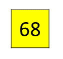

    To apply smoother on this cell, we need to find the average of the values of the cell and its (non-existent) neighbors.

- The sum of the values of the cell and its 0 neighbors is the value present in the cell itself, which is `68`.

- The number of cells we are using to compute the average is `1` only since there were no neighbors.

- Hence, the average is $68 / 1$, which is the same as the value of the cell itself, which is `68`.

- If there is more than one cell in the matrix, then each cell has at least one neighbor.

    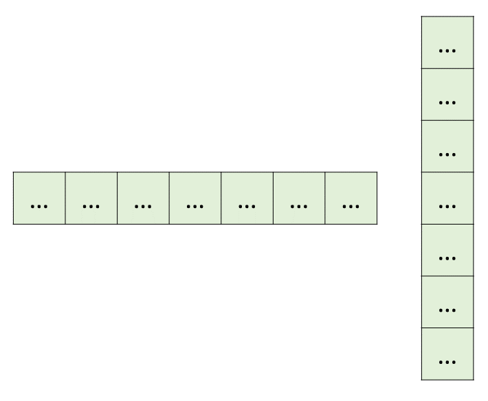

- If the matrix has more than one row, and more than one column, then each cell has at least 3 neighbors.

    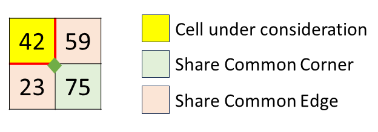

    To apply smoother on the corner cell, colored in yellow, we need to find the average of the values of the cell and its 3 neighbors.

- The sum of the values of the cell and its 3 neighbors is $42 + 59 + 23 + 75$, which adds up to `199`.

- The number of cells we are using to compute the average is `4`.

- Hence, the average is $199 / 4$, which is `49.75`, rounded down to `49`.

Thus, using this way, we need to apply the **smoother** operator on each cell of the `img`, and return the resultant matrix.

<details> <summary> <b> Why it is called a smoother? </b> Click to find out! </summary>

<p>

> Grayscale images are nothing but a matrix (two-dimensional array) of integers. Each integer represents a pixel, the smallest unit of a digital image. The value of the integer represents the intensity of the pixel. The higher the value, the more intense the pixel is. The intensity of the pixel ranges from `0` to `255`. The value `0` represents black, and the value `255` represents white. The values in between represent different shades of gray.
>
> Here is a grayscale image of size `400 px x 400 px`.
>
> 
>
> One pixel represents one cell, hence the dimension of the corresponding matrix will be `400 x 400`. Here is what a part of the matrix looks like.
>
> 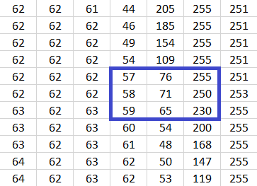
>
> On applying the **smoother** operator on each cell of the matrix, the same part of the matrix will look like this.
>
> 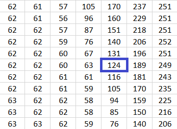
>
> Let's convert the smoothened matrix back to the grayscale image, and compare it with the original image.
>
> 
>
> Readers can observe that the image after applying the **smoother** operator is blurr than the original image with sharp and fine details chopped off. If we again and again apply the **smoother** operator on the image, the image will become more and more blurred. Here are a few rounds of repeated application of the **smoother** operator on the image.
>
> 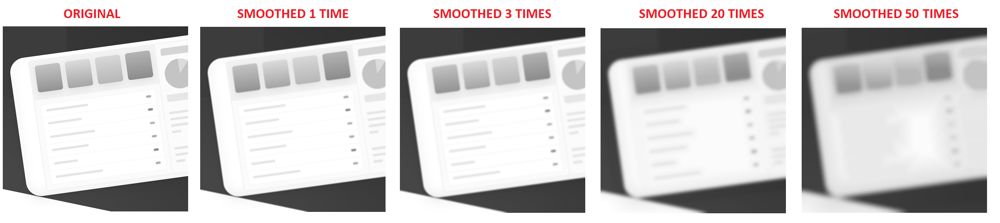

> As **trivia**, it is worth knowing that a grayscale image is a two-dimensional array of integers, but a colored image is a three-dimensional array of integers. It has three dimensions because each pixel has three components: red, green, and blue. The value of each component ranges from `0` to `255`. The value `0` represents the absence of the component, and the value `255` represents the presence of the component in its full intensity. The values in between represent different shades of the component. The three components together represent the color of the pixel.

</p>
</details>
<br/>

Let's see how we can solve this problem with different approaches.

---

### Approach 1: Create a New Smoothened Image

#### Intuition

We know that for applying the **smoother** operator, we need to consider the neighbors in the original `img` matrix, not the neighbors in the resultant matrix. Hence, we cannot overwrite the values of the `img` matrix with the result of the **smoother** operator.

The following example illustrates this point.

> Let our `img` be `[[100, 0, 10], [0, 0, 25], [10, 10, 10]]`. The output should be `[[25, 22, 8], [20, 18, 9], [5, 9, 11]]`
>
> 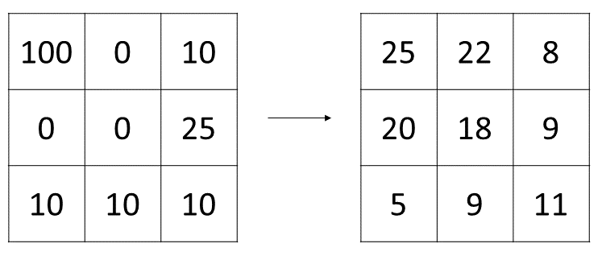
>
> Assume that we have applied the smooth operator on the first cell, and overwritten the value of the cell with the result. The `img` now will become `[[25, 0, 10], [0, 0, 25], [10, 10, 10]]`.
>
> 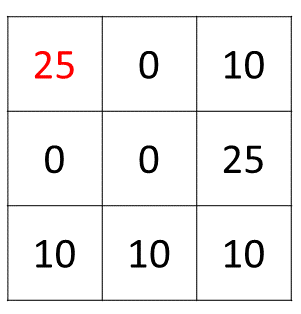
>
> Now if we use this matrix to apply the smooth operator on the second cell of the first row, we will get the value `10` instead of the expected value `22`.
>
> 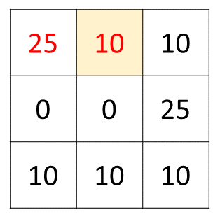

For this reason, we will not overwrite the values of the `img` matrix with the result of the **smoother** operator. This, thus calls for an extra space to store the result of the **smoother** operator for each cell of the `img` matrix.

The dimension of the input `img` matrix is `m x n`. Thus, let's create smoothened image in a new matrix $\text{smooth}_{img}$ of dimension `m x n`.

Now to compute individual cells of the $\text{smooth}_{img}$, we need to read the corresponding cell and its (valid) neighbors from the `img` matrix.

Thus, to compute the $\text{smooth}_{img}[i][j]$, we may need to read the following cells from the `img` matrix.
- $\text{img}[i][j]$, the cell itself.
- $img[i - 1][j - 1]$, the cell that shares the top-left corner with this cell.
- $img[i - 1][j]$, the cell that shares the top edge with this cell.
- $img[i - 1][j + 1]$, the cell that shares the top-right corner with this cell.
- $\text{img}[i][j - 1]$, the cell that shares the left edge with this cell.
- $\text{img}[i][j + 1]$, the cell that shares the right edge with this cell.
- $img[i + 1][j - 1]$, the cell that shares the bottom-left corner with this cell.
- $img[i + 1][j]$, the cell that shares the bottom edge with this cell.
- $img[i + 1][j + 1]$, the cell that shares the bottom-right corner with this cell.

However, not all of these cells are necessarily valid.

> If $i = 0$, then $img[i - 1][j - 1]$, $img[i - 1][j]$, and $img[i - 1][j + 1]$ are invalid, because they are above the top most row of the `img` matrix.

A cell will be valid only if it is within the bounds of the `img` matrix.
- The row index of the cell should be greater than or equal to `0`, and less than `m`.
- The column index of the cell should be greater than or equal to `0`, and less than `n`.

Thus, in general, a neighbor with row index `x`, and column index `y` will be valid if $0 \le x < m$, and $0 \le y < n$. Both of these conditions should be true.

Now we need to compute the average of the values of the valid neighbors of the cell, and the value of the cell itself. For this, we need the sum of these values and the count of these values.

Hence, to compute $\text{smooth}_{img}[i][j]$
- Use two variables, `sum` and `count`, to store the sum and count of the values of the valid neighbors of the cell, and the value of the cell itself.
- Iterate over all plausible nine indices, if the indices form a valid neighbor, then add the value of the cell at that index to `sum`, and increment `count` by `1`.
- Compute the average by $sum / count$, and store the rounded down value in $\text{smooth}_{img}[i][j]$.

Readers are encouraged to implement this algorithm on their own.

#### Algorithm

1. Save the dimensions of the image. Store the number of rows in `m`, and the number of columns in `n`, as convention used in the problem statement as well.

2. Create a new image of the same dimension as the input image. Let's call this new image $\text{smooth}_{img}$. Initialize all the cells of the $\text{smooth}_{img}$ with `0`.

3. Iterate over the cells of the image. Let's call the current cell $\text{img}[i][j]$.

- Initialize two integer variables `sum` and `count` to `0`.

- Iterate over all plausible nine indices `(x, y)`. The `(x, y)` are
      - $(i - 1, j - 1)$

      - $(i - 1, j)$
      - $(i - 1, j + 1)$
      - $(i, j - 1)$
      - `(i, j)`
      - $(i, j + 1)$
      - $(i + 1, j - 1)$
      - $(i + 1, j)$
      - $(i + 1, j + 1)$

      If index `(x, y)` is valid, then add the value of $\text{img}[x][y]$ to `sum`, and increment `count` by `1`.

- In $\text{smooth}_{img}[i][j]$, store the rounded down value of $sum / count$.

4. Return the $\text{smooth}_{img}$.

#### Implementation

```python
class Solution:
    def imageSmoother(self, img: List[List[int]]) -> List[List[int]]:
        # Save the dimensions of the image.
        m = len(img)
        n = len(img[0])

        # Create a new image of the same dimension as the input image.
        smooth_img = [[0] * n for _ in range(m)]

        # Iterate over the cells of the image.
        for i in range(m):
            for j in range(n):
                # Initialize the sum and count
                sum = 0
                count = 0

                # Iterate over all plausible nine indices.
                for x in (i - 1, i, i + 1):
                    for y in (j - 1, j, j + 1):
                        # If the indices form valid neighbor
                        if 0 <= x < m and 0 <= y < n:
                            sum += img[x][y]
                            count += 1

                # Store the rounded down value in smooth_img[i][j].
                smooth_img[i][j] = sum // count

        # Return the smooth image.
        return smooth_img
```

**Implementation Note:** For iterating the nine neighbors, we have used constant time nested for loops, which list the nine neighbors.

The other approach to achieving this is using the `DIRECTION` array, which lists the change in the neighbor's position. A typical `DIRECTION` array will look like this

```DIRECTION []
[
    (-1, -1), (-1, 0), (-1, 1),
    (0, -1), (0, 0), (0, 1),
    (1, -1), (1, 0), (1, 1)
]
```

Readers are encouraged to implement this approach as well to widen their implementation skills.

#### Complexity Analysis

Let $m$ be the number of rows in the `img` matrix, and $n$ be the number of columns in the `img` matrix.

* Time complexity: $O(m \cdot n)$

    We are computing the value of each cell of the `smooth_img` matrix. There are $m \cdot n$ cells in the `smooth_img` matrix.

    For each cell, we are iterating over all plausible nine indices. There are at most nine indices for each cell.

    Hence, the time complexity of the algorithm is $O(m \cdot n \cdot 9)$, which is $O(m \cdot n)$.

* Space complexity: $O(1)$

    We are only using a constant amount of extra space (for variables such as loop counters and temporary sums) while computing the smoothed values.

    Although we create a new matrix smooth_img of size $m × n$ to store the output, that space is required for the result itself and is not considered when calculating auxiliary space complexity.

    > If we include the space required for the output matrix, the total space complexity becomes O(m × n).

---

### Approach 2: Space-Optimized Smoothened Image

#### Intuition

In the previous approach, we created a new matrix of dimension `m x n` to store the result. Moreover, we have seen that we can't overwrite the values of the `img` matrix with the result of the **smoother** operator. If we modify `img[i][j]` in place, we won't be able to use the original `img[i][j]` in subsequent calculations because the value at this position has already been overwritten.

Let's take a closer look at why we can't overwrite these values.

We were moving row-by-row, and in each row, we were moving column-by-column. Assume we are overwriting the cells *(with somehow correct smoothened value)* as we move on.

Let's call the current cell `img[i][j]`. To compute `smooth_img[i][j]`, we need to read the value of `img[i][j]`, and its neighbors.

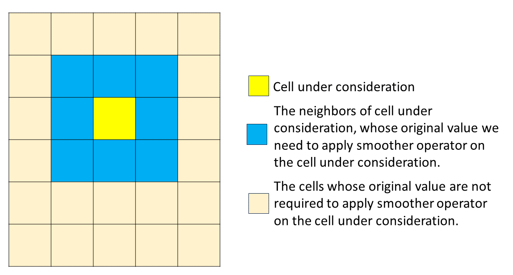

However, because of our order of traversal, out of these 8 neighbors, the top 3 neighbors (which are in the row `img[i - 1]`), and the left neighbor (which is in cell `img[i][j - 1]`) have already been overwritten. Hence, we don't have access to the original values of these neighbors.

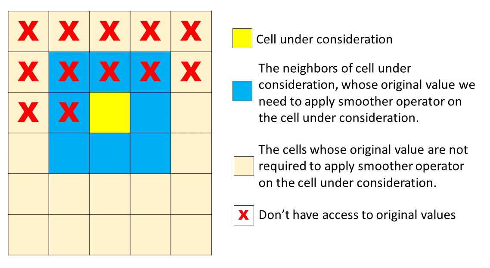

In summary, for calculating `smooth_img[i]`
- We need to save the original values of two rows `img[i]` and `img[i - 1]`.
- Rows before `img[i - 1]`, such as `img[i - 2]` or `img[i - 3]`, are no longer needed and need not be saved.
- The next row `img[i + 1]` has not been overwritten yet, and hence, we can use it as is it.

To achieve this, we can proceed by saving all original values of two rows in two temporary arrays. The previous row is saved as `prev` and the current row is saved as `curr`.

Now, for computing `img[i][j]`
 - All three neighbors of the previous row will be saved in the `prev` array. The stored values in `img[i - 1]` will be the smoothed value as we are supposed to overwrite as we proceed.
 - The original value of `img[i][j - 1]` will be saved in `curr` array. The presently stored value of `img[i][j - 1]` is the smoothed value of `img[i][j - 1]`, and not the original value.
 - The original value of `img[i][j]` is in `img` itself, because it has not been overwritten yet.
 - The original value of `img[i][j + 1]` is in `img` itself, because it has not been overwritten yet.
 - All three neighbors of the next row will be saved in `img` itself.

Hence, by using this approach, we can overwrite the values of the `img` matrix. The `curr` can be filled on the fly before overwriting, and will be given the name of `prev` after the iteration is over.

Readers are encouraged to implement this approach where we need not construct a new matrix to store the result. However, there are a few more optimizations that can be done.

Let's brainstorm further to use only one array `temp` instead of two arrays. The idea is that if we are on `img[i][j]`
- The indices `temp[j]`, `temp[j + 1]`, `temp[j + 2]` ... represent the value of the `prev` array, or in other terms, original values of `img[i - 1]`
- The indices ... `temp[j - 3]`, `temp[j - 2]`, `temp[j - 1]` represent the value of the `curr` array, or in other terms, original values of `img[i]`

This construction overwrites *previous row values* in `temp` with *current row values* as we traverse along the row. However, it has one major flaw. Let's enlist to see what it is by focusing on cell `img[i][j]`.

- The neighbors in next row `img[i + 1]` are in `img` only.
- The next neighbor in same row `img[i][j + 1]` is in `img` only.
- The current value of `img[i][j]` is also not overwritten yet.
- The previous neighbor in same row `img[i][j - 1]` is in `temp`.
- The two of neighbors in previous row `img[i - 1]` are in `temp`. Precisely original value of `img[i - 1][j]` is in `temp[j]`, and original value of `img[i - 1][j + 1]` is in `temp[j + 1]`.

The only missing piece is the original value of `img[i - 1][j - 1]`. The value there now is smoothed value of `img[i - 1][j - 1]`, and `temp[j - 1]` stores `curr[j - 1]`, and not `prev[j - 1]`.

What if before writing original `img[i][j - 1]` into `temp[j - 1]` *(which before writing stores `img[i - 1][j - 1]`)*, we store its original value in an integer variable `prev_val`? Turns out this will work, and the missing piece will be filled.

We have reduced the space used from $m \cdot n$ to $2n$, then to $n$.

<details>
<summary>Any further optimization? Click to find out!</summary>

<p>

What if we have $n \gg m$? In this case, we would prefer to store one column *(which will have elements from $m$ rows)* in an array, and not one row *(which will have elements from $n$ columns)* in an array. This will reduce the space used from $n$ to $m$, or precisely to $\min(m,n)$.

There are two ways of achieving this.

1. [Transpose the matrix](https://leetcode.com/problems/transpose-matrix/description/), and then use row-order traversal. After obtaining the result, transpose the matrix again to get the original matrix.

    However,

- Transposing a non-square matrix in $O(m \cdot n)$ time takes $O(m \cdot n)$ space. We aimed to reduce from $O(n)$ to $O(\min(m,n))$. This indeed has increased space utilization.

- The [in-place transpose](https://en.wikipedia.org/wiki/In-place_matrix_transposition) will increase the time complexity from $O(m \cdot n)$ to $O(m \cdot n \cdot \log(mn))$. This is because the in-place transpose is done by swapping the elements of the matrix. The swapping is done in a cycle. The number of cycles is $O(m \cdot n)$. The length of each cycle is $O(\log(m  n))$. Hence, the time complexity of the in-place transpose is $O(m \cdot n \cdot \log(m  n))$.

    Hence, transposing the matrix is not a good idea. Let's see what's the other way.

2. Use column-order traversal instead of row-order traversal. The `temp` will store values of one column and not one row. The `prev_val` will store the original value of the cell in the same column but in the previous row.

    However, two-dimension arrays in most of the programming languages are **[row-major](https://en.wikipedia.org/wiki/Row-_and_column-major_order)**, and not **column-major**. *The consecutive elements of a row are contiguous in memory*. Reading memory in contiguous locations is faster than jumping around among locations. Hence, column order traversal will be slower than row order traversal. However, asymptotically both will have the same time complexity.

Thus all two ways of reducing space complexity from $O(n)$ to $O(\min(m,n))$ have their downsides. Hence, we will stick with the space complexity of $O(n)$.

</p>
</details>
<br/>

$\downarrow_{\text{Portion after realizing that sticking with space complexity of } O(n) \text{ is better, at least in this approach}}$

With all the details being discussed minutely, let's see how we can implement this approach.

#### Algorithm

1. Save the dimensions of the image. Store the number of rows in `m`, and the number of columns in `n`, as convention used in the problem statement as well.

2. Create an array of size `n`. Let's call this array `temp`.

3. Declare an integer variable `prev_val`, and initialize it with `0`.

4. Iterate over the cells of the image. Let's call the current cell `img[i][j]`.

- Initialize two integer variables `sum` and `count` to `0`.

- If there exists the next row, that is, `i + 1 < m`, then we have to consider all the bottom neighbors.
      - If there exists the left-bottom neighbor, that is, `j - 1 >= 0`, then add the value of `img[i + 1][j - 1]` to `sum`, and increment `count` by `1`.

      - Add the value of `img[i + 1][j]` to `sum`, and increment `count` by `1`.
      - If there exists the right-bottom neighbor, that is, `j + 1 < n`, then add the value of `img[i + 1][j + 1]` to `sum`, and increment `count` by `1`.

- If there exists the next neighbor, that is, `j + 1 < n`, then add the value of `img[i][j + 1]` to `sum`, and increment `count` by `1`.

- Add the value of `img[i][j]` to `sum`, and increment `count` by `1`.

- If there exists the previous neighbor, that is, `j - 1 >= 0`, then add the value of `temp[j - 1]` to `sum`, and increment `count` by `1`. The `temp` till index `j - 1` stores the original values of the current row `img[i]` only.

- If there exists the previous row, that is, `i - 1 >= 0`, then we have to consider all the top neighbors.

      - If there exists the left-top neighbor, that is, `j - 1 >= 0`, then add the value of `prev_val` to `sum`, and increment `count` by `1`. The `prev_val` stores original value of `img[i - 1][j - 1]`.

      - Add the value of `temp[j]` to `sum`, and increment `count` by `1`. The `temp` at index `j` stores the original value of `img[i - 1][j]`.
      - If there exists the right-top neighbor, that is, `j + 1 < n`, then add the value of `temp[j + 1]` to `sum`, and increment `count` by `1`. The `temp` at index `j + 1` stores original value of `img[i - 1][j + 1]`.

- Now comes the overwriting part.

- If there exists the previous row, that is, `i - 1 >= 0`, then the value at `temp[j]` will serve the purpose of the top-left corner sharing neighbor of the next location in iteration, that is, of `img[i][j + 1]`. Hence, store `temp[j]` in `prev_val`.

- Store the value of `img[i][j]` in `temp[j]`. This will maintain the loop invariant of the definition of `temp`.

- Overwrite the value of `img[i][j]` with the rounded down value of `sum / count`.

5. Return the `img`.

#### Implementation

```python
class Solution:
    def imageSmoother(self, img: List[List[int]]) -> List[List[int]]:
        # Save the dimensions of the image.
        m = len(img)
        n = len(img[0])

        # Create a temp array of size n.
        temp = [0] * n

        prev_val = 0

        # Iterate over the cells of the image.
        for i in range(m):
            for j in range(n):
                # Initialize the sum and count
                sum = 0
                count = 0

                # Bottom neighbors
                if i + 1 < m:
                    if j - 1 >= 0:
                        sum += img[i + 1][j - 1]
                        count += 1
                    sum += img[i + 1][j]
                    count += 1
                    if j + 1 < n:
                        sum += img[i + 1][j + 1]
                        count += 1

                # Next neighbor
                if j + 1 < n:
                    sum += img[i][j + 1]
                    count += 1

                # This cell
                sum += img[i][j]
                count += 1

                # Previous neighbor
                if j - 1 >= 0:
                    sum += temp[j - 1]
                    count += 1

                # Top neighbors
                if i - 1 >= 0:
                    # Left-top corner-sharing neighbor.
                    if j - 1 >=  0:
                        sum += prev_val
                        count += 1

                    # Top edge-sharing neighbor.
                    sum += temp[j]
                    count += 1

                    # Right-top corner-sharing neighbor.
                    if j + 1 < n:
                        sum += temp[j + 1]
                        count += 1

                # Store the original value of temp[j], which represents
                # original value of img[i - 1][j].
                if i - 1 >= 0:
                    prev_val = temp[j]

                # Save current value of img[i][j] in temp[j].
                temp[j] = img[i][j]

                # Overwrite with smoothed value.
                img[i][j] = sum // count

        # Return the smooth image.
        return img
```

#### Complexity Analysis

Let $m$ be the number of rows in the `img` matrix, and $n$ be the number of columns in the `img` matrix.

* Time complexity: $O(m \cdot n)$

    We are traversing every cell of the `img` matrix. There are $m \cdot n$ cells in the `img` matrix.

    In every traversal, we are doing constant time work of computing the smoothed value, overwriting, and updating the `temp` array.

    Hence, the time complexity of the algorithm is $O(m \cdot n)$.

* Space complexity: $O(n)$

    The array `temp` is of size $n$. The remaining variables are of constant size. Hence, the space complexity of the algorithm is $O(n)$.

---

### Approach 3: Constant Space Smoothened Image

#### Intuition

Based on the previous algorithms, we know that if we modify `img[i][j]` in place, we won't be able to use the original `img[i][j]` in subsequent calculations because the value at this position has already been overwritten. Can we somehow store both the pre-modified and post-modified `img[i][j]` values in the same cell? Ideally speaking, it's possible.

Considering the data structure of `img`, we cannot store two separate numbers in one cell. However, we can represent two independent numbers using a single number.

Assume we have two independent numbers, $p$ and $r$. Let's define another number $Y$ as
$Y = p \cdot X + r$
where $X$ is a constant.

- To extract $p$ from $Y$, we can do $Y / X$.
- To extract $r$ from $Y$, we can do $Y \% X$.

Hence, the encoded $Y$ indeed stores two integers of our interest, $p$ and $r$.

Let's focus more on $X$. What should be the value of $X$? It turns out it depends on $r$. The $r$ is the remainder when we divide $Y$ by $X$. Hence, $r$ can take values from $0$ to $X - 1$.
>
> If we divide an integer by $X$, the remainder will be in the range $0$ to $X - 1$. For example, when divided by $8$, the remainder will be in the range $0$ to $7$.

Thus our $r$ varies from $0$ to $X - 1$.

Now, let's look at the constraints given in the problem statement.

> `0 <= img[i][j] <= 255`

Thus, every cell of the `img` matrix can take values from `0` to `255`. Thus, we can have correspondence between $r$ and `img[i][j]`. To limit the remainder $r$ to `255`, we can choose $X$ to be `256`.

Let's now find out the value of $p$. In a single integer, we wish to store the original value of `img[i][j]`, and the smoothed value of `img[i][j]`.

- The task of storing original value of `img[i][j]` is done by $r$.
- We can allot $p$ to store the smoothed value of `img[i][j]`.

Hence, the summarized correspondence is
- $Y$ represents two integers encoded in one integer. The two integers are the original value of `img[i][j]`, and smoothed value of `img[i][j]`.
- $X$ is `256`, the carefully chosen constant.
- $r$ is the remainder when we divide $Y$ by $X$. The remainder $r$ is the original value of `img[i][j]`.
- $p$ is the quotient when we divide $Y$ by $X$. The quotient $p$ is the smoothed value of `img[i][j]`.

Hence, our algorithm will be
- For every cell, assume it stores $Y$ (and not $r$)
- Extract $r$, the original value of `img[i][j]`, from $Y$ using $Y \% 256$
- Compute smoothened value using neighbors of `img[i][j]`. For computing a smoothened value, we need the original value of neighbors as well, which will be extracted using the same logic. The smoothened value will be stored in $p$.
- Encode the smoothened value in $Y$ itself by updating it as $Y = p \cdot 256 + r$.
- Once every $Y$ of the matrix is encoded with smoothened value, from it extract smoothened value $p$ by doing $Y / 256$.

Hence, the algorithm sounds simple. However, there is a word of caution. Multiplying integers may cause overflow if multiplication exceeds the range of integers. For this, let's find the minimum and maximum value our encoded $Y$ can take.

$\boxed{Y = p \cdot 256 + r}$

- $p$ is the smoothened value which is an average of at most nine values ranging from $0$ to $255$. Hence, the average $p$ will also lie between $0$ to $255$.

- $r$ also lies between $0$ to $255$.

- The minimum value of $Y$ is $0 \cdot 256 + 0 = 0$.
- The maximum value of $Y$ is $255 \cdot 256 + 255 = 65535$ represented as $2^{16} - 1$, which is reasonably less than the maximum value of an integer, which is $2^{31} - 1$.

Hence, we need not to worry about overflow in this particular problem.

With all the details being discussed minutely, let's see how we can implement this approach.

#### Algorithm

1. Save the dimensions of the image. Store the number of rows in `m`, and the number of columns in `n`, as convention used in the problem statement as well.

2. Iterate over the cells of the image. Let's call the current cell `img[i][j]`.

- Initialize two integer variables `sum` and `count` to `0`.

- Iterate over all plausible nine indices `(x, y)`. The `(x, y)` are
      - `(i - 1, j - 1)`

      - `(i - 1, j)`
      - `(i - 1, j + 1)`
      - `(i, j - 1)`
      - `(i, j)`
      - `(i, j + 1)`
      - `(i + 1, j - 1)`
      - `(i + 1, j)`
      - `(i + 1, j + 1)`

      If the indices form a valid neighbor, then extract the original value of `img[x][y]` using `img[x][y] % 256`, and add it to `sum`. Increment `count` by `1`.

- Encode the smoothed value in `img[i][j]` as `img[i][j] += (sum / count) * 256 `.

3. Traverse again over the cells of the image. Let's call the current cell `img[i][j]`. Extract the smoothed value from `img[i][j]` using `img[i][j] / 256`, and store it in `img[i][j]`.

4. Return the `img`.

#### Implementation

```python
class Solution:
    def imageSmoother(self, img: List[List[int]]) -> List[List[int]]:
        # Save the dimensions of the image.
        m = len(img)
        n = len(img[0])

        # Iterate over the cells of the image.
        for i in range(m):
            for j in range(n):
                # Initialize the sum and count
                sum = 0
                count = 0

                # Iterate over all plausible nine indices.
                for x in (i - 1, i, i + 1):
                    for y in (j - 1, j, j + 1):
                        # If the indices form valid neighbor
                        if 0 <= x < m and 0 <= y < n:
                            # Extract the original value of img[x][y].
                            sum += img[x][y] % 256
                            count += 1

                # Encode the smoothed value in img[i][j].
                img[i][j] += (sum // count) * 256

        # Extract the smoothed value from encoded img[i][j].
        for i in range(m):
            for j in range(n):
                img[i][j] //= 256

        # Return the smooth image.
        return img
```

**Point to Ponder:** With the number `256`, we are doing three operations
- Taking modulo
- Multiplying
- Dividing

Now, `256` is special in the sense that it is a power of two. Is there a faster way to do these three operations? Readers are encouraged to think about it.

#### Complexity Analysis

Let $m$ be the number of rows in the `img` matrix, and $n$ be the number of columns in the `img` matrix.

* Time complexity: $O(m \cdot n)$

    We are traversing every cell of the `img` matrix. There are $m \cdot n$ cells in the `img` matrix.

    For each cell, we are iterating over all plausible nine indices. There are at most nine indices for each cell. At each index, we are doing constant time arithmetic operations.

    Again, we are traversing over all the cells of the `img` matrix to extract the smoothed value from the encoded value.

    Hence, the time complexity of the algorithm is $O((m \cdot n \cdot 9) + (m \cdot n))$, which is $O(m \cdot n)$.

* Space complexity: $O(1)$

    We are not using any extra space. Smoothened Values are encoded and extracted in the existing integer value of `img`. Hence, the space complexity of the algorithm is $O(1)$.

---

### Approach 4: Bit Manipulation

#### Intuition

Let's again analyze the constraints given in the problem statement.

> `0 <= img[i][j] <= 255`

An integer, in most of the programming languages, is represented using 32 bits. The `255` is `11111111` in binary. All numbers from `0` to `255` require at most 8 bits to represent them.

Hence, out of these 32 bits, only the least significant 8 bits are used to represent the value of `img[i][j]`. We, to avoid any inconsistency, won't alter the most significant bit, as it is often used to represent the sign of the integer. Hence, the 23 bits are free to use.

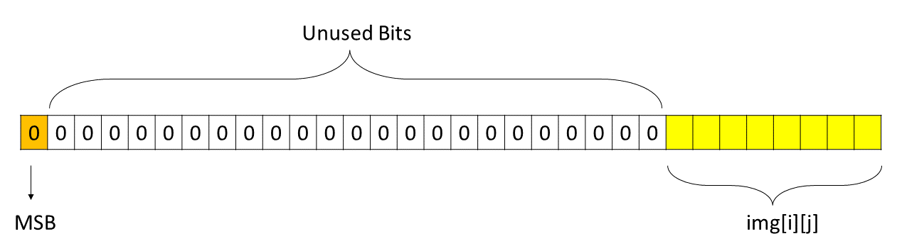

This suggests the idea that in these 23 unused bits, we can store the smoothed value of `img[i][j]`. This we can achieve by using bit-manipulation. In bit manipulation, we use the bit-wise operators.

<details> <summary> <b> For quick review of bit-wise operators, click here </b> </summary>

<p>

- **NOT:** Bitwise NOT is a unary operator that flips the bits of the integer. If the current bit is $0$, it will change it to $1$ and vice versa. The symbol of the bitwise NOT operator is tilde (`~`).

    ```
    N = 5 = 101 (in binary)
    ~N = ~(101) = 010 = 2 (in decimal)
    ```

- **AND:** If both bits in the compared position of the operand are $1$, the bit in the resulting bit pattern is $1$, otherwise $0$. The symbol of the bitwise AND operator is ampersand (`&`).

    ```
    A = 5 = 101 (in binary)
    B = 1 = 001 (in binary)
    A & B = 101 & 001 = 001 = 1 (in decimal)
    ```

- **OR:** If both bits in the compared position of the operand are $0$, the bit in the resulting bit pattern is $0$, otherwise $1$. The symbol of the bitwise OR operator is pipe (`|`).

    ```
    A = 5 = 101 (in binary)
    B = 1 = 001 (in binary)
    A | B = 101 | 001 = 101 = 5 (in decimal)
    ```

- **XOR:** In bitwise XOR if both bits are the same, the result will be $0$, otherwise $1$. The symbol of the bitwise XOR operator is caret (`^`).

    ```
    A = 5 = 101 (in binary)
    B = 1 = 001 (in binary)
    A ^ B = 101 ^ 001 = 100 = 4 (in decimal)
    ```

- **Left Shift:** The Left shift operator is a binary operator that shifts bits to the left by a certain number of positions and appends `0` at the right side. One left shift is equivalent to multiplying the bit pattern with $2$. The symbol of the left shift operator is `<<`.

  `x << y` means left shift `x` by `y` bits, which is equivalent to multiplying `x` with $2^y$.

    ```
    A = 1 = 001 (in binary)
    A << 1 = 001 << 1 = 010 = 2 (in decimal)
    A << 2 = 001 << 2 = 100 = 4 (in decimal)

    B = 5 = 00101 (in binary)
    B << 1 = 00101 << 1 = 01010 = 10 (in decimal)
    B << 2 = 00101 << 2 = 10100 = 20 (in decimal)
    ```

- **Right Shift:** The Right shift operator is a binary operator that shifts bits to the right by a certain number of positions and appends `0` at the left side. One right shift is equivalent to dividing the bit pattern with $2$. The symbol of the right shift operator is `>>`.

  `x >> y` means right shift `x` by `y` bits, which is equivalent to dividing `x` with $2^y$.

    ```
    A = 4 = 100 (in binary)
    A >> 1 = 100 >> 1 = 010 = 2 (in decimal)
    A >> 2 = 100 >> 2 = 001 = 1 (in decimal)
    A >> 3 = 100 >> 3 = 000 = 0 (in decimal)

    B = 5 = 00101 (in binary)
    B >> 1 = 00101 >> 1 = 00010 = 2 (in decimal)
    ```

</p>

</details>

<br/>

$\downarrow_{\text{Portion After Review}}$

Now the smoothed value is an average of nine values ranging from `0` to `255`. Hence, the average will also lie between `0` to `255`. Thus, the smoothed value will also require at most 8 bits to represent it. This we can store together as follows.

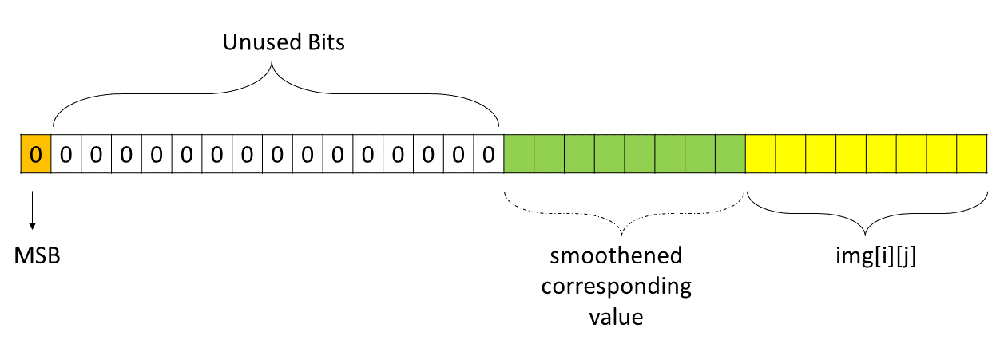

**How do we store smoothened corresponding values?** Let's see.

Initially, the smoothened corresponding value was a separate integer, as shown in the figure below.
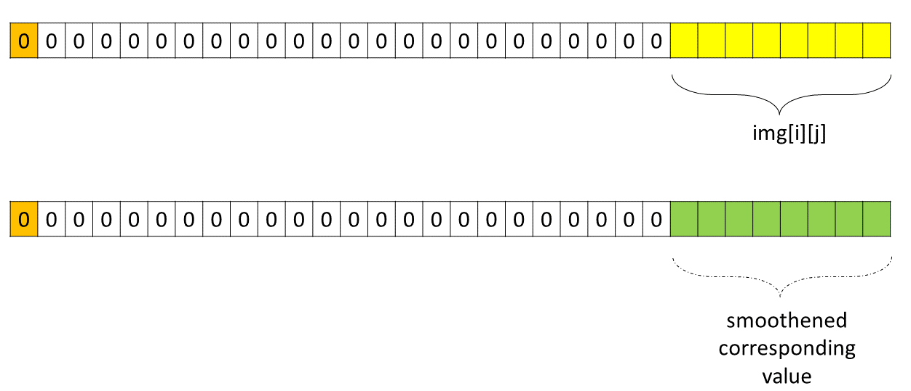

We can left shift (using the `<<` operator ) the integer so that the orientation now looks like as follows.
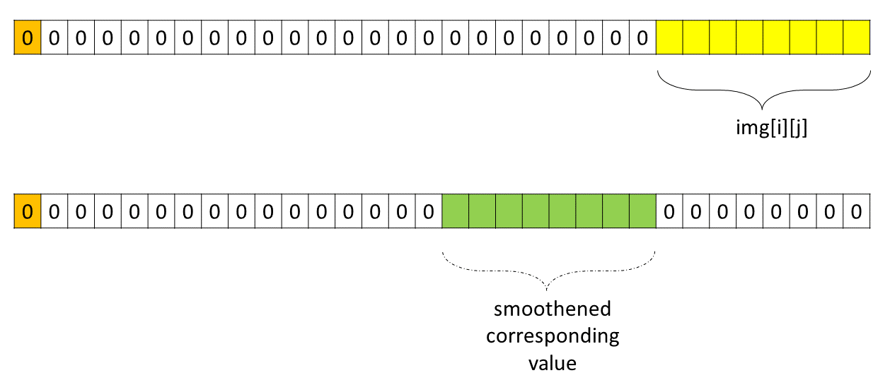

Now there is a property of bitwise OR (`|`) operator. `x | 0 = x`. In the context of the diagram, doing bitwise OR of both these separate integers
- The most significant 16 bits will remain 0 because both integers have 0 in those bits.
- The least significant 8 bits will store the values of `img[i][j]`
- The remaining 8 bits will store the values of the smoothened corresponding value.

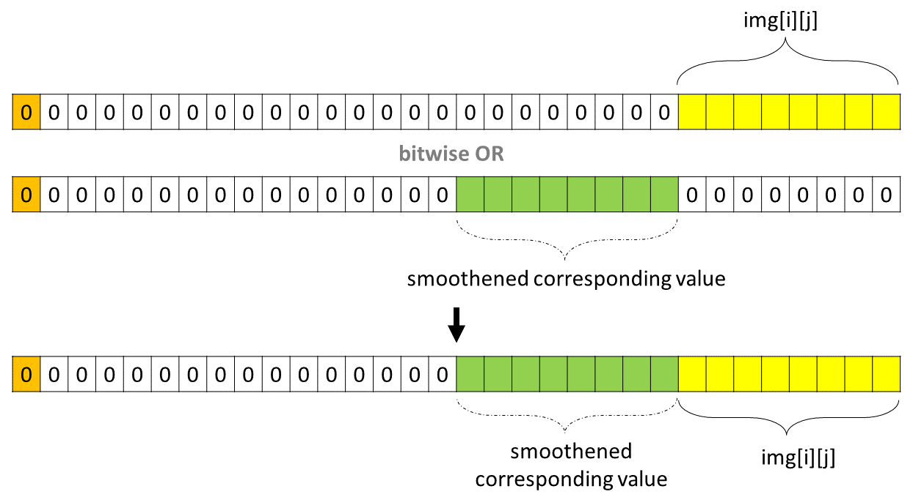

**How can we extract the original value of `img[i][j]` from this mixed integer?**

In other words,

- We wish to set all except the least significant 8 bits to 0.

    The bitwise AND (`&`) operator has property of `x & 0 = 0`. Thus to set the first 24 bits to `0`, we can do bitwise AND with an integer that has the first 24 bits as `0`

- We wish to retain the least significant 8 bits as it is.

    The bitwise AND (`&`) operator has property of `x & 1 = x`. Thus to retain the last 8 bits as it is, we can do bitwise AND with an integer that has the last 8 bits as `1`.

Thus, the integer with which we can do bitwise AND (`&`) to extract the original value of `img[i][j]` is `00000000000000000000000011111111`, which is `255` in decimal, and `11111111` in binary.

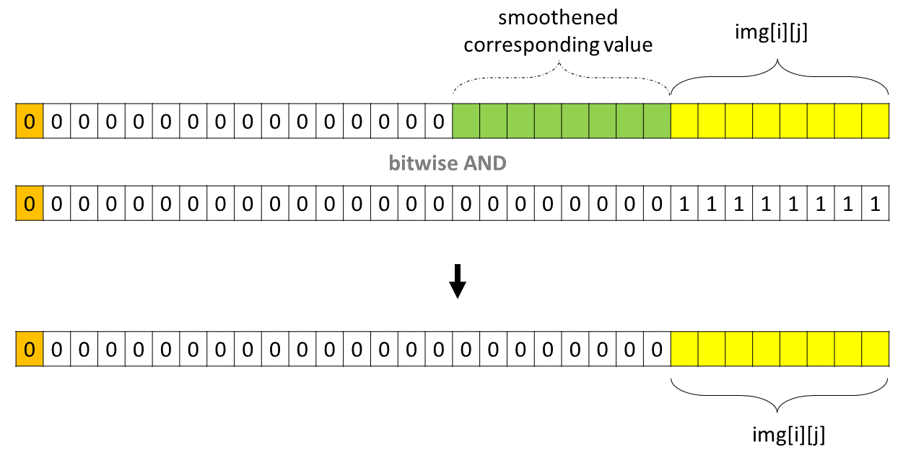

**How can we extract the smoothened value from this mixed integer, after we are done with computing all the smoothened values?**

As done above, we perhaps can do bitwise AND (`&`) with `00000000000000001111111100000000`, which is `65280` in decimal, and `1111111100000000` in binary. This will retain the smoothened value bits as it is, turning off all other bits.

After that, to get the smoothened value, we can right shift (using the`>>` operator ) the integer by 8 bits (To encode, we did a left shift by 8 bits). This will bring the smoothened value to the least significant 8 bits.

However, readers can appreciate that only the right shift is sufficient to extract the smoothened value.

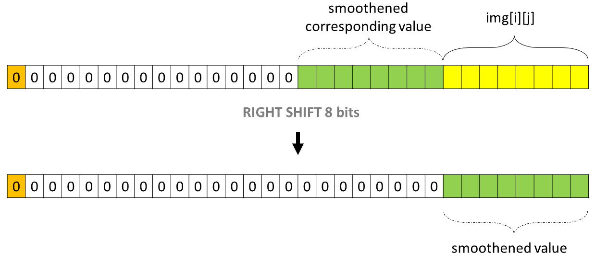

Hence, our algorithm will be
- For every cell, assume it stores the mixed-integer.
- Extract the original value of `img[i][j]` using bitwise AND (`&`) with `255`.
- Compute smoothened value using neighbors of `img[i][j]`. For computing the smoothened value, we need the original value of neighbors as well, which will be extracted using the same logic.
- Left shift (`<<`) the smoothened value by 8 bits, and encode it in the mixed integer using bitwise OR (`|`) operator.
- Once every mixed integer of the matrix is encoded with the smoothened value, extract the smoothened value using the right shift (`>>`) operator.

> The bit manipulation works because we have only 8 bits per pixel (abbreviated as "bpp"). The "bpp" is the number of bits used to represent the color of a single pixel in a bitmapped image or video frame buffer. Hence, we can use the remaining bits to store the smoothened value.

Readers can appreciate the one-to-one correspondence in this approach and [previous approach](#approach-3-constant-space-smoothened-image)

- Bitwise AND (`&`) with `255` $\equiv$ modulo by `256`

- Left shift (`<<`) by 8 bits $\equiv$ multiply by `256`

- Bitwise OR (`|`) of smoothened value with `img[i][j]` provided least significant 8 bits of the left-shifted smoothened value are `0` $\equiv$ add `img[i][j]`

- Right shift (`>>`) by 8 bits $\equiv$ divide by `256`

This was hinted at **[Point to Ponder](#implementation-2)** in previous approach.

The bit-wise operators are faster than arithmetic operators. Hence, this approach is faster than the [previous approach](#approach-3-constant-space-smoothened-image).

#### Algorithm

1. Save the dimensions of the image. Store the number of rows in `m`, and the number of columns in `n`, as convention used in the problem statement as well.

2. Iterate over the cells of the image. Let's call the current cell `img[i][j]`.

- Initialize two integer variables `sum` and `count` to `0`.

- Iterate over all plausible nine indices `(x, y)`. The `(x, y)` are
      - `(i - 1, j - 1)`

      - `(i - 1, j)`
      - `(i - 1, j + 1)`
      - `(i, j - 1)`
      - `(i, j)`
      - `(i, j + 1)`
      - `(i + 1, j - 1)`
      - `(i + 1, j)`
      - `(i + 1, j + 1)`

      If the indices form a valid neighbor, then extract the original value of `img[x][y]` using `img[x][y] & 255`, and add it to `sum`. Increment `count` by `1`.

- Encode the smoothed value in `img[i][j]` as `img[i][j] |= (sum / count) << 8 `.

3. Traverse again over the cells of the image. Let's call the current cell `img[i][j]`. Extract the smoothed value from `img[i][j]` using `img[i][j] >> 8`, and store it in `img[i][j]`

4. Return the `img`.

#### Implementation

```python
class Solution:
    def imageSmoother(self, img: List[List[int]]) -> List[List[int]]:
        # Save the dimensions of the image.
        m = len(img)
        n = len(img[0])

        # Iterate over the cells of the image.
        for i in range(m):
            for j in range(n):
                # Initialize the sum and count
                sum = 0
                count = 0

                # Iterate over all plausible nine indices.
                for x in (i - 1, i, i + 1):
                    for y in (j - 1, j, j + 1):
                        # If the indices form valid neighbor
                        if 0 <= x < m and 0 <= y < n:
                            # Extract the original value of img[x][y].
                            sum += img[x][y] & 255
                            count += 1

                # Encode the smoothed value in img[i][j].
                img[i][j] |= (sum // count) << 8

        # Extract the smoothed value from encoded img[i][j].
        for i in range(m):
            for j in range(n):
                img[i][j] >>= 8

        # Return the smooth image.
        return img
```

**Implementation Notes:** Different programming languages have different notations of bitwise operators. For example, for the bitwise NOT operator, we have the following notations:
- [C++](https://en.cppreference.com/w/cpp/language/operator_arithmetic) uses `~`
- [Go](https://go.dev/ref/spec) uses unary $^$ operator
- [Elixir](https://hexdocs.pm/elixir/1.13.0/Bitwise.html) uses `~~~`, or `bnot`
- [Rust](https://doc.rust-lang.org/book/appendix-02-operators.html) uses `!`
- In [Kotlin](https://kotlinlang.org/api/latest/jvm/stdlib/kotlin/-int/inv.html), we can use `inv()` function

#### Complexity Analysis

Let $m$ be the number of rows in the `img` matrix, and $n$ be the number of columns in the `img` matrix.

* Time complexity: $O(m \cdot n)$

    We are traversing every cell of the `img` matrix. There are $m \cdot n$ cells in the `img` matrix.

    For each cell, we are iterating over all plausible nine indices. There are at most nine indices for each cell. At each index, we are doing constant time bitwise operations.

    > We are taking bitwise AND (`&`) of `sum` and `255`. Now there can be at most $32$ (or any other constant number) bits in an integer. Hence, the `&` operator will be done at most $32$ times. Thus, the time complexity of the bitwise AND (`&`) operator is $O(32)$, which is $O(1)$.

    > We are left shifting (`<<`) an integer ($sum / count$) by `8` bits.
    >
    > Left shifting $1$ bit in a signed integer is done by
    > - Assigning to every non-signed bit the value of the bit to its right side
    >
    > - The LSB doesn't have any bit to its right side, so it is assigned `0`
    >
    > Hence, there will be at most $31$ such assignments in one left shift, since in a signed integer, the MSB is used to represent the sign of the integer, and it is retained as it is in the left shift.
    >
    > Hence, number of assignments in one left shift is $31$, and in $8$ left shifts, it is $31 \cdot 8 = 248$. Thus, the time complexity of the left shift (`<<`) operator is $O(248)$, which is $O(1)$.

    > We are also doing bitwise OR (`|`) of two integers $\text{img}[i][j]$ and $(sum / count) << 8$. Now there can be at most $32$ (or any other constant number) bits in an integer. Hence, the `|` operator will be done at most $32$ times. Thus, the time complexity of the bitwise OR (`|`) operator is $O(32)$, which is $O(1)$.

    Again, we are traversing over all the cells of the `img` matrix to extract the smoothed value from the encoded value using the bitwise operator.

    > We are right shifting (`>>`) an integer ($\text{img}[i][j]$) by `8` bits.
    >
    > Right shifting $1$ bit in a signed integer is done by
    > - Assigning to every non-signed bit the value of the bit to its left side, except for the *second most significant bit*
    >
    > - The *second most significant bit* has to its left side the *most significant bit*, which is used to represent the sign of the integer. Hence, the *second most significant bit* is assigned the value of `0`
    >
    > Hence, there will be at most $31$ such assignments in one right shift, since in a signed integer, the MSB is used to represent the sign of the integer, and it is retained as it is in the right shift.
    >
    > Hence, number of assignments in one right shift is $31$, and in $8$ right shifts, it is $31 \cdot 8 = 248$. Thus, the time complexity of the right shift (`>>`) operator is $O(248)$, which is $O(1)$.

    Hence, the time complexity of the algorithm is $O((m \cdot n \cdot 9) + (m \cdot n))$, which is $O(m \cdot n)$.

* Space complexity: $O(1)$

    We are not using any extra space. Smoothened values are encoded and extracted in the existing integer value of `img`. Hence, the space complexity of the algorithm is $O(1)$.

---