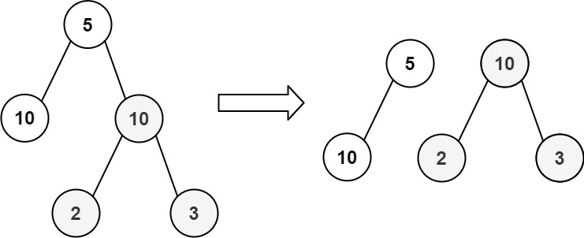
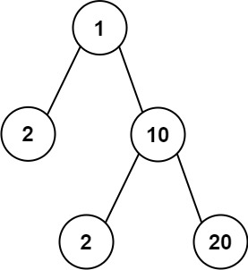

### 1. Description

Given the `root` of a binary tree, return `true`* if you can partition the tree into two trees with equal sums of values after removing exactly one edge on the original tree*.

### 2. Function Contract

`solve(root: TreeNode) -> bool`

**Inputs**

- `root`: the root of a nonempty binary tree. Each node exposes an integer `val` and optional `left` and `right` children.

**Return value**

Return `true` if removing exactly one parent-child edge produces two trees with equal sums of node values. Return `false` if no existing edge has that property.

### 3. Examples

#### Example 1

- **Input:** `root = [5,10,10,null,null,2,3]`
- **Output:** `true`

#### Example 2

- **Input:** `root = [1,2,10,null,null,2,20]`
- **Output:** `false`
- **Explanation:** You cannot split the tree into two trees with equal sums after removing exactly one edge on the tree.

### 4. Constraints

- The number of nodes in the tree is in the range $[1, 10^{4}]$.

- $-10^{5} \le \text{Node.val} \le 10^{5}$
