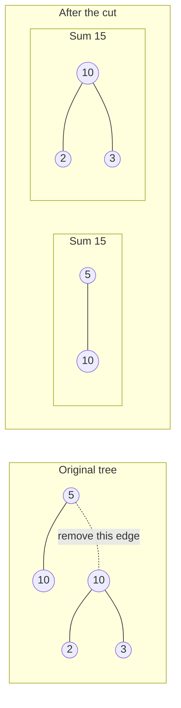
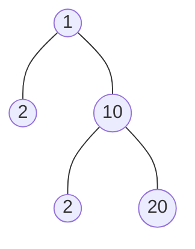

## Examples

**Example 1**

- Input: `root = [5,10,10,null,null,2,3]`
- Output: `true`

The edge from the root value `5` to its right child value `10` can be removed. The component containing `5` then has values `5` and `10`, while the detached subtree has values `10`, `2`, and `3`; both sums are `15`.

**Example 2**

- Input: `root = [1,2,10,null,null,2,20]`
- Output: `false`
- Explanation: No single edge can be removed to make the sums of the two resulting trees equal.

