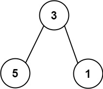
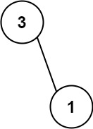

## Description

If the depth of a tree is smaller than `5`, then this tree can be represented by an array of three-digit integers. You are given an **ascending **array `nums` consisting of three-digit integers representing a binary tree with a depth smaller than `5`, where for each integer:

- The hundreds digit represents the depth `d` of this node, where $1 \le d \le 4$.

- The tens digit represents the position `p` of this node within its level, where $1 \le p \le 8$, corresponding to its position in a **full binary tree**.

- The units digit represents the value `v` of this node, where $0 \le v \le 9$.

Return the **sum** of **all paths** from the **root** towards the **leaves**.

It is **guaranteed** that the given array represents a valid connected binary tree.
### Function Contract

`solve(nums: list[int]) -> int`

**Inputs**

- `nums`: an ascending array of three-digit node encodings for a valid connected binary tree. Each encoding uses its hundreds, tens, and units digits for the node's depth, within-level position, and value, respectively.

**Return value**

Return the sum of the node-value sums of every path from the root to a leaf.

### Examples
#### Example 1

**Input:** nums = [113,215,221]

**Output:** 12

**Explanation:**

The tree that the list represents is shown.

The path sum is (3 + 5) + (3 + 1) = 12.

#### Example 2

**Input:** nums = [113,221]

**Output:** 4

**Explanation:**

The tree that the list represents is shown.

The path sum is (3 + 1) = 4.

### Constraints

- $1 \le \text{nums.length} \le 15$

- $110 \le \text{nums}[i] \le 489$

- `nums` represents a valid binary tree with depth less than `5`.

- `nums` is sorted in ascending order.