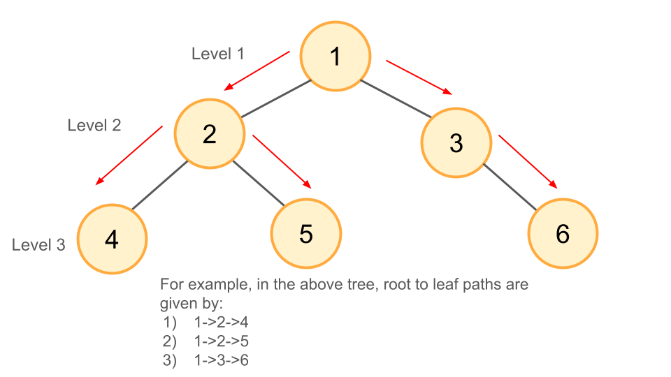
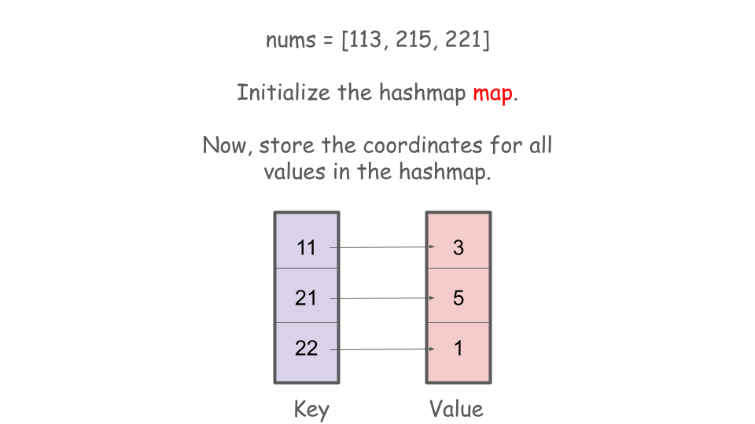
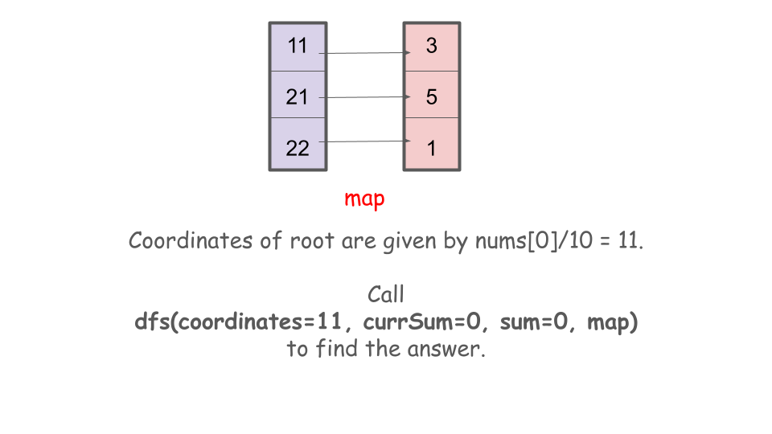
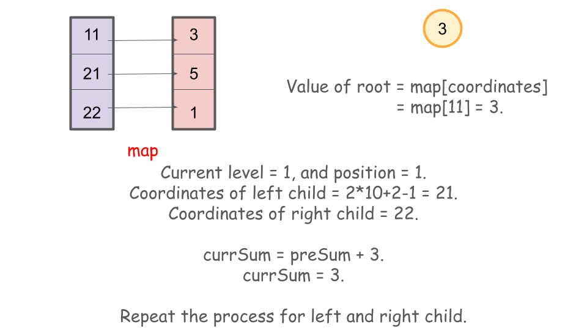
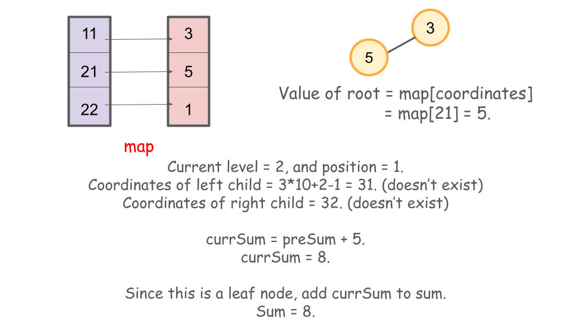
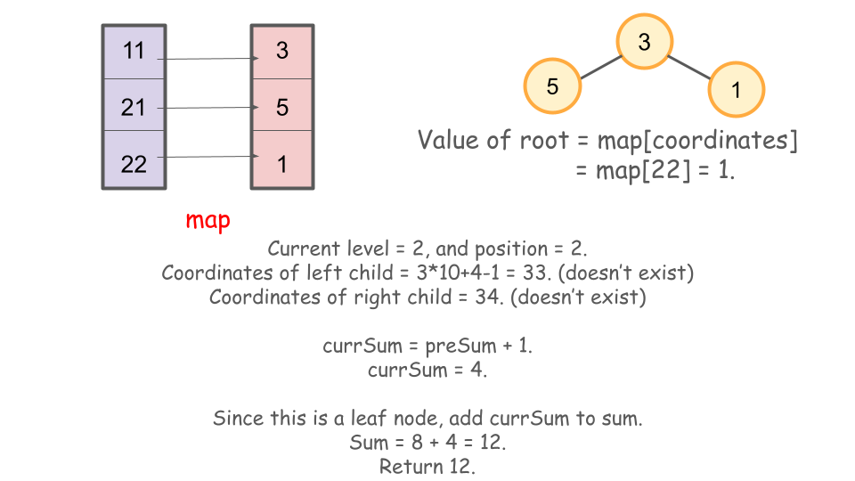

## Solution

---

### Overview:

We are given a tree represented as a list of three-digit numbers, where each number is defined as follows:

- The first digit indicates the node's depth (1-4).
- The second digit specifies the node's position at its level (1-8).
- The third digit represents the node's value (0-9).

We need to calculate the sum of all path values from the root to the leaves and return the total sum.

For tree traversal, we'll be using DFS or BFS. If you're unfamiliar with these concepts, you can learn more from the following [DFS](https://leetcode.com/explore/learn/card/queue-stack/232/practical-application-stack/) and [BFS](https://leetcode.com/explore/learn/card/queue-stack/231/practical-application-queue/) explore cards.

### Approach 1: Depth First Search

#### Intuition

In this approach, we will use the DFS algorithm. The DFS algorithm explores as far as possible along each branch before backing up, which mirrors the path-like exploration from root to leaf. The figure below illustrates the paths:



As we observe from the image, the depth of the nodes increases with each DFS iteration. For example, if a node is at depth 2, its children will be at depth 3, meaning the depth of each child is the current node's depth plus one.

To determine the horizontal position of the child nodes, if a node is at position `p`, its left child will be at $2*p - 1$, and its right child at `2*p`. This calculation is based on the properties of a full binary tree, where positions double as you move deeper. It's a standard formula that you can remember for future use.

Each node is uniquely identified by its depth and position, which we can map to the node's value. Using a hashmap, where the key is the node's depth and position, and the value is the node's value, we can efficiently retrieve any node's value using its coordinates.

#### Algorithm

**Main function - `pathSum(nums)`**

1. Initialize a hashmap `map` to store tree nodes.
2. Iterate through each element in `nums`:
- Calculate `coordinates` by dividing the current element by 10.
- Calculate `value` by taking the remainder of the element when divided by 10.
- Store the `coordinates` as the key and `value` as the value in map.
3. Initialize an integer variable `sum` with 0.
4. Call the helper function `dfs(rootCoordinates, preSum, sum, map)` with:
- `rootCoordinates` set to nums[0] / 10.
- `preSum` set to 0.
- `sum` passed by reference.
5. Return the value of `sum`.

**Helper function - `dfs(rootCoordinates, preSum, sum, map)`**

1. Calculate the `level` and `position` from `rootCoordinates`:
- `level` is obtained by dividing `rootCoordinates` by 10.
- `position` is obtained by taking the remainder of `rootCoordinates` when divided by 10.
2. Determine the coordinates of the `left` and `right` children:
- `left` is calculated as $(level + 1) * 10 + position * 2 - 1$.
- `right` is calculated as $(level + 1) * 10 + position * 2$.
3. Update `currSum` by adding the value of the current node to `preSum`.
4. If map does not contain both `left` and `right` coordinates:
- Add `currSum` to `sum`.
- Return from the function.
5. If `left` exists in `map`, call `dfs(left, currSum, sum, map)`.
6. If `right` exists in `map`, call `dfs(right, currSum, sum, map)`.











#### Implementation

```python
class Solution:
    def pathSum(self, nums):
        """
        :type nums: List[int]
        :rtype: int
        """
        # Store the data in a hashmap, with the coordinates as the key and the node value as the value
        coord_map = {}
        for element in nums:
            coordinates = element // 10
            value = element % 10
            coord_map[coordinates] = value

        # Pass the initial sum value in the sum function.
        return self.dfs(nums[0] // 10, 0, coord_map)

    def dfs(self, root_coordinates, pre_sum, coord_map):
        # Find the level and position values from the coordinates.
        level = root_coordinates // 10
        position = root_coordinates % 10

        # Find out the left child and right child positions of the tree.
        left = (level + 1) * 10 + position * 2 - 1
        right = (level + 1) * 10 + position * 2
        curr_sum = pre_sum + coord_map[root_coordinates]

        # If left child and right child do not exist, return.
        if not left in coord_map and not right in coord_map:
            return curr_sum

        # Otherwise iterate through the left and right children recursively using depth first search.
        left_sum = (
            self.dfs(left, curr_sum, coord_map) if left in coord_map else 0
        )
        right_sum = (
            self.dfs(right, curr_sum, coord_map) if right in coord_map else 0
        )
        return left_sum + right_sum
```

#### Complexity Analysis

Let $n$ be the number of nodes in the tree.

- Time complexity: $O(n)$

    All hashmap insertion and search operations take constant time. Apart from this, in the `dfs` function, we visit all the nodes of the tree exactly once. Therefore, the time complexity is given by $O(n)$.

- Space complexity: $O(n)$

    We perform exactly $n$ insertion operations in the hashmap. For the `dfs` function, the stack space can go up to $n$ in the worst case. Therefore, the total space complexity is given by $O(n)$.

---

### Approach 2: Breadth First Search

#### Intuition

In this approach, we use the breadth-first search algorithm to explore all root-to-leaf paths in the tree. Unlike depth-first search, where we explore each path from root to leaf before moving on, BFS processes all nodes at the current level before proceeding to the next.

To track the running sum as we reach leaf nodes, we initialize a queue that stores pairs of `coordinates` and the current sum up to each node. We start by enqueuing the `root` node. While the queue is not empty, we process each node by checking if it is a leaf. If it is not a leaf, we enqueue its children with updated sums by adding the current node's value to the running sum. If the node is a leaf, we add the current sum to the total sum.

#### Algorithm

1. Initialize `map` as an empty hashmap, and `q` as an empty queue that stores a pair of integers.
2. Initialize `totalSum` as 0.
3. For each element in `nums`:
- Compute `coordinates` as $element / 10$.
- Compute `value` as `element % 10`.
- Store `value` in the map with key `coordinates`.
4. Compute `rootCoordinates` as $\text{nums}[0] / 10$.
5. Enqueue `rootCoordinates` and $\text{map}[rootCoordinates]$ into `q`.
6. While `q` is not empty:
- Dequeue `coordinates` and `currentSum`.
- Compute `level` as $coordinates / 10$ and `position` as `coordinates % 10`.
- Compute `left` as $(level + 1) * 10 + position * 2 - 1$ and `right` as $(level + 1) * 10 + position * 2$.
- If the current node is a leaf node:
- Add `currentSum` to `totalSum`.
- If `map` contains `left`:
- Enqueue `left` and $currentSum + \text{map}[left]$ into `q`.
- If `map` contains `right`:
- Enqueue `right` and $currentSum + \text{map}[right]$ into `q`.
7. Return `totalSum`.

#### Implementation

```python
class Solution:
    def pathSum(self, nums: List[int]) -> int:
        map = (
            {}
        )  # Store the node values in a hashmap, using coordinates as the key.

        # Iterate over given nums
        for element in nums:
            coordinates = element // 10
            value = element % 10
            map[coordinates] = value

        total_sum = 0  # Initialize the total sum
        q = [
            (nums[0] // 10, map[nums[0] // 10])
        ]  # Initialize the BFS queue and start with the root node.

        # Continue till queue is not empty
        while q:
            coordinates, current_sum = q.pop(0)  # Dequeue
            level = coordinates // 10
            position = coordinates % 10

            left = (level + 1) * 10 + position * 2 - 1
            right = (level + 1) * 10 + position * 2

            # If it's a leaf node (no left and right children), add currentSum to totalSum.
            if not (left in map or right in map):
                total_sum += current_sum

            # Add the left child to the queue if it exists.
            if left in map:
                q.append((left, current_sum + map[left]))

            # Add the right child to the queue if it exists.
            if right in map:
                q.append((right, current_sum + map[right]))

        return total_sum
```

#### Complexity Analysis

Let $n$ be the number of nodes in the tree.

- Time complexity: $O(n)$

    All hashmap insertion and search operations take constant time. Apart from this, in the breadth-first search, we visit all the nodes of the tree exactly once. Therefore, the time complexity is given by $O(n)$.

- Space complexity: $O(n)$

    We perform exactly $n$ insertion operations in the hashmap. For the breadth-first search, the queue `q` stores all the elements exactly once. Therefore, the total space complexity is given by $O(n)$.

---